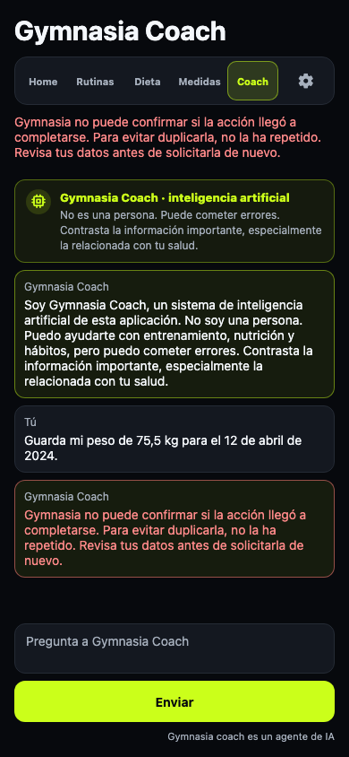
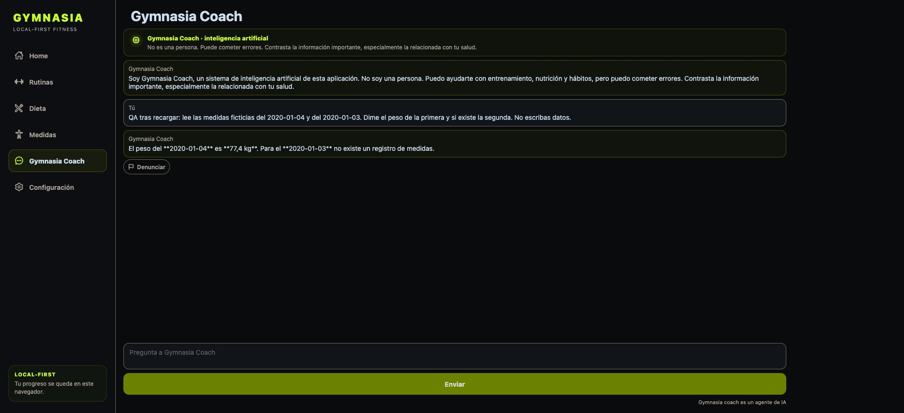

# QA del contrato de errores de Coach

GYM-42 (ticket para que Coach reconozca y gestione los errores de sus herramientas).
Verificado el 4 de octubre de 2026 en web, con Chromium y proveedores falsos.

## Escenarios comprobados

- OpenAI Responses, Anthropic y Google Interactions: argumento inválido de
  medición → resultado marcado de error → llamada corregida → una sola medición
  persistida. Antes de la corrección no existe medición ni recibo de escritura.
- En los tres proveedores, un fallo de persistencia al guardar otro peso detiene
  el turno con un mensaje local claro. No se pide otra ronda, no se reintenta el
  turno, no se confirma éxito ni se filtra el texto de la excepción. El historial
  conserva el mensaje como `technical_error` y el almacén no contiene el peso
  nuevo. La simulación usa una excepción con las palabras `network timeout` para
  comprobar que no entra en los reintentos de transporte.
- Canal de incidencias caído: una única petición, mensaje local de fallo y ninguna
  confirmación de creación. Respuesta ambigua: resultado incierto conservado en el
  diario y acción no repetida. Incidencia confirmada seguida de fallo de proveedor:
  el reintento reproduce el resultado y no duplica la incidencia.
- Regresiones del recorrido normal: lecturas, mediciones, rutina tipada, dieta,
  historial firmado de Google, límites de rondas y configuración BYOK.
- Integración determinista adicional: proveedor compatible con OpenAI, excepción
  de lectura y error fatal; campos inexistentes; JSON ilegible de memoria sin
  borrar los datos; reproducción de una escritura confirmada conservando la marca
  de error tras reiniciar; texto de usuario parecido a un payload de error.
- Se revisa la captura contra `docs/design/Gimnasia Design System.png`: el mensaje
  usa la tarjeta de error existente, mantiene contraste y queda legible en 390 ×
  844, con el campo y botón de envío accesibles. No se añaden componentes ni estilos.

## Validación

- `npm test`: 933 pruebas Vitest, 11 pruebas de dev store y 3 de fronteras móviles,
  todas correctas.
- `npm --workspace apps/mobile exec tsc --noEmit`: correcto.
- `npm run check:mobile-boundaries`: correcto; contrato de errores registrado como entrada pública.
- `npm run check:production-version -- --base origin/main`: versión 1.50.4 correcta.
- `npm run test:agent:e2e`: correcto, incluidos los tres proveedores, incidencias
  y development sin red.
- `npm run check:data-inventory`, `npm run test:data-inventory` y
  `npm run check:legal`: correctos.

## QA exploratoria con un modelo real

El 4 de octubre de 2026 se probó la web publicada, versión **1.51.0**, con
OpenAI **gpt-6-luna**, en la sesión habitual del navegador. Se emplearon fechas
y pesos ficticios de QA. No se leyó, copió ni registró la clave BYOK.

1. **Ausencia y alternativa autorizada.** Se pidió leer el peso del 2020-01-02
   y, si faltaba, consultar el 2020-01-01, sin escribir. Las peticiones reales
   mostraron `read_measurement` para el día 2, un `function_call_output.output`
   con `kind: "tool_error"`, `is_error: true`, `error: "not_found"`,
   `recovery: "choose_alternative"` y `recoverable: true`; después la lectura
   del día 1 devolvió 76 kg. Coach respondió: «Falta el registro del
   **2020-01-02**. El **2020-01-01** sí tiene un peso guardado: **76 kg**».
   Fueron tres peticiones al modelo. Se inspeccionaron únicamente el modelo,
   los argumentos y los resultados de estas tools, sin cabeceras ni claves.
2. **Escritura incierta.** Se inyectó temporalmente un fallo de persistencia
   limitado al almacén de la app y a un registro ficticio del 2020-01-03.
   La excepción incluía `network timeout`. El modelo era real; el fallo local
   era simulado. Hubo una sola petición al modelo y ninguna ronda adicional.
   Coach mostró el mensaje seguro: «Gymnasia no puede confirmar si la acción
   llegó a completarse. Para evitar duplicarla, no la ha repetido. Revisa tus
   datos antes de solicitarla de nuevo». No confirmó éxito ni expuso la
   excepción. El historial conservó ese mensaje como `technical_error`.
3. **Recuperación y persistencia.** Se retiró completamente la inyección.
   Se guardó un peso ficticio de 77,4 kg para el 2020-01-04. Tras recargar,
   el almacén contenía ese registro y no contenía el del día 3. Una nueva
   consulta real de ambas fechas confirmó 77,4 kg para el día 4 y ausencia
   para el día 3. La captura siguiente documenta el resultado visible.

### Comparación exploratoria con el formato antiguo

Una reproducción aislada con la API real de OpenAI, `gpt-6-luna`, `store: false`
y resultados ficticios comparó textos antiguos sin marca con errores nuevos.
No ejecutó escrituras ni reprodujo una versión antigua completa de la app.
La transcripción saneada está en
[`real-model-baseline.json`](benchmarks/tool-errors/real-model-baseline.json).

- Campo inexistente: el modelo reconoció la ausencia en ambos formatos. **No
  se reprodujo una confusión del error con un dato válido.**
- Fecha ausente: con el texto antiguo respondió «No tienes medidas registradas
  para el 2020-01-02». Con el mensaje nuevo respondió «No hay un registro de
  medidas para el 2020-01-02. Esto no permite saber si tienes registros en otras
  fechas». También cambió la precisión del mensaje: la comparación no aísla el
  efecto de `is_error` ni constituye una evaluación estadística.

Esta QA real añade evidencia de recuperación a los tests deterministas, pero
solo cubre un modelo en web. No se presenta como prueba nativa ni como QA real
de Anthropic o Google. La versión Android 1.50.4 se publicó por el workflow
[de release](https://github.com/maximofn/gymnasia/actions/runs/37203970830);
la web probada ya mostraba la versión posterior 1.51.0.

## Artículo y criterio pendiente

El artículo explica el contrato, sus tres adapters y las conversaciones reales,
con las mismas limitaciones en
[español](https://www.maximofn.com/gymnasia-agent-tool-errors/),
[inglés](https://www.maximofn.com/en/gymnasia-agent-tool-errors/) y
[portugués brasileño](https://www.maximofn.com/pt-br/gymnasia-agent-tool-errors/).
Se publicó mediante [PR #106 del portfolio](https://github.com/maximofn/portafolio/pull/106),
fusionada el 4 de octubre de 2026. El navegador verificó HTTP 200 en las tres
URLs, contenido completo de ocho secciones y enlaces al índice localizado.
Las tres páginas se comprobaron en escritorio y con viewport de 390 × 844,
sin desbordamiento horizontal. La portada carga con sus dimensiones reales.
Los índices de la serie y las tarjetas de últimos artículos incluyen el post.
La compilación de 373 rutas, las 78 comprobaciones de redirects y las revisiones
del último commit pasaron antes de fusionar.

La comprobación HTTP automática desde terminal devolvió 403 después del
despliegue. La verificación de producción se hizo en el navegador, que recibió
HTTP 200 y permitió inspeccionar las tres páginas públicas completas.

El criterio original «conversación real donde el modelo confunde un error con
un resultado» sigue sin evidencia. No se marca como cumplido ni se inventa una
conversación. El ticket permanece abierto hasta resolver ese criterio.
