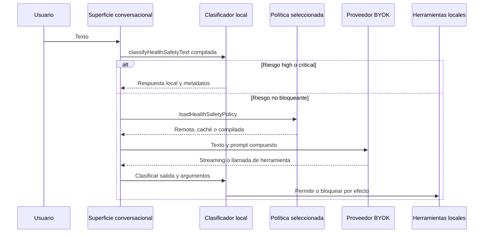

# Seguridad sanitaria y transparencia de IA

Consulta esta página al cambiar chat, estimación de alimentos, minichat de alimentos personales, herramientas del agente, la política sanitaria o la identidad visible del asistente. Estas protecciones pertenecen al cliente local-first y se ejecutan antes o durante las llamadas BYOK descritas en el [entorno de ejecución del agente](runtime.md); no son un diagnóstico ni un backend sanitario.

## Capas de decisión y orden de ejecución

`apps/mobile/agent/healthSafety.ts` contiene la política compilada y las funciones puras. `App.tsx` aplica primero la clasificación determinista de entrada en las tres superficies: `sendMessage`, `sendFoodEstimatorMessage` y `sendMcMessage`. Un riesgo `high` o `critical` añade una respuesta local con `createHealthSafetyChatMessage` y no resuelve proveedor ni transmite el texto.

*La clasificación compilada puede detener una solicitud sin red; la política seleccionada protege después streaming y herramientas.*

Las decisiones se ordenan como `none` < `elevated` < `high` < `critical`. `effectiveToolModeForRisk` permite todos los efectos con `none`, solo lecturas con `elevated` y ninguno con `high`/`critical`. `callProviderChatAPIWithTools` vuelve a clasificar `name` y argumentos de cada herramienta; `agentToolEffect` procede de `toolDefinitions.ts`. Una herramienta bloqueada recibe un resultado JSON `tool_blocked_by_health_safety`, no ejecuta su manejador.

`createHealthSafeStreamGate` no revela un consejo inseguro ya transmitido parcialmente: publica segmentos completos, retiene la salida mientras la entrada es elevada y corta el segmento que clasifica como inseguro. No sustituyas esta puerta por una comprobación solo al final del stream.

## Política compilada, overlay remoto y consentimiento

La fuente declarativa es `policy/health-safety/`: `manifest.json`, `rules.json`, `runtime.json`, casos, esquemas y evaluación informativa. `scripts/health-safety/sync.mjs` genera el bloque administrado de `prompts/AGENTS.md` y `apps/mobile/agent/generated/healthSafetyPolicy.generated.ts`; son salidas derivadas. La fuente también exige que las reglas publicables tengan fuentes y que una regla `approved` tenga revisión profesional; no describas una regla provisional como validación clínica.

`loadHealthSafetyPolicy` usa el canal de `RUNTIME_ENVIRONMENT`:

- `Local` utiliza únicamente `BUNDLED_RUNTIME_HEALTH_SAFETY_POLICY`.
- `Staging` y `Production` consultan el deployment exitoso `gymnasia-policy` de GitHub, aceptan solo URLs de release esperadas y verifican SHA-256 del `health-safety-runtime.json`.
- Si la resolución, descarga, hash, versión o combinación falla, carga una caché AsyncStorage válida del mismo entorno/canal; si tampoco existe, vuelve a la política compilada.

El overlay pasa por `mergeHealthSafetyPolicies`: no puede rebajar riesgo/modo de herramientas, reemplazar respuestas compiladas ni introducir una regla sin `fallbackRuleId` conocido. La selección en memoria y las resoluciones de deployment se limitan a cinco minutos. Esta configuración se relaciona con las variantes y el almacenamiento aislado de [Estado local y copias de seguridad](../mobile/local-state-and-backup.md), y con el prompt versionado de [Entorno de ejecución del agente](runtime.md).

Para señales `elevated`, el usuario puede consentir que el proveedor clasifique texto adicional. `evaluateHealthSafetyWithProvider` tiene tiempo máximo de 10 s, solo acepta JSON con reglas conocidas y combina el resultado con el máximo riesgo local. El consentimiento versionado se guarda fuera de la copia de seguridad; un fallo del evaluador conserva la decisión local. No conviertas ese evaluador opcional en una dependencia para bloquear casos críticos.

## Identidad de IA y composición del prompt

`aiTransparency.ts::composeAiSystemPrompt` elimina bloques reservados previos y anexa exactamente una política local marcada `GYMNASIA_AI_TRANSPARENCY`. Esta regla establece que el agente no es persona ni profesional real y prevalece frente a una instrucción remota contradictoria. Las tres superficies son `main-chat`, `food-estimator` y `personal-food-assistant`.

`AiIdentityDisclosure` muestra la divulgación al iniciar/recorrer la conversación y `AiIdentityPersistentDisclosure` conserva una leyenda accesible. `createAiDisclosureMessage` crea el mensaje inicial local, y `excludeLocalDisclosureMessages` evita reenviarlo como conversación al proveedor. No elimines una de esas dos presentaciones ni cambies una superficie sin actualizar `AI_CONVERSATION_SURFACES`, el prompt compuesto y `aiTransparency.contract.test.ts`.

## Receta de cambio y validación

1. Para modificar reglas, señales o casos, empieza en `policy/health-safety/`; conserva IDs/versiones y actualiza `runtime.json` cuando la regla sea publicable. No edites a mano el bloque `HEALTH-SAFETY` ni los módulos `agent/generated/`.
2. Ejecuta `npm run sync:health-safety`, revisa sus dos salidas derivadas y valida `npm run check:health-safety && npm run test:health-safety`. `report:health-safety` produce un informe determinista informativo; no autoriza PR.
3. Si cambia el prompt, ejecuta además `npm run sync:chat-prompt && npm run check:chat-prompt`. La política de despliegue y sus hashes se prueban con `policyDeployment.test.ts`; el ajuste de prompt no basta para probarlos.
4. Para cambiar integración de UI, herramientas o streaming, ejecuta el foco: `npx vitest run --config apps/mobile/vitest.config.mts apps/mobile/agent/healthSafety.test.ts apps/mobile/agent/healthSafety.contract.test.ts apps/mobile/agent/aiTransparency.contract.test.ts`. Añade `npm test` y la compilación web solo si el cambio cruza el shell o el transporte, según [Compilación, publicación y pruebas](../operations/build-release-and-testing.md).
5. Los cambios de deployment, canal, variante o publicación requieren además validar `apps/mobile/app.config.ts`, `environment.ts` y una variante real. Las pruebas unitarias prueban aceptación de payload/caché, no que exista un deployment remoto.

Los casos de regresión esenciales cubren entrada crítica antes del proveedor, lectura frente a escritura para `elevated`, bloqueo de argumentos, fragmentación de streaming, overlays monotónicos, respuestas en español/inglés/portugués, fallo de evaluador y las tres superficies de divulgación. Mantén pruebas de cada transición cuando amplíes el ciclo de vida.
