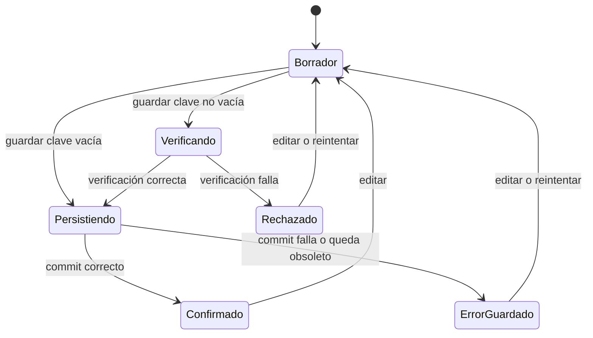
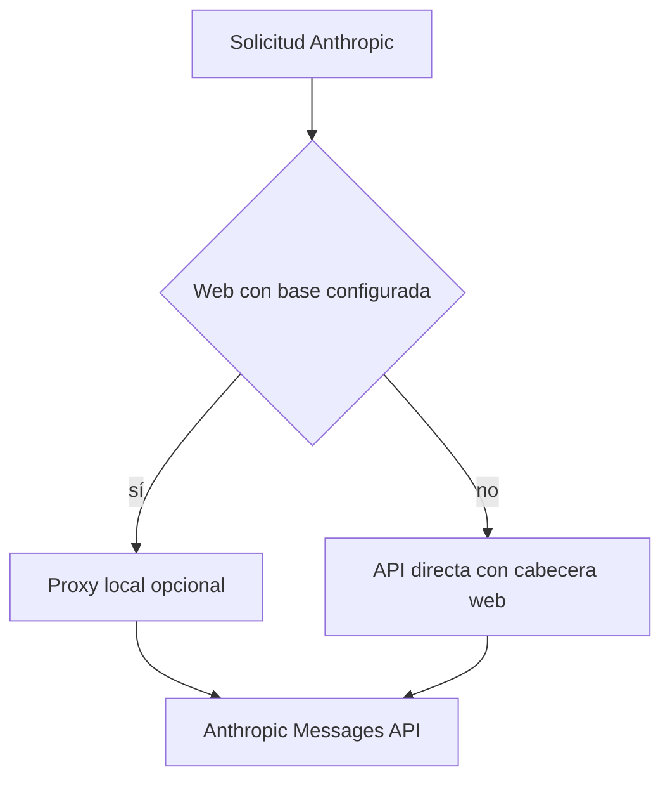

---
okf:
  version: 1
  kind: code-wiki
  status: grounded
  requirement: RQ-01
  scope: Configuración BYOK, persistencia y verificación de proveedores de IA móviles
type: concepto
title: Configuración BYOK de proveedores
description: Contrato de configuración, almacenamiento y comprobación de credenciales BYOK de OpenAI, Google y Anthropic en la aplicación móvil. Explica el aislamiento de secretos, las diferencias entre web y nativo y el proxy Anthropic opcional.
summary: Ciclo de vida de credenciales, modelos, verificación, descubrimiento y transporte por plataforma.
tags: [agent, configuration, providers, credentials, byok, mobile]
related:
  - ./runtime.md
  - ./provider-streaming.md
  - ../mobile/local-state-and-backup.md
  - ../services/anthropic-proxy.md
verified:
  - by: openwiki/0.5.0
    at: 2026-09-07T11:37:28.236Z
sources:
  - id: openwiki-source-88e87a6a49f8c4bba044cff2
    resource: repo://apps/anthropic_proxy/README.md
  - id: openwiki-source-2e89f734760be2c893fbd66e
    resource: repo://apps/mobile/agent/anthropicModels.ts
  - id: openwiki-source-e4b8b3a3e8fb5e339227c3fd
    resource: repo://apps/mobile/agent/providerConfiguration.test.ts
  - id: openwiki-source-0d2384426991583d96044996
    resource: repo://apps/mobile/agent/providerConfiguration.ts
  - id: openwiki-source-04c01bf94878938a4aa2dfd8
    resource: repo://apps/mobile/agent/providerConfigurationPersistence.test.ts
  - id: openwiki-source-98e300a08b181f278443549a
    resource: repo://apps/mobile/agent/providerConfigurationPersistence.ts
  - id: openwiki-source-150caf6747c75c64a081007d
    resource: repo://apps/mobile/agent/providerCredentials.ts
  - id: openwiki-source-0bfe6194a595817dd215a286
    resource: repo://apps/mobile/agent/providerTransport.contract.test.ts
  - id: openwiki-source-c5c28138a849ad0b9daed017
    resource: repo://apps/mobile/agent/providerTransport.test.ts
  - id: openwiki-source-cc29928f3ae5e1998f27d57a
    resource: repo://apps/mobile/agent/providerTransport.ts
  - id: openwiki-source-e5f74ffc1b3b8c00fd4c6086
    resource: repo://apps/mobile/agent/providerVerification.test.ts
  - id: openwiki-source-c80e54251b903682e229caf2
    resource: repo://apps/mobile/agent/providerVerification.ts
  - id: openwiki-source-929e8e1df23628a3f3848ff8
    resource: repo://apps/mobile/App.tsx
  - id: openwiki-source-7a047b00a95eb325eb147887
    resource: repo://apps/mobile/environment.ts
generated: { by: "openwiki/0.5.0", at: "2026-09-07T11:37:28.236Z" }
---

# Configuración BYOK de proveedores

La aplicación móvil admite credenciales aportadas por la persona usuaria (**BYOK**) para `openai`, `anthropic` y `google`. No incorpora una clave real de desarrollo ni necesita un backend propio para operar: OpenAI y Google se llaman directamente y Anthropic también se llama directamente de forma predeterminada. Las claves no se incluyen en las copias de seguridad ni en el agregado general de estado. La configuración de proveedores es una partición de persistencia separada y la única excepción de transporte es un proxy Anthropic **opt-in** para web.

Esta página cubre el contrato de configuración hasta la solicitud de proveedor. El streaming, los formatos de mensajes y las continuaciones de herramientas se describen en [Streaming de proveedores](./provider-streaming.md); el uso de las credenciales por el chat y las herramientas locales, en [Entorno de ejecución del agente](./runtime.md).

## Modelo canónico, borradores e invariantes

`ProviderConfiguration` contiene `provider`, `is_active`, `api_key`, `model`, `workspace_id?` y `reasoning_effort?`; `ProviderDraft` omite la selección activa para que la interfaz pueda editar sin publicar cambios. `PROVIDERS` establece el orden canónico `openai`, `anthropic`, `google`. `normalizeProviderConfigurations` siempre produce esos tres registros y exactamente uno activo: conserva el primero activo en ese orden o activa OpenAI si no había ninguno.

Los modelos iniciales son `gpt-5.6-luna`, `claude-sonnet-5` y `gemini-3.8-flash`. La normalización recorta claves, Workspace ID y modelos; un modelo vacío usa el valor inicial y uno personalizado no vacío se conserva. Como migración, sustituye `gpt-4o-mini` y los valores Google retirados `gemini-1.5-flash`, `gemini-3-flash-preview` y `gemini-3.6-flash`.

`workspace_id` solo tiene significado para Anthropic y `reasoning_effort` solo para OpenAI. Antes de guardar desde la interfaz, un Workspace ID Anthropic no vacío debe comenzar por `wrkspc_`; los errores de Anthropic que indican que falta se traducen a una instrucción accionable. Las claves se mandan en cabeceras directas —`Authorization: Bearer`, `x-api-key` y `x-goog-api-key`—, no en URL.

### Razonamiento según el modelo

OpenAI admite esfuerzos distintos según el prefijo del modelo: `gpt-5.4-pro` admite `medium`, `high`, `xhigh`; `gpt-5-pro`, solo `high`; las familias 5.4, 5.3 y 5.2 admiten `none` a `xhigh`; 5.1 no admite `xhigh`; otros `gpt-5` admiten `minimal` a `high`; y los modelos `o...`, `low` a `high`. Los demás devuelven `null`. Si el valor guardado ya no es compatible al cambiar el modelo, se reemplaza por `medium` cuando se admite o por la primera alternativa.

El razonamiento Anthropic se decide al construir el transporte, no en el formulario: los modelos de las familias heredadas Claude 3 y 4.5 reciben `thinking: {type: "enabled", budget_tokens}`, mientras que los demás —también un modelo desconocido— reciben `thinking: {type: "adaptive", display: "summarized"}`. Esta elección deliberadamente favorece el protocolo moderno para no exigir una actualización de la aplicación por cada modelo nuevo.

## Persistencia, secretos y recuperación

`ProviderConfigurationRepository` es la autoridad durable. Cada snapshot normalizado tiene revisión y se almacena en un diario de esquema 1 con `committed` y `pending`. El repositorio serializa sus operaciones: escribe el candidato pendiente, comprueba que la operación continúa vigente y lo convierte en commit final. Si una escritura falla o el candidato queda obsoleto, intenta restaurar el commit anterior. Durante la hidratación, un `pending` superviviente jamás se promociona por inferencia; se recupera `committed`, y un diario con solo `pending` se descarta y migra desde los valores heredados.

| Plataforma | Diario de proveedores | Consecuencia para secretos |
|---|---|---|
| Web | AsyncStorage, en la clave dedicada del repositorio | El diario contiene las credenciales; la interfaz advierte de la menor protección disponible en navegador. |
| iOS/Android con SecureStore | SecureStore es el diario canónico; AsyncStorage recibe un espejo saneado | El espejo y el `LocalStore` tienen `api_key: ""`; las claves solo están en SecureStore. |
| Nativo sin SecureStore disponible | No se crea repositorio | La sesión puede usar la última configuración legible, pero no se permite guardar una nueva y la anterior permanece activa. |

El agregado general se serializa mediante `stripProviderApiKeys`, por lo que nunca se convierte en otra fuente de secretos, ni siquiera en web. La hidratación combina el agregado histórico saneado con secretos heredados, crea o recupera el repositorio, y deriva `chatProvider` del elemento activo confirmado. Tras migrar correctamente al diario actual, se eliminan las claves individuales heredadas.

Las copias de seguridad excluyen las claves BYOK. Durante una importación se sanean los proveedores del archivo y se conservan la `api_key` y el `workspace_id` Anthropic existentes del dispositivo; por tanto, restaurar un backup no puede inyectar ni sustituir credenciales. Véase [Estado local y copia de seguridad](../mobile/local-state-and-backup.md) para el alcance completo de exportación e importación.



*El candidato solo se publica a los consumidores después del commit; borrar una clave no hace una llamada de verificación.*

## Guardado, selección y respuestas obsoletas

Guardar una clave no vacía normaliza el borrador, comprueba la conexión y solo persiste si la comprobación tiene `ok: true`. Un rechazo deja intacto el registro confirmado y conserva el borrador para corregirlo. Una clave vacía persiste la eliminación sin red. Guardar un candidato con clave lo activa; una eliminación no lo activa. La confirmación de borrado enmascara la clave **persistida**, no el texto temporal que pudiera haber en el borrador.

La selección explícita de proveedor también se persiste en el repositorio antes de actualizar `store.keys` y `chatProvider`. Así, un error de almacenamiento no cambia silenciosamente el proveedor que usa el chat.

La interfaz mantiene revisiones independientes de borrador, guardado y descubrimiento. Editar un borrador incrementa su revisión y hace inválidos los resultados pendientes; iniciar otra operación emite un token con las revisiones pertinentes y la revisión global de configuración. Una respuesta que ya no coincide con el token no actualiza interfaz ni persistencia. Una clave hidratada aparece como «pendiente de comprobar» en esa sesión: el indicador visual no es una promesa de conectividad y no impide que los consumidores la utilicen.

## Verificación y catálogo de modelos

`verifyProviderConfiguration` usa `fetchProviderConfiguration`, que aborta a los 15 segundos y traduce el abort a un error legible. Sin clave devuelve una advertencia sin tocar la red. En modo fixture devuelve éxito local y tampoco hace red.

| Proveedor | Solicitud de verificación directa | Semántica |
|---|---|---|
| OpenAI | `GET https://api.openai.com/v1/models` | Cualquier respuesta 2xx confirma la conexión. |
| Anthropic | `POST https://api.anthropic.com/v1/messages` con `max_tokens: 1` | Un 404 confirma la clave pero advierte que el modelo no está disponible; otro no-2xx rechaza. |
| Google | `GET https://generativelanguage.googleapis.com/v1beta/models/{model}` | Cualquier respuesta 2xx confirma la conexión. |

Si se ha seleccionado proxy, Anthropic verifica contra `/chat/providers/anthropic/verify`, enviando `api_key`, `model` y opcionalmente `workspace_id` en JSON al proxy. Un `{ok: false}` es rechazo; «modelo no disponible» permite guardar con advertencia. Esa advertencia valida la clave, no garantiza que el chat funcione con ese modelo.

El selector es una ayuda y no una lista de permitidos: requiere una clave de borrador para cargar opciones, pero el campo de modelo sigue siendo editable. OpenAI consulta `/v1/models`. Google consulta `/v1beta/models`, elimina `models/`, deduplica y ordena, y solo conserva los modelos que admiten `generateContent` cuando declaran métodos de generación.

Anthropic comparte un recolector paginado en acceso directo y proxy. Solicita `limit=100`, deduplica IDs y se detiene como máximo a las 20 páginas. Si falla la primera página, falla el descubrimiento; si falla una posterior, devuelve lo ya obtenido marcado como parcial. Un cursor ausente o repetido, una página que no aporta modelos o alcanzar el máximo marca el catálogo como truncado. La interfaz muestra la advertencia para que un catálogo incompleto no parezca exhaustivo.

## Transporte y diferencias de plataforma

OpenAI y Google usan acceso directo en web y nativo. Anthropic también usa acceso directo por defecto: en navegador añade `anthropic-dangerous-direct-browser-access: true`, que permite a la página leer la respuesta CORS; nativo no manda esa cabecera. La clave sigue siendo BYOK y reside en el navegador de quien la aportó; quien use esta modalidad debe entender su exposición habitual a las herramientas y al entorno del navegador.

`EXPO_PUBLIC_API_BASE_URL` es la única selección del proxy. `resolveWebApiBaseUrl` recorta el valor y elimina barras finales. `shouldUseAnthropicWebProxy` solo es verdadero cuando la plataforma es web y esa base no está vacía; no hay fallback automático al proxy después de un fallo directo.



*El proxy solo entra por configuración explícita en web, no como backend requerido por la aplicación.*

Con base configurada, las operaciones Anthropic de modelos, verificación y mensajes usan `/chat/providers/anthropic/models`, `/verify` y `/messages`. El proxy recibe la clave en JSON y la convierte en `x-api-key` para el upstream en lugar de reenviarla en el cuerpo. Es un servicio local de desarrollo, no un backend de producto; tiene límites de confianza y operación propios, descritos en [Proxy CORS de Anthropic para navegador](../services/anthropic-proxy.md).

## Consumidores, modo fixture y cambios seguros

Los resolutores de las superficies omiten configuraciones sin clave y normalizan el modelo antes de llamar al proveedor. El estimador de alimentos usa prioridad Google → OpenAI → Anthropic. El modo `fake` solo puede elegirse para `APP_ENV=development` mediante `DEV_PROVIDER_MODE`; sin valor, desarrollo usa `fake`, mientras staging y producción usan BYOK. Las superficies de conversación cortocircuitan antes de la red, generan resultados deterministas locales y no incorporan una clave real de desarrollo.

Al añadir un proveedor o alterar este contrato, cambie de forma coordinada:

1. La unión `Provider`, `PROVIDERS`, valores iniciales y normalizadores, incluido el único activo.
2. El repositorio, saneamiento del agregado y reglas de migración/importación para que los secretos sigan fuera de backups.
3. Verificación, descubrimiento y consumidores con su autenticación fuera de URL.
4. La decisión explícita de acceso directo web o intermediario y el límite de confianza del intermediario.
5. Pruebas de normalización, tokens obsoletos, diario y rollback, verificación, catálogos y rutas web/nativa.

Las pruebas focalizadas son `providerConfiguration.test.ts`, `providerConfigurationPersistence.test.ts`, `providerCredentials.test.ts`, `providerVerification.test.ts`, `providerTransport.test.ts` y `providerTransport.contract.test.ts`. Desde la raíz:

```bash
npx vitest run --config apps/mobile/vitest.config.mts apps/mobile/agent/providerConfiguration.test.ts apps/mobile/agent/providerConfigurationPersistence.test.ts apps/mobile/agent/providerCredentials.test.ts apps/mobile/agent/providerVerification.test.ts apps/mobile/agent/providerTransport.test.ts apps/mobile/agent/providerTransport.contract.test.ts
```
