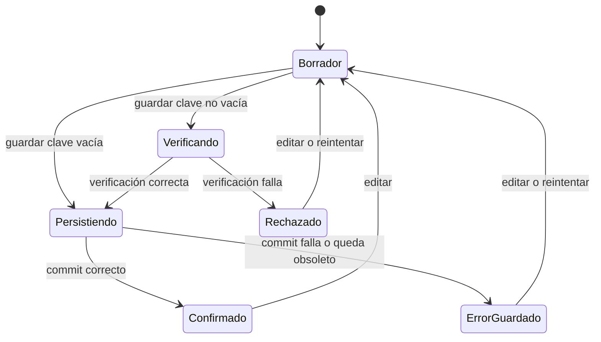
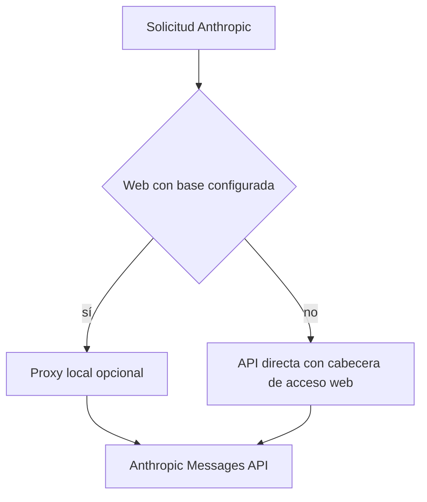

---
okf:
  version: 1
  kind: code-wiki
  status: grounded
  requirement: RQ-01
  scope: Canonical AI provider configuration across settings UI, persistence, selection, verification, discovery, and consumers
type: concepto
title: Configuración y transporte de proveedores
description: Configuración BYOK, persistencia, verificación, descubrimiento de modelos y transporte de OpenAI, Anthropic y Google. Anthropic usa acceso directo en web por defecto; el proxy local es una alternativa opt-in.
summary: RQ-01-complete lifecycle for OpenAI, Anthropic, and Google configuration, selection, credentials, models, verification, routing, failures, tests, and extensions.
tags: [agent, configuration, providers, credentials, models, transport]
related:
  - ./runtime.md
  - ./provider-streaming.md
  - ../mobile/local-state-and-backup.md
  - ../mobile/diet-and-food-estimation.md
  - ../services/anthropic-proxy.md
  - ../operations/build-release-and-testing.md
verified:
  - by: openwiki/0.4.3
    at: 2026-09-06T10:32:53.606Z
sources:
  - id: openwiki-source-88e87a6a49f8c4bba044cff2
    resource: repo://apps/anthropic_proxy/README.md
  - id: openwiki-source-2e89f734760be2c893fbd66e
    resource: repo://apps/mobile/agent/anthropicModels.ts
  - id: openwiki-source-e4b8b3a3e8fb5e339227c3fd
    resource: repo://apps/mobile/agent/providerConfiguration.test.ts
  - id: openwiki-source-0d2384426991583d96044996
    resource: repo://apps/mobile/agent/providerConfiguration.ts
  - id: openwiki-source-04c01bf94878938a4aa2dfd8
    resource: repo://apps/mobile/agent/providerConfigurationPersistence.test.ts
  - id: openwiki-source-98e300a08b181f278443549a
    resource: repo://apps/mobile/agent/providerConfigurationPersistence.ts
  - id: openwiki-source-0bfe6194a595817dd215a286
    resource: repo://apps/mobile/agent/providerTransport.contract.test.ts
  - id: openwiki-source-cc29928f3ae5e1998f27d57a
    resource: repo://apps/mobile/agent/providerTransport.ts
  - id: openwiki-source-e5f74ffc1b3b8c00fd4c6086
    resource: repo://apps/mobile/agent/providerVerification.test.ts
  - id: openwiki-source-c80e54251b903682e229caf2
    resource: repo://apps/mobile/agent/providerVerification.ts
  - id: openwiki-source-929e8e1df23628a3f3848ff8
    resource: repo://apps/mobile/App.tsx
generated: { by: "openwiki/0.4.3", at: "2026-09-06T10:32:53.606Z" }
---

# Configuración y transporte de proveedores

La aplicación móvil configura credenciales aportadas por la persona usuaria (BYOK) para `openai`, `anthropic` y `google`. Esta página describe el límite entre la configuración guardada, los borradores de Ajustes y las solicitudes de red. El streaming y los bucles de herramientas se detallan en [Streaming de proveedores](./provider-streaming.md); la ejecución de herramientas, en [Entorno de ejecución del agente](./runtime.md).

> **Anthropic en web es directo por defecto.** La aplicación añade la cabecera `anthropic-dangerous-direct-browser-access`, con la que Anthropic habilita CORS. El proxy local no es un requisito del navegador ni un backend de producto: únicamente se elige si se configura expresamente `EXPO_PUBLIC_API_BASE_URL`.

## Modelo canónico y normalización

`ProviderConfiguration` reúne `provider`, `is_active`, `api_key`, `model`, `workspace_id?` y `reasoning_effort?`; `ProviderDraft` contiene los campos editables sin el indicador activo. `PROVIDERS` fija el orden canónico: OpenAI, Anthropic y Google. La normalización siempre devuelve una entrada por cada uno y conserva exactamente un `is_active`: si faltan activos elige OpenAI y, si hay varios, conserva el primero en ese orden.

Los valores iniciales son `gpt-5.6-luna`, `claude-sonnet-5` y `gemini-3.8-flash`. Las claves y el Workspace ID se recortan. Un modelo vacío recibe el valor predeterminado; los modelos personalizados no vacíos se conservan. La migración reemplaza el antiguo valor OpenAI `gpt-4o-mini` y los valores Google retirados (`gemini-1.5-flash`, `gemini-3-flash-preview`, `gemini-3.6-flash`) por los predeterminados actuales.

Para Anthropic, `workspace_id` solo se conserva para ese proveedor. Al guardar desde la interfaz, un Workspace ID no vacío debe empezar por `wrkspc_`; los errores que indiquen que Anthropic lo exige se traducen a una instrucción para completar ese campo. La clave nunca forma parte de una URL: OpenAI usa `Authorization: Bearer`, Anthropic `x-api-key` y Google `x-goog-api-key`.

### Esfuerzo de razonamiento de OpenAI

La política de `getSupportedOpenAIReasoningEfforts` depende del prefijo del modelo. `gpt-5.4-pro` admite `medium`, `high`, `xhigh`; `gpt-5-pro`, solo `high`; las familias 5.4, 5.3 y 5.2 admiten desde `none` hasta `xhigh`; 5.1 excluye `xhigh`; otros `gpt-5` admiten `minimal` a `high`; y los modelos `o...` admiten `low` a `high`. Los demás no reciben esfuerzo (`null`).

`normalizeOpenAIReasoningEffort` conserva una elección compatible, o usa `medium` si se admite, o la primera alternativa. Por ello, cambiar el modelo puede reajustar un esfuerzo incompatible antes de persistirlo. La configuración de razonamiento de Anthropic depende de la generación del modelo y se construye en el transporte, no en el formulario.

## Persistencia y ciclo de vida

El estado de la aplicación conserva las configuraciones hidratadas para los consumidores, pero el `ProviderConfigurationRepository` es la autoridad duradera. Guarda snapshots versionados en un diario con `committed` y `pending`; todas las entradas pasan por la normalización. En web, el diario completo —incluidas las credenciales— vive en su clave dedicada de AsyncStorage. En nativo, el diario canónico vive en SecureStore y AsyncStorage recibe un espejo con todas las `api_key` vacías.

La escritura es una secuencia de dos fases: escribe un candidato `pending`, comprueba que la operación sigue vigente y lo promueve a `committed`. El repositorio serializa operaciones concurrentes. Si falla una escritura o el candidato queda obsoleto, intenta restaurar el último commit. Al arrancar, un `pending` nunca se promueve por intuición: se restaura `committed`; un diario con solo `pending` se descarta y se inicia desde el estado heredado. Esto evita publicar una rotación parcial de credenciales.

Durante la hidratación, la aplicación combina el agregado histórico con las claves individuales seguras, crea o lee el repositorio y deriva `chatProvider` del elemento activo confirmado. Si SecureStore no está disponible en nativo, no se crea repositorio: se puede usar la configuración legible de esa sesión, pero un nuevo guardado falla y la configuración anterior sigue activa. Las exportaciones e importaciones eliminan las claves: al importar se conservan las credenciales y el Workspace ID actualmente guardados en vez de aceptar secretos del archivo.

*El candidato no se publica para los consumidores hasta que el commit termina; una clave vacía elimina la configuración sin hacer una llamada de verificación.*

La IU mantiene revisiones independientes de borrador, guardado y descubrimiento. Editar aumenta la revisión de borrador e invalida las respuestas anteriores; comenzar un guardado o descubrimiento crea un token que incluye esas revisiones. Las respuestas que ya no coinciden no actualizan estado ni persisten datos. El estado visual de conexión es efímero: una clave hidratada aparece como pendiente de comprobación, no como conectada, y no bloquea las solicitudes posteriores.

## Guardar, seleccionar y usar una configuración

Al guardar una clave no vacía, la aplicación normaliza el borrador, verifica la conexión y solo entonces confirma el candidato. Un resultado de verificación con `ok: false` conserva el registro confirmado y el borrador para corregirlo. Una clave vacía omite la red y confirma la eliminación. La eliminación desde el diálogo toma y enmascara la clave **persistida**, no el contenido temporal del borrador.

Un candidato con clave se confirma como activo; al guardar una eliminación no se activa. `applyProviderCandidate` vuelve a imponer el único activo, y solo después del commit la interfaz actualiza `store.keys` y `chatProvider`. Por tanto, un error de almacenamiento no cambia silenciosamente el proveedor usado por el chat.

Las superficies que eligen por prioridad omiten las claves vacías y normalizan el modelo antes de llamar a un proveedor. `resolveFoodEstimatorProvider` usa la prioridad Google → OpenAI → Anthropic. El modo de proveedor falso crea credenciales y resultados de fixture locales, y las superficies de conversación cortocircuitan antes de cualquier red; no incorpora una clave real de desarrollo.

## Verificación y catálogo de modelos

`verifyProviderConfiguration` tiene un timeout de 15 segundos a través de `fetchProviderConfiguration`; un timeout se convierte en un error legible. Sin clave devuelve una advertencia sin red. En modo fixture devuelve éxito sin llamar a `fetch`.

| Proveedor | Verificación directa | Resultado relevante |
|---|---|---|
| OpenAI | `GET https://api.openai.com/v1/models` | Cualquier 2xx confirma la conexión. |
| Anthropic | `POST https://api.anthropic.com/v1/messages` con `max_tokens: 1` | Un 404 confirma la clave pero advierte que el modelo no está disponible; otros no-2xx son errores. |
| Google | `GET https://generativelanguage.googleapis.com/v1beta/models/{model}` | Cualquier 2xx confirma la conexión. |

Si se ha optado por el proxy de Anthropic, la verificación se envía a `/chat/providers/anthropic/verify` y el proxy recibe `api_key`, `model` y, opcionalmente, `workspace_id` en JSON. Un `{ok:false}` es un error; un mensaje que indique «modelo no disponible» sigue siendo un éxito con advertencia. La advertencia permite guardar la clave, pero no garantiza que las conversaciones con ese modelo funcionen.

El desplegable de modelos es una ayuda, no una lista de permitidos: solo se abre con clave de borrador y el campo de modelo sigue siendo editable. OpenAI consulta `/v1/models`; Google consulta `/v1beta/models`, elimina el prefijo `models/`, deduplica, ordena y excluye modelos que declaran métodos de generación pero no `generateContent`.

El catálogo Anthropic es paginado. Tanto el acceso directo como el proxy usan el lector compartido, que deduplica opciones, pide páginas con `limit=100` y detiene un recorrido en 20 páginas. Si falla la primera página, el descubrimiento falla; si falla una posterior, entrega lo reunido marcado como parcial. Un cursor ausente o repetido, una página sin modelos nuevos o el límite de páginas marca el catálogo como truncado. La interfaz muestra la advertencia para que una lista incompleta no parezca exhaustiva.

## Transporte de Anthropic: directo primero, proxy opt-in

`resolveWebApiBaseUrl` toma `EXPO_PUBLIC_API_BASE_URL`, lo recorta y elimina barras finales; el valor predeterminado es vacío. `shouldUseAnthropicWebProxy` solo devuelve verdadero en web y con esa base no vacía. En cualquier otro caso —incluido navegador sin base configurada— el transporte de Anthropic va directamente a `https://api.anthropic.com`.

*La elección del proxy depende exclusivamente de una base configurada; no es una alternativa automática tras un fallo directo.*

Las solicitudes directas Anthropic incluyen `x-api-key`, `anthropic-version`, el Workspace ID si existe y, en web, `anthropic-dangerous-direct-browser-access: true`. La cabecera permite que el navegador lea la respuesta CORS. Las solicitudes nativas no envían esa cabecera. OpenAI y Google usan acceso directo en ambas plataformas.

Cuando se ha configurado una base, las operaciones Anthropic de modelos, verificación y mensajes van a las rutas `/chat/providers/anthropic/models`, `/verify` y `/messages` del proxy. El proxy de `apps/anthropic_proxy` es deliberadamente local y de desarrollo: rechaza arrancar fuera de una dirección local y rechaza clientes remotos. Convierte las credenciales recibidas en el cuerpo a las cabeceras upstream, no las reenvía en el cuerpo, y aplica 15 segundos a modelos/verificación y 120 segundos a mensajes. Consulte [Proxy de Anthropic](../services/anthropic-proxy.md) para su contrato y restricciones operativas.

## Pruebas y cambios seguros

Las pruebas unitarias de configuración verifican la normalización de modelos antiguos, el único proveedor activo, la compatibilidad de razonamiento y la invalidación de tokens de guardado y descubrimiento, incluidas propiedades con `fast-check`. Las pruebas del repositorio cubren diario web y nativo, espejo nativo sin secretos, rollback de la escritura final, descartado de `pending` y actualizaciones concurrentes. Las de verificación cubren cabeceras sin claves en URL, 401, el 404 advertido de Anthropic, el contrato opcional del proxy, timeout y modo fixture. El contrato de transporte además exige que las superficies de conversación no alcancen la red en modo falso y que Google nunca coloque la clave en la URL.

Al añadir un proveedor o modificar su configuración, cambie de forma conjunta el tipo `Provider`, `PROVIDERS`, valores predeterminados y normalizadores, el repositorio y su saneamiento, las rutas de descubrimiento/verificación y los resolutores de consumidores. Decida explícitamente si puede usarse acceso directo web y, si se añade un intermediario, documente su límite de confianza. Amplíe las pruebas de normalización, persistencia, concurrencia, verificación, catálogo y ambas rutas de plataforma; no convierta el proxy Anthropic en una dependencia por defecto.
