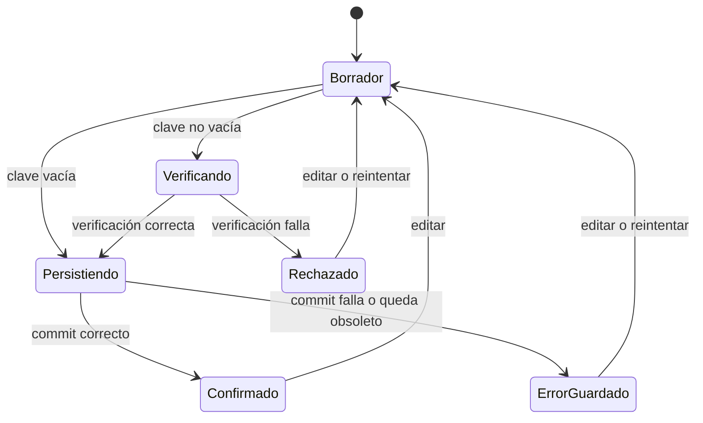
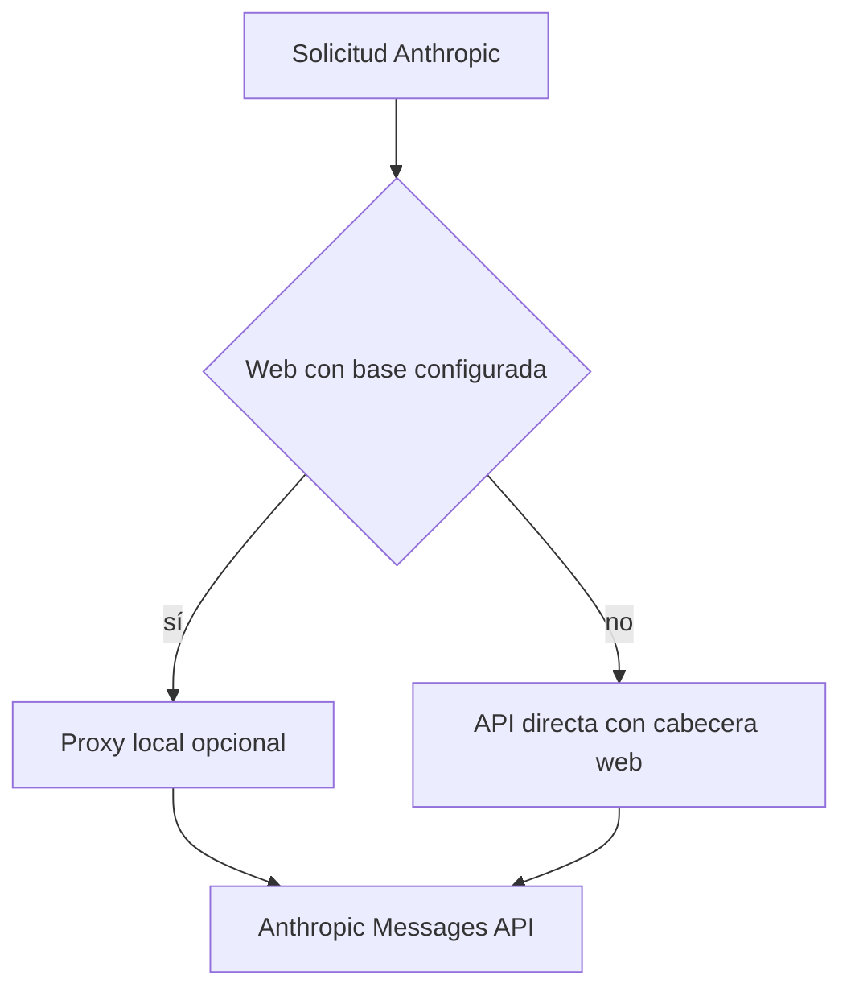

---
okf:
  version: 1
  kind: code-wiki
  status: grounded
  requirement: RQ-01
  scope: Configuración BYOK, persistencia y verificación de proveedores de IA móviles
type: concepto
title: Configuración BYOK de proveedores
description: Configuración, persistencia y verificación de credenciales BYOK para OpenAI, Anthropic y Google en la aplicación móvil. Distingue secretos estrictamente locales de los ajustes portables y describe los límites de tiempo y transporte por plataforma.
summary: Ciclo de vida de credenciales, modelos, verificación, descubrimiento y transporte por plataforma.
tags: [agent, configuration, providers, credentials, byok, mobile]
related:
  - ./runtime.md
  - ./provider-streaming.md
  - ../mobile/local-state-and-backup.md
  - ../services/anthropic-proxy.md
verified:
  - by: openwiki/0.5.0
    at: 2026-09-15T14:17:12.687Z
sources:
  - id: openwiki-source-88e87a6a49f8c4bba044cff2
    resource: repo://apps/anthropic_proxy/README.md
  - id: openwiki-source-2e89f734760be2c893fbd66e
    resource: repo://apps/mobile/agent/anthropicModels.ts
  - id: openwiki-source-dc42304b20e8518ef65b4b63
    resource: repo://apps/mobile/agent/googleContextBudget.ts
  - id: openwiki-source-f310c5fb576ae69a7753918c
    resource: repo://apps/mobile/agent/googleStreamTransport.ts
  - id: openwiki-source-9cad4ef8944c5d67ea03dec8
    resource: repo://apps/mobile/agent/providerChatClient.ts
  - id: openwiki-source-e4b8b3a3e8fb5e339227c3fd
    resource: repo://apps/mobile/agent/providerConfiguration.test.ts
  - id: openwiki-source-0d2384426991583d96044996
    resource: repo://apps/mobile/agent/providerConfiguration.ts
  - id: openwiki-source-04c01bf94878938a4aa2dfd8
    resource: repo://apps/mobile/agent/providerConfigurationPersistence.test.ts
  - id: openwiki-source-98e300a08b181f278443549a
    resource: repo://apps/mobile/agent/providerConfigurationPersistence.ts
  - id: openwiki-source-150caf6747c75c64a081007d
    resource: repo://apps/mobile/agent/providerCredentials.ts
  - id: openwiki-source-0bfe6194a595817dd215a286
    resource: repo://apps/mobile/agent/providerTransport.contract.test.ts
  - id: openwiki-source-c5c28138a849ad0b9daed017
    resource: repo://apps/mobile/agent/providerTransport.test.ts
  - id: openwiki-source-cc29928f3ae5e1998f27d57a
    resource: repo://apps/mobile/agent/providerTransport.ts
  - id: openwiki-source-e5f74ffc1b3b8c00fd4c6086
    resource: repo://apps/mobile/agent/providerVerification.test.ts
  - id: openwiki-source-c80e54251b903682e229caf2
    resource: repo://apps/mobile/agent/providerVerification.ts
  - id: openwiki-source-a6ba9053969a3e00cd971742
    resource: repo://apps/mobile/app.config.ts
  - id: openwiki-source-929e8e1df23628a3f3848ff8
    resource: repo://apps/mobile/App.tsx
  - id: openwiki-source-318f06e80876ecd0a060af5a
    resource: repo://apps/mobile/persistence/localStoreModel.ts
generated: { by: "openwiki/0.5.0", at: "2026-09-15T14:17:12.687Z" }
---

# Configuración BYOK de proveedores

La aplicación móvil configura credenciales aportadas por la persona usuaria (**BYOK**) para `openai`, `anthropic` y `google`. La configuración vive separada del agregado ordinario de estado: las claves no son configuración portable ni se incluyen en una copia de seguridad. OpenAI y Google se llaman directamente; Anthropic también es directo de forma predeterminada, con un proxy web local opcional.

Esta página cubre el contrato desde el formulario hasta la solicitud al proveedor. Para streaming, formato de mensajes y bucles de herramientas, véase [Streaming de proveedores](./provider-streaming.md); para los consumidores del chat y herramientas locales, [Entorno de ejecución del agente](./runtime.md).

## Modelo canónico e invariantes

`ProviderConfiguration` contiene `provider`, `is_active`, `api_key`, `model`, `workspace_id?` y `reasoning_effort?`. `ProviderDraft` omite `is_active`: permite editar una propuesta sin hacer visible un cambio aún no confirmado. `PROVIDERS` fija el orden canónico `openai`, `anthropic`, `google`; `normalizeProviderConfigurations` siempre devuelve los tres y exactamente uno activo. Conserva el primero activo según ese orden o activa OpenAI si no existe uno.

Los modelos iniciales son `gpt-5.6-luna`, `claude-sonnet-5` y `gemini-3.8-flash`. La normalización recorta clave, modelo y Workspace ID; un modelo vacío recupera el inicial y uno personalizado no vacío se conserva. Migra `gpt-4o-mini` y los valores Google retirados `gemini-1.5-flash`, `gemini-3-flash-preview` y `gemini-3.6-flash`.

`workspace_id` solo se conserva para Anthropic, y `reasoning_effort` solo para OpenAI. La interfaz debe validar que un Workspace ID Anthropic no vacío empiece por `wrkspc_`; si Anthropic dice que falta, el mensaje guía a copiarlo desde la consola. Las claves viajan exclusivamente en cabeceras: `Authorization: Bearer` para OpenAI, `x-api-key` para Anthropic y `x-goog-api-key` para Google, nunca en la URL.

### Razonamiento por modelo

OpenAI calcula los esfuerzos admitidos a partir del prefijo del modelo. `gpt-5.4-pro` admite `medium`, `high`, `xhigh`; `gpt-5-pro`, solo `high`; las familias 5.4, 5.3 y 5.2 admiten `none` a `xhigh`; 5.1 no admite `xhigh`; otros `gpt-5` admiten `minimal` a `high`; y los modelos `o...`, `low` a `high`. Los demás no tienen esfuerzo compatible. Al cambiar de modelo, un valor guardado incompatible se sustituye por `medium` si procede, por la primera alternativa o por `null`.

Anthropic decide el formato de razonamiento al construir el transporte: Claude 3 y 4.5 usan `thinking: { type: "enabled", budget_tokens }`; los demás, incluidos modelos aún desconocidos, usan `thinking: { type: "adaptive", display: "summarized" }`. El sesgo deliberado hacia el protocolo moderno evita requerir una publicación por cada modelo nuevo.

## Persistencia local y frontera de secretos

`ProviderConfigurationRepository` es la autoridad durable. Guarda snapshots de esquema 1 con revisión en un diario `committed`/`pending`, serializa las operaciones y solo actualiza el snapshot actual tras el commit final. Si la escritura falla o el candidato queda obsoleto, restaura el commit previo. Al hidratar, un `pending` superviviente nunca se promueve por inferencia: se recupera `committed`; si solo existe `pending`, se descarta y se migra desde los valores heredados.

| Plataforma | Diario de proveedores | Implicación |
|---|---|---|
| Web | AsyncStorage, bajo la clave dedicada del repositorio | El diario contiene la clave. La protección disponible es la propia del navegador. |
| iOS/Android con SecureStore | SecureStore es canónico; AsyncStorage conserva un espejo saneado | El espejo deja `api_key: ""`; las claves solo están en SecureStore. |
| Nativo sin SecureStore | No se crea repositorio | El arranque puede usar la última configuración legible, pero no permite confirmar una configuración nueva. |

El agregado `LocalStore` se serializa mediante `stripProviderApiKeys`, por lo que no crea una segunda fuente de claves. Durante la hidratación se combinan los valores históricos saneados con secretos heredados, se hidrata o migra el repositorio y se deriva `chatProvider` del proveedor activo confirmado. Tras una migración nativa correcta se eliminan las claves heredadas individuales.

Las copias de seguridad usan el agregado saneado. Al importar, la aplicación normaliza y vuelve a sanear los proveedores del archivo; después conserva la `api_key` local de cada proveedor y el `workspace_id` Anthropic ya existente. Una copia no puede inyectar, rotar ni sobrescribir esos secretos locales. Véase [Estado local y copia de seguridad](../mobile/local-state-and-backup.md) para el formato y alcance de exportación.



*El candidato se publica tras un commit confirmado; eliminar una clave no llama a la red.*

## Guardado, selección y respuestas obsoletas

Guardar una clave no vacía normaliza el borrador, verifica la conexión y solo persiste cuando recibe `ok: true`. Un rechazo mantiene intacto el registro confirmado y conserva el borrador para corregirlo. Una clave vacía persiste el borrado sin verificación. Guardar un candidato con clave lo activa; eliminar una clave no lo activa. La confirmación de borrado enmascara la clave persistida, no texto temporal del borrador.

La selección explícita de proveedor se persiste antes de actualizar `store.keys` y `chatProvider`; un fallo de almacenamiento no cambia silenciosamente el proveedor del chat. La UI mantiene revisiones independientes de borrador, guardado y descubrimiento. Editar incrementa revisiones e invalida resultados pendientes; los tokens incluyen las revisiones pertinentes y, para el guardado, la revisión global de configuración. Una respuesta que no coincide ya con su token no modifica UI ni persistencia. Tras hidratar una clave, el estado visual es «pendiente de comprobar»: no certifica conectividad ni impide que un consumidor la use.

## Verificación, descubrimiento y límites de tiempo

`fetchProviderConfiguration` limita a **15 segundos** las solicitudes de configuración —verificación y catálogos— mediante `AbortController`; transforma el abort en un mensaje legible. Sin clave, la verificación devuelve una advertencia sin red; en modo fixture devuelve éxito local sin red.

| Proveedor | Verificación directa | Resultado |
|---|---|---|
| OpenAI | `GET https://api.openai.com/v1/models` | Cualquier 2xx confirma conexión. |
| Anthropic | `POST https://api.anthropic.com/v1/messages` con `max_tokens: 1` | Un 404 confirma la clave pero advierte que el modelo no está disponible; otro no-2xx rechaza. |
| Google | `GET https://generativelanguage.googleapis.com/v1beta/models/{model}` | Cualquier 2xx confirma conexión. |

Con proxy Anthropic seleccionado, la verificación usa `/chat/providers/anthropic/verify` y envía `api_key`, `model` y opcionalmente `workspace_id` en JSON. `{ ok: false }` rechaza; «modelo no disponible» permite guardar con advertencia, que valida clave pero no garantiza el chat.

El selector es una ayuda, no una lista de permitidos: requiere una clave de borrador para descubrir opciones, pero el campo de modelo continúa editable. OpenAI consulta `/v1/models`. Google consulta `/v1beta/models`, elimina el prefijo `models/`, deduplica y ordena, filtrando solo los modelos que declaran métodos de generación incompatibles con `generateContent`. La generación de Google, en cambio, usa `POST /v1beta/interactions`, transmite `stream: true` y `store: false`; el historial se prepara localmente. Por tanto, que aparezca en el catálogo no prueba compatibilidad completa con Interactions.

Anthropic comparte un recolector paginado en acceso directo y proxy: solicita `limit=100`, deduplica IDs y visita como máximo 20 páginas. Si falla la primera, el descubrimiento falla; si falla una posterior, retorna lo ya reunido como parcial. Cursor ausente o repetido, página sin modelos o límite alcanzado marcan el catálogo como truncado para que la interfaz no lo presente como exhaustivo.

El timeout de 15 segundos **no** es el timeout de una generación en streaming. La ruta XHR de Google para streaming —incluido su fallback buffered nativo— fija `xhr.timeout = 120000`; el lector debe operar y diagnosticar configuración y generación como presupuestos distintos.

## Transporte y diferencia web/nativo

OpenAI y Google usan acceso directo en web y nativo. Anthropic también lo hace por defecto: en navegador añade `anthropic-dangerous-direct-browser-access: true` para que CORS permita a la página leer la respuesta; en nativo no se envía dicha cabecera. La clave sigue siendo BYOK y reside en el navegador de quien la aportó, con la exposición habitual de ese entorno.

`EXPO_PUBLIC_API_BASE_URL` controla la única ruta alternativa. `resolveWebApiBaseUrl` recorta el valor y elimina barras finales; `shouldUseAnthropicWebProxy` solo es verdadero si la plataforma es web y la base no está vacía. No hay fallback automático al proxy tras un fallo directo.



*El proxy se elige explícitamente para web; no es un backend de producto requerido.*

Con base configurada, los modelos, la verificación y los mensajes Anthropic usan `/chat/providers/anthropic/models`, `/verify` y `/messages`. El proxy recibe la clave en JSON y la transforma en `x-api-key` hacia upstream. Es un servicio local de desarrollo, con límites de confianza propios; véase [Proxy CORS de Anthropic para navegador](../services/anthropic-proxy.md).

## Fixture, operaciones y cambios seguros

El modo `fake` solo puede seleccionarse con `APP_ENV=development` mediante `DEV_PROVIDER_MODE`; si no se define, desarrollo usa `fake`, mientras staging y producción usan BYOK. Todas las superficies de conversación cortocircuitan antes de la red y producen resultados locales deterministas. No hay una clave real de desarrollo incorporada. El estimador de alimentos omite configuraciones sin clave y aplica prioridad Google → OpenAI → Anthropic.

`GOOGLE_FIXTURE_PORT` solo puede incorporarse a una compilación Development BYOK y debe ser un puerto local válido entre 1024 y 65535. En tiempo de petición, el endpoint de fixture exige además `environment === "development"` y la clave exacta `e2e-local-fake-key`; de otro modo lanza un error, en vez de redirigir accidentalmente tráfico real. El endpoint local conserva el protocolo `/v1beta/interactions` y la generación real usa el mismo protocolo con `store: false`.

Al añadir un proveedor o modificar este contrato, cambie coordinadamente:

1. `Provider`, `PROVIDERS`, valores iniciales y normalizadores, preservando el único activo.
2. El repositorio, el saneamiento del agregado y migración/importación para no volver portables los secretos.
3. Verificación, catálogo y consumidores, manteniendo autenticación fuera de URL.
4. La decisión explícita entre acceso directo web e intermediario, incluyendo su límite de confianza.
5. Pruebas de normalización, tokens obsoletos, diario/rollback, verificación, catálogo y rutas web/nativa.

Las pruebas focalizadas son `providerConfiguration.test.ts`, `providerConfigurationPersistence.test.ts`, `providerCredentials.test.ts`, `providerVerification.test.ts`, `providerTransport.test.ts` y `providerTransport.contract.test.ts`. Para ejecutarlas desde la raíz:

```bash
npx vitest run --config apps/mobile/vitest.config.mts apps/mobile/agent/providerConfiguration.test.ts apps/mobile/agent/providerConfigurationPersistence.test.ts apps/mobile/agent/providerCredentials.test.ts apps/mobile/agent/providerVerification.test.ts apps/mobile/agent/providerTransport.test.ts apps/mobile/agent/providerTransport.contract.test.ts
```
