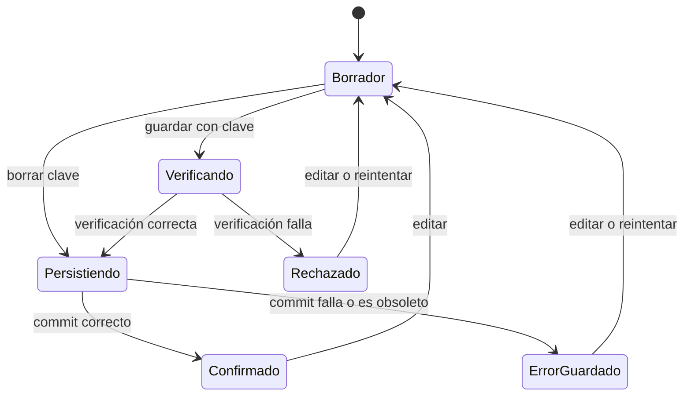
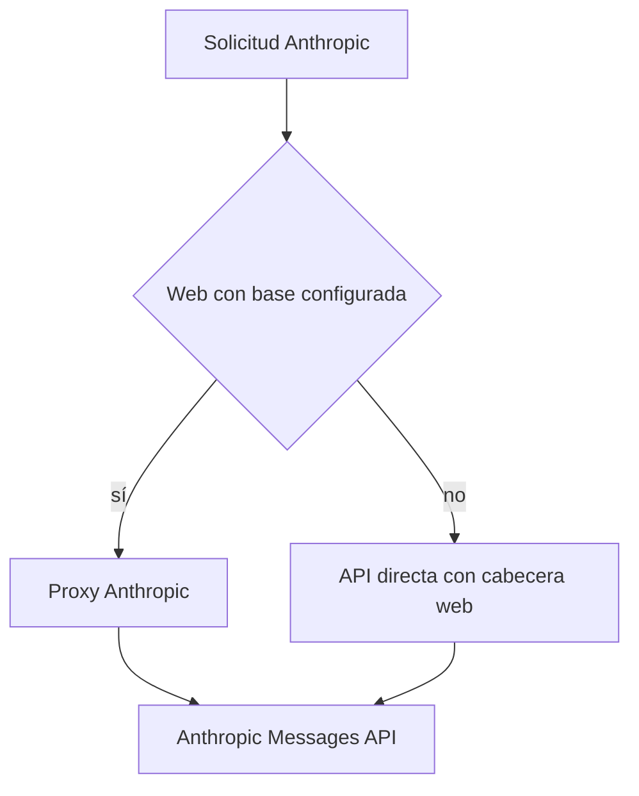

# Configuración de proveedores

La aplicación móvil usa credenciales aportadas por la persona usuaria (**BYOK**) para exactamente `openai`, `anthropic` y `google`. El cliente llama directamente a OpenAI y Google; Anthropic también es directo de forma predeterminada. La configuración durable de proveedores está separada del agregado general de estado para aislar sus claves y evitar que entren en copias de seguridad. Un proxy Anthropic es una opción explícita y solo para web, no un backend requerido.

Esta página cubre el contrato desde el borrador hasta la solicitud al proveedor. Para el protocolo de streaming y las continuaciones con herramientas, véase [Streaming de proveedores](./provider-streaming.md); para los consumidores de chat y herramientas locales, [Entorno de ejecución del agente](./runtime.md).

## Configuración canónica e invariantes

`ProviderConfiguration` contiene `provider`, `is_active`, `api_key`, `model`, `workspace_id?` y `reasoning_effort?`. `ProviderDraft` omite `is_active`: permite editar un proveedor sin publicar la selección. `PROVIDERS` fija el orden canónico `openai`, `anthropic`, `google`.

`normalizeProviderConfigurations` devuelve siempre un registro por cada proveedor y **exactamente uno** activo. Conserva el primer activo según ese orden; si no hay ninguno, activa OpenAI. Es la barrera que debe usarse al leer datos históricos, antes de persistir y para construir borradores.

| Proveedor | Modelo predeterminado | Campo específico |
|---|---|---|
| OpenAI | `gpt-5.6-luna` | `reasoning_effort` |
| Anthropic | `claude-sonnet-5` | `workspace_id` |
| Google | `gemini-3.8-flash` | — |

La normalización recorta clave, modelo y Workspace ID; un modelo vacío toma el predeterminado y uno personalizado no vacío se conserva. Migra `gpt-4o-mini` y los valores Google retirados `gemini-1.5-flash`, `gemini-3-flash-preview` y `gemini-3.6-flash`. Los campos no aplicables se vacían: Workspace ID solo se conserva para Anthropic y esfuerzo de razonamiento solo para OpenAI.

El formulario debe validar que un Workspace ID Anthropic no vacío empieza por `wrkspc_`. Si Anthropic responde que el Workspace ID es obligatorio, el transporte lo traduce a una instrucción para obtenerlo en la consola. Las credenciales se transmiten en cabeceras —`Authorization: Bearer`, `x-api-key` y `x-goog-api-key`— y no en URL.

### Razonamiento por familia de modelo

Para OpenAI, las opciones de `reasoning_effort` dependen del prefijo del modelo. `gpt-5.4-pro` admite `medium`, `high`, `xhigh`; `gpt-5-pro`, solo `high`; las familias 5.4, 5.3 y 5.2 admiten de `none` a `xhigh`; 5.1 no admite `xhigh`; otros `gpt-5` admiten de `minimal` a `high`; y `o...`, de `low` a `high`. Para una familia desconocida el resultado es `null`. Al cambiar modelo, un esfuerzo que ya no sirve se sustituye por `medium` si está disponible, o por la primera alternativa compatible.

Anthropic decide el formato de razonamiento al construir la petición, no al editar. Claude 3 y 4.5 reciben `thinking: { type: "enabled", budget_tokens }`; cualquier otro modelo, incluso uno desconocido, recibe `thinking: { type: "adaptive", display: "summarized" }`. El sesgo hacia el formato moderno permite que modelos futuros funcionen sin actualizar la lista de la aplicación.

## Persistencia y frontera de secretos

`ProviderConfigurationRepository` es la autoridad durable. Persiste snapshots normalizados con `schemaVersion: 1`, revisión y un diario con `committed` y `pending`. Serializa operaciones en una cola: escribe el candidato como pendiente, vuelve a comprobar que la operación sigue vigente y lo finaliza como commit. Ante fallo o invalidez, intenta restaurar el commit previo. Al hidratar, un `pending` superviviente no se promociona: se recupera `committed`; un diario que solo tiene `pending` se descarta y se migra desde la configuración heredada.

| Plataforma | Almacén canónico | Espejo / consecuencia |
|---|---|---|
| Web | Diario dedicado en AsyncStorage | Contiene las claves; el navegador ofrece menos protección que el almacén seguro nativo. |
| iOS/Android con SecureStore | Diario completo en SecureStore | AsyncStorage recibe el diario saneado, con toda `api_key` vacía. |
| Nativo sin SecureStore | No se crea repositorio | La app conserva la última configuración legible para la sesión, pero no permite persistir una nueva. |

El agregado `LocalStore` se serializa con `stripProviderApiKeys`, por lo que nunca se convierte en una segunda fuente de secretos. Durante la hidratación se combinan el agregado histórico saneado y las claves heredadas, se inicializa el repositorio cuando es posible y `chatProvider` se deriva del proveedor activo confirmado. Tras una migración nativa correcta se eliminan las claves heredadas individuales.

Las exportaciones excluyen claves BYOK. Al importar, la app sanea los proveedores del archivo y conserva la `api_key` y el `workspace_id` Anthropic que ya estaban en el dispositivo: una copia de seguridad no puede inyectar ni reemplazar esos secretos.



*El estado consumible solo cambia tras un commit confirmado; eliminar una clave no verifica por red.*

## Guardado, selección y operaciones concurrentes

Guardar un borrador con clave no vacía primero lo normaliza y verifica; solo un resultado `ok: true` pasa a persistencia. Un rechazo conserva intacta la configuración confirmada y el borrador para corregirlo. Una clave vacía persiste la eliminación sin red. Guardar una clave activa el candidato; borrar una clave no cambia por sí solo la selección. La selección explícita de proveedor también se confirma en el repositorio antes de actualizar `store.keys` y `chatProvider`, de modo que un fallo de almacenamiento deja activo el proveedor anterior.

Cada proveedor mantiene revisiones de borrador, guardado y descubrimiento; los tokens de guardado incluyen además la revisión global de configuración. Editar incrementa la revisión de borrador y descubrimiento; un nuevo guardado o descubrimiento invalida su operación anterior. Una respuesta cuyo token no coincide ya no puede cambiar interfaz ni persistencia. Una clave hidratada puede mostrarse como pendiente de comprobar durante la sesión: ese indicador no impide su uso por los consumidores.

## Verificación y catálogo de modelos

`verifyProviderConfiguration` no hace red si falta la clave —devuelve advertencia— ni en modo `fake`, que devuelve éxito de fixture local. Las llamadas reales usan `fetchProviderConfiguration`, cuyo timeout predeterminado es 15 segundos y convierte un aborto en un error legible.

| Proveedor | Comprobación directa | Resultado especial |
|---|---|---|
| OpenAI | `GET https://api.openai.com/v1/models` | Cualquier 2xx confirma la conexión. |
| Anthropic | `POST https://api.anthropic.com/v1/messages`, `max_tokens: 1` | Un 404 confirma la clave y avisa de que el modelo no está disponible; otro no-2xx rechaza. |
| Google | `GET https://generativelanguage.googleapis.com/v1beta/models/{model}` | Cualquier 2xx confirma la conexión. |

Si se selecciona proxy, Anthropic verifica contra `/chat/providers/anthropic/verify`, enviando `api_key`, `model` y, si existe, `workspace_id` en JSON. Un `{ ok: false }` rechaza; un mensaje de modelo no disponible permite guardar con advertencia. Esta advertencia acredita la clave, no que el modelo pueda atender conversaciones.

El selector de modelos es una ayuda, no una allowlist: necesita una clave de borrador para cargar opciones, pero el modelo se puede editar libremente. OpenAI consulta `/v1/models`; Google consulta `/v1beta/models`, retira el prefijo `models/`, deduplica, ordena y, cuando el proveedor declara métodos de generación, conserva solo los que admiten `generateContent`.

El recolector Anthropic comparte la paginación directa y la del proxy. Pide páginas de 100, deduplica IDs y se limita a 20 páginas. Si la primera página falla, falla el descubrimiento; si falla una posterior, devuelve lo acumulado como parcial. Cursor ausente o repetido, una página sin modelos nuevos o el límite de páginas marcan el resultado truncado. La advertencia correspondiente impide presentar un catálogo incompleto como exhaustivo.

## Transporte, web y Google

OpenAI y Google usan acceso directo tanto en web como en nativo. Anthropic también usa directo por defecto; en web añade `anthropic-dangerous-direct-browser-access: true` para poder leer la respuesta CORS, mientras nativo no envía esa cabecera. La clave BYOK sigue en el entorno de la persona usuaria; el acceso directo en navegador conlleva la exposición habitual a las herramientas y al entorno del navegador.

`EXPO_PUBLIC_API_BASE_URL` activa el proxy Anthropic: se recorta y se eliminan barras finales; solo una base no vacía en web hace que `shouldUseAnthropicWebProxy` sea verdadero. No existe fallback automático al proxy después de un fallo directo.



*El proxy se elige explícitamente solo para web; no es una dependencia de la aplicación móvil.*

Con esa base, modelos, verificación y mensajes Anthropic usan respectivamente `/chat/providers/anthropic/models`, `/verify` y `/messages`. El proxy recibe las credenciales en JSON y las convierte en cabeceras upstream. Es una ayuda de desarrollo local con límites de confianza propios; véase [Proxy CORS de Anthropic para navegador](../services/anthropic-proxy.md).

Google genera por `POST /v1beta/interactions` con `stream: true` y `store: false`; la petición lleva el historial local. El endpoint de fixture `http://127.0.0.1:{port}/v1beta/interactions` solo se habilita con un puerto válido, `APP_ENV=development`, modo BYOK y la clave ficticia exacta `e2e-local-fake-key`. Fuera de ese caso, intentar configurarlo falla; la generación normal usa el endpoint real de Interactions. La verificación y el catálogo permanecen en `/v1beta/models`, por lo que listar un modelo no prueba que soporte todas las capacidades de Interactions.

## Consumidores, modo fixture y cambios seguros

Los resolutores omiten configuraciones sin clave y normalizan el modelo antes de llamar al proveedor. El estimador de alimentos elige en prioridad Google, OpenAI y Anthropic. `DEV_PROVIDER_MODE` solo es válido si `APP_ENV=development`: sin valor, desarrollo usa `fake`; staging y producción usan BYOK. En `fake`, las superficies de conversación cortocircuitan antes de cualquier red de proveedor y devuelven resultados locales deterministas; no hay una clave real de desarrollo integrada.

Al añadir un proveedor o cambiar este contrato, actualice coordinadamente:

1. La unión `Provider`, `PROVIDERS`, predeterminados y normalizadores, incluido el invariante de un solo activo.
2. El repositorio, saneamiento del agregado y migración/importación para que secretos y backups sigan separados.
3. Verificación, descubrimiento y consumidores, conservando autenticación en cabeceras y no en URL.
4. La decisión explícita entre acceso directo web e intermediario y el límite de confianza del intermediario.
5. Pruebas de normalización, tokens obsoletos, diario y rollback, verificación, catálogo y rutas web/nativas.

Las pruebas focalizadas son `providerConfiguration.test.ts`, `providerConfigurationPersistence.test.ts`, `providerCredentials.test.ts`, `providerVerification.test.ts`, `providerTransport.test.ts` y `providerTransport.contract.test.ts`:

```bash
npx vitest run --config apps/mobile/vitest.config.mts apps/mobile/agent/providerConfiguration.test.ts apps/mobile/agent/providerConfigurationPersistence.test.ts apps/mobile/agent/providerCredentials.test.ts apps/mobile/agent/providerVerification.test.ts apps/mobile/agent/providerTransport.test.ts apps/mobile/agent/providerTransport.contract.test.ts
```
