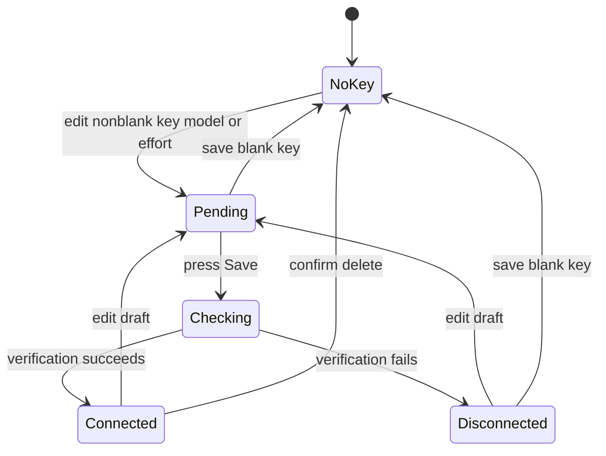

---
okf:
  version: 1
  kind: code-wiki
  status: grounded
  requirement: RQ-01
  scope: Canonical AI provider configuration across settings UI, persistence, selection, verification, discovery, and consumers
type: concepto
title: Configuración de proveedores
description: Ciclo de vida completo de la configuración, selección, credenciales, modelos, verificación, enrutamiento, fallos, pruebas y extensiones de OpenAI, Anthropic y Google.
summary: RQ-01-complete lifecycle for OpenAI, Anthropic, and Google configuration, selection, credentials, models, verification, routing, failures, tests, and extensions.
tags: [agent, configuration, providers, credentials, models, requirements]
sources:
  - apps/mobile/App.tsx
  - apps/mobile/package.json
  - apps/anthropic_proxy/cors-proxy.py
related:
  - ./runtime.md
  - ./provider-streaming.md
  - ../mobile/local-state-and-backup.md
  - ../mobile/diet-and-food-estimation.md
  - ../services/anthropic-proxy.md
  - ../operations/build-release-and-testing.md
---

# Configuración de proveedores

Esta página satisface **RQ-01** al cubrir el ámbito canónico completo de la configuración de proveedores: tipos y valores predeterminados de proveedores/modelos; estado persistido frente a editable; selección y alternativas para el chat y el estimador de alimentos; normalización y compatibilidad con el razonamiento de OpenAI; descubrimiento y filtrado de modelos; estados de verificación y gravedad; ciclo de vida de guardado, eliminación y restablecimiento; persistencia de credenciales; precedencia del entorno y de la URL base; enrutamiento web/nativo; comportamiento de los consumidores; fallos parciales; pruebas; y superficies de extensión. Los aspectos internos del protocolo de streaming permanecen en [Streaming de proveedores](./provider-streaming.md), mientras que el comportamiento de las herramientas permanece en [Entorno de ejecución del agente](./runtime.md).

La aplicación admite exactamente `Provider = "anthropic" | "openai" | "google"`. Una `AIKey` es `{provider, is_active, api_key, model, reasoning_effort?}`. A pesar de su nombre histórico, es el registro completo del proveedor guardado. `ProviderDraft` es exclusivo de la IU y contiene los campos editables `api_key`, `model` y el esfuerzo opcional de OpenAI.

## Modelo de configuración y propiedad

| Aspecto | Símbolos exactos | Comportamiento canónico |
|---|---|---|
| Universo de proveedores | `Provider`, `PROVIDERS` | El orden de los auxiliares de IU/persistencia es OpenAI, Anthropic y Google. |
| Valores predeterminados | `DEFAULT_MODELS`, `createDefaultProviderKeys` | OpenAI `gpt-5-mini` activo de forma predeterminada; Anthropic `claude-3-5-sonnet-latest`; Google `gemini-3-flash-preview`; todas las claves vacías. |
| Estado guardado | `LocalStore.keys`, `chatProvider?`, `foodAIProvider?` | Tres registros normalizados más consumidores preferidos independientes. |
| Estado editable | `providerDraftByProvider`, `createProviderDraftMap`, `updateProviderDraft` | Los cambios no se convierten en credenciales para los consumidores hasta que se guardan correctamente, salvo la eliminación mediante el guardado de un valor vacío. |
| Estado de verificación | `ProviderConnectionStatus`, `providerConnectionStatus` | Estado efímero de la IU: `connected`, `disconnected`, `checking`, `unknown`, además de gravedad/detalle. No se conserva. |
| Resolutor del chat | memo `activeProvider` | El `chatProvider` configurado preferido; de lo contrario, el primer registro con una clave; de lo contrario, `store.keys[0]`. |
| Resolutor del estimador | `resolveFoodEstimatorProvider`, `resolveFoodEstimatorProviderFromState` | El `foodAIProvider` configurado preferido cuando corresponda; prioridad alternativa Google → OpenAI → Anthropic. |
| Resolutor genérico de minichat | `resolveProviderByPriority`, `MiniChat` | El proveedor preferido si tiene clave; de lo contrario, la prioridad indicada por el llamador, usando de forma predeterminada la prioridad del estimador. |
| Almacenamiento de secretos | `secureStoreKey`, `readProviderApiKeysFromSecureStore`, `writeProviderApiKeysToSecureStore` | Usa el prefijo de clave `gymnasia.mobile.v3.provider.api_key.{provider}` cuando SecureStore está disponible. |
| URL base web de Anthropic | `resolveWebApiBaseUrl`, `buildWebProxyUrl` | Recorta `EXPO_PUBLIC_API_BASE_URL`; si no existe, usa el valor predeterminado vacío; elimina las barras diagonales finales y, a continuación, añade la ruta. |

`is_active` es un marcador compatible con sistemas heredados para indicar un único elemento activo, no el único selector en tiempo de ejecución. Los cambios en el selector de chat de la configuración actualizan `chatProvider`; `activeProvider` consulta primero ese valor. `setActiveProvider` también escribe `chatProvider` y hace que exactamente ese registro esté activo. `normalizeStore` repara `is_active` para que exactamente un elemento sea verdadero y migra un `chatProvider` ausente a partir de él, pero los consumidores deben entenderse mediante sus selectores explícitos actuales.

## Invariantes de hidratación y normalización

`normalizeStore(raw)` reconstruye exactamente una entrada para cada proveedor compatible y en orden. Recorta las claves, completa los modelos, normaliza el esfuerzo de OpenAI y establece `is_active` de forma predeterminada según el índice. Si ningún registro está activo, OpenAI pasa a estarlo; si hay varios activos, solo permanece activo el primero. Un `chatProvider` ausente se migra a partir del registro activo y después a OpenAI; un `foodAIProvider` ausente usa Google de forma predeterminada.

`normalizeProviderModel(provider, rawModel)` recorta un modelo y, si está vacío, usa `DEFAULT_MODELS[provider]`. También migra dos valores predeterminados heredados exactos:

- OpenAI `gpt-4o-mini` → `gpt-5-mini`
- Google `gemini-1.5-flash` → `gemini-3-flash-preview`

Los ID de modelos arbitrarios indicados por el usuario se conservan en los demás casos. No se comprueba ninguna lista de permitidos durante la persistencia.

Cuando SecureStore está disponible, `serializeStoreForAsyncStorage` llama a `stripSensitiveStoreData`, dejando los metadatos de los proveedores en `STORAGE_KEY = gymnasia.mobile.local.v3`, pero vaciando cada `api_key`. Durante la hidratación, `mergeStoreWithSecureApiKeys` da preferencia a los valores no vacíos de SecureStore y, de lo contrario, conserva el valor del almacén ordinario. Cuando SecureStore no está disponible, el `LocalStore` serializado incluye las claves de API como alternativa. Este es un límite deliberado de las capacidades de la plataforma, no una garantía de cifrado; consulte [Estado local y copia de seguridad](../mobile/local-state-and-backup.md).

## Semántica de selección y alternativas

### Chat principal

El memo `activeProvider` busca primero un `store.chatProvider` con una clave no vacía. Si está ausente o sin configurar, toma el primer registro con clave de `store.keys` (normalmente en el orden normalizado OpenAI, Anthropic, Google). Si no existe ninguna clave, devuelve `store.keys[0]`, lo que hace que `sendMessage` informe de que falta la clave de ese proveedor en lugar de indicar que «no hay proveedor». Un proveedor seleccionado que falle en el momento de la solicitud **no** cambia automáticamente a otro proveedor.

### Estimador de alimentos y minichat

`FOOD_ESTIMATOR_PROVIDER_PRIORITY` es Google, OpenAI, Anthropic. `resolveFoodEstimatorProvider` y `resolveProviderByPriority` omiten las claves ausentes o vacías, recortan la clave elegida y normalizan su modelo. Las rutas específicas del estado del estimador de alimentos respetan primero `foodAIProvider` cuando tiene una clave y, después, recurren a la prioridad. De forma similar, `MiniChat` respeta `preferredProvider`, después una prioridad proporcionada y, por último, la prioridad del estimador. Consulte [Dieta y estimación de alimentos](../mobile/diet-and-food-estimation.md) para conocer el comportamiento de imágenes, códigos de barras y resultados estructurados.

### Invariantes del proveedor activo

- Los registros de proveedores deben ser únicos y estar completos después de `normalizeStore`.
- Exactamente un `is_active` sobrevive a la normalización, pero `chatProvider` y `foodAIProvider` pueden apuntar a proveedores diferentes.
- La selección solo requiere una clave guardada no vacía, no un estado actualmente «conectado». El estado de verificación es efímero y los resolutores no lo consultan.
- Un fallo de verificación deja intacto el registro del proveedor guardado previamente, mientras conserva los valores fallidos en el borrador para su corrección.

## Ciclo de vida de borrador, descubrimiento, verificación y guardado



*Leyenda: El estado efímero de conexión sigue las ediciones del borrador y la verificación; solo una verificación correcta confirma una credencial no vacía.*

`createProviderConnectionStatusMap` inicializa los proveedores con clave como `unknown`/advertencia («verificación pendiente») y los proveedores vacíos como `disconnected`/advertencia («guarde una clave de API»). No vuelve a verificar durante la hidratación.

`updateProviderDraft(provider, updates)`:

1. actualiza únicamente el mapa de borradores;
2. vuelve a normalizar el esfuerzo de OpenAI con respecto al modelo previsto;
3. cuando cambia la clave, cierra y borra el menú desplegable, las opciones y el filtro de modelos de ese proveedor;
4. normalmente marca un borrador no vacío como `unknown`/advertencia y un borrador vacío como `disconnected`/advertencia.

Abrir un menú desplegable de modelos requiere una clave de **borrador** no vacía e inicia el descubrimiento. Los resultados y filtros son estados de IU locales de cada proveedor. Seleccionar un modelo actualiza únicamente el borrador y cierra o borra los mensajes y el filtro del menú desplegable. La selección de OpenAI también normaliza el esfuerzo para el nuevo modelo.

`saveProviderApiKey(provider)` normaliza la clave, el modelo y el esfuerzo, llama inmediatamente a `setActiveProvider(provider)` y marca la carga del guardado. Sus ramas son:

- **Clave normalizada vacía:** actualiza inmediatamente el registro guardado con una clave vacía, conserva el modelo y el esfuerzo normalizados, sincroniza el borrador, establece una advertencia de desconexión, oculta la clave, borra las opciones de modelos y retorna sin verificación de red.
- **Clave no vacía:** establece `checking`, llama a `verifyProviderConnection` y confirma la clave, el modelo y el esfuerzo mediante `updateProviderConfig` solo cuando `check.ok` es verdadero. En caso de fallo, el borrador permanece editable, mientras que se conserva el registro guardado anterior. El estado pasa a conectado o desconectado según la gravedad y el mensaje devueltos; el fallo también establece un error global.

Debido a que `setActiveProvider` precede a la verificación, un intento fallido cambia el proveedor de chat preferido y los indicadores `is_active`, aunque su nueva clave no se confirme. A continuación, `activeProvider` recurre a una alternativa si ese proveedor no tiene una clave guardada previamente. Este comportamiento de estado parcial es importante al depurar un informe del tipo «un guardado fallido cambió mi selección».

`openDeleteProviderApiKeyModal` enmascara la clave **persistida** y solo se abre cuando existe una. `confirmDeleteProviderApiKey` vacía las claves guardada y de borrador, establece una advertencia de desconexión, borra la IU de descubrimiento del proveedor, cierra el modal y depende de los efectos normales de persistencia para eliminar el elemento de SecureStore. Guardar una clave vacía tiene una semántica equivalente de eliminación de credenciales, pero sin confirmación. «Borrar actividad y conversaciones» conserva las claves y la selección de proveedor. «Borrar todos mis datos» elimina cada clave actual y antigua de SecureStore, vuelve a leerla para verificar el resultado y remonta el runtime; si SecureStore no está disponible en móvil, el informe queda incompleto en vez de afirmar que las credenciales desaparecieron.

## Matriz de verificación

| Proveedor | Solicitud de verificación | Comportamiento de éxito/advertencia |
|---|---|---|
| OpenAI | `GET https://api.openai.com/v1/models` con clave de portador | Cualquier respuesta 2xx es correcta; no se verifica el modelo seleccionado. |
| Anthropic nativo | `POST /v1/messages` con el modelo seleccionado, `max_tokens: 1` y un ping | Una respuesta 2xx es correcta. HTTP 404 se trata como `ok: true`, con gravedad `warning`: la clave se ha verificado, pero el modelo no está disponible. Otros códigos distintos de 2xx son errores. |
| Anthropic web | `POST {base}/chat/providers/anthropic/verify` con clave/modelo | `{ok:false}` del proxy es un error. `{ok:true}` es correcto, salvo que el mensaje contenga `modelo no disponible`, en cuyo caso se convierte en advertencia. |
| Google | `GET .../v1beta/models/{model}?key=...` | Una respuesta 2xx es correcta; una distinta de 2xx es un error. |

`verifyProviderConnection` devuelve `{ok, message, severity}`, donde la gravedad es success/warning/error. Las claves ausentes devuelven una advertencia sin realizar una solicitud. `toMediumProviderDetail` y `toSevereProviderDetail` normalizan el énfasis dirigido al usuario; cuando es posible, la extracción utiliza los mensajes de error de la carga útil del proveedor. Una advertencia con `ok: true` se confirma y se muestra como conectada.

El estado de conexión es orientativo: se vuelve a crear después de recargar y no impide las llamadas del chat o del estimador. A la inversa, el descubrimiento correcto de la lista de modelos no establece el estado conectado ni guarda nada.

## Descubrimiento y filtrado de modelos

| Proveedor | Símbolo/ruta de descubrimiento | Notas de análisis/filtrado |
|---|---|---|
| OpenAI | `fetchOpenAIModelsDirect` → `GET /v1/models` | `parseOpenAIModelOptions`; el filtro de la IU busca coincidencias en `id` en minúsculas más `owned_by`. |
| Anthropic nativo | `fetchAnthropicModelsDirect` → `GET /v1/models` | Envía `x-api-key` y `anthropic-version`. |
| Anthropic web | `fetchAnthropicModelsViaWebProxy` → `/chat/providers/anthropic/models` | Envía la clave en el cuerpo POST; un fallo de obtención se convierte en instrucciones que indican que se requiere el proxy. El filtro de la IU busca coincidencias en `id` más `display_name`. |
| Google | `fetchGoogleModelsDirect` → `GET /v1beta/models?key=...` | El analizador elimina el prefijo `models/`, quita duplicados, ordena y excluye las entradas cuya lista no vacía de métodos de generación no contenga `generateContent`; el filtro de la IU busca coincidencias en `id` más el nombre para mostrar. |

Una lista vacía es una advertencia; un fallo de solicitud o análisis borra las opciones y muestra un error. El texto del modelo continúa siendo editable manualmente, por lo que el descubrimiento es una ayuda y no una lista de permitidos. Cambiar una clave del borrador invalida las opciones almacenadas en caché para evitar mostrar modelos autorizados por una clave anterior.

## Compatibilidad con el esfuerzo de razonamiento de OpenAI

`getSupportedOpenAIReasoningEfforts(model)` y `normalizeOpenAIReasoningEffort(effort, model)` constituyen la política canónica de compatibilidad:

| Prefijo del modelo normalizado | Esfuerzos permitidos |
|---|---|
| `gpt-5.4-pro` | medium, high, xhigh |
| `gpt-5-pro` | high |
| `gpt-5.4`, `gpt-5.3`, `gpt-5.2` | none, low, medium, high, xhigh |
| `gpt-5.1` | none, low, medium, high |
| otros `gpt-5` | minimal, low, medium, high |
| `o...` | low, medium, high |
| otros modelos | sin configuración de razonamiento |

La normalización conserva un valor proporcionado que sea compatible; de lo contrario, prefiere `DEFAULT_OPENAI_REASONING_EFFORT = medium`, después el primer valor compatible, y devuelve null cuando la familia de modelos no tiene ninguna política. `buildOpenAIReasoningConfig` usa esta configuración normalizada para las llamadas de OpenAI y solicita el modo de resumen `detailed`. Por tanto, las ediciones del modelo pueden cambiar silenciosamente un esfuerzo incompatible al valor predeterminado de la política. El comportamiento de razonamiento de Anthropic y Google está fijado en las cargas útiles de transporte y no se puede configurar aquí; consulte [Streaming de proveedores](./provider-streaming.md).

## URL base, plataforma y límites de confianza

`resolveWebApiBaseUrl()` lee `globalThis.process?.env?.EXPO_PUBLIC_API_BASE_URL`, recorta el valor, recurre a `DEFAULT_WEB_API_BASE_URL = ""` y elimina las barras diagonales finales. `buildWebProxyUrl(path)` devuelve una URL absoluta configurada o la ruta relativa sin cambios. La versión web de producción es estática y, deliberadamente, no tiene un valor predeterminado de localhost.

Solo el descubrimiento de modelos, la verificación y los mensajes de Anthropic en el navegador usan este proxy, porque las llamadas directas desde el navegador se enfrentan a CORS. Anthropic nativo llama directamente al proveedor. OpenAI y Google llaman directamente a los proveedores en ambas plataformas. Por tanto, todas las claves de API propiedad del usuario terminan saliendo de la aplicación: las de OpenAI/Google van directamente a los proveedores, la de Anthropic nativo va directamente a Anthropic y la de Anthropic en el navegador va primero al proxy configurado. El proxy recibe la clave en el cuerpo de la solicitud; sus restricciones de despliegue y de seguridad/CORS están documentadas en [Proxy de Anthropic](../services/anthropic-proxy.md).

La URL base es una configuración del entorno de compilación/tiempo de ejecución, no se almacena en `LocalStore` ni se puede editar en la configuración de proveedores. Si no hay ninguna base configurada, Anthropic en el navegador usa la ruta relativa `/chat/providers/anthropic/...`; en un host estático sin esas rutas, falla y muestra `ANTHROPIC_WEB_PROXY_REQUIRED_MESSAGE`.

## Comportamiento ante fallos y confirmaciones parciales

| Situación | Registro guardado | Borrador/estado | Consecuencia para el consumidor |
|---|---|---|---|
| Edición sin guardar | sin cambios | advertencia pendiente | Los consumidores continúan usando los valores guardados anteriores. |
| Fallo del descubrimiento | sin cambios | opciones borradas, error de descubrimiento | La edición manual del modelo y el guardado siguen siendo posibles. |
| Fallo de verificación | sin cambios, salvo que el proveedor preferido y los indicadores activos cambiaron antes | borrador fallido conservado, error de desconexión | El chat puede usar la clave guardada anterior de ese proveedor o recurrir a otro registro con clave. |
| Modelo de Anthropic con 404 y clave válida | nuevos valores confirmados | conectado con advertencia | Las solicitudes aún pueden fallar con el modelo seleccionado no disponible. |
| Guardado vacío | clave eliminada; modelo/esfuerzo normalizados y guardados | advertencia de desconexión | El resolutor lo omite y puede recurrir a una alternativa. |
| SecureStore falla al escribir posteriormente | el estado en memoria ya ha cambiado | la IU puede aparentar que se ha guardado | El fallo del efecto de persistencia puede hacer que la persistencia difiera de la memoria; el controlador de guardado no espera al almacenamiento duradero. |
| Recarga de la aplicación después de un resultado correcto | valores hidratados/normalizados | el estado vuelve a una advertencia desconocida | El proveedor se puede seguir seleccionando porque el estado no actúa como barrera. |
| Fallo de la solicitud del proveedor seleccionado | sin cambios | el estado de conexión no baja de categoría automáticamente | No hay cambio de proveedor en tiempo de ejecución. |

No existe ninguna transacción atómica que abarque el estado de React, AsyncStorage, SecureStore y la verificación. La verificación se produce antes de confirmar una credencial no vacía, pero la persistencia duradera se realiza posteriormente. También son posibles las condiciones de carrera de estado si un usuario inicia guardados superpuestos; no hay ningún token de solicitud que impida que una respuesta de verificación anterior sobrescriba un estado más reciente.

## Pruebas y comandos específicos

**No hay pruebas unitarias específicas** para `normalizeProviderModel`, la selección de proveedores, la compatibilidad del razonamiento, los borradores de configuración, el análisis/descubrimiento de modelos, las transiciones de verificación, el comportamiento de combinación/escritura de SecureStore ni los fallos parciales de guardado/eliminación. Las pruebas deterministas del agente ejercitan los contratos de analizadores/herramientas, pero no la configuración de ajustes. `scripts/agent-chat.e2e.mjs` y los flujos del estimador de alimentos constituyen evidencia de consumidores posteriores, en lugar de una prueba completa de la máquina de estados de configuración.

Use comprobaciones específicas estáticas, de tipos y de compilación al modificar esta superficie monolítica de `App.tsx`:

```bash
npm --workspace apps/mobile run test:deterministic
npm --workspace apps/mobile run build:web
```

Para un cambio de enrutamiento de Anthropic en el navegador, ejecute la aplicación con una URL base explícita y el proxy por separado; no incluya ningún secreto en el comando ni en el repositorio:

```bash
EXPO_PUBLIC_API_BASE_URL=http://127.0.0.1:8000 npm --workspace apps/mobile run web
python apps/anthropic_proxy/cors-proxy.py
```

El segundo comando refleja el punto de entrada del código fuente; instale los requisitos del proxy según [Proxy de Anthropic](../services/anthropic-proxy.md). Ejecute el flujo explícito del agente en el navegador únicamente con las credenciales y el entorno locales adecuados:

```bash
npm run test:agent:e2e
```

## Superficie de cambios para extensiones

### Añadir una regla de familia de modelos

1. Actualice `DEFAULT_MODELS` o las constantes heredadas solo si se pretende realizar una migración.
2. Actualice `normalizeProviderModel` y, para OpenAI, `getSupportedOpenAIReasoningEfforts`/`normalizeOpenAIReasoningEffort`, además de las opciones de configuración.
3. Compruebe que los constructores de solicitudes para el chat ordinario, el chat con herramientas y la estimación de alimentos llamen todos a la normalización.
4. Añada pruebas específicas; actualmente, esta lógica carece de cobertura directa.

### Añadir o cambiar el comportamiento de configuración de proveedores

1. Amplíe conjuntamente `Provider`, `AIKey`, `ProviderDraft`, `PROVIDERS`, `DEFAULT_MODELS`, `PROVIDER_UI_META`, los constructores de mapas predeterminados/de borradores/de estados/booleanos y `normalizeStore`.
2. Añada la participación de lectura/escritura/eliminación de claves seguras y el comportamiento de migración. Decida si el proveedor puede usar de forma segura solicitudes directas desde el navegador.
3. Implemente el análisis del descubrimiento de modelos, el estado del menú desplegable/filtro, la verificación, las ramas de guardado/eliminación/restablecimiento y la IU de selección.
4. Actualice deliberadamente los resolutores del chat, del minichat y del estimador de alimentos; la prioridad de proveedores es una decisión de producto, no una consecuencia incidental del orden de una matriz.
5. Añada todas las cargas útiles de solicitudes y las asignaciones de analizadores/bucles/declaraciones de herramientas de streaming descritas en [Streaming de proveedores](./provider-streaming.md) y [Entorno de ejecución del agente](./runtime.md).
6. Si se requiere un proxy, añada sus rutas/configuración y documente los límites de confianza/despliegue. Mantenga explícitos la precedencia de `EXPO_PUBLIC_API_BASE_URL` y el comportamiento de la web estática.
7. Pruebe la normalización, la migración heredada, el invariante de un único elemento activo, la alternativa del proveedor preferido, el guardado vacío, la verificación fallida/correcta/con advertencia, los guardados superpuestos, el filtrado de descubrimiento, las rutas con SecureStore disponible/no disponible y el enrutamiento tanto web como nativo.

### Lista de comprobación para RQ-01

- Las selecciones de proveedores y consumidores permanecen independientes y normalizadas.
- Las credenciales vacías nunca pasan por los resolutores; los secretos se recortan y se omiten de AsyncStorage cuando SecureStore está disponible.
- Las ediciones de borradores no pueden convertirse silenciosamente en credenciales no vacías guardadas sin una verificación correcta.
- La advertencia con resultado correcto (modelo de Anthropic no disponible) continúa diferenciándose de un fallo grave.
- Los modelos manuales siguen siendo utilizables cuando falla el descubrimiento.
- Todos los consumidores de proveedores comparten la normalización de modelos y configuraciones de razonamiento compatibles.
- Anthropic en el navegador tiene una base de proxy explícita y ningún valor predeterminado accidental de localhost en producción.
- Los resultados de los fallos de verificación, los fallos de persistencia, las recargas y los fallos de solicitudes en tiempo de ejecución están documentados y probados.
