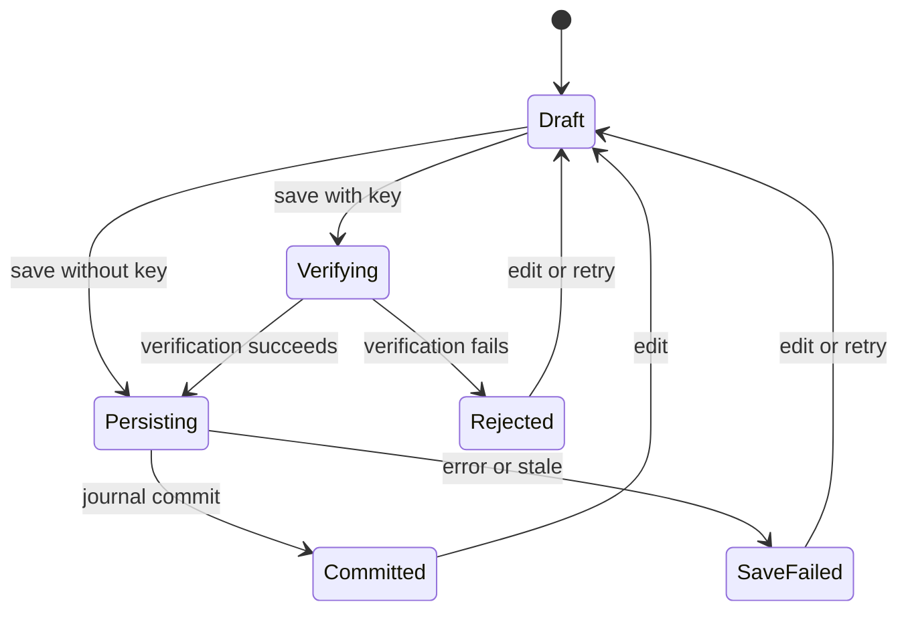
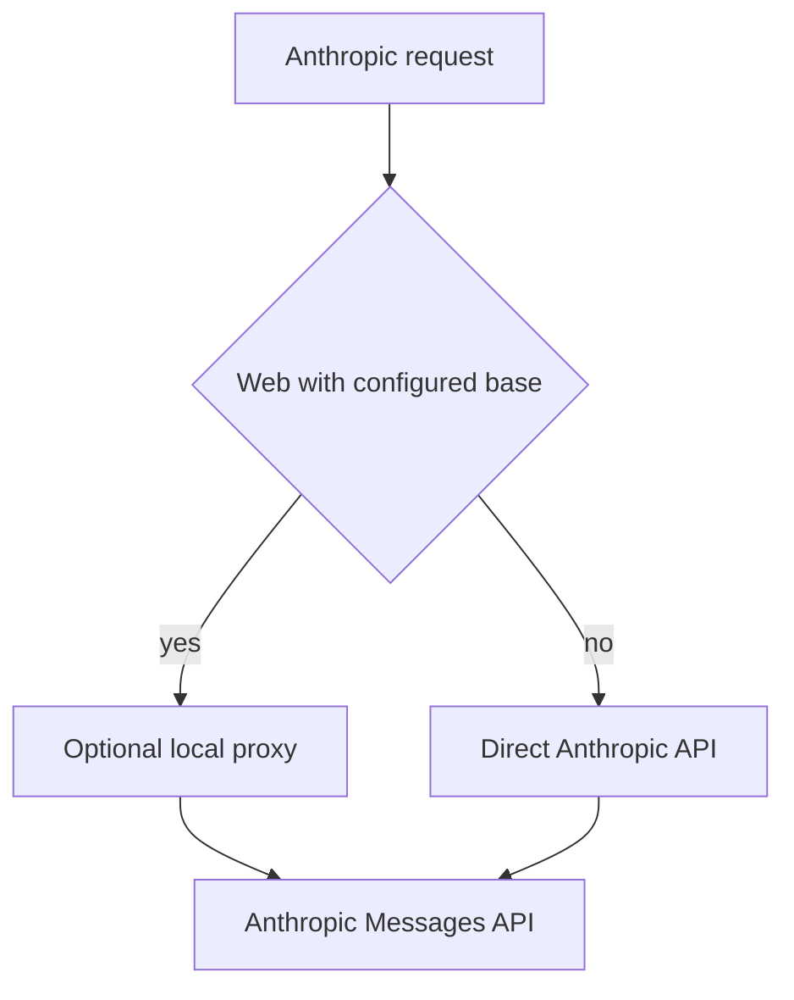

---
okf:
  version: 1
  kind: code-wiki
  status: grounded
  requirement: RQ-01
  scope: Configuración BYOK, persistencia y verificación de proveedores de IA móviles
type: concepto de configuración
title: Configuración BYOK de proveedores
description: Contratos de configuración, credenciales, verificación, descubrimiento y transporte BYOK para OpenAI, Anthropic, Google y servidores compatibles con OpenAI en la aplicación móvil.
summary: Ciclo de vida de credenciales, modelos, verificación, descubrimiento y transporte por plataforma.
tags: [agent, configuration, providers, credentials, byok, mobile, openai-compatible]
related:
  - ./runtime.md
  - ./provider-streaming.md
  - ../operations/runtime-behavior.md
  - ../services/anthropic-proxy.md
verified:
  - by: openwiki/0.6.0
    at: 2026-09-27T17:43:05.548Z
sources:
  - id: openwiki-source-88e87a6a49f8c4bba044cff2
    resource: repo://apps/anthropic_proxy/README.md
  - id: openwiki-source-2e89f734760be2c893fbd66e
    resource: repo://apps/mobile/agent/anthropicModels.ts
  - id: openwiki-source-74a8135d887c0dcfb2d83938
    resource: repo://apps/mobile/agent/customOpenAIChat.ts
  - id: openwiki-source-8386aa6f62e471c6ed28f6e0
    resource: repo://apps/mobile/agent/customOpenAIModels.ts
  - id: openwiki-source-851640bf701b674c49b731d8
    resource: repo://apps/mobile/agent/customOpenAIUrl.ts
  - id: openwiki-source-dc42304b20e8518ef65b4b63
    resource: repo://apps/mobile/agent/googleContextBudget.ts
  - id: openwiki-source-f310c5fb576ae69a7753918c
    resource: repo://apps/mobile/agent/googleStreamTransport.ts
  - id: openwiki-source-9cad4ef8944c5d67ea03dec8
    resource: repo://apps/mobile/agent/providerChatClient.ts
  - id: openwiki-source-e4b8b3a3e8fb5e339227c3fd
    resource: repo://apps/mobile/agent/providerConfiguration.test.ts
  - id: openwiki-source-0d2384426991583d96044996
    resource: repo://apps/mobile/agent/providerConfiguration.ts
  - id: openwiki-source-04c01bf94878938a4aa2dfd8
    resource: repo://apps/mobile/agent/providerConfigurationPersistence.test.ts
  - id: openwiki-source-98e300a08b181f278443549a
    resource: repo://apps/mobile/agent/providerConfigurationPersistence.ts
  - id: openwiki-source-150caf6747c75c64a081007d
    resource: repo://apps/mobile/agent/providerCredentials.ts
  - id: openwiki-source-0bfe6194a595817dd215a286
    resource: repo://apps/mobile/agent/providerTransport.contract.test.ts
  - id: openwiki-source-c5c28138a849ad0b9daed017
    resource: repo://apps/mobile/agent/providerTransport.test.ts
  - id: openwiki-source-cc29928f3ae5e1998f27d57a
    resource: repo://apps/mobile/agent/providerTransport.ts
  - id: openwiki-source-c80e54251b903682e229caf2
    resource: repo://apps/mobile/agent/providerVerification.ts
  - id: openwiki-source-a6ba9053969a3e00cd971742
    resource: repo://apps/mobile/app.config.ts
  - id: openwiki-source-929e8e1df23628a3f3848ff8
    resource: repo://apps/mobile/App.tsx
generated: { by: "openwiki/0.6.0", at: "2026-09-27T17:43:05.548Z" }
---

# Configuración BYOK de proveedores

La aplicación móvil admite cuatro configuraciones BYOK: `openai`, `anthropic`, `google` y `custom_openai`. Las tres primeras se conectan a sus APIs conocidas; la última permite un servidor HTTPS que implemente el contrato OpenAI Chat Completions. La configuración es local al dispositivo: no debe documentarse ni registrarse una clave real.

Esta página cubre la frontera entre Ajustes y las solicitudes al proveedor. Para el streaming y las continuaciones de herramientas, consulte [Streaming de proveedores](./provider-streaming.md); para el recorrido de un turno y los límites estáticos que se deben contrastar con observabilidad, consulte [Comportamiento en ejecución y oportunidades](../operations/runtime-behavior.md). Esa página enlaza de vuelta aquí porque una traza de proveedor no prueba ni expone una credencial, y estos contratos no prueban disponibilidad, coste ni latencia remota.

## Modelo y normalización

`ProviderConfiguration` guarda `provider`, `is_active`, `api_key`, `model`, `base_url?`, `workspace_id?` y `reasoning_effort?`; el borrador omite `is_active`, de modo que editar no publica un cambio. `PROVIDERS` define el orden canónico `openai`, `anthropic`, `google`, `custom_openai`. La normalización siempre devuelve una entrada por cada uno y exactamente una activa: conserva la primera activa por ese orden o activa OpenAI si no había ninguna.

La normalización recorta claves y modelos. OpenAI, Anthropic y Google completan un modelo vacío con su valor predeterminado; `custom_openai` conserva un modelo vacío para obligar a que se configure explícitamente. Se migran `gpt-4o-mini` y los valores Google heredados al modelo actual, mientras que un modelo personalizado no vacío se conserva. `base_url` solo se conserva para `custom_openai`, `workspace_id` solo para Anthropic y `reasoning_effort` solo para OpenAI.

El esfuerzo de razonamiento OpenAI depende de la familia del modelo. Si el esfuerzo almacenado deja de ser compatible, se sustituye por `medium` cuando está permitido, por la primera alternativa soportada o por `null`. Anthropic decide el formato de `thinking` al construir la petición: Claude 3 y 4.5 reciben el modo heredado con presupuesto, y los demás —incluido uno desconocido— el modo adaptativo resumido.

Para guardar Anthropic, un Workspace ID no vacío debe empezar por `wrkspc_`. La aplicación lo transmite como cabecera y convierte los errores que indican que falta en una instrucción accionable. Las claves directas viajan en cabeceras (`Authorization: Bearer`, `x-api-key` o `x-goog-api-key`), no en la URL.

### Servidor compatible con OpenAI

`custom_openai` requiere clave, ID de modelo y `base_url`. La URL se valida antes de guardar: debe ser `https://` absoluta, sin credenciales, espacios, consulta, fragmento ni separadores de ruta ambiguos. A partir de esa base se forman únicamente `/models` y `/chat/completions`; las llamadas omiten credenciales HTTP del navegador y usan el bearer BYOK.

El catálogo `/models` es una comodidad, no una condición para guardar: si el servidor responde 404, 405 o 501, se marca como no disponible y la persona puede escribir el ID manualmente. La verificación trata ese caso como advertencia; una prueba explícita del modelo realiza una petición de chat no streaming y puede consumir API. En conversación intenta SSE y vuelve a una respuesta JSON normal únicamente cuando el servidor declara que no admite streaming.

## Persistencia, secretos e importación

`ProviderConfigurationRepository` es la autoridad durable. Serializa los commits y persiste snapshots de esquema 1 con `revision`, `committed` y `pending`: escribe el candidato pendiente, vuelve a comprobar que la operación sigue vigente y finaliza el commit. Si falla una escritura o el candidato se vuelve obsoleto, restaura el commit anterior. Al hidratar, un `pending` superviviente nunca se promociona; se recupera el último `committed` y un diario solo-pending se descarta.

| Plataforma | Almacenamiento canónico | Tratamiento de la copia |
|---|---|---|
| Web | Diario dedicado en AsyncStorage | Contiene las credenciales; el navegador no ofrece el aislamiento de SecureStore. |
| Nativo con SecureStore | Diario en SecureStore | AsyncStorage recibe un espejo con `api_key: ""`. |
| Nativo sin almacenamiento seguro | No se puede persistir una nueva configuración | La configuración anterior permanece activa y Ajustes informa el fallo. |

El agregado general se sanea con `stripProviderApiKeys`, por lo que no se convierte en una segunda fuente de secretos. Las copias de seguridad no exportan claves. Al importar, se sanea el archivo y se conservan la clave y el Workspace ID Anthropic que ya están en el dispositivo; el backup no puede inyectar ni reemplazar esos secretos.


```mermaid
stateDiagram-v2
    [*] --> Draft
    Draft --> Verifying: save with key
    Draft --> Persisting: save without key
    Verifying --> Rejected: verification fails
    Verifying --> Persisting: verification succeeds
    Persisting --> Committed: journal commit
    Persisting --> SaveFailed: error or stale
    Rejected --> Draft: edit or retry
    SaveFailed --> Draft: edit or retry
    Committed --> Draft: edit
```

*El candidato solo llega al estado visible después de un commit confirmado; borrar una clave no hace verificación de red.*

## Guardado, selección y presentación

Guardar normaliza el borrador. Con una clave no vacía, valida los requisitos específicos y verifica la conexión antes de persistir; con una clave vacía persiste la eliminación sin red. Un guardado con clave activa el candidato; una eliminación no altera la selección activa. La selección explícita de chat también se confirma primero en el repositorio y solo entonces actualiza `chatProvider` y el estado visible. Así, una escritura fallida no cambia silenciosamente el proveedor en uso.

Las revisiones de borrador, guardado, descubrimiento y configuración global forman tokens de operaciones asíncronas. Editar, iniciar otro guardado o iniciar otro descubrimiento invalida el token anterior; una respuesta antigua no actualiza interfaz ni persistencia. Una clave hidratada se presenta como pendiente de comprobar: ese indicador no es una garantía de conectividad ni bloquea a los consumidores.

La presentación distingue `checking`, conectado, advertencia y error. No muestra la clave completa: la confirmación de borrado toma y enmascara la clave ya persistida, no el texto transitorio del borrador.

## Verificación y catálogo

`fetchProviderConfiguration` aborta por defecto a los 15 segundos y traduce el aborto a un error legible. Sin clave, la verificación devuelve una advertencia sin red; en modo fixture devuelve éxito local sin red.

| Proveedor | Verificación | Resultado especial |
|---|---|---|
| OpenAI | `GET https://api.openai.com/v1/models` | Cualquier 2xx confirma la conexión. |
| Anthropic directo | `POST https://api.anthropic.com/v1/messages` con `max_tokens: 1` | Un 404 confirma la clave pero advierte que el modelo no está disponible. |
| Google | `GET .../v1beta/models/{model}` | Cualquier 2xx confirma la conexión. |
| OpenAI compatible | `GET {base_url}/models` | 404, 405 o 501 permiten guardar con advertencia; otros errores rechazan. |

El selector no es una lista de permitidos: el modelo permanece editable. OpenAI consulta `/v1/models`; Google consulta `/v1beta/models`, quita `models/`, deduplica, ordena y filtra los modelos que declaran métodos de generación incompatibles. Anthropic pagina de 100 en 100, deduplica IDs y se limita a 20 páginas; comunica un catálogo parcial o truncado en vez de hacerlo pasar por completo.

## Transporte y operación

OpenAI y Google acceden directamente en web y nativo. Google genera contra Interactions con `store: false`; verificación y catálogo usan Models, por lo que la presencia en catálogo no garantiza capacidad de Interactions. El endpoint local de Google solo se permite con puerto válido en Development y la clave ficticia `e2e-local-fake-key`; cualquier otra combinación falla en vez de desviar tráfico real.

Anthropic también es directo por defecto. En web añade `anthropic-dangerous-direct-browser-access` para permitir que la página lea la respuesta CORS; nativo no lo envía. El proxy Anthropic es opcional y solo se selecciona en web cuando `EXPO_PUBLIC_API_BASE_URL` queda no vacío tras recortar y quitar barras finales. No existe fallback automático al proxy tras un fallo directo.


```mermaid
flowchart TD
    Request["Anthropic request"] --> Choice{"Web with configured base"}
    Choice -->|"yes"| Proxy["Optional local proxy"]
    Choice -->|"no"| Direct["Direct Anthropic API"]
    Proxy --> Upstream["Anthropic Messages API"]
    Direct --> Upstream
```

*El proxy entra por una decisión explícita de configuración web, no como backend requerido por la aplicación.*

Con proxy, modelos, verificación y mensajes usan las rutas `/chat/providers/anthropic/models`, `/verify` y `/messages`. Recibe la clave en JSON y la transforma en cabecera upstream; sus límites de confianza y uso local se describen en [Proxy CORS de Anthropic para navegador](../services/anthropic-proxy.md).

Los consumidores omiten configuraciones sin clave; `custom_openai` también queda fuera si faltan modelo o URL. El estimador de alimentos prueba, en orden, Google, OpenAI, Anthropic y OpenAI compatible. El modo `fake` solo puede seleccionarse en desarrollo mediante `DEV_PROVIDER_MODE`; por defecto desarrollo usa fixtures y staging/producción BYOK. Chat principal, chat con herramientas y estimador cortocircuitan antes de la red en ese modo y no incorporan una clave real de desarrollo.

## Cambios seguros y pruebas

Al añadir o cambiar un proveedor, actualice conjuntamente el tipo y normalizadores, persistencia y saneamiento, requisitos de guardado, verificación, catálogo, transporte y consumidores. Conserve la autenticación fuera de URLs, el único proveedor activo y los tokens de invalidez. Para un servidor compatible, no relaje la validación HTTPS ni suponga que `/models`, SSE o tools están disponibles: son capacidades independientes.

Ejecute las pruebas focalizadas desde la raíz:

```bash
npx vitest run --config apps/mobile/vitest.config.mts apps/mobile/agent/providerConfiguration.test.ts apps/mobile/agent/providerConfigurationPersistence.test.ts apps/mobile/agent/providerCredentials.test.ts apps/mobile/agent/providerVerification.test.ts apps/mobile/agent/providerCatalog.test.ts apps/mobile/agent/customOpenAIChat.test.ts apps/mobile/agent/providerTransport.test.ts apps/mobile/agent/providerTransport.contract.test.ts
```

Estas pruebas fijan contratos de normalización, rollback, aislamiento de secretos, tokens obsoletos, verificación y transporte. No prueban la disponibilidad ni el coste de servicios remotos.
