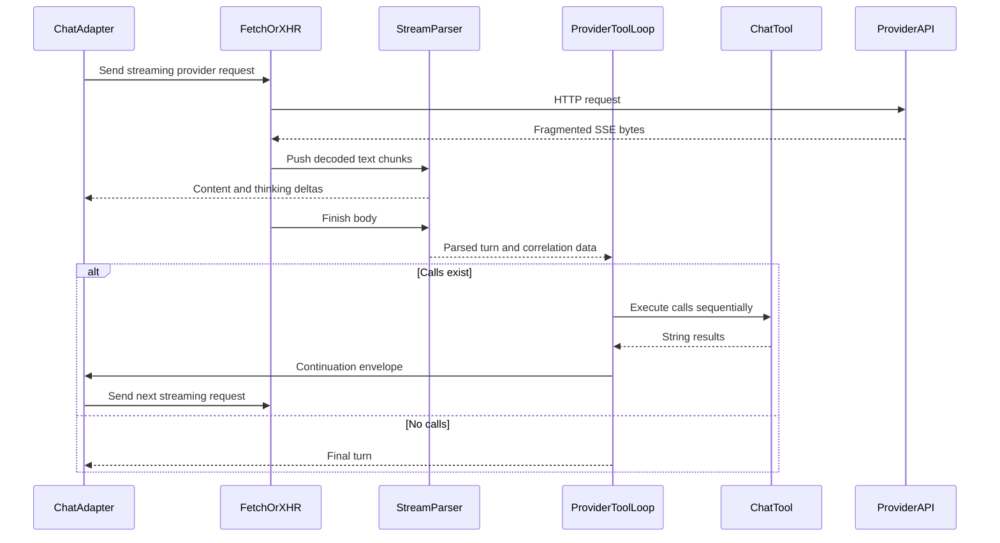

---
okf:
  version: 1
  kind: code-wiki
  status: grounded
  scope: provider stream transports, parsers, and continuation protocols
type: concepto
title: Streaming de proveedores y continuación de herramientas
description: Encuadre SSE, selección de transporte, contratos de turnos analizados, correlación, errores, pruebas y superficies de extensión para OpenAI, Anthropic y Google.
summary: SSE framing, transport selection, parsed turn contracts, correlation, errors, tests, and extension surfaces for OpenAI, Anthropic, and Google.
tags:
  - agent
  - streaming
  - events
  - openai
  - anthropic
  - google
related:
  - ./runtime.md
  - ./provider-configuration.md
  - ../services/anthropic-proxy.md
---

# Streaming de proveedores y continuación de herramientas

El agente móvil normaliza tres protocolos de streaming incompatibles en el mismo resultado de aplicación `{content, thinking}`, a la vez que conserva los datos de correlación de cada proveedor para la continuación de herramientas. `App.tsx::callProviderChatAPIWithTools` crea las solicitudes y elige el transporte web/nativo. `sse.ts` encuadra los eventos, `providerStreamParsers.ts` crea incrementalmente objetos de turno específicos del proveedor y `providerToolLoop.ts` convierte las llamadas a herramientas en la siguiente solicitud. Consulte [Entorno de ejecución del agente](./runtime.md) para conocer los efectos de las herramientas y los reintentos externos, y [Configuración de proveedores](./provider-configuration.md) para el enrutamiento de modelos/claves.

## Ciclo de vida del stream por capas



*Leyenda: la fragmentación del transporte es absorbida por el analizador incremental antes de que los metadatos específicos del proveedor impulsen cero o más continuaciones de herramientas.*

### Contrato de encuadre SSE

`splitSSEEvents(buffer)` normaliza CRLF a LF, emite registros separados por una línea en blanco y conserva una cola incompleta. `parseSSEEvent(rawEvent)` establece de forma predeterminada `event` en `message`, ignora las líneas en blanco o de comentario (`:`), elimina un espacio opcional después de `:` y une múltiples líneas `data:` con `\n`. `parseSSEJsonFixture` existe para las pruebas; añade un terminador cuando es necesario, omite `[DONE]` y descarta silenciosamente el JSON no válido.

Cada analizador de stream mantiene su propio `rawBuffer`; `push(chunk)` encuadra eventos completos y `finish()` procesa una cola que no esté en blanco. Por lo tanto, los fragmentos de red pueden dividir texto decodificado como UTF-8, campos SSE o límites JSON. Los lectores de Fetch utilizan un `TextDecoder` de streaming; los auxiliares XHR procesan el texto creciente de la respuesta. Las instancias de los analizadores son objetos mutables de un solo turno y no deben compartirse simultáneamente.

## Comparación de proveedores

| Aspecto | OpenAI Responses | Anthropic Messages | Google Generative Language |
|---|---|---|---|
| Endpoint | `POST https://api.openai.com/v1/responses` | `POST https://api.anthropic.com/v1/messages` nativo; proxy web `/chat/providers/anthropic/messages` | `POST .../v1beta/models/{model}:streamGenerateContent?alt=sse&key=...` |
| Transporte web/nativo | Fetch web, XHR nativo | XHR en ambos; los destinos de navegador usan el proxy configurado | Fetch web, XHR nativo |
| Autenticación | Encabezado Bearer | `x-api-key` nativa; en web, la clave está en el cuerpo JSON del proxy | Parámetro de consulta de clave de API |
| Prompt del sistema | `instructions` | `system` | `systemInstruction.parts[].text` |
| Herramientas | `CHAT_TOOLS.openai` | `CHAT_TOOLS.anthropic` | `CHAT_TOOLS.google` |
| Solicitud de razonamiento | `reasoning` opcional procedente de una configuración de OpenAI compatible con el modelo | `thinking: {type: "enabled", budget_tokens: 1024}` y `max_tokens: 3072` en el chat con herramientas | `generationConfig.thinkingConfig` con `includeThoughts: true`, `thinkingLevel: "high"` |
| Turno analizado | `OpenAIStreamTurnResult` | `AnthropicStreamTurnResult` | `GoogleStreamTurnResult` |
| Correlación | `responseId`, `call_id` de la función | `tool_use.id` y bloques exactos del asistente | Nombre de la función más partes/firmas conservadas del modelo |
| Límite predeterminado | `MAX_TOOL_ROUNDS = 10` | igual | igual |

Los auxiliares de streaming de OpenAI y Google que aparecen en `App.tsx` imponen un tiempo de espera de 120 segundos y convierten `AbortError` en errores de tiempo de espera en español específicos del proveedor; los auxiliares de transporte también extraen los cuerpos de respuestas que no sean 2xx antes de analizarlos. Los fallos de Anthropic en el navegador que mencionan `failed to fetch` se normalizan en la indicación de que se requiere el proxy. La selección exacta del transporte forma parte del contrato de la plataforma: cambiar únicamente un analizador no es suficiente cuando la entrega de eventos difiere entre Fetch y XHR de React Native.

## Mensajes iniciales que no son del sistema en la transmisión

`App.tsx::callProviderChatAPIWithTools` elimina primero todos los mensajes `system`. Para cada `ChatInputMessage` restante, conserva `content` exactamente y asigna el rol a `assistant` solo cuando el rol de origen es `assistant`; cualquier otro rol que no sea del sistema se convierte en `user`. La lista resultante, compuesta únicamente por texto, se adapta de la siguiente manera para la solicitud inicial con herramientas habilitadas:

| Campo del proveedor | Transformación exacta por mensaje | Ejemplo de transmisión inicial |
|---|---|---|
| `input` de OpenAI Responses | Sin una segunda transformación: el rol sigue siendo `assistant` o `user`, y `content` sigue siendo una cadena. | `{"input":[{"role":"user","content":"hello"},{"role":"assistant","content":"hi"}]}` |
| `messages` de Anthropic | Sin una segunda transformación: el rol sigue siendo `assistant` o `user`, y `content` sigue siendo una cadena. | `{"messages":[{"role":"user","content":"hello"},{"role":"assistant","content":"hi"}]}` |
| `contents` de Google | `assistant` se convierte en `model`; `user` sigue siendo `user`. Cada cadena se convierte en una parte de texto. | `{"contents":[{"role":"user","parts":[{"text":"hello"}]},{"role":"model","parts":[{"text":"hi"}]}]}` |

Estas matrices se sitúan junto al campo de sistema específico del proveedor en la tabla comparativa y la declaración `CHAT_TOOLS` correspondiente. Por lo tanto, la ruta de chat normal **no** envuelve el texto inicial de OpenAI en elementos `input_text`/`output_text`, no envuelve el texto inicial de Anthropic en bloques `{type: "text"}` y no envía partes de función iniciales de Google. Los objetos nativos del proveedor de llamada/resultado de herramientas solo aparecen durante la continuación, con las formas documentadas a continuación.

La ruta de imágenes independiente `App.tsx::callFoodEstimatorAPI` utiliza deliberadamente transmisiones de contenido inicial más completas. Descarta las imágenes cuyos datos base64 están en blanco, establece de forma predeterminada un tipo MIME en blanco como `image/jpeg` y adjunta todas las imágenes conservadas únicamente al último mensaje de usuario que no sea del sistema (a menos que se establezca `skipImages`):

- **OpenAI:** un mensaje del asistente es `{"role":"assistant","content":[{"type":"output_text","text":"..."}]}`; un mensaje de usuario es `{"role":"user","content":[{"type":"input_text","text":"..."}]}`. El último usuario recibe además un elemento `{"type":"input_image","image_url":"data:<mime>;base64,<data>","detail":"auto"}` por cada imagen.
- **Anthropic:** el contenido del asistente y del usuario normal sigue siendo una cadena. En cambio, el último usuario con imágenes tiene `content: [{"type":"text","text":"..."},{"type":"image","source":{"type":"base64","media_type":"<mime>","data":"<data>"}}]`. Este flujo de imágenes se rechaza en la web antes de realizar una solicitud; la implementación nativa envía estos bloques directamente.
- **Google:** cada mensaje tiene `parts`; el asistente se asigna a `model` y el usuario a `user`. El último usuario con imágenes añade `{"inline_data":{"mime_type":"<mime>","data":"<data>"}}` después de su parte de texto. Por lo tanto, las partes de imagen iniciales utilizan snake_case, mientras que la normalización del analizador/continuación acepta y emite las formas de función/razonamiento descritas en la sección de Google.

Para el texto vacío después de recortarlo en el estimador de alimentos, los mensajes del asistente utilizan `"Entendido."`; los mensajes del usuario utilizan `"Analiza esta comida y estima los valores solicitados."`. Este valor alternativo y el recorte son específicos del estimador de imágenes; la transformación normal del chat descrita anteriormente conserva la cadena original.

## Analizador y continuación de OpenAI

`createOpenAIStreamParser(handlers)` mantiene `responseId`, el contenido/razonamiento transmitido, `itemsByIndex` e `indexesById`.

- `response.created` y `response.in_progress` capturan `response.id`.
- `response.output_text.delta` y `response.reasoning_summary_text.delta` añaden agregados e invocan `StreamingHandlers`.
- `response.output_item.added`/`done` normalizan objetos indexados `reasoning`, `message` y `function_call`.
- `response.function_call_arguments.delta` añade por `item_id`; `...arguments.done` sustituye la cadena de argumentos.
- `response.completed` captura el ID final y, cuando el `response.output` final se normaliza como una lista no vacía, sustituye los elementos creados incrementalmente.
- `error` y `response.failed` lanzan errores. El JSON no válido y los eventos desconocidos se ignoran.

`finish()` ordena los elementos de salida por índice. El texto transmitido tiene prioridad; de lo contrario, los bloques `output_text` del mensaje se recortan y se unen. El razonamiento transmitido tiene prioridad; de lo contrario, se unen los bloques de resumen del razonamiento.

`runOpenAIToolLoop` analiza la cadena de argumentos de cada función con `parseOpenAIFunctionArguments`; el JSON mal formado o que no sea un objeto se convierte en `{}`. Ejecuta cada llamada y envía únicamente:

```json
{"type":"function_call_output","call_id":"provider-call-id","output":"tool result string"}
```

La solicitud de continuación establece `previous_response_id` y vuelve a incluir las herramientas. Si existe una llamada a herramienta pero `responseId` es nulo, el bucle lanza explícitamente un error. Tanto `id` (utilizado al ensamblar los deltas transmitidos de los argumentos) como `call_id` (utilizado para correlacionar el resultado) son obligatorios para el tipo normalizado de llamada a función.

## Analizador y continuación de Anthropic

`createAnthropicStreamParser(handlers)` indexa bloques de contenido mutables:

- `content_block_start` reconoce `text`, `thinking` y `tool_use`.
- `content_block_delta` añade `text_delta`, `thinking_delta`, `signature_delta` o el `input_json_delta` de una herramienta.
- `content_block_stop` analiza el JSON acumulado de la herramienta; el JSON no válido o que no sea un objeto se convierte en `{}`.
- `message_delta` captura `stop_reason` desde `message.stop_reason` o `delta.stop_reason`.
- Los eventos `error` lanzan errores; los eventos mal formados y no compatibles se ignoran.

Al finalizar, los bloques se ordenan y `partial_json` se elimina de los `AnthropicToolUseBlock` públicos. El texto y el razonamiento son únicamente los agregados transmitidos; a diferencia de OpenAI, no existe una recopilación alternativa a partir de los bloques completados.

`runAnthropicToolLoop` conserva cada matriz `contentBlocks` completa del asistente —incluidos los bloques de razonamiento/firma— y añade una matriz de contenido de usuario de tipo `{type: "tool_result", tool_use_id, content}`. Esta conservación de bloques es necesaria para la continuidad del protocolo. El bucle detecta las llamadas según el tipo de bloque en lugar de confiar en `stopReason`.

## Analizador y continuación de Google

`createGoogleStreamParser(handlers)` acepta tanto las formas camelCase como snake_case de la transmisión para `finishReason`, `functionCall` y `thoughtSignature`. Para cada parte candidata:

- dirige el texto con `thought: true` al razonamiento y el resto del texto al contenido;
- emite un `GoogleResponsePart` por cada llamada a función, normalizando los argumentos que sean objetos o cadenas JSON como un objeto; en los demás casos, usa `{}`;
- conserva `thought` y `thoughtSignature` en las partes de función y de texto/firma;
- lanza un error cuando la carga útil de nivel superior contiene `error`.

Los eventos de Google se acumulan; no se indexan ni sustituyen. Por lo tanto, la repetición de eventos duplicados del proveedor duplicaría el texto y las partes del modelo.

`runGoogleToolLoop` llama a `mapGoogleResponsePartToRequestPart` para que el mensaje anterior del modelo conserve el texto, las llamadas, los indicadores de razonamiento y las firmas. A continuación, añade partes del usuario con la forma `{functionResponse: {name, response: {result}}}`. La correlación se realiza por el nombre de la función; no existe un ID de llamada del proveedor. Las llamadas con el mismo nombre en un turno producen respuestas con el mismo nombre en orden.

## Invariantes del stream y la interfaz de usuario

- `StreamingHandlers.onContentDelta(delta, aggregate)` y `onThinkingDelta(delta, aggregate)` exponen tanto el fragmento nuevo como el agregado del analizador. `callProviderChatAPIWithTools` crea un segundo agregado entre los turnos de continuación, de modo que el borrador visible del asistente contiene todas las rondas transmitidas.
- El adaptador elige su texto transmitido acumulado en lugar del `content` del último turno del analizador. Por lo tanto, un preámbulo de herramienta puede permanecer en la respuesta final si el proveedor emite texto visible antes de una llamada a herramienta.
- `sendMessage` limita las escrituras de React a una cada 40 ms, pero no limita las devoluciones de llamada del analizador.
- El mensaje final del asistente requiere contenido que no esté en blanco. El razonamiento por sí solo no constituye una respuesta correcta.
- Las llamadas a herramientas se ejecutan secuencialmente y las rondas de continuación son seriales. Al alcanzar el límite de rondas, se devuelve silenciosamente el último turno.
- Ningún analizador valida un esquema formal de eventos. Los eventos desconocidos o mal formados suelen desaparecer, mientras que los errores reconocidos del proveedor lanzan excepciones.

## Matriz de fallos

| Fallo | Dónde se detecta | Resultado |
|---|---|---|
| HTTP distinto de 2xx | Auxiliar de transporte | El error se extrae del cuerpo JSON/sin procesar; el analizador no llega a completarse normalmente. |
| Tiempo de espera de red | Auxiliar Fetch/XHR | Error de tiempo de espera/red específico del proveedor; el chat externo puede reintentarlo. |
| Evento SSE final incompleto | `finish()` del analizador | Se intenta procesar una vez la cola que no esté en blanco. El JSON no válido se ignora. |
| Evento de error del stream | Analizador del proveedor | Lanza el mensaje del proveedor o el mensaje alternativo. |
| Argumentos de herramienta no válidos | Normalización del analizador/bucle | `{}` llega al controlador; no se invoca la validación del esquema de producción. |
| Falta el ID de respuesta de OpenAI | Bucle de OpenAI | Lanzamiento explícito antes de la continuación. |
| JSON de herramienta de Anthropic ausente/no válido | Analizador de Anthropic | La herramienta se ejecuta con `{}`. |
| Fragmentos/eventos duplicados de Google | Analizador de Google | Posible duplicación de contenido/llamadas; no hay desduplicación. |
| Diez rondas siguen produciendo herramientas | Bucle de herramientas | Devuelve el último turno que contiene herramientas; posteriormente, el adaptador puede fallar si el contenido está vacío. |
| Efectos secundarios parciales antes de un fallo de transporte | Entorno de ejecución/reintento externo | Los efectos secundarios permanecen y la solicitud completa puede repetirse; consulte [Entorno de ejecución del agente](./runtime.md). |

## Pruebas y accesorios

`agent/__fixtures__/raw` contiene capturas SSE emparejadas de llamada a herramienta/respuesta final para los tres proveedores. `providerPipeline.test.ts::replayInNetworkChunks` suministra cada captura en tamaños de fragmento repetidos `[1, 7, 23, 5, 41, 3, 17]`, lo que demuestra que la composición del encuadre y del analizador/bucle es independiente de los límites de red. Verifica los valores exactos `responseId`/`call_id` de OpenAI, `tool_use_id` de Anthropic, `functionResponse` de Google, los deltas transmitidos y los motivos finales. `providerToolLoop.test.ts` utiliza por separado accesorios analizados y verifica el error por la ausencia del ID de OpenAI. `sse.test.ts` se centra en el encuadre. La cobertura no simula implementaciones reales de Fetch/XHR, condiciones de carrera de los tiempos de espera, eventos duplicados, cancelaciones ni el agotamiento de diez rondas.

Comandos específicos desde la raíz del repositorio:

```bash
npx vitest run --config apps/mobile/vitest.config.mts apps/mobile/agent/sse.test.ts
npx vitest run --config apps/mobile/vitest.config.mts apps/mobile/agent/providerPipeline.test.ts apps/mobile/agent/providerToolLoop.test.ts
```

Utilice el conjunto determinista completo solo después de realizar cambios en la carga útil o en herramientas compartidas:

```bash
npm run test:deterministic
```

## Superficie de extensión y cambios de protocolo

Para una revisión de eventos o de carga útil de un proveedor:

1. Capture los datos SSE sin procesar y saneados en `apps/mobile/agent/__fixtures__/raw`; nunca incluya claves de API ni contenido personal.
2. Actualice las interfaces exactas de turno/resultado y el analizador en `providerStreamParsers.ts`. Conserve la seguridad del procesamiento incremental de fragmentos, el orden, los metadatos de razonamiento y la correlación de llamadas.
3. Si cambia la forma de la continuación, actualice `providerToolLoop.ts`, especialmente `previous_response_id`/`call_id` de OpenAI, la repetición de bloques del asistente de Anthropic o las firmas de razonamiento de Google.
4. Actualice todas las ramas de carga útil y todos los transportes relevantes en `App.tsx::callProviderChatAPIWithTools`, incluido el comportamiento web y nativo, así como el contrato del proxy de Anthropic documentado en [Proxy de Anthropic](../services/anthropic-proxy.md).
5. Añada aserciones de canalización fragmentada para texto, razonamiento, llamadas, metadatos finales, entradas mal formadas y eventos de error explícitos. Ejecute los comandos específicos anteriores.
6. Si cambian los modelos, la autenticación o las URL base, actualice también [Configuración de proveedores](./provider-configuration.md). Si cambia la semántica de las herramientas, actualice [Entorno de ejecución del agente](./runtime.md). Evite implementar un cuarto proveedor únicamente en `App.tsx`: también requiere tipos/valores predeterminados de configuración, interfaz de usuario, persistencia y asignación canónica de transmisión de herramientas.