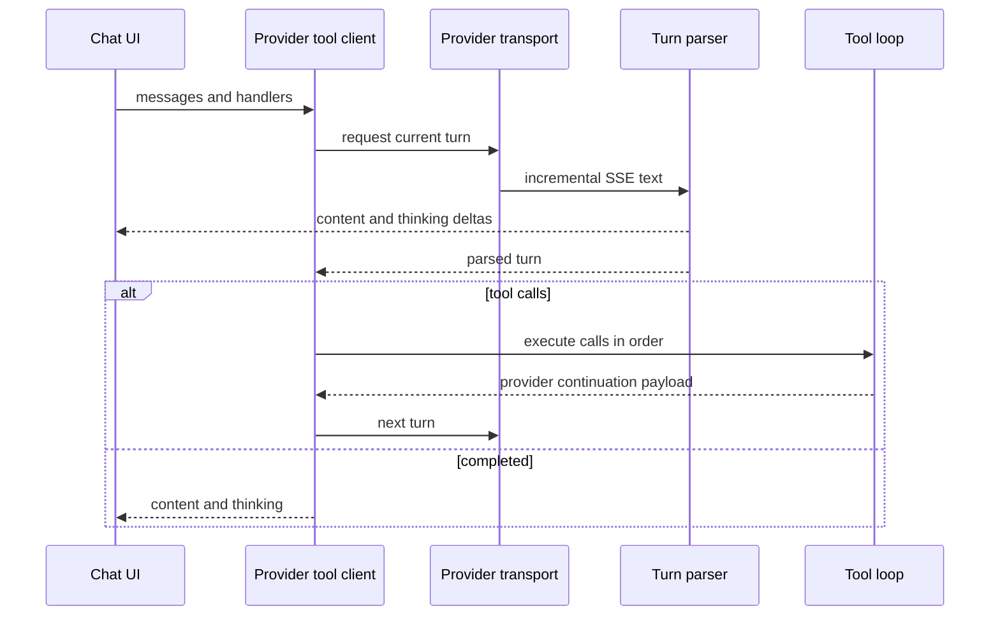

---
okf:
  version: 1
  kind: code-wiki
  status: grounded
  scope: provider stream transports, parsers, and continuation protocols
type: arquitectura de streaming
title: Streaming de proveedores
description: Describe el flujo SSE y los bucles de herramientas de OpenAI, Anthropic y Google en el cliente móvil, incluidos sus contratos de continuación, validación y fallos.
tags: [agent, streaming, sse, openai, anthropic, google]
related:
  - ./runtime.md
  - ./provider-configuration.md
verified:
  - by: manual-code-review
    at: 2026-09-14T00:00:00.000Z
  - by: openwiki/0.5.0
    at: 2026-09-13T12:53:55.207Z
sources:
  - id: openwiki-source-c2d1a0c89805fc4fc01238e2
    resource: repo://apps/anthropic_proxy/cors-proxy.py
  - id: openwiki-source-63dae4a27346d91c6139697b
    resource: repo://apps/mobile/agent/googleInteractions.test.ts
  - id: openwiki-source-df22d5c1fa6f9ff9bb908437
    resource: repo://apps/mobile/agent/googleInteractions.ts
  - id: openwiki-source-f310c5fb576ae69a7753918c
    resource: repo://apps/mobile/agent/googleStreamTransport.ts
  - id: google-context-budget
    resource: repo://apps/mobile/agent/googleContextBudget.ts
  - id: openwiki-source-c65a19b98fa314cba98ace44
    resource: repo://apps/mobile/agent/providerPipeline.test.ts
  - id: openwiki-source-6b9b666faa646a8fd83706ea
    resource: repo://apps/mobile/agent/providerStreamParsers.ts
  - id: openwiki-source-479fc45ac32d23cfffe17d8e
    resource: repo://apps/mobile/agent/providerStreamTransport.ts
  - id: openwiki-source-abc6fea468a7de09acfb0c4f
    resource: repo://apps/mobile/agent/providerToolClient.ts
  - id: openwiki-source-b14a4ecd65e83b5561f88e2a
    resource: repo://apps/mobile/agent/providerToolLoop.ts
  - id: openwiki-source-c5c28138a849ad0b9daed017
    resource: repo://apps/mobile/agent/providerTransport.test.ts
  - id: openwiki-source-cc29928f3ae5e1998f27d57a
    resource: repo://apps/mobile/agent/providerTransport.ts
  - id: openwiki-source-63f2fbe9450b42dc3369441f
    resource: repo://apps/mobile/agent/sse.test.ts
  - id: openwiki-source-42008b636d0a1be0e91188e0
    resource: repo://apps/mobile/agent/sse.ts
  - id: openwiki-source-929e8e1df23628a3f3848ff8
    resource: repo://apps/mobile/App.tsx
generated: { by: "openwiki/0.5.0", at: "2026-09-13T07:56:37.562Z" }
---

# Streaming de proveedores

El chat principal entra por `callProviderChatAPIWithTools` en `apps/mobile/App.tsx`, que aplica la política de seguridad antes de delegar en `requestProviderToolChat`. Este cliente separa el prompt de sistema, abre una solicitud por turno, convierte los eventos SSE en un resultado del proveedor y ejecuta el bucle de herramientas. El ejecutor y la coordinación de efectos no pertenecen al transporte: se inyectan como `executeTool`.



*Cada ronda crea su parser y el mismo cliente conserva los deltas visibles mientras el bucle solicita continuaciones.*

## Encuadre y acumulación incremental

`splitSSEEvents` normaliza CRLF, entrega solo registros acabados en una línea vacía y conserva el sufijo incompleto. `parseSSEEvent` ignora comentarios, usa `message` como nombre predeterminado y combina las líneas `data:`. Por tanto, los transportes pueden pasar fragmentos arbitrarios sin intentar alinear sus lecturas con JSON ni con eventos SSE.

Cada `create*StreamParser` mantiene su propio búfer y estado de turno. OpenAI y Anthropic toleran el resto no vacío al finalizar; Google exige una interacción terminal y ningún resto. Los parsers publican `onContentDelta` y `onThinkingDelta` con el agregado del turno. `requestProviderToolChat` añade sus propios acumuladores alrededor de cada petición, por lo que el borrador de interfaz y el resultado incluyen deltas de todas las rondas de herramientas, no solo de la última.

## Transporte y acceso a proveedores

| Proveedor | Web | Nativo | Límite y particularidad |
|---|---|---|---|
| OpenAI | `Fetch` y `TextDecoder` incremental | `XMLHttpRequest` incremental | 120 s; usa `/v1/responses` |
| Anthropic | `XMLHttpRequest` | `XMLHttpRequest` | 120 s; usa `/v1/messages` |
| Google | `Fetch` y `TextDecoder` incremental | `XMLHttpRequest` incremental | 120 s; puede reintentar una respuesta XHR completa si el progreso nativo falla antes de emitir un delta |

En XHR, el transporte recorta de `responseText` únicamente el sufijo posterior a `lastOffset` y lo pasa al parser. Fetch decodifica bytes con `TextDecoder` en modo streaming y también usa ese parser. Los estados HTTP no exitosos, errores de red, tiempo de espera y errores del parser rechazan la solicitud. Para Google, el reintento nativo con respuesta bufferizada se permite solo antes de hacer visible contenido o razonamiento; así no se duplica texto ya mostrado.

En web, Anthropic se llama directamente por defecto con la cabecera `anthropic-dangerous-direct-browser-access`. `EXPO_PUBLIC_API_BASE_URL` activa de manera explícita el proxy para Anthropic; sin esa base, no se intenta `localhost`. El proxy incluido está limitado a clientes loopback y se declara como herramienta local de desarrollo: no es un backend de producción. Cuando se usa, recibe las credenciales en el cuerpo y las transforma en cabeceras hacia Anthropic.

## Contratos de turnos y continuación

### OpenAI y Anthropic

El parser de OpenAI recoge texto y resúmenes de razonamiento incrementales, identifica la respuesta y ensambla los elementos de salida por índice. Para una llamada `function_call`, el bucle exige `responseId`, ejecuta las llamadas en orden y reenvía `function_call_output` asociado a cada `call_id`. Los argumentos vacíos, inválidos o que no son objeto se normalizan a `{}` antes del ejecutor.

Anthropic ensambla bloques `text`, `thinking` —incluida su firma— y `tool_use` por índice; los fragmentos `input_json_delta` se convierten en objeto cuando se cierra el bloque. La continuación conserva todos los bloques del asistente y añade un mensaje de usuario con `tool_result` correlacionado por `tool_use_id`. Un stream que no contiene `message_stop` queda marcado como truncado y el transporte XHR lo rechaza incluso con HTTP 2xx.

La configuración de thinking de Anthropic protege la compatibilidad de modelos: Claude 3 y 4.5 reciben `type: "enabled"` con presupuesto, mientras los demás modelos, incluidos los desconocidos, reciben `type: "adaptive", display: "summarized"`.

### Google Interactions sin estado remoto

`buildGoogleInteractionRequest` en `googleContextBudget.ts` usa `stream: true` y `store: false`, y envía el historial como `input`; no usa `previous_interaction_id`. El parser de Google es deliberadamente estricto: requiere `interaction.created`, pasos con índices ordenados y ciclo `step.start`/`step.delta`/`step.stop`, y un `interaction.completed` coherente. Rechaza JSON, argumentos, firmas, índices, estados, orden o cierre inválidos antes de que el bucle reciba el turno para ejecutar herramientas. Aperturas y cierres repetidos del mismo paso no reinician ni duplican lo ya acumulado.

El bucle conserva los pasos de respuesta y añade un `function_result` con el mismo `call_id` para cada `function_call`; cada continuación vuelve a entregar el historial candidato al preparador de contexto. Conserva las firmas y campos opacos del proveedor. Detecta una identidad de interacción contradictoria, evita ejecutar dos veces un replay identificado y rechaza IDs de llamada reutilizados entre rondas. Como `store: false` puede producir un identificador vacío, ese valor no se usa para reconocer replays entre rondas.

El resultado Google se guarda como `GoogleConversationTurn` en el mensaje de asistente. Al reconstruir el historial, un turno almacenado válido aporta sus pasos técnicos; los mensajes sin esos metadatos se convierten en pasos de texto. La validación de restauración no acepta llamadas pendientes, firmas de pensamiento ausentes ni correlaciones `function_result` inválidas, por lo que hidratar un chat no dispara herramientas.

### Presupuesto de contexto de Google

`prepareGoogleInteractionRequest` aplica tres límites antes de abrir la red: diez intercambios, 512 KiB para el JSON sin datos inline de imagen y 19.000.000 bytes para el cuerpo JSON completo. La medida incluye instrucciones del sistema, herramientas, configuración de razonamiento y esquema de respuesta. Un intercambio empieza en `user_input` y conserva todos sus pasos hasta el siguiente; el turno activo nunca se divide.

La preparación selecciona los diez intercambios más recientes y retira los bytes de imágenes de todos salvo el activo, conservando su texto y la respuesta o insertando un marcador neutro si el usuario solo había enviado una imagen. Si el candidato aún no cabe, elimina intercambios completos desde el más antiguo. Si el último por sí solo excede un límite, lanza `GoogleContextBudgetError` antes de Fetch/XHR, con un mensaje específico para imágenes activas demasiado grandes y otro para el resto del contexto imprescindible. El historial persistido o en memoria no se modifica.

`App.tsx` recibe un reporte allowlist por cada preparación y lo guarda en la traza local como `googleContext/request-prepared` o `googleContext/request-rejected`. Solo contiene resultado, motivos y contadores de intercambios, bytes e imágenes retiradas; nunca mensajes, base64, firmas ni argumentos de herramientas. Un fallo al registrar el diagnóstico no altera la petición.

Esta política queda aislada en el adaptador de Google. GYM-51 (ticket para compactar el contexto para todos los proveedores) podrá sustituirla por una estrategia común sin depender del transporte genérico.

## Límites, errores y cambios seguros

Los tres bucles ejecutan llamadas secuencialmente y su máximo predeterminado es `MAX_TOOL_ROUNDS = 10`; el estimador de alimentos limita su bucle Google a cinco rondas. Alcanzar el límite con Google todavía en `requires_action` es un error. Un fallo posterior a una herramienta no revierte su efecto: el bucle aporta al ejecutor proveedor, ID de llamada y ocurrencia para que el coordinador de operaciones pueda decidir la idempotencia.

Al añadir un dialecto o cambiar un evento, actualice conjuntamente el parser, el objeto de continuación del bucle y ambos caminos de transporte aplicables. No se deben eliminar firmas, IDs de llamada ni bloques de razonamiento al persistir o continuar: son datos de protocolo.

## Pruebas focalizadas

`providerPipeline.test.ts` reproduce SSE crudo de los tres proveedores en tamaños repetidos y en particiones aleatorias. Verifica el recorrido parser → herramienta → continuación, correlación de IDs, argumentos inválidos, errores de proveedor y truncamiento de Anthropic.

`googleInteractions.test.ts` cubre las permutaciones de ciclo inválidas y truncadas antes de herramientas, replays, firmas opacas, IDs vacíos con `store:false`, historial completo, presupuesto de contexto y paridad Fetch/XHR. Sus propiedades comprueban orden, inmutabilidad y parejas completas de herramientas; otra regresión verifica el rechazo anterior a red y que el reporte no filtre contenido. El E2E comprueba un historial largo limitado a diez intercambios y una imagen que deja de reenviarse después del turno que la analiza. También verifica que el fallback bufferizado nativo solo se hace antes de que exista contenido visible. `sse.test.ts` protege el encuadre compartido y `providerTransport.test.ts` la selección de thinking de Anthropic.

Ejecute desde la raíz:

```bash
npm exec -- vitest run --config apps/mobile/vitest.config.mts apps/mobile/agent/sse.test.ts apps/mobile/agent/providerTransport.test.ts apps/mobile/agent/providerPipeline.test.ts apps/mobile/agent/googleInteractions.test.ts
```
