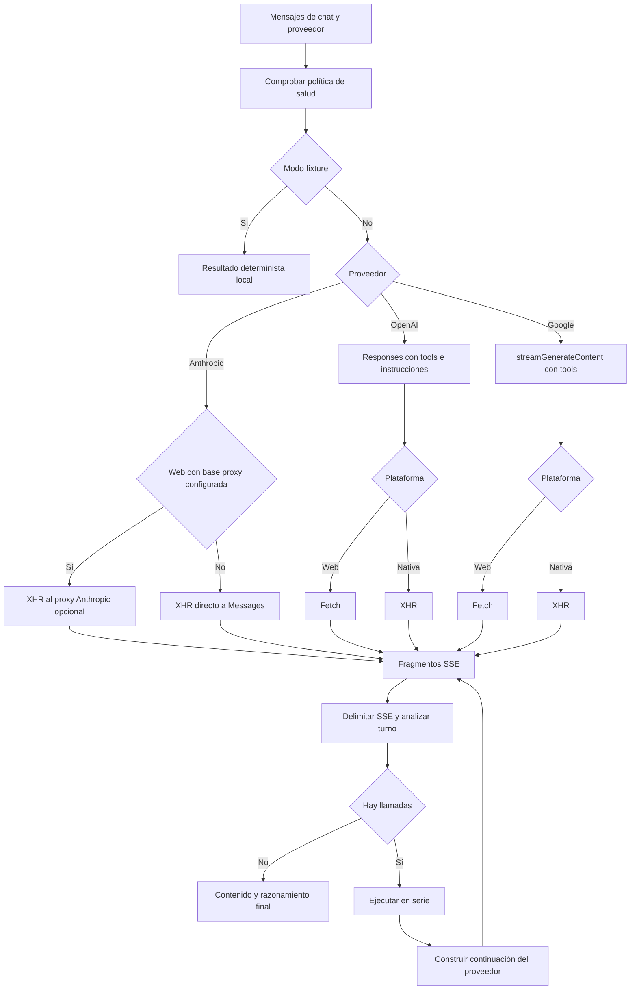

---
okf:
  version: 1
  kind: code-wiki
  status: grounded
  scope: provider stream transports, parsers, and continuation protocols
type: concepto
title: Transporte, streaming y compatibilidad de modelos
description: Explica cómo el cliente móvil transmite y analiza SSE de OpenAI, Anthropic y Google, conserva la correlación para herramientas y decide entre acceso directo y el proxy local opcional de Anthropic.
summary: SSE framing, transport selection, parsed turn contracts, correlation, errors, tests, and extension surfaces for OpenAI, Anthropic, and Google.
tags: [agent, streaming, events, openai, anthropic, google]
related:
  - ./runtime.md
  - ./provider-configuration.md
  - ../services/anthropic-proxy.md
verified:
  - by: openwiki/0.5.0
    at: 2026-09-07T11:37:28.236Z
sources:
  - id: openwiki-source-c2d1a0c89805fc4fc01238e2
    resource: repo://apps/anthropic_proxy/cors-proxy.py
  - id: openwiki-source-c65a19b98fa314cba98ace44
    resource: repo://apps/mobile/agent/providerPipeline.test.ts
  - id: openwiki-source-6b9b666faa646a8fd83706ea
    resource: repo://apps/mobile/agent/providerStreamParsers.ts
  - id: openwiki-source-b14a4ecd65e83b5561f88e2a
    resource: repo://apps/mobile/agent/providerToolLoop.ts
  - id: openwiki-source-c5c28138a849ad0b9daed017
    resource: repo://apps/mobile/agent/providerTransport.test.ts
  - id: openwiki-source-cc29928f3ae5e1998f27d57a
    resource: repo://apps/mobile/agent/providerTransport.ts
  - id: openwiki-source-63f2fbe9450b42dc3369441f
    resource: repo://apps/mobile/agent/sse.test.ts
  - id: openwiki-source-42008b636d0a1be0e91188e0
    resource: repo://apps/mobile/agent/sse.ts
  - id: openwiki-source-929e8e1df23628a3f3848ff8
    resource: repo://apps/mobile/App.tsx
generated: { by: "openwiki/0.5.0", at: "2026-09-07T11:37:28.236Z" }
---

# Transporte, streaming y compatibilidad de modelos

El chat con herramientas convierte los tres dialectos de streaming en un resultado común de contenido y razonamiento, sin perder la información que cada API necesita para continuar después de una herramienta. `callProviderChatAPIWithTools` en `apps/mobile/App.tsx` prepara la solicitud y concentra los deltas de todas las rondas; `sse.ts` delimita eventos; `providerStreamParsers.ts` mantiene el estado mutable de un turno; y `providerToolLoop.ts` ejecuta las herramientas y construye la continuación específica del proveedor.

La configuración de claves, modelos y verificación se describe en [Configuración de proveedores](./provider-configuration.md). La ejecución, autorización y persistencia de las herramientas pertenece al [entorno de ejecución](./runtime.md), no al parser.

## Flujo de solicitud y stream



*El flujo muestra la selección de transporte y cómo cada vuelta de herramientas vuelve a entrar en el mismo recorrido de streaming.*

Antes de abrir red, el adaptador bloquea una consulta clasificada como riesgo de salud. En modo de fixture no abre red: entrega contenido determinista y emite un único delta. En el modo normal, separa los mensajes de sistema para componer el prompt y transforma el resto en roles `user` o `assistant`; Google convierte este último rol en `model` y en partes de texto.

### Selección de transporte y límites de plataforma

| Proveedor | Solicitud y autenticación | Transporte en web | Transporte nativo |
|---|---|---|---|
| OpenAI | `POST /v1/responses`, `Authorization: Bearer`, `Accept: text/event-stream` | `Fetch` | `XMLHttpRequest` |
| Anthropic | `POST /v1/messages`, `x-api-key`, versión y, si existe, workspace | Directo por `XMLHttpRequest` de forma predeterminada; proxy solamente si se configuró base web | `XMLHttpRequest` directo |
| Google | `:streamGenerateContent?alt=sse`, `x-goog-api-key` | `Fetch` | `XMLHttpRequest` |

Los lectores Fetch decodifican bytes con `TextDecoder` en modo streaming. La ruta XHR toma solamente el sufijo nuevo de `responseText` en cada progreso, por lo que ambas rutas entregan texto incremental al mismo parser. Los XHR de streaming tienen un límite de 120 segundos; errores de transporte, tiempo de espera, HTTP no exitoso o un error del parser rechazan la operación.

Anthropic ya admite acceso directo desde el navegador: el cliente añade `anthropic-dangerous-direct-browser-access: true` únicamente en web. `shouldUseAnthropicWebProxy()` usa el proxy solo si la plataforma es web **y** `EXPO_PUBLIC_API_BASE_URL` se configuró deliberadamente. El proxy de FastAPI local es por tanto un adaptador de depuración/CORS opcional, no infraestructura de producción ni requisito para Android, iOS o el acceso web directo. Si se usa, el navegador le envía las credenciales en el cuerpo para que el proxy las convierta en cabeceras ascendentes; véase [Proxy de Anthropic](../services/anthropic-proxy.md) para su límite de confianza.

## Encuadre SSE e invariantes incrementales

`splitSSEEvents(buffer)` normaliza CRLF, devuelve solo los registros terminados por una línea vacía y conserva el resto incompleto. `parseSSEEvent(rawEvent)` usa `message` como evento predeterminado, omite comentarios y líneas vacías, retira un espacio inicial de cada valor y une varias líneas `data:` con saltos de línea. `parseSSEJsonFixture` es un auxiliar tolerante para pruebas: añade el terminador que falte, ignora `[DONE]` y descarta JSON no válido.

Cada `create*StreamParser` posee un `rawBuffer` privado. `push()` acumula texto y procesa eventos completos; `finish()` intenta una vez el resto no vacío. Esta separación es la invariante que permite que un fragmento de red corte UTF-8 decodificado, una cabecera SSE, un objeto JSON o el separador entre eventos sin cambiar el resultado. Son instancias por turno: no se deben compartir entre solicitudes concurrentes.

Los parsers exponen `onContentDelta(delta, aggregate)` y `onThinkingDelta(delta, aggregate)`. El adaptador acumula además esos deltas fuera del parser, de modo que el borrador y el resultado final incluyen texto emitido en rondas previas a una herramienta. El contenido transmitido acumulado prevalece sobre el texto del último turno; razonamiento sin contenido no satisface el contrato final y produce el error específico del proveedor.

## Dialectos, razonamiento y continuación

### OpenAI Responses

La solicitud usa `instructions`, `input`, herramientas `CHAT_TOOLS.openai` y, cuando el modelo lo permite, `reasoning` con esfuerzo normalizado y resumen. El parser recoge el identificador de respuesta de `response.created`, `response.in_progress` y `response.completed`; acumula deltas de `response.output_text.delta` y `response.reasoning_summary_text.delta`; e indexa los elementos de salida por `output_index`. Los deltas de argumentos se aplican por `item_id`, mientras que `response.completed` reemplaza el conjunto incremental si aporta una salida final no vacía.

El bucle reconoce elementos `function_call`, analiza sus argumentos como objeto —un valor vacío, inválido o no objeto se degrada a `{}`— y los ejecuta secuencialmente. Para continuar manda salidas `function_call_output` correlacionadas por `call_id` y el `previous_response_id`. Una llamada sin `responseId` hace fallar explícitamente la continuación: no es seguro inventar esa correlación.

### Anthropic Messages y compatibilidad de thinking

El parser de Anthropic indexa bloques por `index`: admite `text`, `thinking` con firma y `tool_use`; agrega `text_delta`, `thinking_delta`, `signature_delta` e `input_json_delta`. Al detener un bloque de herramienta, convierte el JSON parcial en objeto o `{}`. Expone `stopReason`, pero el bucle detecta llamadas por los bloques `tool_use`, no por ese motivo.

Una continuidad de Anthropic añade al historial el arreglo completo de bloques del asistente, incluidos los bloques de razonamiento y sus firmas, seguido de un mensaje de usuario con bloques `tool_result` identificados por `tool_use_id`. Eliminar los bloques no textuales o sustituir el identificador rompe el protocolo de continuidad.

El razonamiento no usa una única carga útil para todos los modelos. `anthropicThinkingConfig` aplica `{ type: "enabled", budget_tokens }` a modelos de la familia Claude 3 y generación 4.5; para los demás, incluidos modelos desconocidos y posteriores, solicita `{ type: "adaptive", display: "summarized" }`. Esta política por defecto hacia el formato moderno evita que un modelo nuevo reciba el formato fijo que rechaza, y `display: "summarized"` permite que la aplicación muestre razonamiento en lugar de un bloque vacío.

A diferencia de los otros parsers, Anthropic registra si recibió `message_stop`. `finish()` devuelve `truncated: true` cuando falta ese evento, incluso para un stream vacío. El adaptador XHR rechaza un HTTP 2xx truncado con un error explícito: el código de estado no convierte una respuesta parcial en un turno válido.

### Google Generative Language

Google recibe `contents`, `systemInstruction`, `CHAT_TOOLS.google` y `generationConfig.thinkingConfig` con `includeThoughts: true` y nivel alto. Su parser tolera formas camelCase y snake_case para `finishReason`, `functionCall` y `thoughtSignature`. Dirige las partes de texto marcadas `thought` al razonamiento, normaliza argumentos de función de objeto o cadena JSON a objeto, y conserva texto, indicador de pensamiento y firma como `modelParts`.

Para continuar, el bucle vuelve a enviar el mensaje `model` con todas las partes preservadas y añade un mensaje `user` con `functionResponse`. Cuando el proveedor ofrece `id`, lo conserva tanto en llamada como en respuesta; si no, el nombre sigue formando parte de la respuesta. Las llamadas se ejecutan en el orden recibido. No hay deduplicación de eventos: eventos duplicados del upstream pueden duplicar contenido, partes o llamadas.

## Fallos y límites operativos

- Los tres parsers ignoran JSON inválido, eventos desconocidos y fragmentos incompletos que no se puedan analizar; los eventos de error reconocidos de OpenAI/Anthropic o la propiedad `error` de Google lanzan el mensaje del proveedor cuando está disponible.
- Los argumentos de herramientas mal formados se convierten en `{}` antes de llegar al ejecutor. La validación y las decisiones sobre efectos secundarios son responsabilidad posterior del runtime.
- Los tres bucles permiten como máximo `MAX_TOOL_ROUNDS = 10`. Ejecutan las llamadas de cada ronda en serie y retornan el último turno si se agota el límite; si éste no contiene texto visible, el adaptador puede rechazar la respuesta final.
- Un error después de ejecutar una herramienta no revierte sus efectos. Los identificadores de proveedor y la ocurrencia por nombre/argumentos se pasan al coordinador de operaciones para que el runtime pueda tratar reintentos y efectos; no asuma que reintentar la petición es idempotente.
- La base web vacía no activa automáticamente el proxy. Un fallo de red en el proxy configurado se presenta como su mensaje de proxy inalcanzable; el acceso directo utiliza el mensaje de conexión de Anthropic.

## Pruebas que protegen el contrato

`providerPipeline.test.ts` reproduce fixtures SSE crudos de los tres proveedores y los reparte en tamaños de red repetidos y también en particiones arbitrarias generadas. Cubre el recorrido parser → herramienta → continuación, los `call_id` de OpenAI, `tool_use_id` de Anthropic, los identificadores de Google, deltas, razonamiento, argumentos inválidos, errores explícitos y streams truncados de Anthropic. Esta es la prueba más útil al modificar un dialecto o una carga útil de continuación.

`providerTransport.test.ts` cubre credenciales y cabeceras, migración del modelo predeterminado de Google, fixtures locales y la selección de razonamiento Anthropic para modelos heredados y modernos. `sse.test.ts` comprueba que el encuadre conserva eventos incompletos y combina líneas `data:`. `anthropicModels.test.ts` cubre de forma independiente la paginación del catálogo: un fallo posterior a la primera página conserva lo ya obtenido pero lo marca como parcial, y cursores ausentes o repetidos terminan como catálogo truncado.

Ejecute desde la raíz:

```bash
npx vitest run --config apps/mobile/vitest.config.mts apps/mobile/agent/sse.test.ts apps/mobile/agent/providerTransport.test.ts apps/mobile/agent/providerPipeline.test.ts apps/mobile/agent/anthropicModels.test.ts
```

## Cambiar o añadir compatibilidad

1. Mantenga el parser incremental: añada fixtures SSE saneados que corten eventos y JSON en límites arbitrarios antes de modificar la normalización.
2. Si el proveedor cambia eventos o campos, actualice el tipo de turno, el parser **y** la forma que `providerToolLoop.ts` reenvía; las firmas de pensamiento e identificadores de llamada son datos de protocolo, no detalles de interfaz.
3. Revise las dos rutas de transporte cuando cambie una solicitud: Fetch web y XHR nativo no comparten la misma implementación de lectura.
4. Para Anthropic, clasifique explícitamente la compatibilidad de thinking de un modelo que requiera una excepción; en ausencia de excepción, la política lo trata como moderno.
5. No convierta el proxy local de Anthropic en backend de producción. Un despliegue de producción requeriría un diseño propio de autenticación, límites, TLS, control de origen, protección de claves y operación.
