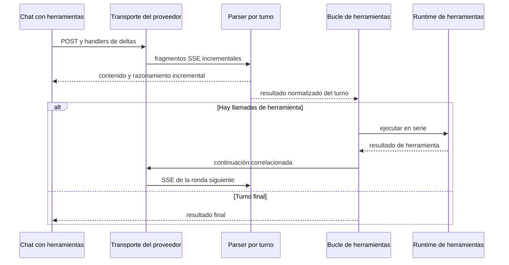

---
okf:
  version: 1
  kind: code-wiki
  status: grounded
  scope: transportes de stream de proveedores y protocolos de continuación
type: concepto
title: Transporte, streaming y compatibilidad de modelos
description: Describe los transportes SSE y los contratos de parser de OpenAI, Anthropic y Google en el cliente móvil, incluidas las continuaciones de herramientas y los fallos de stream.
tags: [agent, streaming, sse, openai, anthropic, google]
related:
  - ./runtime.md
  - ./provider-configuration.md
  - ../services/anthropic-proxy.md
verified:
  - by: openwiki/0.5.0
    at: 2026-09-12T11:47:11.882Z
sources:
  - id: openwiki-source-c2d1a0c89805fc4fc01238e2
    resource: repo://apps/anthropic_proxy/cors-proxy.py
  - id: openwiki-source-63dae4a27346d91c6139697b
    resource: repo://apps/mobile/agent/googleInteractions.test.ts
  - id: openwiki-source-df22d5c1fa6f9ff9bb908437
    resource: repo://apps/mobile/agent/googleInteractions.ts
  - id: openwiki-source-f310c5fb576ae69a7753918c
    resource: repo://apps/mobile/agent/googleStreamTransport.ts
  - id: openwiki-source-c65a19b98fa314cba98ace44
    resource: repo://apps/mobile/agent/providerPipeline.test.ts
  - id: openwiki-source-6b9b666faa646a8fd83706ea
    resource: repo://apps/mobile/agent/providerStreamParsers.ts
  - id: openwiki-source-b14a4ecd65e83b5561f88e2a
    resource: repo://apps/mobile/agent/providerToolLoop.ts
  - id: openwiki-source-c5c28138a849ad0b9daed017
    resource: repo://apps/mobile/agent/providerTransport.test.ts
  - id: openwiki-source-cc29928f3ae5e1998f27d57a
    resource: repo://apps/mobile/agent/providerTransport.ts
  - id: openwiki-source-63f2fbe9450b42dc3369441f
    resource: repo://apps/mobile/agent/sse.test.ts
  - id: openwiki-source-42008b636d0a1be0e91188e0
    resource: repo://apps/mobile/agent/sse.ts
  - id: openwiki-source-929e8e1df23628a3f3848ff8
    resource: repo://apps/mobile/App.tsx
generated: { by: "openwiki/0.5.0", at: "2026-09-12T11:47:11.882Z" }
---

# Transporte, streaming y compatibilidad de modelos

El chat con herramientas traduce los dialectos SSE de OpenAI Responses, Anthropic Messages y Google Interactions a resultados de turno que el bucle de herramientas puede continuar. `callProviderChatAPIWithTools` en `apps/mobile/App.tsx` crea los handlers de streaming y conserva sus agregados durante todas las rondas; los parsers son instancias por turno y el bucle construye la siguiente petición con la correlación propia de cada API.

La configuración de claves y modelos se documenta en [Configuración de proveedores](./provider-configuration.md). La autorización, ejecución y persistencia de efectos de las herramientas corresponde al [runtime del agente](./runtime.md), no al transporte.

## Flujo de un turno con herramientas



*El mismo parser de proveedor recibe todos los fragmentos de una ronda y los agregados de `Chat` sobreviven a las continuaciones.*

Antes de llamar a la red, el chat bloquea consultas clasificadas como riesgo de salud. En modo fixture devuelve una respuesta local determinista y emite un único delta, sin abrir red. En modo normal separa el prompt de sistema de los mensajes conversacionales; para Google, `buildGoogleHistory` convierte el historial local al formato de pasos que exige Interactions.

## Encuadre SSE y contrato incremental

`sse.ts` normaliza CRLF y separa únicamente registros terminados por una línea vacía: conserva en `rest` cualquier evento incompleto. `parseSSEEvent` ignora comentarios, usa `message` por defecto y une las líneas `data:` con saltos de línea. Por ello un lector puede entregar cortes arbitrarios de la respuesta sin partir un evento antes de que el parser de proveedor lo procese.

Cada `create*StreamParser` mantiene su propio buffer, acumula deltas y ofrece `push()` y `finish()`:

- **OpenAI** recoge `responseId`, texto, resumen de razonamiento y elementos de salida. Indexa los elementos por `output_index`, aplica deltas de argumentos por `item_id` y usa los elementos finales de `response.completed` si existen.
- **Anthropic** indexa bloques por `index`: texto, `thinking` —incluida su firma— y `tool_use`. Ensambla `input_json_delta` y, cuando cierra el bloque, solo acepta un objeto JSON; de lo contrario devuelve `{}`. La ausencia de `message_stop` marca el resultado como `truncated`.
- **Google** valida el ciclo `interaction.created` y `step.start`/`step.delta`/`step.stop` antes de admitir `interaction.completed`. Conserva campos opacos de los pasos, incluidas firmas y uso, pero rechaza índices, estados, firmas, argumentos u orden incompatibles. `finish()` falla si queda buffer, falta el cierre o hay pasos sin cerrar.

Los handlers reciben `(delta, aggregate)` para contenido y razonamiento. El adaptador del chat también conserva un agregado fuera del parser; al terminar el bucle usa ese agregado antes que el contenido del último turno. Así, texto o razonamiento emitidos antes de una llamada de herramienta no se pierden al mostrar el resultado final. Si no hay contenido, el chat rechaza la respuesta del proveedor.

## Transporte por proveedor y plataforma

| Proveedor | Endpoint y autenticación | Web | Nativo |
|---|---|---|---|
| OpenAI | `POST https://api.openai.com/v1/responses`, `Authorization: Bearer` | `fetch` + `TextDecoder` | `XMLHttpRequest` incremental |
| Anthropic | `POST https://api.anthropic.com/v1/messages`, `x-api-key` y `anthropic-version` | `XMLHttpRequest` incremental | `XMLHttpRequest` incremental |
| Google | `POST /v1beta/interactions`, `x-goog-api-key` | `fetch` + `TextDecoder` | `XMLHttpRequest` incremental |

OpenAI y Google seleccionan Fetch en web y XHR fuera de web. Fetch decodifica bytes en modo streaming; XHR toma exclusivamente el sufijo nuevo de `responseText` en cada progreso. Ambos alimentan el mismo parser del proveedor. Los XHR y Fetch de streaming tienen un plazo de 120 segundos y convierten errores de red, timeout, HTTP no exitoso o de parser en rechazo.

Google añade una contingencia nativa específica: si el XHR incremental falla **antes** de haber notificado contenido o razonamiento visible, repite la misma solicitud mediante XHR sin progreso y entrega la respuesta completa al mismo parser. Si ya mostró un delta, no reintenta para evitar duplicar una respuesta parcial.

Anthropic usa XHR también en web. En acceso web directo añade `anthropic-dangerous-direct-browser-access: true`; el proxy se escoge solo cuando la base web está configurada explícitamente. Cuando se usa el proxy, las credenciales se incluyen en el cuerpo para que este las transforme en cabeceras ascendentes. Es un adaptador local/opcional de CORS y depuración, no un backend de producción; consulte [Proxy de Anthropic](../services/anthropic-proxy.md) para su límite de confianza.

## Continuación y correlación de herramientas

Las herramientas se ejecutan en serie y cada bucle entrega al runtime un `ToolCallEnvelope` con proveedor, identificador de llamada, nombre, argumentos y ocurrencia. El runtime puede emplearlo para coordinar reintentos y efectos, pero una excepción tras ejecutar una herramienta no revierte su efecto.

- **OpenAI:** `runOpenAIToolLoop` extrae `function_call`, interpreta argumentos vacíos, no-objeto o inválidos como `{}`, y devuelve elementos `function_call_output` con el mismo `call_id`. Requiere `responseId` para enviar `previous_response_id`; si falta, falla antes de continuar.
- **Anthropic:** el bucle agrega al historial los `contentBlocks` completos del asistente —también pensamiento y firma— y un mensaje de usuario con `tool_result` correlacionado por `tool_use_id`. No se debe reducir el bloque del asistente a texto antes de una continuación.
- **Google:** un turno `requires_action` es una continuación válida. El bucle añade sus pasos al historial y, por cada `function_call`, un `function_result` con el mismo `name` y el `call_id` igual al identificador de llamada. Reenvía el historial completo en cada ronda con `store: false`, sin `previous_interaction_id`.

El bucle de Google trata un identificador de interacción no vacío repetido con la misma identidad como replay y no vuelve a ejecutar sus herramientas; rechaza una identidad contradictoria o un `call_id` reutilizado en una interacción distinta. Google puede devolver ID vacío con `store: false`, por lo que ese valor no se usa para deduplicar rondas. El límite general es `MAX_TOOL_ROUNDS = 10`; el estimador de alimentos usa cinco rondas para Google.

## Google Interactions: estado local y validación

`buildGoogleInteractionRequest` construye la carga de Interactions con `input`, `stream: true` y `store: false`; puede añadir instrucción de sistema, herramientas, configuración de thinking y formato estructurado. El historial local conserva pasos y las firmas de pensamiento literalmente: son campos de protocolo opacos, no texto que pueda regenerarse. Al reconstruir una conversación, `isGoogleConversationTurn` exige pasos válidos, firmas en pensamientos y que toda llamada tenga el resultado correlacionado; nunca restaura una llamada pendiente como trabajo ejecutable.

Esta validación estricta ocurre antes del bucle que ejecuta herramientas. Un stream truncado, JSON inválido, un paso abierto, una secuencia reordenada, argumentos que no sean objeto o el estado terminal incompatible se rechazan en el parser; un HTTP 2xx no convierte esos datos en un turno válido.

## Compatibilidad de razonamiento

OpenAI incluye `reasoning` solo cuando la normalización del modelo y esfuerzo produce una configuración válida. Para Anthropic, `anthropicThinkingConfig` mantiene el formato heredado `{ type: "enabled", budget_tokens }` para la familia Claude 3 y generación 4.5. Para los demás modelos, incluidos nombres desconocidos, usa `{ type: "adaptive", display: "summarized" }`; esta política orientada a formatos modernos evita aplicar el presupuesto fijo a modelos que lo rechazan y solicita un resumen que la interfaz pueda mostrar.

## Fallos que deben conservarse

- OpenAI y Anthropic toleran eventos desconocidos o JSON de evento no válido; Google falla de forma explícita ante datos de protocolo no válidos.
- Anthropic no acepta un stream parcial aunque el XHR reciba 2xx: el transporte rechaza un resultado marcado `truncated`.
- No invente correlaciones: OpenAI necesita `responseId`; Anthropic necesita `tool_use_id`; Google necesita IDs de llamada únicos y resultados con el mismo nombre.
- Cambiar una carga de continuación exige modificar conjuntamente el tipo de turno, parser y bucle. Las firmas de pensamiento y los identificadores son datos de wire protocol.

## Pruebas enfocadas

`providerPipeline.test.ts` reproduce fixtures SSE crudos de los tres proveedores a través de parser → herramienta → continuación. Los vuelve a fragmentar tanto con una secuencia de tamaños repetida como con 100 particiones arbitrarias generadas; cubre múltiples llamadas, correlación, errores del proveedor, argumentos OpenAI inválidos y truncamiento de Anthropic.

`googleInteractions.test.ts` cubre el ciclo de vida estricto de Google, replays de aperturas/cierres, límites de bytes UTF-8, IDs vacíos con `store:false`, historial completo y prevención de segundas ejecuciones. También comprueba la paridad Fetch/XHR y el fallback nativo que solo se permite antes de emitir deltas. `providerTransport.test.ts` protege cabeceras, migración del modelo Google y la selección de thinking de Anthropic; `sse.test.ts` protege el encuadre común.

Ejecute desde la raíz:

```bash
npm exec -- vitest run --config apps/mobile/vitest.config.mts apps/mobile/agent/sse.test.ts apps/mobile/agent/providerTransport.test.ts apps/mobile/agent/providerToolLoop.test.ts apps/mobile/agent/providerPipeline.test.ts apps/mobile/agent/googleInteractions.test.ts
```

## Extender un proveedor o protocolo

1. Añada primero fixtures SSE saneados que corten eventos, JSON y texto UTF-8 en límites arbitrarios.
2. Mantenga el parser por turno y especifique qué condición demuestra que el stream terminó correctamente.
3. Actualice a la vez el parser, el resultado normalizado, la continuación del bucle y las dos rutas de lectura de la plataforma.
4. Conserve literales los IDs y campos opacos que el proveedor exige en la siguiente ronda.
5. Para Anthropic, añada una excepción de modelo solo cuando la compatibilidad de thinking esté demostrada; por defecto los modelos desconocidos usan el formato moderno.
