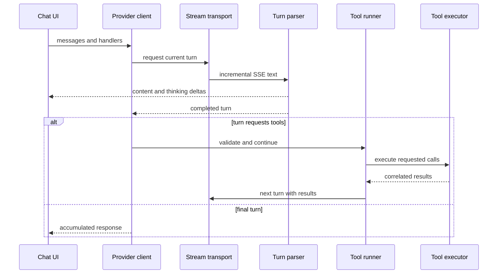

---
okf:
  version: 1
  kind: code-wiki
  status: grounded
  scope: provider stream transports, parsers, and continuation protocols
type: arquitectura de streaming
title: Streaming, continuaciones y bucles de proveedores
description: Describe el procesamiento SSE y los contratos de continuación con herramientas de OpenAI, Anthropic y Google en el cliente móvil, incluidos el límite de rondas y el presupuesto local de Google.
tags: [agent, streaming, sse, openai, anthropic, google]
related:
  - ./runtime.md
  - ./provider-configuration.md
  - ../operations/runtime-behavior.md
sources:
  - id: openwiki-source-c2d1a0c89805fc4fc01238e2
    resource: repo://apps/anthropic_proxy/cors-proxy.py
  - id: openwiki-source-dc42304b20e8518ef65b4b63
    resource: repo://apps/mobile/agent/googleContextBudget.ts
  - id: openwiki-source-63dae4a27346d91c6139697b
    resource: repo://apps/mobile/agent/googleInteractions.test.ts
  - id: openwiki-source-df22d5c1fa6f9ff9bb908437
    resource: repo://apps/mobile/agent/googleInteractions.ts
  - id: openwiki-source-f310c5fb576ae69a7753918c
    resource: repo://apps/mobile/agent/googleStreamTransport.ts
  - id: openwiki-source-c65a19b98fa314cba98ace44
    resource: repo://apps/mobile/agent/providerPipeline.test.ts
  - id: openwiki-source-6b9b666faa646a8fd83706ea
    resource: repo://apps/mobile/agent/providerStreamParsers.ts
  - id: openwiki-source-479fc45ac32d23cfffe17d8e
    resource: repo://apps/mobile/agent/providerStreamTransport.ts
  - id: openwiki-source-abc6fea468a7de09acfb0c4f
    resource: repo://apps/mobile/agent/providerToolClient.ts
  - id: openwiki-source-b14a4ecd65e83b5561f88e2a
    resource: repo://apps/mobile/agent/providerToolLoop.ts
  - id: openwiki-source-c5c28138a849ad0b9daed017
    resource: repo://apps/mobile/agent/providerTransport.test.ts
  - id: openwiki-source-cc29928f3ae5e1998f27d57a
    resource: repo://apps/mobile/agent/providerTransport.ts
  - id: openwiki-source-63f2fbe9450b42dc3369441f
    resource: repo://apps/mobile/agent/sse.test.ts
  - id: openwiki-source-42008b636d0a1be0e91188e0
    resource: repo://apps/mobile/agent/sse.ts
  - id: openwiki-source-929e8e1df23628a3f3848ff8
    resource: repo://apps/mobile/App.tsx
verified:
  - by: openwiki/0.6.0
    at: 2026-10-10T14:02:47.335Z
generated: { by: "openwiki/0.6.0", at: "2026-10-10T14:02:47.335Z" }
---

# Streaming, continuaciones y bucles de proveedores

`requestProviderToolChat` es la entrada del chat móvil con herramientas. Compone las instrucciones, escoge el transporte del proveedor, reenvía deltas a la interfaz y entrega cada turno completo a un bucle específico. El transporte no decide efectos: el bucle valida el turno, correlaciona resultados y decide si debe pedir otra ronda.


```mermaid
sequenceDiagram
    participant UI as Chat UI
    participant Client as Provider client
    participant Transport as Stream transport
    participant Parser as Turn parser
    participant ToolRunner as Tool runner
    participant Executor as Tool executor
    UI->>Client: messages and handlers
    Client->>Transport: request current turn
    Transport->>Parser: incremental SSE text
    Parser-->>UI: content and thinking deltas
    Parser-->>Client: completed turn
    alt turn requests tools
        Client->>ToolRunner: validate and continue
        ToolRunner->>Executor: execute requested calls
        Executor-->>ToolRunner: correlated results
        ToolRunner->>Transport: next turn with results
    else final turn
        Client-->>UI: accumulated response
    end
```

*Solicitud con streaming y, si el turno lo requiere, continuación de herramientas.*

## Encuadre, parsers y acumulación

`splitSSEEvents` normaliza CRLF, entrega solo registros acabados por una línea vacía y conserva el resto; `parseSSEEvent` ignora comentarios, usa `message` por defecto y concatena líneas `data:`. Por tanto, Fetch y XHR pueden pasar cortes arbitrarios sin conocer las fronteras JSON o SSE.

Cada petición crea un parser por turno. OpenAI reúne elementos por índice, `responseId` y fragmentos de argumentos; Anthropic reúne bloques `text`, `thinking` —incluida su firma— y `tool_use`, cuyo JSON se interpreta al cerrar el bloque. Ambos marcan el turno como truncado si falta su evento terminal. `requestProviderToolChat` mantiene acumuladores alrededor de todas las rondas: los callbacks y el resultado final contienen los deltas de contenido y razonamiento, no solo los del último turno.

Google Interactions aplica una máquina de estados más estricta. Exige `interaction.created`, pasos abiertos en índices consecutivos, el ciclo `step.start`/`step.delta`/`step.stop` y un cierre consistente con `completed` o `requires_action`. Rechaza JSON, argumentos, firmas, IDs, secuencia o cierre inválidos; un `step.start` repetido e idéntico no borra lo ya acumulado.

## Transporte y fallos

| Proveedor | Web | Nativo | Semántica relevante |
|---|---|---|---|
| OpenAI | Fetch con `TextDecoder` incremental | XHR con progreso | Tiempo de espera de 120 s; un turno truncado no llega a ejecutar herramientas. |
| Anthropic | XHR con progreso | XHR con progreso | Tiempo de espera de 120 s; sin `message_stop` el parser lo marca truncado. |
| Google | Fetch con `TextDecoder` incremental | XHR con progreso | Tiempo de espera de 120 s; si la ruta incremental falla antes de mostrar un delta, se repite una vez mediante XHR bufferizado. |

En XHR se entrega al parser únicamente el sufijo de `responseText` posterior a `lastOffset`; Fetch decodifica bytes de forma incremental. Estados HTTP no exitosos, fallo de red, timeout y errores de parser rechazan la solicitud. El fallback de Google no se intenta después de notificar contenido o razonamiento, para evitar duplicar texto visible.

## Continuaciones, efectos y límite de rondas

OpenAI añade al contexto los `outputItems` del turno y un `function_call_output` correlacionado por `call_id`. Anthropic conserva los bloques completos del asistente y añade un mensaje de usuario con `tool_result` correlacionado por `tool_use_id`; esto preserva pensamiento y otros datos de protocolo además del texto visible. Google añade un `function_result` con el mismo `call_id` y conserva los pasos recibidos. Los argumentos de OpenAI que no sean un objeto JSON no se ejecutan: se devuelve al modelo un resultado de error de entrada.

Los tres bucles permiten como máximo `MAX_TOOL_ROUNDS = 10` rondas de herramientas. Si el turno posterior aún pide herramientas, no ejecutan esas llamadas: adjuntan un resultado sintético y hacen una única petición de cierre con `tool_choice: "none"`. Un cierre con tools, truncado, no completado o fallido se convierte en `ToolRoundLimitError`, en vez de presentar una respuesta parcial como final. Las llamadas de una ronda se conservan y sus resultados se devuelven en el orden del turno, pero se delegan a `executeToolBatch`; no se debe inferir de este módulo que los efectos se ejecuten estrictamente en serie. Los sobres de ejecución incluyen proveedor, ID remoto y ocurrencia para que el coordinador pueda identificar la operación.

Un fallo inesperado de una tool de solo lectura se transforma en un resultado controlado para el modelo; un error de operación indeterminada o de turno se propaga, evitando invitar a reintentar ciegamente un efecto potencialmente escrito.

## Google Interactions: continuidad e historial

`buildGoogleInteractionRequest` transmite `stream: true`, `store: false` y el historial local en `input`; no usa `previous_interaction_id`. El bucle detecta un replay de interacción no vacío y no vuelve a ejecutar sus tools, pero rechaza una identidad contradictoria o un ID de tool reutilizado entre rondas. Puesto que `store: false` permite un ID vacío, este no identifica replays.

El metadato persistible de una respuesta Google es `GoogleConversationTurn`, con los pasos completos y el resumen de interacciones. Al restaurar, `buildGoogleHistory` solo incorpora esos pasos si pasan validación: no puede haber llamadas pendientes, firmas de pensamiento ausentes ni resultados mal correlacionados. La hidratación no ejecuta herramientas; si el metadato falta, el mensaje se representa como texto.

## Presupuesto de contexto de Google

Antes de abrir la red, `prepareGoogleInteractionRequest` prepara una copia del historial y no muta el original. Su presupuesto predeterminado es diez intercambios, 512 KiB de JSON sin datos de imagen y 19 000 000 bytes para el cuerpo total. El cliente Coach sustituye solo el máximo de intercambios por `COACH_CONTEXT_MESSAGE_LIMIT`; los dos límites de bytes se conservan.

Un intercambio empieza en `user_input` y no se divide. Tras seleccionar los intercambios más recientes, el preparador elimina las imágenes inline de los intercambios anteriores —mantiene el texto o inserta un marcador si la entrada era solo imagen— y, si todavía supera un límite, elimina intercambios completos desde el más antiguo. Si el último intercambio seleccionado sigue sin caber, lanza `GoogleContextBudgetError`; el informe entregado a `onContextReport` describe la decisión, pero el callback nunca bloquea la petición ni convierte por sí solo este comportamiento en telemetría de producción.

## Contraste de runtime y operación

Esta página documenta el comportamiento implementado y las pruebas deterministas, no una muestra de tráfico ni métricas de producción. La evidencia operativa, sus límites y cualquier medición deben leerse junto con [Comportamiento de runtime](/openwiki/operations/runtime-behavior.md); ese informe debe enlazar aquí al atribuir a los parsers, transportes, truncamientos, rondas o presupuesto de Google su causa en el cliente.

En web, Anthropic se llama directamente por defecto y añade `anthropic-dangerous-direct-browser-access`. El proxy solo se usa cuando se configura `EXPO_PUBLIC_API_BASE_URL`; el proxy incluido está restringido a loopback y es una ayuda de desarrollo, no un backend de producción. Véase también [Configuración de proveedores](./provider-configuration.md).

## Pruebas focalizadas y cambios seguros

`providerPipeline.test.ts` reproduce fixtures SSE de los tres proveedores con tamaños de fragmento repetidos y fronteras arbitrarias. Cubre parser → tool → continuación, correlación de varias llamadas, argumentos inválidos, errores del proveedor y truncamiento de Anthropic. Las pruebas de Google cubren su máquina de estados, replays, restauración, presupuesto y paridad de transporte; `sse.test.ts` protege el encuadre común y las pruebas de límite cubren la petición de cierre.

Al cambiar un dialecto, actualice parser, contrato de continuación y transportes aplicables como una unidad. No descarte `call_id`, firmas, bloques de razonamiento ni pasos persistidos: son datos de protocolo. Añada siempre una fixture de stream completo y casos que partan tanto el evento SSE como el JSON.

```bash
npm exec -- vitest run --config apps/mobile/vitest.config.mts apps/mobile/agent/sse.test.ts apps/mobile/agent/providerPipeline.test.ts apps/mobile/agent/providerToolClient.roundLimit.test.ts apps/mobile/agent/googleInteractions.test.ts
```
