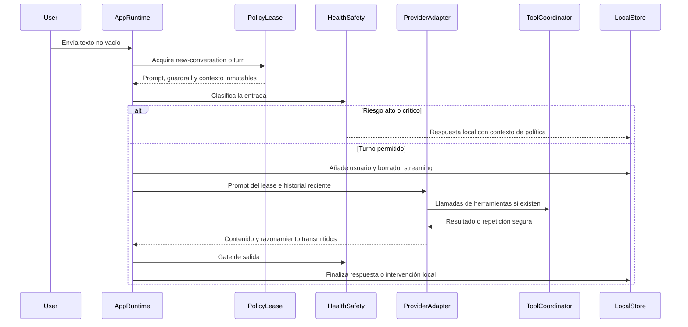

---
okf:
  version: 1
  kind: code-wiki
  status: grounded
  scope: apps/mobile/agent and chat orchestration in apps/mobile/App.tsx
type: concepto
title: Entorno de ejecución del agente
description: Ciclo de ejecución local-first del agente móvil, desde el lease inmutable de política y los controles sanitarios hasta el streaming, las herramientas y la persistencia del resultado.
summary: Provider-independent chat, tool execution, persistence, retry, and extension contracts for the mobile agent.
tags:
  - agent
  - chat
  - tools
  - runtime
  - mobile
related:
  - ./provider-streaming.md
  - ./provider-configuration.md
  - ./signed-policy-lifecycle.md
  - ../mobile/local-state-and-backup.md
  - ../operations/build-release-and-testing.md
  - ../operations/prompt-policy-governance.md
verified:
  - by: openwiki/0.4.3
    at: 2026-09-05T11:27:14.639Z
sources:
  - id: openwiki-source-192849a5973afd8b6e55db2c
    resource: repo://apps/mobile/agent/agentPolicyRuntime.test.ts
  - id: openwiki-source-0c30fc96b9e7c8b57c35473c
    resource: repo://apps/mobile/agent/agentPolicyRuntime.ts
  - id: openwiki-source-600d0c06462286badb80af0a
    resource: repo://apps/mobile/agent/chatSystemPrompt.contract.test.ts
  - id: openwiki-source-60bf595411222eba5d93cbd0
    resource: repo://apps/mobile/agent/chatSystemPromptRuntime.ts
  - id: openwiki-source-c8058179f2f675901a8caa09
    resource: repo://apps/mobile/agent/healthSafety.ts
  - id: openwiki-source-8281cde290f55702198714d3
    resource: repo://apps/mobile/agent/healthSafetyRuntime.ts
  - id: openwiki-source-a5860dc24336c2fe655bbc75
    resource: repo://apps/mobile/agent/policyContext.ts
  - id: openwiki-source-9e7ddd51c09caf628a81acad
    resource: repo://apps/mobile/agent/toolOperationLedger.ts
  - id: openwiki-source-929e8e1df23628a3f3848ff8
    resource: repo://apps/mobile/App.tsx
generated: { by: "openwiki/0.4.3", at: "2026-09-05T11:27:14.639Z" }
---

# Entorno de ejecución del agente

El agente se ejecuta en el proceso Expo y su orquestación vive en `apps/mobile/App.tsx`; no hay un backend propio que posea la conversación ni el estado de dominio. La ruta principal `sendMessage` adquiere una política, aplica controles de salud, transmite el turno al proveedor y persiste el mensaje final en `LocalStore`. Las herramientas operan sobre dependencias locales inyectadas y sus acciones con efecto se coordinan con un ledger. Los protocolos SSE y la continuación específica de OpenAI, Anthropic y Google se documentan en [Streaming de proveedores y continuación de herramientas](./provider-streaming.md); las claves, modelos y transportes se documentan en [Configuración de proveedores](./provider-configuration.md).

La política ya **no** se carga como texto mutable desde GitHub Raw ni usa el fallback manual de `AsyncStorage` que describía versiones anteriores de esta página. Cada envío adquiere un `AgentPolicyLease`; el lease reúne el prompt, la política sanitaria, su procedencia y la atribución de activación del mismo bundle. Para verificación criptográfica, selección remoto/caché/integrado, límites de activación y promoción, consulte [Ciclo de vida de la política firmada](./signed-policy-lifecycle.md). Esta página describe únicamente cómo el runtime consume ese contrato.

## Flujo de un envío de chat



*Un envío usa una única selección de política para clasificar, transmitir y atribuir el resultado; el proveedor solo se alcanza si el control de entrada permite continuar.*

### Entrada, lease y atribución

`sendMessage` rechaza la operación sin hilo, texto útil, proveedor activo o clave configurada. Antes de crear el borrador decide el límite: `new-conversation` si el hilo aún no contiene un mensaje de usuario y `turn` en caso contrario. Después llama a `acquireAgentPolicyLease`, refleja la selección y el estado en la interfaz, y conserva el `policy_context` del lease en el borrador y en las respuestas locales de seguridad.

El lease es una estructura profundamente congelada. En canal `Local` se construye con el snapshot integrado del prompt y la política sanitaria incluida; para los demás canales deriva el prompt, el guardrail fusionado y el contexto de la misma selección firmada. De este modo, una petición no puede mezclar un prompt de un candidato con reglas sanitarias o atribución de otro. La traza `lease-acquired` registra la identidad de activación, candidato, secuencia, origen y límite, no el contenido del prompt.

`PolicyContext` persistido en los mensajes tiene claves exactas: activación (`activate` o `rollback` e ID), `bundle_sha256`, candidato, secuencia, origen y versión. Al rehidratar mensajes, `normalizePolicyContext` descarta un objeto que no cumpla exactamente el formato esperado; esto evita que metadatos arbitrarios se presenten como atribución de política válida.

### Controles sanitarios antes, durante y después del proveedor

El runtime clasifica determinísticamente la entrada contra la política sanitaria del lease. Los riesgos `high` y `critical` bloquean el proveedor y materializan una respuesta local; un riesgo `elevated` puede solicitar consentimiento para un evaluador del proveedor, pero mientras tanto el modo efectivo de herramientas es solo lectura. Para el resto, el modo es `all`.

Durante la transmisión, `createHealthSafeStreamGate` retiene la salida visible hasta límites de segmentos completos y la evalúa con la misma política. Al finalizar, una decisión bloqueante sustituye la salida del modelo por una respuesta local de seguridad y marca el mensaje como `health_safety_intervention`. La clasificación de entrada, el gate de salida y los resultados locales usan por tanto la política sanitaria que acompañaba al prompt en el lease, no una recarga independiente a mitad del turno.

### Historial, streaming y finalización

Cuando la entrada está permitida, la aplicación añade a `LocalStore` el mensaje de usuario y un borrador del asistente con `is_streaming: true`, vacía el campo y abre el razonamiento. El historial excluye los mensajes locales de divulgación de IA, conserva los últimos 20 y coloca `policyLease.prompt.content` como único mensaje de sistema. La ruta de chat no lee ni concatena memoria personal como una anulación local del prompt.

Los deltas de contenido y razonamiento actualizan agregados locales; las escrituras del borrador en React se agrupan cada 40 ms. `callProviderChatAPIWithTools` puede realizar rondas de herramientas, pero el mensaje final exige contenido no vacío. Un fallo transitorio reconocido se reintenta hasta tres intentos, con espera de 2 y 4 segundos; cada reintento reinicia el borrador y su gate. Al terminar, el gate decide entre contenido visible del modelo y una intervención sanitaria; en error, el mismo borrador se convierte en `technical_error` y se elimina el estado de envío.

## Herramientas: ejecución local y semántica de repetición

El proveedor recibe el catálogo canónico `CHAT_TOOLS`; el adaptador y la continuación de protocolo se tratan en la página de streaming. En `App.tsx`, las llamadas se convierten en `ToolCallEnvelope` con `executionId` igual al ID del mensaje del usuario, proveedor, ID de llamada cuando exista, nombre, argumentos y ocurrencia. `ToolOperationCoordinator` decide si una operación se debe ejecutar, unirse a una ejecución en curso o reproducir una salida ya comprometida.

Las herramientas de lectura se ejecutan directamente. Para una herramienta con efecto, su identidad incluye versión, ejecución, proveedor, nombre, argumentos JSON canónicos y ocurrencia; el fingerprint protege además contra una colisión de identidad con otros argumentos. El coordinador deduplica ejecuciones simultáneas en memoria y consulta un ledger persistente antes de llamar al ejecutor. Una repetición válida devuelve la salida previa; una colisión devuelve `No se ejecutó la acción porque su identidad no era segura.`

Solo los resultados con estado `committed` se registran. El ledger conserva como máximo 256 entradas, vence cada una a los siete días y serializa escrituras para no corromper su estado. Si el almacenamiento del ledger falla tras el efecto, el resultado se conserva en memoria y se devuelve, pero no queda protección persistente tras reiniciar la aplicación: es un riesgo operativo que debe considerarse al añadir efectos no idempotentes. El borrado de datos debe limpiar también el coordinador/ledger con su método `clear`.

Los controladores reciben estado, repositorios y funciones de persistencia como dependencias del runtime; no deben acceder a credenciales del proveedor. `healthSafetyToolAllowed` se aplica al efecto declarado de la herramienta y a la mayor severidad entre la decisión del turno y la de los argumentos. Por ello, una extensión debe clasificar correctamente su efecto como `read`, `local_write` o `external_write`: etiquetarla como lectura ampliaría indebidamente el acceso bajo riesgo elevado.

## Otros consumidores del lease

El chat principal no es el único consumidor. `MiniChat` del asistente de alimentos personales y `sendFoodEstimatorMessage` también eligen `new-conversation` o `turn`, adquieren un lease, clasifican entrada/salida y guardan `policy_context` junto a los mensajes. El estimador combina el prompt del lease con `FOOD_ESTIMATOR_SYSTEM_PROMPT` para su tarea especializada; esa composición no restaura la antigua carga Raw del prompt base.

Las cargas en segundo plano usan el límite `background`, incluido `loadChatSystemPrompt` y `loadHealthSafetyPolicy`. Son adaptadores de compatibilidad/estado: extraen una copia de la parte correspondiente del lease y trazan su selección. No deben usarse para ensamblar por separado el prompt y las reglas de una petición interactiva, porque romperían la coherencia que proporciona un único lease adquirido para el turno.

## Límites, privacidad y operación

- El contenido del prompt y la política sanitaria son texto privilegiado obtenido del bundle o de una selección firmada; su cambio requiere el proceso de [gobierno de política de prompt](../operations/prompt-policy-governance.md), no una edición del shell de chat. La promoción, rollback y degradación pertenecen al documento especializado de ciclo de vida.
- El historial y las respuestas se almacenan localmente. La atribución de política guardada permite explicar qué activación gobernó una respuesta sin persistir secretos del proveedor. Consulte [Estado local y copia de seguridad](../mobile/local-state-and-backup.md) para los límites de almacenamiento y borrado.
- Los deltas y las llamadas de herramientas pasan al proveedor configurado; la validación sanitaria local no convierte al proveedor en un entorno confiable para datos personales. Mantenga el prompt, las trazas y los fixtures libres de conversaciones, claves y otros datos sensibles.
- La UI puede mostrar el estado de política (`active`, `pending` o `degraded`) que llega en el lease. Ese estado describe la selección, no prueba por sí solo que una respuesta de modelo sea correcta ni revierte efectos locales ya comprometidos.

## Validación focalizada y cambios seguros

Para cambiar el ensamblaje del lease o su contrato de inmutabilidad, ejecute:

```bash
npm --workspace apps/mobile exec vitest run --config vitest.config.mts agent/agentPolicyRuntime.test.ts agent/chatSystemPrompt.contract.test.ts agent/policyContext.test.ts
```

Para controles sanitarios, ledger o ejecución de herramientas, añada las pruebas propietarias correspondientes:

```bash
npm --workspace apps/mobile exec vitest run --config vitest.config.mts agent/healthSafety.contract.test.ts agent/healthSafety.test.ts agent/toolOperationLedger.test.ts agent/toolExecutor.test.ts
```

Cambios que atraviesen la composición del chat, el protocolo de proveedor o efectos de herramientas requieren también las pruebas de streaming y la batería determinista descritas en [Compilación, publicación y pruebas](../operations/build-release-and-testing.md). Al modificar `prompts/AGENTS.md` o snapshots generados, ejecute además `npm run check:chat-prompt` y el control de gobierno; no reintroduzca constantes de fallback ni lecturas Raw en `App.tsx`.

Al extender el runtime:

1. Mantenga `AgentPolicyLease` como la única fuente de prompt, guardrail y contexto para una petición interactiva.
2. Añada una herramienta al catálogo canónico y declare su efecto correctamente; conecte sus dependencias explícitamente en el shell, sin convertirlas en estado global oculto.
3. Preserve `executionId`, ocurrencia y argumentos canónicos cuando adapte una llamada de un proveedor nuevo; de lo contrario el ledger no puede deduplicar con seguridad.
4. Pruebe tanto el éxito como la repetición, la colisión, el fallo antes de compromiso y el fallo de persistencia. Para cambios de protocolo, actualice también [Streaming de proveedores y continuación de herramientas](./provider-streaming.md).
