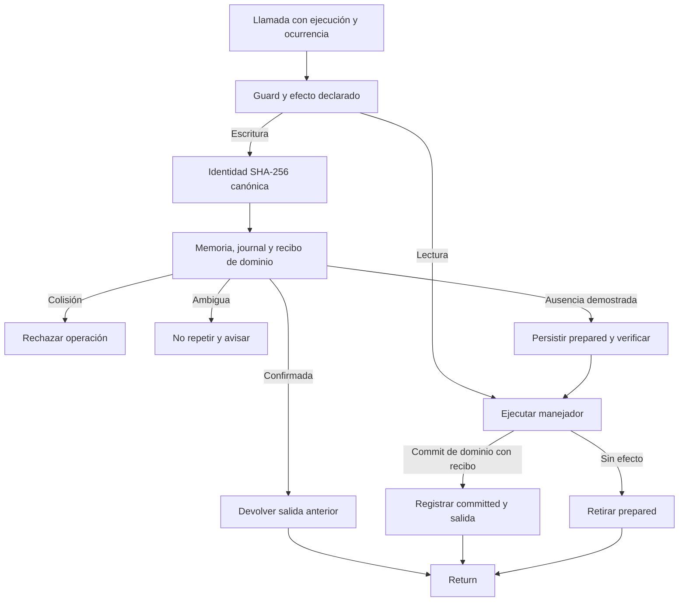

---
okf:
  version: 1
  kind: code-wiki
  status: grounded
  scope: apps/mobile/agent and chat orchestration in apps/mobile/App.tsx
type: entorno de ejecución
title: Runtime del agente y herramientas
description: Guía para interpretar una muestra de ejecución LangSmith del agente móvil sin convertirla en una tasa poblacional. Relaciona llamadas, repeticiones, latencia y tokens con los límites efectivos del loop, la política y los efectos locales.
summary: Diagnóstico de rutas, reintentos, límites, costes e idempotencia del agente móvil.
tags: [agent, runtime, tools, mobile, policy, idempotency, langsmith]
related:
  - ./provider-streaming.md
  - ./provider-configuration.md
  - ../architecture/policy-delivery.md
  - ../mobile/diet-and-food-estimation.md
  - ../operations/runtime-behavior.md
sources:
  - id: openwiki-source-192849a5973afd8b6e55db2c
    resource: repo://apps/mobile/agent/agentPolicyRuntime.test.ts
  - id: openwiki-source-0c30fc96b9e7c8b57c35473c
    resource: repo://apps/mobile/agent/agentPolicyRuntime.ts
  - id: openwiki-source-c8058179f2f675901a8caa09
    resource: repo://apps/mobile/agent/healthSafety.ts
  - id: openwiki-source-google-context-budget
    resource: repo://apps/mobile/agent/googleContextBudget.ts
  - id: openwiki-source-google-interactions-test
    resource: repo://apps/mobile/agent/googleInteractions.test.ts
  - id: openwiki-source-1120d27174dc5514893a227c
    resource: repo://apps/mobile/agent/personalData.contract.test.ts
  - id: openwiki-source-f0c2a422cec47f5791d6713d
    resource: repo://apps/mobile/agent/personalData.ts
  - id: openwiki-source-c65a19b98fa314cba98ace44
    resource: repo://apps/mobile/agent/providerPipeline.test.ts
  - id: openwiki-source-b14a4ecd65e83b5561f88e2a
    resource: repo://apps/mobile/agent/providerToolLoop.ts
  - id: openwiki-source-ce025f2f0f394ccba9235558
    resource: repo://apps/mobile/agent/toolDefinitions.ts
  - id: openwiki-source-165cffcff462003cd11223e2
    resource: repo://apps/mobile/agent/toolExecutor.test.ts
  - id: openwiki-source-d3be928c369037f29888bc0b
    resource: repo://apps/mobile/agent/toolExecutor.ts
  - id: openwiki-source-d8ad30beb46f5e7dc1ced4cf
    resource: repo://apps/mobile/agent/toolOperationLedger.test.ts
  - id: openwiki-source-9e7ddd51c09caf628a81acad
    resource: repo://apps/mobile/agent/toolOperationLedger.ts
  - id: openwiki-source-tool-operation-receipts
    resource: repo://apps/mobile/agent/toolOperationReceipts.ts
  - id: openwiki-source-929e8e1df23628a3f3848ff8
    resource: repo://apps/mobile/App.tsx
verified:
  - by: openwiki/0.5.0
    at: 2026-09-13T12:53:55.207Z
generated: { by: "openwiki/0.5.0", at: "2026-09-13T12:53:55.207Z" }
---

# Runtime del agente y herramientas

Esta página sirve para decidir **qué comprobar antes de alterar el loop móvil** a partir de una muestra de LangSmith. No describe el ensamblaje normal de middleware ni sustituye el contrato operativo de [Comportamiento en ejecución de la automatización OpenWiki](../operations/runtime-behavior.md): aquella página trata el runner privado que genera la wiki; esta trata el chat de `apps/mobile` y sus efectos locales. A la inversa, una señal del runner o de OpenWiki no debe atribuirse al agente móvil sin una traza de este proyecto.

## Cómo leer la evidencia

### Observado

No hay un dump LangSmith legible mediante las fuentes de trabajo disponibles en esta actualización. Por tanto, esta revisión **no publica conteos de llamadas, latencias, tokens, costes ni repeticiones**, ni deduce una causa de fallo. No confunda la presencia de configuración de trazado con evidencia de tráfico o métricas.

Cuando esté disponible el dump ya ingerido, registre únicamente agregados de la muestra: número de runs, llamadas por herramienta, latencia por herramienta, tokens de entrada/salida cuando estén presentes, y repeticiones por `executionId` y operación. Indique siempre ventana, filtros y denominador. Una muestra de trazas es sesgada por proveedor, entorno, usuarios, errores y muestreo; no es una tasa poblacional ni prueba causal.

### Correlacionado: límites que explican qué inspeccionar

Los siguientes hechos provienen de símbolos de código, no de LangSmith. Son el mapa para convertir una señal observada en una hipótesis comprobable:

- **Límite de rondas y coste de proveedor.** `MAX_TOOL_ROUNDS` vale 10. Cada loop ejecuta las calls de una ronda de forma secuencial y solicita otra respuesta al proveedor si quedan llamadas. Una secuencia que alcance diez rondas debe revisarse como límite del loop y como posible multiplicador de latencia/tokens, no como evidencia de que una herramienta concreta sea lenta. OpenAI también falla si necesita continuar una llamada sin `responseId`; Google rechaza IDs de llamada repetidos entre rondas. Véanse `runOpenAIToolLoop`, `runAnthropicToolLoop` y `runGoogleToolLoop`.
- **Reintentos de turno.** `sendMessage` intenta como máximo tres veces errores de transporte que coincidan con su patrón, esperando 2 y 4 segundos antes de los intentos posteriores y reiniciando el borrador. Una misma interacción de usuario puede por ello tener varias solicitudes de proveedor sin que sea una repetición de escritura; para correlacionarlas, el `executionId` transmitido al loop es el ID del mensaje de usuario.
- **Rutas que evitan o amplían tráfico.** El riesgo sanitario bloqueante evita el proveedor. Para riesgo `elevated`, el evaluador remoto solo se consulta si hay consentimiento para el proveedor; tiene un timeout de 10 s y, si falla, se conserva la decisión base. Separar esas llamadas de clasificación de las llamadas principales evita sumar su latencia o tokens al turno conversacional.
- **Historial y streaming.** OpenAI y Anthropic reciben como máximo 20 mensajes de historial. Google conserva como máximo los diez intercambios más recientes, elimina imágenes de intercambios anteriores y aplica límites de 512 KiB sin imágenes y 19 MB para la petición completa; si ni el intercambio actual cabe, rechaza localmente la petición. El cliente acumula deltas y el borrador se actualiza con una cadencia mínima de 40 ms. Así, la latencia visible no equivale necesariamente a la latencia de una herramienta ni a un único request remoto.
- **Efectos y repetición segura.** El guard bloquea tools desconocidas y las incompatibles con la decisión sanitaria antes del ejecutor. Las tools de lectura no se deduplican. Para una escritura, la identidad usa versión, `executionId`, proveedor, nombre, argumentos JSON canónicos y ocurrencia; excluye `providerCallId`. El coordinador comparte ejecuciones simultáneas y reproduce una escritura ya comprometida desde memoria o ledger. Por ello, varias calls observadas con igual operación no implican varias mutaciones locales.
- **Punto de commit.** El ejecutor solamente clasifica un resultado como `committed` si el manejador invoca `markEffectCommitted`; los errores o validaciones previos pueden volver a intentarse. Antes de una escritura, el journal persiste una entrada `prepared`; después conserva el resultado comprometido o el estado ambiguo. Las confirmadas caducan a los siete días, las no resueltas no se expulsan automáticamente y cualquier lectura no verificable bloquea el efecto.

### Hipótesis que una muestra puede priorizar

1. **Latencia elevada con muchas rondas:** comprobar `MAX_TOOL_ROUNDS`, el número de continuaciones del proveedor y la secuencialidad de las calls antes de optimizar un handler.
2. **Más de un request por mensaje:** distinguir el reintento de transporte, el evaluador sanitario consentido y las continuaciones de tools. No etiquetarlo como duplicación hasta contrastar `executionId`, proveedor, ocurrencia y `operationId`.
3. **Coste de entrada creciente:** contrastar proveedor e historial efectivo. Google aplica su propio presupuesto por intercambios y bytes y elimina imágenes antiguas; no comparte el recorte por número de mensajes de OpenAI/Anthropic.
4. **Una tool repetida con una única mutación:** verificar si el resultado fue replay del ledger o unión `inFlight`. Si fue `no_effect` o `failed_before_commit`, la repetición sí puede ejecutar de nuevo porque aún no hubo commit.
5. **Fallo de escritura sin respuesta normal:** revisar primero lectura del ledger, validación del handler y persistencia local. Una colisión o una lectura de ledger fallida están diseñadas para impedir el efecto.

Estas son hipótesis de diagnóstico, no explicaciones de una observación inexistente o de una muestra aislada.

## Invariantes para cambiar el loop

- Mantenga un único `AgentPolicyLease` inmutable por turno: une prompt, política sanitaria, contexto y estado de política. En canal `Local` procede del bundle y fuera de él una política sanitaria firmada incompatible se rechaza. No mezcle datos personales locales en el prompt: la memoria se expone mediante tools específicas.
- Al añadir una tool, declare su esquema y efecto en `AGENT_TOOL_DEFINITIONS`, mantenga el handler registrado y decida si es lectura, escritura local o externa. La clasificación de seguridad se aplica también a `nombre + argumentos`, no solo al texto inicial.
- Para una escritura, valide antes de mutar, use el almacenamiento durable apropiado y marque el commit inmediatamente después del efecto irreversible. Propague `operationId` a IDs durables cuando la entidad creada necesite resistencia adicional a duplicados.
- No cambie la composición de identidad para incluir `providerCallId`: los reintentos del proveedor cambiarían de identidad. Tampoco elimine `occurrence`, pues dos calls idénticas dentro del mismo turno deben poder distinguirse.
- Al instrumentar, no incluya contenido de prompt, argumentos personales, resultados crudos ni razonamiento. Los agregados deben permitir separar proveedor, ruta, tool y estado de commit sin convertir la observabilidad en otra superficie de datos sensibles.

## Protocolos de proveedor

Cada proveedor usa un bucle con `MAX_TOOL_ROUNDS = 10`. Las llamadas de una ronda se ejecutan secuencialmente y la ocurrencia se cuenta por pareja de nombre y argumentos canónicos. El resultado vuelve al protocolo de origen: `function_call_output` con `call_id` en OpenAI, `tool_result` con `tool_use_id` en Anthropic y `functionResponse` en Google. Los argumentos JSON malformados de OpenAI se degradan a `{}`; los manejadores de dominio, no el parser, son la frontera que decide si el resultado puede causar una escritura.

## Autorización, validación y commit local

Cada tool tiene un efecto declarado: `read`, `local_write` o `external_write`. Antes de ejecutar, `executeGuardedTool` busca ese efecto y clasifica tanto la entrada del turno como `nombre + argumentos`. Una tool desconocida o incompatible con el modo sanitario devuelve un error estructurado y no llega al ejecutor. Con riesgo elevado solo se permiten lecturas; con riesgo alto o crítico no se permiten tools.

El ejecutor detallado despacha únicamente los manejadores registrados. Convierte una tool desconocida en una respuesta controlada y captura excepciones para no abortar todo el turno: informa un fallo y diferencia `failed_before_commit` de un efecto que ya se había comprometido. Las escrituras validan sus estructuras de dominio antes de mutar. Por ejemplo, una medición inválida, una referencia de catálogo ausente o ambigua, o una rutina parcialmente irresoluble no se persisten.

`ToolExecutionContext` separa la instantánea de lectura (`store`) de `commitStore`, que persiste la mutación durable. Un manejador debe llamar a `markEffectCommitted` solo después del punto irreversible. El resultado se clasifica como `committed` únicamente si se hizo esa llamada; validación fallida y errores previos quedan como `no_effect` o `failed_before_commit` y se pueden volver a intentar. Las escrituras que crean entidades derivan identificadores estables de `operationId`, lo que añade una defensa de dominio ante una repetición.

La memoria personal tiene una frontera de forma propia: `sanitizePersonalDataFields` acepta únicamente arrays de objetos con una `key` utilizable, convierte números y booleanos a texto y descarta entradas inválidas. Es total e idempotente y conserva literalmente la clave —sin recortarla, deduplicarla ni normalizarla— porque las tools de lectura comparan claves por igualdad exacta. El saneador no es una autorización ni un mecanismo de privacidad del prompt: esa separación se mantiene porque la memoria no se concatena al prompt.

## Idempotencia de escrituras

Las lecturas no se deduplican. Para `local_write` y `external_write`, `ToolOperationCoordinator` calcula una identidad SHA-256 sobre versión, `executionId` del mensaje, proveedor, nombre, argumentos JSON canónicos y ocurrencia. El `providerCallId` no participa: un reintento del proveedor con el mismo turno puede recuperar el mismo resultado, mientras que dos llamadas idénticas del mismo turno conservan ocurrencias distintas.



*La garantía es como máximo una ejecución automática: ante una duda se sacrifica el
reintento, no se arriesga un segundo efecto.*

El coordinador une ejecuciones simultáneas con la misma identidad y mantiene en memoria
resultados comprometidos. Antes de cualquier efecto consulta el journal y el recibo del
destino; una colisión, corrupción o lectura no verificable falla cerrada. Cuando la
ausencia es segura, persiste y relee una entrada `prepared` **antes** de invocar al
manejador. Una validación sin efecto o un fallo anterior al commit retira esa entrada.

Las escrituras locales guardan un recibo mínimo —identidad, nombre de tool y fecha— en
la misma mutación durable que el dato. `LocalStoreRecoveryRepository` verifica esa
mutación para comidas, medidas y rutinas; la memoria personal usa un sobre versionado y
una cola de escrituras verificada. Si el efecto termina pero falla el registro
`committed` del journal, el coordinador consulta ese recibo y puede reconstruir el
resultado sin repetir la mutación. Un recibo ausente solo demuestra que no hubo efecto
mientras no haya podido caducar ni ser expulsado por el límite; fuera de esa ventana la
operación queda `indeterminate`.

`ToolOperationLedgerRepository` persiste el journal de esquema 2 en AsyncStorage, migra
las entradas confirmadas del esquema 1 y verifica cada escritura por relectura. Conserva
como máximo 256 entradas: las `committed` caducan a los siete días, mientras `prepared`
e `indeterminate` no se expulsan hasta reconciliarse o borrar la actividad. Si las 256
son irresolubles, una escritura nueva falla antes del efecto. Un journal corrupto ya no
se reinicia vacío. El borrado de actividad y el total incluyen journal y recibos; un
contador de generación evita que una operación que termine después del borrado vuelva a
poblar el journal.

Al hidratar, la app reconcilia las entradas sin resolver. Si el destino confirma el
efecto, las promueve a `committed`; si demuestra ausencia, las retira. Si el estado es
ambiguo, no ejecuta nada y muestra un aviso para que el usuario revise sus datos antes de
solicitar de nuevo la acción. Las trazas solo incluyen fase, estado, origen y nombre de
tool: nunca identidad, argumentos, contenido ni salida.

## Feedback como escritura externa verificable

`create_feature_issue` es `external_write`, no una llamada directa del modelo a GitHub. La definición exige mostrar al usuario el título y resumen exactos, esperar su aprobación, no copiar citas literales ni datos personales y no afirmar éxito sin referencia. El manejador sanea el borrador, invoca `submitFeedbackIssue` y solo marca el commit si el resultado discriminado es `created`.

El cliente hace `POST /feedback/issues` con exactamente cinco campos: versión de esquema,
tipo, título, resumen y `idempotency_key`. Los formularios conservan la clave corta del
borrador saneado; `create_feature_issue` usa la identidad completa de 64 hexadecimales.
Antes de enviar y cuando pierde o recibe una respuesta ambigua, consulta
`GET /feedback/issues/status` con esa identidad. Solo `created` con un número positivo y
una URL `https://github.com/` verificable confirma la operación. `pending`, servicio
inaccesible o respuesta malformada quedan como indeterminados y no causan un segundo
`POST`; una ausencia fresca permite el primer envío.

Las denuncias de respuestas IA también se forman y saneaban en el dispositivo como una vista previa limitada: motivo, detalles opcionales, pregunta previa, respuesta denunciada y metadatos técnicos. No admiten el hilo completo ni el razonamiento como superficie de envío. La recepción, retención, deduplicación de servidor y controles de abuso corresponden al [Worker de feedback](../services/feedback-worker.md).

## Guía para extender el runtime

1. **Política:** use un único `AgentPolicyLease` para prompt, guardrail y `PolicyContext` durante un turno. No añada texto local privilegiado en `sendMessage`.
2. **Nueva tool:** añada definición, esquema, efecto y manejador juntos. `CHAT_TOOLS` se deriva del catálogo y las pruebas comprueban que catálogo y ejecutor declaren exactamente los mismos nombres.
3. **Escritura:** valide todo antes de mutar, persista `prepared` antes del efecto y guarde
   el recibo de `operationId` en la misma transacción o escritura durable que el dato. Un
   error que pueda haber ocurrido después del commit debe clasificarse como
   `indeterminate`, nunca como fallo reintentable.
4. **Reintentos:** preserve `executionId`, argumentos canónicos y ocurrencia al cambiar parsers o adaptadores. No use el identificador de llamada del proveedor como identidad persistente.
5. **Privacidad y feedback:** no convierta memoria personal en prompt, no envíe conversaciones o razonamiento en reportes, y no comunique una incidencia como creada sin su referencia verificable.

## Pruebas focalizadas

Ejecute estas pruebas desde la raíz al modificar estas fronteras:

```bash
npx vitest run --config apps/mobile/vitest.config.mts apps/mobile/agent/agentPolicyRuntime.test.ts apps/mobile/agent/providerToolClient.test.ts apps/mobile/agent/providerToolLoop.test.ts apps/mobile/agent/toolDefinitions.test.ts apps/mobile/agent/toolExecutor.test.ts apps/mobile/agent/toolOperationLedger.test.ts
```

Las pruebas de lease cubren inmutabilidad y selección de política. Las de bucle y pipeline
reproducen SSE fragmentado y verifican las correlaciones nativas, truncamiento de
Anthropic y continuación de los tres proveedores. Las de definiciones y ejecutor
mantienen alineados catálogo, esquema y manejadores, y prueban que no se confirma una
escritura sin persistencia. Las del journal cubren identidad canónica, write-ahead,
reinicio en cada frontera de crash, unión concurrente, colisiones, corrupción, límites,
retención de ambiguas y borrado durante una operación. Las de recibos cubren caducidad y
expulsión segura. Las de datos personales prueban migración del sobre y preservación de
recibos; las de feedback prueban reconciliación de estado sin éxito falso.
Las pruebas del presupuesto de Google fijan además el recorte por intercambios y bytes,
la eliminación de imágenes antiguas y el rechazo local de la petición actual cuando no
cabe. Úselas junto con las trazas: prueban contratos locales, pero no miden disponibilidad,
latencia ni coste de proveedores remotos.
