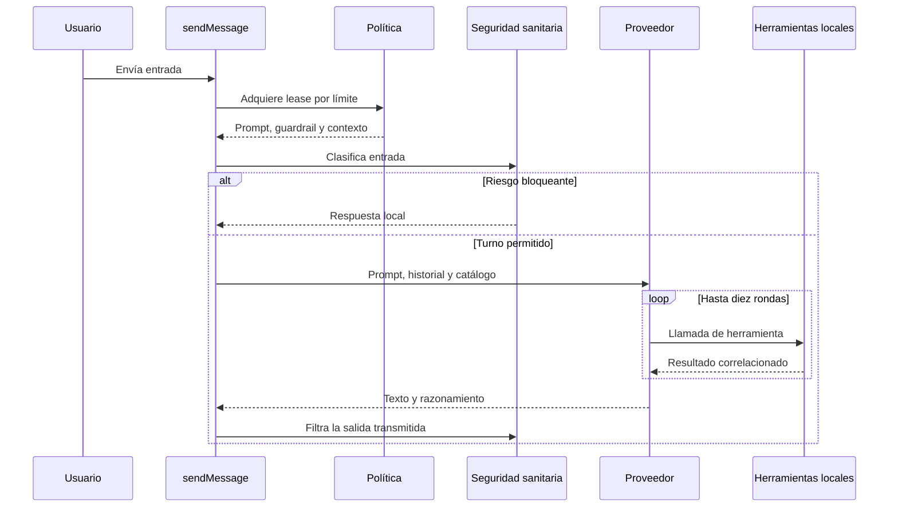
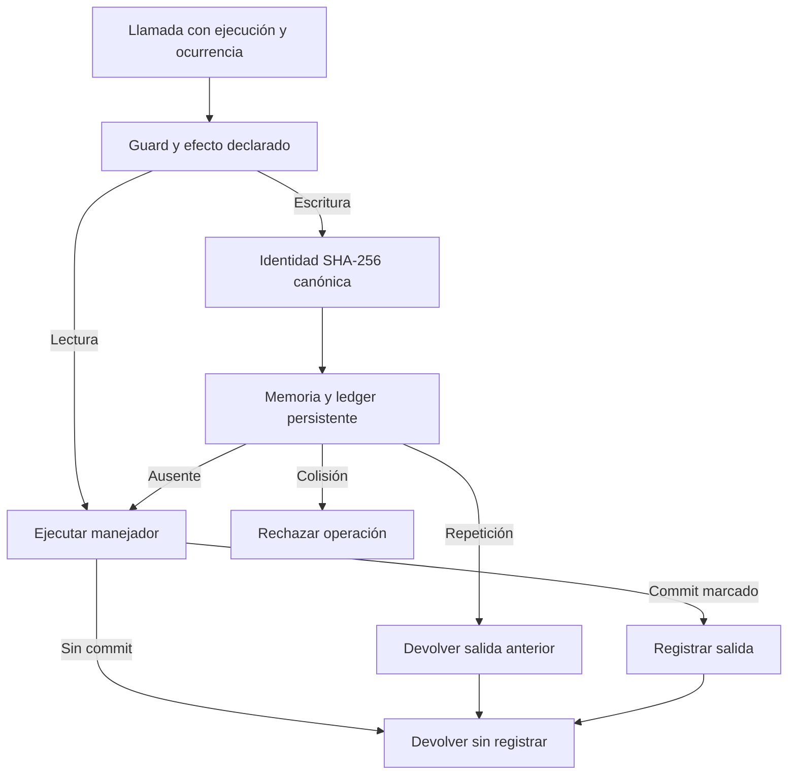

---
okf:
  version: 1
  kind: code-wiki
  status: grounded
  scope: apps/mobile/agent and chat orchestration in apps/mobile/App.tsx
type: entorno de ejecución
title: Runtime del agente y herramientas
description: Cómo el chat móvil fija la política de un turno, transmite al proveedor y ejecuta herramientas locales con validación, commit explícito e idempotencia persistente. Incluye los límites de privacidad, degradación y confirmación de efectos.
summary: Contratos de chat, política, herramientas, persistencia y reintentos del agente móvil.
tags: [agent, chat, tools, runtime, mobile, policy, idempotency, feedback]
related:
  - ./provider-streaming.md
  - ./provider-configuration.md
  - ../architecture/policy-delivery.md
  - ../mobile/diet-and-food-estimation.md
  - ../mobile/training.md
  - ../services/feedback-worker.md
  - ../operations/runtime-behavior.md
sources:
  - id: openwiki-source-192849a5973afd8b6e55db2c
    resource: repo://apps/mobile/agent/agentPolicyRuntime.test.ts
  - id: openwiki-source-0c30fc96b9e7c8b57c35473c
    resource: repo://apps/mobile/agent/agentPolicyRuntime.ts
  - id: openwiki-source-742e2ba85404d0ff40adc087
    resource: repo://apps/mobile/agent/feedbackClient.ts
  - id: openwiki-source-8105d33ba3952fea055f8d50
    resource: repo://apps/mobile/agent/feedbackIssues.ts
  - id: openwiki-source-7c7e6958947eb5cdbed74d47
    resource: repo://apps/mobile/agent/feedbackPipeline.test.ts
  - id: openwiki-source-c8058179f2f675901a8caa09
    resource: repo://apps/mobile/agent/healthSafety.ts
  - id: openwiki-source-1120d27174dc5514893a227c
    resource: repo://apps/mobile/agent/personalData.contract.test.ts
  - id: openwiki-source-f0c2a422cec47f5791d6713d
    resource: repo://apps/mobile/agent/personalData.ts
  - id: openwiki-source-c65a19b98fa314cba98ace44
    resource: repo://apps/mobile/agent/providerPipeline.test.ts
  - id: openwiki-source-6b9b666faa646a8fd83706ea
    resource: repo://apps/mobile/agent/providerStreamParsers.ts
  - id: openwiki-source-b14a4ecd65e83b5561f88e2a
    resource: repo://apps/mobile/agent/providerToolLoop.ts
  - id: openwiki-source-ce025f2f0f394ccba9235558
    resource: repo://apps/mobile/agent/toolDefinitions.ts
  - id: openwiki-source-165cffcff462003cd11223e2
    resource: repo://apps/mobile/agent/toolExecutor.test.ts
  - id: openwiki-source-d3be928c369037f29888bc0b
    resource: repo://apps/mobile/agent/toolExecutor.ts
  - id: openwiki-source-d8ad30beb46f5e7dc1ced4cf
    resource: repo://apps/mobile/agent/toolOperationLedger.test.ts
  - id: openwiki-source-9e7ddd51c09caf628a81acad
    resource: repo://apps/mobile/agent/toolOperationLedger.ts
  - id: openwiki-source-929e8e1df23628a3f3848ff8
    resource: repo://apps/mobile/App.tsx
generated: { by: "openwiki/0.5.0", at: "2026-09-12T11:47:11.882Z" }
verified:
  - by: openwiki/0.5.0
    at: 2026-09-12T11:47:11.882Z
---

# Runtime del agente y herramientas

El agente se ejecuta en el proceso de la aplicación móvil. `sendMessage` en `apps/mobile/App.tsx` es el orquestador del chat: fija la política del turno, decide si la entrada puede llegar a un proveedor, mantiene el borrador visible durante el streaming y delega las llamadas de herramientas al ejecutor local. `callProviderChatAPIWithTools` adapta ese contrato a OpenAI, Anthropic y Google.

La configuración de credenciales y proveedor se trata en [Configuración del proveedor](./provider-configuration.md), y los dialectos SSE en [Streaming del proveedor](./provider-streaming.md). Este documento se centra en el contrato de ejecución: el proveedor produce texto y peticiones de tools, pero la aplicación conserva la autoridad sobre la política, los datos locales, los efectos y su confirmación.

## Turno de chat: política, streaming y recuperación

Antes de cada envío, `sendMessage` requiere un hilo activo, texto no vacío, un proveedor activo y una API key no vacía. Determina el límite `new-conversation` o `turn` según si ya existe un mensaje de usuario y adquiere un `AgentPolicyLease`. El lease es la unidad inmutable de la petición: reúne el prompt, la política sanitaria, `PolicyContext` y el estado de política. En el canal `Local` procede del bundle; en otros canales se resuelve desde una política firmada y se rechaza si la combinación con la política sanitaria integrada no cumple el contrato móvil.

El prompt de la petición procede exclusivamente de `policyLease.prompt`. La memoria personal local **no** se lee ni se concatena al prompt. Esos datos solo se exponen al modelo mediante las tools de lectura específicas; incluso un campo llamado `debug` es un dato ordinario, no una instrucción privilegiada. La traza del envío registra metadatos y longitud del prompt, no su contenido.



*El lease y el filtro sanitario gobiernan todo el turno; una llamada del proveedor nunca autoriza por sí misma un efecto local.*

La clasificación sanitaria bloquea directamente los riesgos `high` y `critical`, persiste el mensaje del usuario junto a una respuesta local y evita el proveedor. Para riesgo `elevated`, puede solicitar consentimiento antes de consultar el evaluador del proveedor; sin consentimiento conserva la decisión determinista. Un borrador del asistente se crea solo después de superar ese punto, con `is_streaming`, contexto de política y origen/modelo para reporte. El historial excluye mensajes locales de divulgación; OpenAI y Anthropic reciben los últimos 20, mientras que Google recibe el historial local completo para conservar sus firmas de pensamiento opacas.

Los deltas actualizan el borrador, agrupados cada 40 ms. Un `HealthSafeStreamGate` inspecciona el agregado antes de hacerlo visible: si la entrada ya tenía riesgo distinto de `none`, retiene todo el texto hasta el cierre; en otro caso solo libera segmentos terminados que siguen limpios. Al finalizar vuelve a clasificar el contenido completo. Una intervención sanitaria reemplaza el texto del modelo, elimina el razonamiento y marca el origen; de otro modo se materializan contenido y razonamiento y se desactiva `is_streaming`.

La llamada completa puede intentarse hasta tres veces. Solo errores que coinciden con red, timeout, sobrecarga, `529`, `503` o `429` se reintentan, esperando 2 y 4 segundos; cada nuevo intento reinicia el borrador y el guard de streaming. Un fallo no recuperable o el agotamiento convierte el mismo borrador en `technical_error` con el prefijo `Error de proveedor:` y siempre libera `sendingChat`. Este reintento de transporte no es una garantía de exactamente una vez: las escrituras se protegen independientemente.

## Proveedor y bucle de herramientas

El adaptador separa los mensajes de sistema de la conversación y pasa el prompt por `composeAiSystemPrompt`, que incorpora la divulgación local de IA. Anuncia `CHAT_TOOLS`, una proyección por proveedor del catálogo canónico `AGENT_TOOL_DEFINITIONS`; así definición, efecto y esquema no se duplican por adaptador.

Los parsers SSE reconstruyen contenido, razonamiento y llamadas de tools desde fragmentos de red. Los eventos de error se propagan como errores controlados. Para Anthropic, la falta de `message_stop` significa que el stream quedó truncado, por lo que no debe presentarse como una respuesta completa. OpenAI exige un `responseId` para continuar una ronda que contiene una llamada; una respuesta final sin contenido produce un error explícito en vez de una recuperación inventada.

Cada proveedor usa un bucle con `MAX_TOOL_ROUNDS = 10`. Las llamadas de una ronda se ejecutan secuencialmente y la ocurrencia se cuenta por pareja de nombre y argumentos canónicos. El resultado vuelve al protocolo de origen: `function_call_output` con `call_id` en OpenAI, `tool_result` con `tool_use_id` en Anthropic y `functionResponse` en Google. Los argumentos JSON malformados de OpenAI se degradan a `{}`; los manejadores de dominio, no el parser, son la frontera que decide si el resultado puede causar una escritura.

## Autorización, validación y commit local

Cada tool tiene un efecto declarado: `read`, `local_write` o `external_write`. Antes de ejecutar, `executeGuardedTool` busca ese efecto y clasifica tanto la entrada del turno como `nombre + argumentos`. Una tool desconocida o incompatible con el modo sanitario devuelve un error estructurado y no llega al ejecutor. Con riesgo elevado solo se permiten lecturas; con riesgo alto o crítico no se permiten tools.

El ejecutor detallado despacha únicamente los manejadores registrados. Convierte una tool desconocida en una respuesta controlada y captura excepciones para no abortar todo el turno: informa un fallo y diferencia `failed_before_commit` de un efecto que ya se había comprometido. Las escrituras validan sus estructuras de dominio antes de mutar. Por ejemplo, una medición inválida, una referencia de catálogo ausente o ambigua, o una rutina parcialmente irresoluble no se persisten.

`ToolExecutionContext` separa la instantánea de lectura (`store`) de `commitStore`, que persiste la mutación durable. Un manejador debe llamar a `markEffectCommitted` solo después del punto irreversible. El resultado se clasifica como `committed` únicamente si se hizo esa llamada; validación fallida y errores previos quedan como `no_effect` o `failed_before_commit` y se pueden volver a intentar. Las escrituras que crean entidades derivan identificadores estables de `operationId`, lo que añade una defensa de dominio ante una repetición.

La memoria personal tiene una frontera de forma propia: `sanitizePersonalDataFields` acepta únicamente arrays de objetos con una `key` utilizable, convierte números y booleanos a texto y descarta entradas inválidas. Es total e idempotente y conserva literalmente la clave —sin recortarla, deduplicarla ni normalizarla— porque las tools de lectura comparan claves por igualdad exacta. El saneador no es una autorización ni un mecanismo de privacidad del prompt: esa separación se mantiene porque la memoria no se concatena al prompt.

## Idempotencia de escrituras

Las lecturas no se deduplican. Para `local_write` y `external_write`, `ToolOperationCoordinator` calcula una identidad SHA-256 sobre versión, `executionId` del mensaje, proveedor, nombre, argumentos JSON canónicos y ocurrencia. El `providerCallId` no participa: un reintento del proveedor con el mismo turno puede recuperar el mismo resultado, mientras que dos llamadas idénticas del mismo turno conservan ocurrencias distintas.



*Solo una escritura que confirma el commit entra en el ledger y puede reproducirse sin repetir su efecto.*

El coordinador une ejecuciones simultáneas con la misma identidad, consulta primero el ledger y mantiene en memoria resultados comprometidos. Una colisión de huella falla cerrada. Si no puede leer el ledger, propaga el fallo antes de ejecutar la escritura; así prioriza no duplicar un efecto frente a disponibilidad. Si el registro posterior falla, devuelve el efecto ya comprometido y deja traza: la operación no se revierte, pero la deduplicación tras reinicio deja de estar garantizada.

`ToolOperationLedgerRepository` persiste el ledger en AsyncStorage, conserva un máximo de 256 entradas y expira cada una a los siete días. Solo guarda resultados `committed`; no memoriza validaciones fallidas ni errores anteriores al commit. Un ledger corrupto se reinicia vacío con traza. El borrado total de datos incluye `toolOperationCoordinator.clear()` y verifica la clave de AsyncStorage; un contador de generación evita que una operación que termine después del borrado vuelva a poblarlo.

## Feedback como escritura externa verificable

`create_feature_issue` es `external_write`, no una llamada directa del modelo a GitHub. La definición exige mostrar al usuario el título y resumen exactos, esperar su aprobación, no copiar citas literales ni datos personales y no afirmar éxito sin referencia. El manejador sanea el borrador, invoca `submitFeedbackIssue` y solo marca el commit si el resultado discriminado es `created`.

El cliente hace `POST /feedback/issues` con exactamente cinco campos: versión de esquema, tipo, título, resumen y `idempotency_key`, estable para el borrador saneado. Tiene timeout de 15 s y mapea transporte, timeout, 4xx, 429, 503 y 5xx a resultados explícitos. Incluso un 2xx se considera error si no contiene un número positivo y una URL `https://github.com/` verificables. Por ello, un canal fallido o una respuesta malformada no puede transformarse en una confirmación falsa para el modelo.

Las denuncias de respuestas IA también se forman y saneaban en el dispositivo como una vista previa limitada: motivo, detalles opcionales, pregunta previa, respuesta denunciada y metadatos técnicos. No admiten el hilo completo ni el razonamiento como superficie de envío. La recepción, retención, deduplicación de servidor y controles de abuso corresponden al [Worker de feedback](../services/feedback-worker.md).

## Guía para extender el runtime

1. **Política:** use un único `AgentPolicyLease` para prompt, guardrail y `PolicyContext` durante un turno. No añada texto local privilegiado en `sendMessage`.
2. **Nueva tool:** añada definición, esquema, efecto y manejador juntos. `CHAT_TOOLS` se deriva del catálogo y las pruebas comprueban que catálogo y ejecutor declaren exactamente los mismos nombres.
3. **Escritura:** valide todo antes de mutar, use `commitStore` cuando requiera durabilidad y llame a `markEffectCommitted` inmediatamente después del efecto irreversible. Propague `operationId` a IDs durables cuando una repetición de dominio pueda crear duplicados.
4. **Reintentos:** preserve `executionId`, argumentos canónicos y ocurrencia al cambiar parsers o adaptadores. No use el identificador de llamada del proveedor como identidad persistente.
5. **Privacidad y feedback:** no convierta memoria personal en prompt, no envíe conversaciones o razonamiento en reportes, y no comunique una incidencia como creada sin su referencia verificable.

## Pruebas focalizadas

Ejecute estas pruebas desde la raíz al modificar estas fronteras:

```bash
npx vitest run --config apps/mobile/vitest.config.mts apps/mobile/agent/agentPolicyRuntime.test.ts apps/mobile/agent/personalData.test.ts apps/mobile/agent/personalData.contract.test.ts
npx vitest run --config apps/mobile/vitest.config.mts apps/mobile/agent/providerToolLoop.test.ts apps/mobile/agent/providerPipeline.test.ts apps/mobile/agent/toolDefinitions.test.ts apps/mobile/agent/toolExecutor.test.ts apps/mobile/agent/toolOperationLedger.test.ts
npx vitest run --config apps/mobile/vitest.config.mts apps/mobile/agent/feedbackPipeline.test.ts apps/mobile/agent/feedbackClient.test.ts apps/mobile/agent/feedbackIssues.test.ts
```

Las pruebas de lease cubren inmutabilidad y selección de política. Las de bucle y pipeline reproducen SSE fragmentado y verifican las correlaciones nativas, truncamiento de Anthropic y continuación de los tres proveedores. Las de definiciones y ejecutor mantienen alineados catálogo, esquema y manejadores, y prueban que no se confirma una escritura sin persistencia. Las del ledger cubren identidad canónica, replay tras reinicio, unión concurrente, colisiones, fallos de lectura, límites y borrado durante una operación. Las de datos personales prueban higiene de forma e imposibilidad de inyectar memoria en el prompt; las de feedback prueban que no existe éxito sin referencia verificable.
