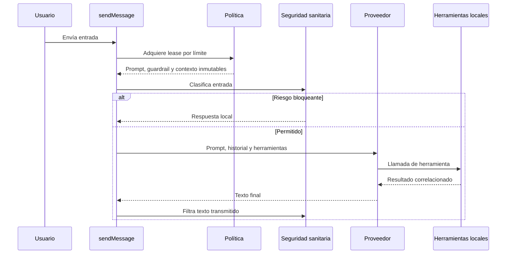
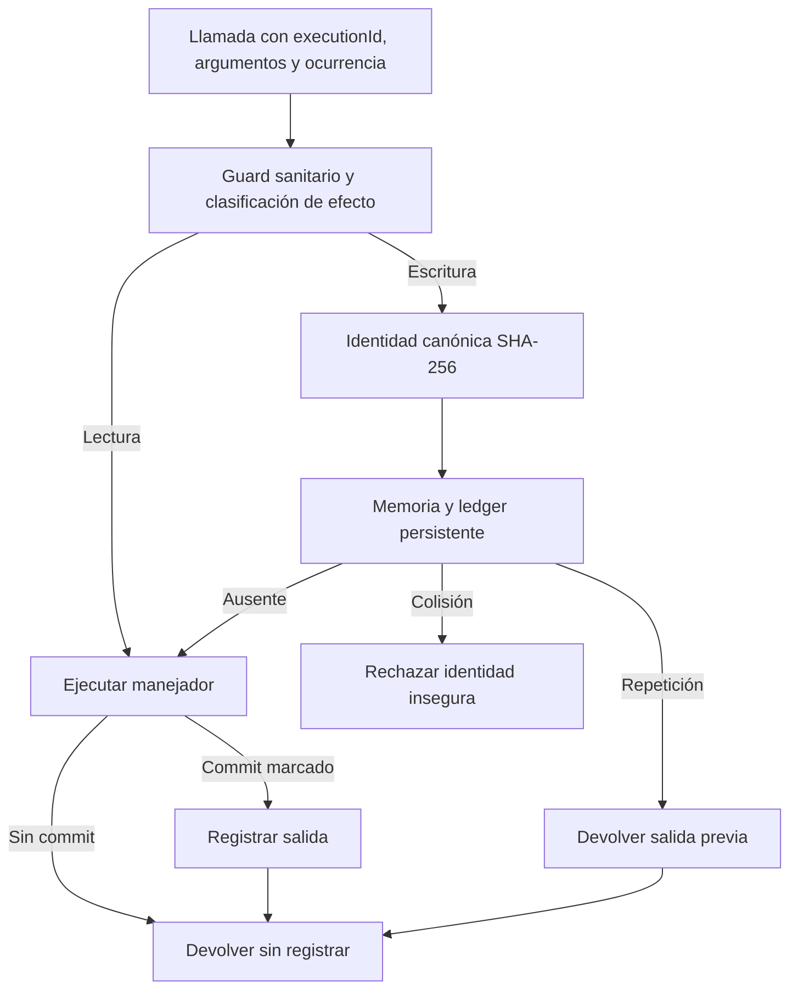

---
okf:
  version: 1
  kind: code-wiki
  status: grounded
  scope: apps/mobile/agent and chat orchestration in apps/mobile/App.tsx
type: entorno de ejecución
title: Entorno de ejecución del agente
description: Contrato del chat móvil para leases de política inmutables, streaming y herramientas con efectos deduplicados. Describe el circuito verificable de feedback y los límites de estado y reintento que deben preservarse.
summary: Contratos de chat, política, herramientas, persistencia y reintentos del agente móvil.
tags: [agent, chat, tools, runtime, mobile, policy, idempotency, feedback]
related:
  - ./provider-streaming.md
  - ./provider-configuration.md
  - ../mobile/local-state-and-backup.md
  - ../mobile/diet-and-food-estimation.md
  - ../mobile/measurements.md
verified:
  - by: openwiki/0.4.3
    at: 2026-09-06T10:32:53.606Z
sources:
  - id: openwiki-source-192849a5973afd8b6e55db2c
    resource: repo://apps/mobile/agent/agentPolicyRuntime.test.ts
  - id: openwiki-source-0c30fc96b9e7c8b57c35473c
    resource: repo://apps/mobile/agent/agentPolicyRuntime.ts
  - id: openwiki-source-742e2ba85404d0ff40adc087
    resource: repo://apps/mobile/agent/feedbackClient.ts
  - id: openwiki-source-8105d33ba3952fea055f8d50
    resource: repo://apps/mobile/agent/feedbackIssues.ts
  - id: openwiki-source-7c7e6958947eb5cdbed74d47
    resource: repo://apps/mobile/agent/feedbackPipeline.test.ts
  - id: openwiki-source-c65a19b98fa314cba98ace44
    resource: repo://apps/mobile/agent/providerPipeline.test.ts
  - id: openwiki-source-6b9b666faa646a8fd83706ea
    resource: repo://apps/mobile/agent/providerStreamParsers.ts
  - id: openwiki-source-b14a4ecd65e83b5561f88e2a
    resource: repo://apps/mobile/agent/providerToolLoop.ts
  - id: openwiki-source-ce025f2f0f394ccba9235558
    resource: repo://apps/mobile/agent/toolDefinitions.ts
  - id: openwiki-source-d3be928c369037f29888bc0b
    resource: repo://apps/mobile/agent/toolExecutor.ts
  - id: openwiki-source-d8ad30beb46f5e7dc1ced4cf
    resource: repo://apps/mobile/agent/toolOperationLedger.test.ts
  - id: openwiki-source-9e7ddd51c09caf628a81acad
    resource: repo://apps/mobile/agent/toolOperationLedger.ts
  - id: openwiki-source-929e8e1df23628a3f3848ff8
    resource: repo://apps/mobile/App.tsx
generated: { by: "openwiki/0.4.3", at: "2026-09-06T10:32:53.606Z" }
---

# Entorno de ejecución del agente

El agente se ejecuta en el proceso de la aplicación móvil. `App.tsx::sendMessage` coordina el chat principal: adquiere una política para el límite de conversación, aplica el filtro sanitario, persiste un borrador del asistente y transmite la solicitud al proveedor. `callProviderChatAPIWithTools` adapta el mismo contrato de herramientas a OpenAI, Anthropic y Google; el bucle del proveedor vuelve a llamar al ejecutor local hasta obtener un turno sin herramientas. No trate texto de chat, argumentos de herramientas ni respuestas de red como evidencia fiable por sí mismos.

La selección de proveedor y credenciales BYOK se documentan en [Configuración del proveedor](./provider-configuration.md). Los formatos de streaming se detallan en [Streaming del proveedor](./provider-streaming.md). El endpoint de incidencias y su retención son responsabilidad del [Worker de feedback](../services/feedback-worker.md), no del chat.

## Lease de política: unidad inmutable de una petición

Antes de enviar el primer turno de una conversación o un turno posterior, las superficies de chat adquieren `AgentPolicyLease` con el límite `new-conversation` o `turn`. El lease une en un mismo objeto inmutable el prompt, la política sanitaria, la atribución (`PolicyContext`) y el estado de ejecución de la política. En canal `Local` procede del bundle; en otros canales se resuelve mediante la política firmada. La política sanitaria firmada se combina con la política sanitaria integrada y se rechaza si no cumple el contrato móvil.

El chat principal conserva el `policy_context` del lease en el mensaje de respuesta —incluida una intervención sanitaria— y usa el mismo lease para clasificar la entrada, vigilar la respuesta en streaming y construir el prompt. El prompt enviado procede de `policyLease.prompt`; la ruta ya no lee ni anexa memoria personal local, por lo que no hay una sobrescritura local de prompt en esta petición.



*El lease fija la política que gobierna una petición completa; el proveedor solo se contacta cuando el filtro de entrada lo permite.*

## Ciclo del chat y estados observables

`sendMessage` no inicia nada sin hilo activo, entrada no vacía, proveedor activo y clave no vacía. Tras adquirir el lease y superar el bloqueo sanitario, agrega el mensaje del usuario y un borrador del asistente marcado `is_streaming`, limita el historial a los últimos 20 mensajes no locales de divulgación y agrupa las actualizaciones visibles del borrador cada 40 ms. El contenido final pasa por el filtro sanitario de streaming: una intervención sustituye la respuesta del modelo y se identifica como tal; de lo contrario se materializan contenido y razonamiento y se desactiva `is_streaming`.

Un fallo final convierte el mismo borrador en `technical_error` con el prefijo `Error de proveedor:` y limpia `sendingChat`. La llamada completa al proveedor se intenta como máximo tres veces; solo los errores de red, timeout, sobrecarga y códigos transitorios incluidos en el patrón de reintento vuelven a intentarse, con esperas de 2 s y 4 s. Cada intento reinicia el borrador y el guard de streaming. Esta política no hace que la red sea exactamente una vez: los efectos se protegen aparte mediante el ledger.

Las superficies de estimación de comida y el asistente de alimentos personales también adquieren un lease y adjuntan su contexto a sus mensajes; no son copias históricas de la política del chat principal.

## Proveedores, parser y continuación de herramientas

`callProviderChatAPIWithTools` separa mensajes de sistema y mensajes conversacionales, compone el prompt de transparencia local y anuncia `CHAT_TOOLS`, derivado del catálogo único `AGENT_TOOL_DEFINITIONS`. Los parsers SSE reconstruyen texto, razonamiento y llamadas desde fragmentos de red. En Anthropic, la ausencia de `message_stop` marca el turno como truncado; los eventos de error de los tres proveedores se propagan como error controlado.

Los tres bucles comparten `MAX_TOOL_ROUNDS = 10`, ejecutan las llamadas de un turno **secuencialmente** y mantienen una ocurrencia por la pareja nombre/argumentos canónicos. Cada proveedor devuelve el resultado con su correlación nativa: `function_call_output` y `call_id` en OpenAI, `tool_result` y `tool_use_id` en Anthropic, y `functionResponse` en Google. OpenAI exige `responseId` antes de continuar. Al alcanzar el máximo, el bucle devuelve el último turno; si este no contiene texto, el adaptador termina con error de contenido, no con una recuperación implícita.

Los argumentos malformados de OpenAI y Google se degradan a `{}` en el parser. Aunque existe `validateToolInput`, la ruta de producción delega en los validadores y manejadores específicos del dominio; un cambio que quiera aplicar esa validación genérica debe definir el resultado que verá el modelo y probar la incompatibilidad resultante.

## Herramientas: efectos, commit y deduplicación

Cada herramienta canónica declara un efecto: `read`, `local_write` o `external_write`. `executeGuardedTool` clasifica también el nombre y los argumentos con la política sanitaria: una herramienta desconocida o no permitida no llega al efecto. Las lecturas no se deduplican. Las escrituras pasan por el coordinador global `ToolOperationCoordinator`; el ejecutor detallado solo las considera comprometidas si el manejador llama a `markEffectCommitted`.

La identidad de una operación se calcula con SHA-256 sobre versión, `executionId` del mensaje, proveedor, nombre, argumentos JSON canónicos y ocurrencia. El identificador del proveedor no participa, de modo que una repetición del proveedor con los mismos argumentos puede recuperar el mismo resultado, mientras que dos llamadas iguales del mismo turno tienen ocurrencias distintas. El coordinador une ejecuciones simultáneas, devuelve resultados comprometidos desde memoria y consulta un ledger persistente antes de ejecutar un efecto. Una colisión de identidad falla cerrada y una lectura del ledger que falla impide ejecutar la escritura.

El ledger se almacena en AsyncStorage, conserva como máximo 256 entradas y caduca operaciones a los siete días. Solo registra resultados `committed`: una validación sin efecto o un fallo antes de `markEffectCommitted` puede volver a ejecutarse. Si la persistencia posterior del ledger falla, el efecto ya comprometido se devuelve y se deja traza, por lo que la deduplicación tras reinicio deja de estar garantizada. Al borrar todos los datos, la aplicación también borra y verifica el ledger; una operación que termina después de `clear()` no lo repuebla.



*Solo una escritura que ha señalado su commit entra en el ledger y puede reproducirse sin repetir el efecto.*

Los manejadores viven en `toolExecutor.ts` y acceden a memoria personal, mediciones, dieta, catálogos, rutinas y feedback mediante dependencias inyectadas. `ToolExecutionContext` separa una instantánea de lectura del `store` de `commitStore`, que realiza la mutación durable; por ello, un manejador nuevo debe decidir explícitamente qué fuente es autorizada y cuándo marca el commit. El ejecutor convierte excepciones del manejador en un resultado para el modelo: si el efecto ya se comprometió conserva el estado `committed`; si no, devuelve `failed_before_commit` para que un reintento sea posible.

## Feedback verificable

`create_feature_issue` es una escritura externa, no una llamada directa a GitHub. Su definición exige que el modelo muestre y obtenga aprobación del título y resumen antes de invocarla, no copie citas literales ni datos personales y no afirme éxito sin número de referencia. El manejador sanea el borrador y pasa el resultado discriminado de `submitFeedbackIssue` a `describeOutcomeForModel`; solo la variante `created` comunica una incidencia registrada.

El cliente `createFeedbackIssueClient` hace `POST /feedback/issues` con exactamente cinco campos: versión de esquema, tipo, título, resumen y `idempotency_key`. La clave es estable para el borrador saneado. El cliente tiene timeout de 15 s y traduce transportes, timeout, 4xx, 429, 503 y 5xx a resultados explícitos. Incluso un 2xx es error si no contiene un número positivo y una URL `https://github.com/` verificables. Así, una respuesta no verificable o un fallo del canal no puede convertirse en una confirmación falsa para el modelo.

El formateador de denuncias sanea caracteres de control y patrones de secretos en el dispositivo, limita el contenido y genera solo la vista previa que el usuario denuncia: motivo, detalles opcionales, pregunta anterior, respuesta denunciada y metadatos técnicos. No acepta el hilo completo ni el razonamiento como superficie de envío. El Worker vuelve a validar, decide repositorio y etiquetas y deduplica del lado servidor; consulte su página para límites de abuso, retención y operación.

## Límites seguros para cambios

1. **Política:** mantenga prompt, guardrail y `PolicyContext` procedentes del mismo `AgentPolicyLease` durante una petición. No introduzca fuentes locales de texto privilegiado en `sendMessage`.
2. **Herramientas:** añada definición, efecto y manejador juntos; `CHAT_TOOLS` se deriva del catálogo. Para una escritura, coloque `markEffectCommitted` inmediatamente después del punto irreversible y propague `operationId` a identificadores durables si el dominio lo necesita.
3. **Reintentos:** no suponga que los tres intentos del chat o una repetición de proveedor son únicos. Preserve `executionId`, argumentos canónicos y ocurrencia cuando cambie los adaptadores o bucles.
4. **Persistencia:** no convierta un resultado sin efecto o fallido antes del commit en una entrada del ledger. Mantenga sus límites de 7 días y 256 entradas, y conecte cualquier borrado total a `toolOperationCoordinator.clear()`.
5. **Feedback:** conserve el esquema cerrado, el saneado previo y la confirmación basada en referencia verificable. No envíe conversaciones ni razonamiento y no añada claves o destinos decididos por el cliente.

## Pruebas focalizadas

Ejecute estas pruebas desde la raíz al tocar estas fronteras:

```bash
npx vitest run --config apps/mobile/vitest.config.mts apps/mobile/agent/agentPolicyRuntime.test.ts apps/mobile/agent/toolOperationLedger.test.ts
npx vitest run --config apps/mobile/vitest.config.mts apps/mobile/agent/providerPipeline.test.ts apps/mobile/agent/feedbackPipeline.test.ts apps/mobile/agent/feedbackClient.test.ts apps/mobile/agent/feedbackIssues.test.ts
```

`agentPolicyRuntime.test.ts` prueba que un lease firmado congela prompt, guardrail y atribución del mismo bundle. `toolOperationLedger.test.ts` cubre identidad canónica, replay tras reinicio, unión concurrente, no registro antes de commit, límites, corrupción, fallo de lectura y borrado durante una operación. `providerPipeline.test.ts` recorre fixtures SSE fragmentadas para los tres proveedores y prueba correlación, orden y truncamiento de Anthropic. `feedbackPipeline.test.ts` recorre parser, bucle, ejecutor y cliente HTTP para demostrar que el modelo solo recibe éxito con una referencia verificable; las pruebas de cliente y dominio cubren mapeo HTTP, saneado e idempotencia.
