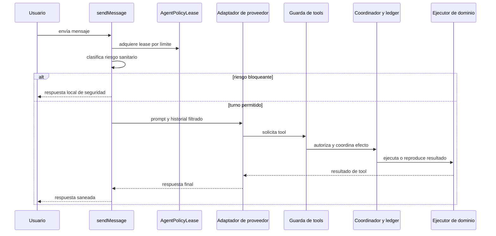
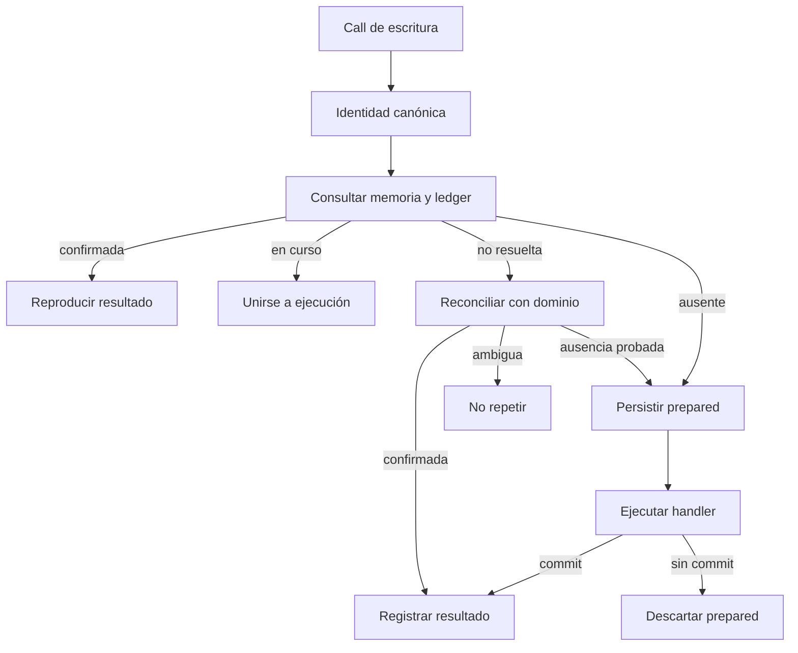

---
okf:
  version: 1
  kind: code-wiki
  status: grounded
  scope: apps/mobile/agent and chat orchestration in apps/mobile/App.tsx
type: runtime de agente
title: Runtime del agente y herramientas
description: Contrato ejecutable del turno de chat móvil, sus guardas sanitarias, los bucles de proveedor y la idempotencia de efectos locales o externos.
summary: Política por turno, ejecución de tools, commit, reconciliación e idempotencia.
tags: [agent, runtime, tools, mobile, policy, idempotency]
related:
  - ./provider-streaming.md
  - ./provider-configuration.md
  - ../mobile/diet-and-food-estimation.md
  - ../mobile/measurements.md
  - ../operations/runtime-behavior.md
  - ../services/feedback-worker.md
verified:
  - by: openwiki/0.5.0
    at: 2026-09-15T14:17:12.687Z
sources:
  - id: openwiki-source-192849a5973afd8b6e55db2c
    resource: repo://apps/mobile/agent/agentPolicyRuntime.test.ts
  - id: openwiki-source-0c30fc96b9e7c8b57c35473c
    resource: repo://apps/mobile/agent/agentPolicyRuntime.ts
  - id: openwiki-source-c8058179f2f675901a8caa09
    resource: repo://apps/mobile/agent/healthSafety.ts
  - id: openwiki-source-1120d27174dc5514893a227c
    resource: repo://apps/mobile/agent/personalData.contract.test.ts
  - id: openwiki-source-f0c2a422cec47f5791d6713d
    resource: repo://apps/mobile/agent/personalData.ts
  - id: openwiki-source-c65a19b98fa314cba98ace44
    resource: repo://apps/mobile/agent/providerPipeline.test.ts
  - id: openwiki-source-592c302a01c2b134e66ce8f9
    resource: repo://apps/mobile/agent/providerToolLoop.test.ts
  - id: openwiki-source-b14a4ecd65e83b5561f88e2a
    resource: repo://apps/mobile/agent/providerToolLoop.ts
  - id: openwiki-source-ce025f2f0f394ccba9235558
    resource: repo://apps/mobile/agent/toolDefinitions.ts
  - id: openwiki-source-d3be928c369037f29888bc0b
    resource: repo://apps/mobile/agent/toolExecutor.ts
  - id: openwiki-source-d8ad30beb46f5e7dc1ced4cf
    resource: repo://apps/mobile/agent/toolOperationLedger.test.ts
  - id: openwiki-source-9e7ddd51c09caf628a81acad
    resource: repo://apps/mobile/agent/toolOperationLedger.ts
  - id: openwiki-source-929e8e1df23628a3f3848ff8
    resource: repo://apps/mobile/App.tsx
generated: { by: "openwiki/0.5.0", at: "2026-09-15T14:17:12.687Z" }
---

# Runtime del agente y herramientas

El runtime del chat vive en `apps/mobile/App.tsx`: prepara un turno, adquiere una política inmutable, aplica seguridad sanitaria y entrega la conversación a los adaptadores de proveedor. Las tools no mutan el estado directamente desde el loop: pasan por una guarda, un coordinador de operaciones y el ejecutor de dominio.

Esta página documenta el contrato ejecutable del agente móvil. Para hechos **observados** de ejecución, agregados operativos e incidencias del runner de automatización, consulte [Comportamiento en ejecución de la automatización OpenWiki](../operations/runtime-behavior.md); ese runtime no es el chat móvil. A la inversa, cualquier observación que afecte a este loop debe enlazar de vuelta a esta página y mantener separados los agregados de los contenidos, argumentos y razonamiento de las trazas.

## Turno, política y privacidad

`sendMessage` valida que haya hilo, entrada y proveedor configurado. Después determina el límite `new-conversation` o `turn` a partir de si el hilo ya contiene un mensaje de usuario y adquiere un único `AgentPolicyLease`. El lease reúne el prompt, la política sanitaria, el `PolicyContext` y el estado de política, y se conserva en el mensaje de respuesta, incluso si la seguridad corta el turno antes de llamar al proveedor.

Un lease se congela profundamente. En canal `Local` procede de los bundles; en los demás canales se construye desde una resolución firmada y rechaza una política sanitaria fusionada que no cumpla el contrato. No se debe adquirir ni combinar otro lease a mitad de turno.

La memoria personal local no entra en el prompt. El mensaje de sistema usa exclusivamente `systemPromptSelection.content`; el historial excluye divulgaciones locales y la memoria se consulta mediante tools de lectura explícitas. `sanitizePersonalDataFields` es una frontera de forma: admite arrays de objetos con una clave no vacía, convierte números y booleanos a texto y mantiene la clave literal, pues las lecturas comparan por igualdad exacta. No es una autorización adicional ni una vía para inyectar datos en el prompt.

## Flujo del turno



*El diagrama muestra el orden de control del turno móvil; no representa una traza ni expone contenido de conversación.*

Para una respuesta no bloqueada, el cliente persiste primero un borrador de asistente marcado como streaming. Sus actualizaciones se agrupan como mínimo cada 40 ms. OpenAI y Anthropic reciben los últimos 20 mensajes del historial filtrado; Google recibe todo el historial filtrado y aplica su propio presupuesto de contexto en su adaptador. El guard de streaming revisa el resultado antes de fijar el mensaje final; una intervención lo reemplaza por una respuesta local sanitaria. Un error terminal actualiza ese mismo borrador como `technical_error`.

Las excepciones de transporte transitorias se reintentan hasta tres intentos en total. Los reintentos segundo y tercero esperan 2 y 4 segundos respectivamente y reinician el borrador. El `executionId` que llega al loop de tools es el id del mensaje de usuario: conservarlo entre reintentos es esencial para la idempotencia.

## Seguridad antes de ejecutar una tool

Cada entrada del catálogo `AGENT_TOOL_DEFINITIONS` declara un esquema y un efecto: `read`, `local_write` o `external_write`. De ese catálogo se derivan las definiciones `CHAT_TOOLS` para OpenAI, Anthropic y Google. Antes de despachar, `executeGuardedTool` busca el efecto y clasifica tanto la entrada original como la concatenación serializada de nombre y argumentos.

Una tool desconocida o no permitida devuelve un error estructurado y no llega al ejecutor. Con riesgo `elevated` solo se autorizan lecturas; con riesgo `high` o `critical` no se autoriza ninguna. Esta segunda clasificación impide que argumentos peligrosos rebajen una decisión sanitaria tomada sobre el mensaje inicial.

Al extender el catálogo, añada a la vez definición, esquema, efecto y manejador. Un nombre publicado sin manejador acaba como resultado controlado sin efecto; un manejador sin definición no debe quedar accesible al proveedor.

## Bucles por proveedor

Los tres adaptadores ejecutan las llamadas de cada ronda secuencialmente y conservan una ocurrencia por pareja de nombre y argumentos JSON canónicos. El máximo predeterminado es `MAX_TOOL_ROUNDS = 10`.

- **OpenAI:** exige `responseId` para continuar y devuelve cada salida como `function_call_output`, asociada con `call_id`. Argumentos JSON inválidos se degradan a `{}` antes de que la validación de dominio decida si hay efecto.
- **Anthropic:** añade los bloques de la respuesta del asistente y devuelve `tool_result` correlacionado con `tool_use_id` antes de pedir la ronda siguiente.
- **Google:** conserva un snapshot de mensajes, evita reutilizar IDs de llamada entre rondas nuevas y devuelve `function_result` con el ID de llamada. Un replay completo de interacción reutiliza sus resultados sin crear ocurrencias ni efectos nuevos.

El límite de rondas es una frontera de control, no una garantía de que haya respuesta final: OpenAI y Anthropic devuelven el último turno al agotarlo, mientras Google lanza un error si sigue pendiente de tools al alcanzar el límite.

## Commit e idempotencia de escrituras

El ejecutor detallado transforma una excepción del handler en un resultado controlado para no abortar el turno completo. Solo devuelve `committed` cuando el handler invoca explícitamente `markEffectCommitted`; validaciones sin mutación son `no_effect`, errores previos al commit son `failed_before_commit` y errores ambiguos son `indeterminate`. Los handlers de escritura deben persistir la mutación durable y, cuando corresponde, su recibo de operación antes de marcar el commit.

Las lecturas no se deduplican. Para `local_write` y `external_write`, la identidad SHA-256 incorpora versión, `executionId`, proveedor, nombre, argumentos canónicos y ocurrencia; no incorpora `providerCallId`. Por ello, un reintento de proveedor con un ID de llamada nuevo puede correlacionarse con la misma operación, mientras dos calls idénticas del mismo turno se distinguen por su ocurrencia.



*Para una escritura, el coordinador prefiere detenerse ante ambigüedad antes que repetir un posible efecto.*

`ToolOperationCoordinator` comparte una promesa `inFlight` para escrituras simultáneas con la misma identidad y puede reproducir un resultado confirmado desde memoria o el ledger. Antes de ejecutar persiste y verifica una entrada `prepared`. Si un resultado no tuvo efecto o falló antes de commit, descarta esa entrada; si no puede determinarse el resultado, registra `indeterminate` y no repite automáticamente. Tras fallar el registro final de un commit, consulta el reconciliador de dominio antes de decidir entre confirmar o dejar el estado indeterminado.

El ledger persistente usa esquema 2, migra entradas confirmadas de esquema 1 y verifica por relectura cada escritura. Conserva hasta 256 entradas: las `committed` expiran a los siete días; `prepared` e `indeterminate` no se expulsan para abrir hueco. Corrupción, error de lectura, colisión de identidad o falta de capacidad bloquean el nuevo efecto. `clear()` incrementa una generación y evita que una operación terminada después del borrado vuelva a registrar su resultado.

Al terminar la hidratación local, la aplicación ejecuta `reconcileUnresolved`. El reconciliador promueve lo que el dominio confirma, descarta lo que demuestra ausente y mantiene como indeterminado lo ambiguo; en este último caso se muestra un aviso para revisar los datos. Esta reconciliación es el mecanismo de recuperación de crashes, no un permiso para reejecutar una escritura pendiente.

## Fronteras de dominio y operaciones externas

Las escrituras de medidas, dieta y rutinas usan `operationId` para derivar identificadores estables y guardan un recibo junto a la mutación durable. Esto permite al reconciliador comprobar un posible commit cuando el ledger no pudo registrar su estado final. Para los contratos específicos de alimentos y medidas, véanse [Dieta y estimación de alimentos](../mobile/diet-and-food-estimation.md) y [Mediciones](../mobile/measurements.md).

`create_feature_issue` es `external_write`. El handler sanea el borrador, llama a `submitFeedbackIssue` y solo marca el efecto como confirmado si el resultado es `created`; marca indeterminación ante un resultado `error`. Los detalles de transporte, verificación remota y retención del servicio pertenecen al [Worker de feedback](../services/feedback-worker.md).

## Validación focalizada

Al cambiar estas fronteras, ejecute:

```bash
npx vitest run --config apps/mobile/vitest.config.mts apps/mobile/agent/agentPolicyRuntime.test.ts apps/mobile/agent/personalData.contract.test.ts apps/mobile/agent/providerToolLoop.test.ts apps/mobile/agent/toolDefinitions.test.ts apps/mobile/agent/toolExecutor.test.ts apps/mobile/agent/toolOperationLedger.test.ts
```

Las pruebas de policy lease cubren inmutabilidad y selección; `personalData.contract.test.ts` protege que `sendMessage` no lea memoria al construir el prompt. Las pruebas de loops cubren la correlación nativa y el requisito de continuación de OpenAI. Las de ledger cubren identidad canónica, preparación antes del efecto, uniones concurrentes, recuperación tras error de registro, corrupción, límites y borrado durante una operación. Añada una prueba de crash/reconciliación cuando una nueva escritura introduzca un punto irreversible distinto.
