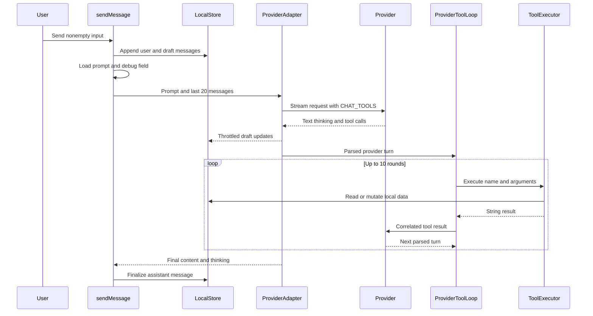
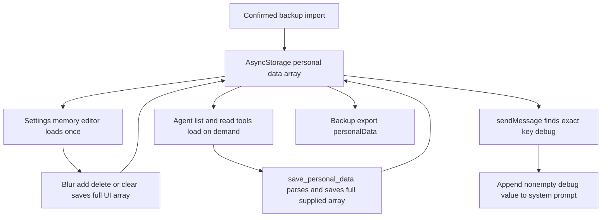

---
okf:
  version: 1
  kind: code-wiki
  status: grounded
  scope: apps/mobile/agent and chat orchestration in apps/mobile/App.tsx
type: concepto
title: Entorno de ejecución del agente
description: Contratos independientes del proveedor para chat, ejecución de herramientas, persistencia, reintentos y extensiones del agente móvil.
summary: Provider-independent chat, tool execution, persistence, retry, and extension contracts for the mobile agent.
tags: [agent, chat, tools, runtime, mobile]
sources:
  - apps/mobile/App.tsx
  - apps/mobile/agent/toolDefinitions.ts
  - apps/mobile/agent/toolExecutor.ts
  - apps/mobile/agent/providerToolLoop.ts
  - apps/mobile/agent/toolDefinitions.test.ts
  - apps/mobile/agent/toolExecutor.test.ts
  - apps/mobile/agent/providerToolLoop.test.ts
  - apps/mobile/agent/providerPipeline.test.ts
  - prompts/AGENTS.md
related:
  - ./provider-streaming.md
  - ./provider-configuration.md
  - ../mobile/local-state-and-backup.md
  - ../mobile/diet-and-food-estimation.md
  - ../mobile/measurements.md
---

# Entorno de ejecución del agente

El agente es una capacidad en proceso de la aplicación Expo, no un servicio de backend. `App.tsx::sendMessage` controla el ciclo de vida del chat visible para el usuario; `callProviderChatAPIWithTools` adapta una conversación normalizada a OpenAI, Anthropic o Google; `providerToolLoop.ts` realiza rondas de continuación específicas de cada proveedor; y `createAgentToolExecutor` despacha el catálogo canónico de herramientas al estado local, los repositorios locales, los datos respaldados por SecureStore/AsyncStorage o el adaptador de incidencias de GitHub actualmente deshabilitado. Los detalles del streaming se encuentran en [Streaming del proveedor](./provider-streaming.md), mientras que la selección del proveedor y las credenciales se encuentran en [Configuración del proveedor](./provider-configuration.md).

## Límites del entorno de ejecución e interfaces exactas

| Capa | Superficie exacta del código fuente | Responsabilidad |
|---|---|---|
| Ciclo de vida de la IU | `App.tsx::sendMessage`, `appendMessagesToThread`, `updateThreadMessage` | Validar los requisitos previos del envío, anexar mensajes del usuario y borradores, limitar la frecuencia de las escrituras de streaming en la IU, reintentar y finalizar o materializar un error. |
| Adaptador del proveedor | `App.tsx::callProviderChatAPIWithTools(provider, messages, options)` | Separar los mensajes del sistema y ajenos al sistema, crear cargas útiles para los proveedores, adjuntar `CHAT_TOOLS`, transmitir turnos, invocar un bucle del proveedor y exigir contenido final. |
| Esquema canónico | `AgentToolDefinition`, `ToolInputSchema`, `AGENT_TOOL_DEFINITIONS`, `AGENT_TOOL_NAMES`, `CHAT_TOOLS` | Definir un catálogo único de 13 herramientas y derivar los tres formatos de intercambio. |
| Continuación | `ExecuteTool`, `runOpenAIToolLoop`, `runAnthropicToolLoop`, `runGoogleToolLoop`, `MAX_TOOL_ROUNDS` | Ejecutar llamadas secuencialmente y correlacionar los resultados en el siguiente turno del proveedor. |
| Ejecución | `ToolExecutionContext`, `ToolExecutorDependencies`, `ToolHandler`, `AGENT_TOOL_HANDLERS`, `createAgentToolExecutor` | Resolver nombres e implementar lecturas/escrituras. Los nombres desconocidos devuelven `Herramienta no reconocida.`. |
| Puente de la aplicación | `App.tsx::createToolExecutionContext`, `executeChatTool` | Adaptar `LocalStore`, el `setStore` de React, los repositorios de alimentos/ejercicios, los auxiliares de persistencia, los identificadores, las URL de imágenes y la creación de incidencias. |

`ToolExecutionContext` es deliberadamente opcional: `setStore`, `store`, `foodsRepo` y `exercisesRepo` pueden estar ausentes. Los controladores que necesitan alguno devuelven una cadena de error en español en lugar de generar una excepción. `ToolExecutorDependencies` proporciona `loadPersonalData`, `savePersonalData`, E/S y ordenación de mediciones, `createId`, `getExerciseImageUrl` y `createFeatureIssue`.

## Ciclo de vida de extremo a extremo



*Leyenda: El envío de un chat transmite un turno del proveedor, puede ejecutar herramientas locales mediante rondas de continuación correlacionadas y termina como un único mensaje persistente del asistente.*

1. `sendMessage` retorna a menos que existan tanto `activeThreadId` como una entrada no vacía después de eliminar espacios. Rechaza un proveedor ausente o una clave vacía antes de crear mensajes.
2. Anexa el mensaje del usuario y un mensaje vacío del asistente con `is_streaming: true`, expande el panel de razonamiento y borra la entrada.
3. El historial consta del hilo anterior más el nuevo mensaje del usuario, truncado a los últimos **20** mensajes. `loadChatSystemPrompt()` y `loadPersonalData()` se ejecutan simultáneamente. Un campo de datos personales cuya clave exacta sea `debug` se anexa bajo `## Instrucciones de depuracion`.
4. La política base efectiva sigue una cadena de precedencia estricta: una solicitud con invalidación de caché al archivo `prompts/AGENTS.md` de GitHub Raw; si la solicitud falla o la respuesta no es correcta, `gymnasia.mobile.chat.system_prompt.v1` de AsyncStorage; si la caché no existe, está vacía, no puede leerse o se normaliza a un valor vacío, se usa `DEFAULT_CHAT_SYSTEM_PROMPT` integrado. Una lectura remota correcta se devuelve de inmediato y su texto normalizado se almacena en caché de forma asíncrona. La clave exacta y en minúsculas de memoria personal `debug`, cuando tiene un valor no vacío, se anexa después bajo `## Instrucciones de depuracion`; no constituye un rol independiente del proveedor.
5. Las devoluciones de llamada del stream mantienen agregados locales de texto/razonamiento. `flushAssistantDraft` agrupa las actualizaciones del almacén de React mediante un temporizador de 40 ms; los reintentos restablecen el borrador visible.
6. `callProviderChatAPIWithTools` transmite un turno inicial con todas las herramientas canónicas y delega la continuación de herramientas. Las llamadas dentro de un turno se ejecutan secuencialmente, conservando el orden del proveedor.
7. Un turno sin llamadas a herramientas termina el bucle. El límite predeterminado es `MAX_TOOL_ROUNDS = 10`; alcanzarlo devuelve el último turno en lugar de generar un error específico de agotamiento. A continuación, el adaptador exige contenido final no vacío.
8. En caso de éxito, se reemplaza el contenido/razonamiento del borrador y se elimina `is_streaming`. En caso de error, se escribe `Error de proveedor: …` en ese mismo registro del asistente y también se actualiza el estado global de error. `finally` borra `sendingChat`.

## Política mutable del prompt del sistema

El archivo `prompts/AGENTS.md` incluido en el repositorio es una política de tiempo de ejecución, no un catálogo integrado. `loadChatSystemPrompt` lee su URL de GitHub Raw en cada envío con un parámetro de consulta de marca de tiempo, por lo que los cambios en el repositorio pueden modificar las instrucciones del agente sin compilar ni publicar la aplicación. La caché es un recurso de reserva con la última política conocida, no una sustitución local de mayor prioridad; la constante integrada solo se utiliza cuando no están disponibles ni el origen remoto ni una caché utilizable.

Actualmente existe una divergencia semántica entre estas copias de la política. La versión actual de GitHub y del archivo `prompts/AGENTS.md` incluido en el repositorio solo describe las herramientas y los flujos de trabajo de memoria personal, mientras que `DEFAULT_CHAT_SYSTEM_PROMPT` también describe flujos de trabajo de dieta y entrenamiento. Debido a que GitHub Raw tiene precedencia, una solicitud correcta usa el prompt más restringido y **no** combina las secciones integradas de dieta/entrenamiento. En cambio, un cliente sin conexión puede usar una política remota anterior almacenada en caché, y un cliente sin red ni caché utiliza la política integrada más amplia. En consecuencia, dos clientes que ejecuten el mismo binario pueden recibir instrucciones del sistema sustancialmente diferentes.

Esta mutabilidad constituye un límite de política y de cadena de suministro: un cambio en el archivo del repositorio se convierte en texto privilegiado del sistema en el siguiente envío correcto y se conserva en la caché local. El campo exacto de memoria `debug` es una política mutable aún más local, anexada después del prompt base seleccionado y capaz de cambiar el comportamiento en todas las conversaciones. Ninguna de las fuentes se valida mediante un esquema, se fija a una versión, se firma, se muestra para su aprobación ni se restringe al catálogo de herramientas anunciado. Las pruebas deterministas cubren los esquemas y la ejecución de las herramientas canónicas, así como los envoltorios de los proveedores, pero no existe una prueba específica para la precedencia remoto → caché → integrado, el fallo de escritura en caché, la paridad entre copias del prompt, la mutación remota o la inyección de `debug`. Por lo tanto, los cambios en cualquier copia del prompt requieren revisar ambas copias y añadir pruebas de precedencia/divergencia, en lugar de asumir que el recurso de reserva es equivalente.

## Ciclo de vida y copropiedad de la memoria personal

La memoria personal es un registro independiente de AsyncStorage en `gymnasia.mobile.personal_data.v1`, serializado como un único arreglo de objetos `{key, description, value}`. No forma parte de `LocalStore`. Tanto la IU de **Memoria del coach** en Configuración como las cuatro herramientas de memoria del agente son propietarias del mismo registro y lo sobrescriben.



*Leyenda: Configuración y las herramientas del agente comparten la propiedad de un arreglo de memoria que se reemplaza por completo y que también alimenta la inyección de la política de depuración y la copia de seguridad/restauración.*

- **Carga y tratamiento de la estructura:** `loadPersonalData` devuelve `[]` cuando falta un valor, el JSON está mal formado o el valor analizado no es un arreglo. No valida cada elemento del arreglo. Por lo tanto, un registro almacenado con formato incorrecto se observa como vacío, aunque la carga por sí sola no reescribe el almacenamiento.
- **Claves exactas:** `list_personal_data_keys` conserva las claves tal como están almacenadas. `read_field_description` y `read_field_value` usan `item.key === key`: la búsqueda es exacta y distingue entre mayúsculas y minúsculas, sin recorte ni normalización. `Nombre`, `nombre` y ` nombre ` son distintos. La IU recorta una clave nueva, pero permite duplicados; las ediciones pueden introducir valores vacíos, espacios en blanco, duplicados o variantes de mayúsculas/minúsculas.
- **Comportamiento de sustitución y borrado de las herramientas:** `save_personal_data` no es una operación de inserción o actualización. Reemplaza el arreglo completo, por lo que el prompt indica al modelo que lea los campos existentes y envíe todas las entradas anteriores junto con las nuevas. Una cadena JSON con formato incorrecto, un valor JSON válido que no sea un arreglo o una entrada no admitida se analiza como `[]`, se guarda y aun así se confirma con `Datos personales guardados correctamente.`; por lo tanto, una salida de herramienta con formato incorrecto puede borrar toda la memoria y devolver una confirmación de éxito falsa.
- **Condiciones de carrera entre Configuración y las herramientas:** Configuración carga su `memoryFields` local una sola vez al entrar por primera vez en la pestaña de memoria. El desenfoque de un campo, así como añadir, eliminar y **Borrar toda la memoria**, guarda esa instantánea completa de la IU. Las lecturas del agente cargan el almacenamiento bajo demanda y las escrituras del agente no actualizan la instantánea de Configuración. Si una herramienta cambia la memoria mientras permanece montada una instantánea anterior de Configuración, el siguiente guardado de Configuración puede sobrescribir el cambio de la herramienta; también es posible la condición de carrera inversa en la que prevalece la última escritura. No existe revisión, combinación, bloqueo ni detección de conflictos.
- **Inyección de depuración:** antes de cada solicitud de chat, `sendMessage` carga la memoria simultáneamente con el prompt base y selecciona el primer campo cuya clave sea exactamente `debug` en minúsculas. Un `value` no vacío se anexa literalmente bajo `## Instrucciones de depuracion`. `Debug`, los campos `debug` duplicados posteriores y una primera coincidencia vacía no se inyectan. Esto convierte la memoria persistente ordinaria —editable tanto por el usuario como por el modelo— en una política mutable de nivel de sistema.
- **Copia de seguridad, restauración y restablecimiento:** la copia de seguridad manual exporta este arreglo independiente y una importación confirmada lo reemplaza por completo; consulte [Estado local y copia de seguridad](../mobile/local-state-and-backup.md). La acción específica de memoria de Configuración **Borrar toda la memoria** guarda `[]`. En cambio, la acción general **Restablecer datos locales** llama a `resetLocalData`, que restablece el `LocalStore` de React, pero no borra la clave independiente de memoria personal ni su instantánea cargada en la IU. Los usuarios no deben suponer que el restablecimiento general elimina los datos recordados o de `debug`.

`toolExecutor.test.ts` comprueba un guardado válido del arreglo completo, pero no cubre el borrado debido a entradas con formato incorrecto, la búsqueda con distinción entre mayúsculas y minúsculas, las claves duplicadas, las actualizaciones perdidas entre Configuración y las herramientas, la inyección de depuración, la sustitución mediante copia de seguridad/importación ni la excepción del restablecimiento general. Estos son los casos de regresión críticos para cualquier cambio en la memoria personal.

## Catálogo canónico de herramientas

Todos los nombres siguientes aparecen tanto en `AGENT_TOOL_DEFINITIONS` como en `AGENT_TOOL_HANDLERS`; `toolDefinitions.test.ts` verifica la igualdad exacta de los conjuntos y la equivalencia de los esquemas de OpenAI, Anthropic y Google.

| Herramienta | Entrada obligatoria | Lectura/efecto y cadena/JSON devuelto |
|---|---|---|
| `save_personal_data` | `personal_data: string` | Analiza un arreglo JSON completo, llama a `savePersonalData` y devuelve una confirmación. Un JSON no válido se convierte en un arreglo vacío y aun así se guarda. |
| `list_personal_data_keys` | ninguna | Carga los datos personales; devuelve un arreglo JSON de claves o `No hay campos guardados.` |
| `read_field_description` | `key: string` | Búsqueda por clave exacta; devuelve la descripción, `(sin descripcion)` o texto que indica que no se encontró. |
| `read_field_value` | `key: string` | Búsqueda por clave exacta; devuelve el valor, `(sin valor)` o texto que indica que no se encontró. |
| `read_measurement` | `date: string` | Busca la primera coincidencia de `measured_at.startsWith(date)` y omite `id`/`photo_uri` del JSON. |
| `write_measurement` | `date: string`, `data: string` | Inserta o actualiza por fecha, acepta solo campos numéricos finitos y positivos, conserva los valores existentes omitidos y la foto, ordena, limita a 1.826, persiste y después lo refleja en `setStore`. |
| `read_meal_foods` | `date`, `meal` | Busca la comida sin distinguir entre mayúsculas y minúsculas en `context.store`; devuelve JSON nutricional localizado o texto explicativo. |
| `search_foods` | ninguna | Filtra/ordena `foodsRepo` sin distinguir acentos, limita a 15 y devuelve JSON por cada 100 g. |
| `add_meal_food` | `date`, `meal`, `data` | Anexa un elemento mediante `setStore` funcional; crea/ordena una comida si no existe. La coerción numérica utiliza cero como valor de reserva. |
| `search_exercises` | ninguna | Filtra por nombre, músculo, músculo secundario, equipamiento y dificultad; limita a 15. |
| `read_routines` | ninguna | Serializa plantillas, ejercicios, series, tempo y subseries. |
| `create_routine` | `data: string` | Exige al menos un ejercicio, busca imágenes/músculos en el repositorio mediante coincidencias exactas de nombre, crea identificadores y anexa una plantilla. |
| `create_feature_issue` | `title_summary`, `conversation_excerpt`, `interpretation` | Llama al escritor de incidencias inyectado y después informa de éxito incondicionalmente. En la aplicación actual, el escritor retorna inmediatamente porque su token codificado está vacío, por lo que no se crea ninguna incidencia y el texto de éxito es un falso positivo. |

El vocabulario del esquema solo admite `string`, `number`, `object` y `array`. Varias cargas útiles complejas se declaran intencionadamente como cadenas que contienen JSON (`personal_data` y `data` de mediciones/alimentos/rutinas). `validateToolInput(schema, input)` informa de campos ausentes e incompatibilidades de tipos primitivos y tolera campos desconocidos, pero la ruta de producción `executeChatTool` **no** lo llama. Por lo tanto, los argumentos proporcionados por el proveedor llegan directamente a los controladores. Esto constituye una brecha material de validación en tiempo de ejecución, no solo un detalle de las pruebas.

## Invariantes de continuación independientes del proveedor

- **OpenAI:** `OpenAIToolTurn.outputItems` se filtra por `type: "function_call"`. Los argumentos pasan por `parseOpenAIFunctionArguments`; los JSON con formato incorrecto, vacíos, de tipo arreglo o escalares se convierten en `{}`. Un turno de herramienta sin `responseId` genera una excepción. Los resultados tienen la forma `{type: "function_call_output", call_id, output}` y la siguiente solicitud recibe `previous_response_id`.
- **Anthropic:** cada bloque `tool_use` se convierte en un `tool_result` identificado por `tool_use_id`. Los bloques exactos de contenido del asistente y un mensaje sintético de resultados del usuario se anexan a los mensajes acumulados.
- **Google:** las partes del modelo se conservan mediante `mapGoogleResponsePartToRequestPart`, incluidas `thought` y `thoughtSignature`; cada llamada se convierte en una `functionResponse` de usuario cuya `response` es `{result: string}`.
- Varias llamadas en un mismo turno no se ejecutan en paralelo. Si un controlador posterior falla, las mutaciones anteriores se mantienen.
- Las salidas de las herramientas son cadenas incluso cuando semánticamente contienen JSON. No existe transacción, reversión, deduplicación de identificadores de llamadas ni token de idempotencia.

## Riesgos de estado, persistencia y efectos secundarios

`sendMessage` pasa la instantánea de `store` del momento del renderizado a `createToolExecutionContext`, al tiempo que pasa un `setStore` funcional. Por lo tanto, las lecturas realizadas mediante `context.store` pueden estar obsoletas después de una mutación anterior de una herramienta dentro de la misma solicitud al proveedor. Las escrituras que utilizan el `setStore` funcional se combinan con el estado actual de React, pero la instantánea de lectura de la continuación no se actualiza.

Los mensajes de chat y los cambios ordinarios del dominio local pasan por los efectos de persistencia de `LocalStore` descritos en [Estado local y copia de seguridad](../mobile/local-state-and-backup.md). Los datos personales y las mediciones también utilizan funciones de persistencia inyectadas. `write_measurement` realiza la persistencia antes de reflejar los datos en la IU; las escrituras de dieta/rutina actualizan el estado de React y dependen del efecto de persistencia posterior de la aplicación.

Los tres escritores de incidencias de GitHub en `App.tsx` —alimentos, ejercicios y funcionalidades— son actualmente operaciones nulas deshabilitadas porque `GITHUB_FOOD_ISSUE_TOKEN` está codificado como `""` para un cliente estático. Retornan antes de `fetch`, por lo que GitHub Issues **no es una dependencia efectiva actual del entorno de ejecución**. En particular, `create_feature_issue` espera a la operación nula y después devuelve `Issue de mejora creada en GitHub correctamente.`, un falso positivo de éxito aunque no exista ninguna incidencia. Si en el futuro se habilita un escritor de confianza, su implementación actual también ignora las respuestas que no sean 2xx y captura internamente los fallos de transporte, por lo que la herramienta aún podría afirmar que tuvo éxito a menos que se modifique ese contrato.

`sendMessage` reintenta una llamada completa a `callProviderChatAPIWithTools` hasta tres veces para los mensajes que coincidan con `failed to fetch`, `network`, `timeout`, `econnrefused`, `econnreset`, `overloaded`, `529`, `503` o `429`, esperando 2 s y después 4 s. Las herramientas de escritura local pueden repetirse porque ni el reintento externo ni los bucles registran los identificadores de llamadas completadas, por lo que presentan una semántica de **al menos una vez** durante los reintentos. La creación repetida de incidencias de GitHub solo es un **riesgo futuro si se habilita la escritura de incidencias**; la operación nula actual con token vacío no puede crear ni duplicar una incidencia. Cualquier escritor futuro deberá añadir idempotencia/deduplicación y exponer los fallos antes de habilitar la herramienta.

## Errores y estados terminales observables

| Condición | Comportamiento |
|---|---|
| No hay ningún proveedor de chat seleccionado/configurado | Error global de configuración; no se anexa ningún mensaje. |
| Herramienta desconocida | El resultado de cadena `Herramienta no reconocida.` se devuelve al modelo. |
| Falta el contexto/repositorio de ejecución | Se devuelve al modelo una cadena de resultado específica del controlador en español; el bucle continúa. |
| La continuación de OpenAI carece de identificador de respuesta | El bucle genera `OpenAI no devolvio response_id…`. |
| Fallo del stream, la red o el proveedor | Puede reintentarse; un fallo terminal finaliza el borrador como mensaje de error. |
| El proveedor no devuelve texto final | Error de ausencia de contenido específico del adaptador/proveedor o el error externo `El modelo no devolvió contenido.` |
| Se alcanza el límite de rondas de herramientas con otra llamada a una herramienta | Se devuelve el último turno; normalmente se convierte en un error de ausencia de contenido, pero no existe un error explícito de límite. |
| Llamada actual a `create_feature_issue` | El token vacío codificado hace que el escritor inyectado sea una operación nula, pero el controlador informa de que la incidencia de GitHub se creó correctamente. |
| Una dependencia del controlador genera una excepción | Se propaga por el bucle y la política de reintentos; los efectos secundarios anteriores se conservan. El escritor de incidencias actual captura sus propios fallos. |

## Pruebas y comandos de validación específicos

- `toolDefinitions.test.ts`: paridad exacta entre esquema y controlador, derivación para tres proveedores, errores de campos obligatorios/tipos y una prueba de propiedades con semilla de 1.000 casos que demuestra que `validateToolInput` no genera excepciones.
- `toolExecutor.test.ts`: una sustitución válida de datos personales, además de comportamientos representativos de mediciones, alimentos, rutinas, repositorios y herramientas desconocidas. No comprueba el borrado de memoria por formato incorrecto, las lecturas de claves exactas, el falso éxito de incidencias ni los flujos de prompts/Configuración controlados por la aplicación.
- `providerToolLoop.test.ts`: los tres envoltorios de continuación y el fallo de OpenAI por ausencia del identificador de respuesta.
- `providerPipeline.test.ts`: integración para todos los proveedores desde SSE sin procesar y fragmentado → analizador → herramienta → segunda ronda.
- `sse.test.ts`: detalles del enmarcado. El flujo de chat del navegador también se comprueba mediante `scripts/agent-chat.e2e.mjs`, pero las pruebas deterministas no montan `sendMessage` ni demuestran la idempotencia de los reintentos.

Ejecute el conjunto relevante más pequeño desde la raíz del repositorio:

```bash
npx vitest run --config apps/mobile/vitest.config.mts apps/mobile/agent/toolDefinitions.test.ts apps/mobile/agent/toolExecutor.test.ts
npx vitest run --config apps/mobile/vitest.config.mts apps/mobile/agent/providerToolLoop.test.ts apps/mobile/agent/providerPipeline.test.ts
```

Ejecute el conjunto determinista completo del agente solo cuando el cambio atraviese varias capas:

```bash
npm run test:deterministic
```

## Superficie de cambios para extensiones

Para añadir o cambiar de forma segura una herramienta de chat:

1. Edite la única entrada canónica en `AGENT_TOOL_DEFINITIONS`; no edite manualmente las cargas útiles de los proveedores, ya que `CHAT_TOOLS` las deriva.
2. Añada/actualice el mismo nombre en `AGENT_TOOL_HANDLERS`. Amplíe `ToolExecutionContext` solo para los datos de instantáneas de renderizado; amplíe `ToolExecutorDependencies` para E/S estable o efectos externos.
3. Conecte las nuevas dependencias al construir `App.tsx::executeAgentTool` y, cuando sea necesario, en las opciones de `createToolExecutionContext`/`callProviderChatAPIWithTools`.
4. Decida explícitamente la validación. Llamar a `validateToolInput` en producción supondría un cambio de comportamiento para las salidas con formato incorrecto del proveedor y requeriría un formato de error visible para el proveedor.
5. Añada pruebas del ejecutor para casos de éxito, datos con formato incorrecto, ausencia de contexto, fallos de persistencia y ejecución repetida. Mantenga correcta la aserción de paridad entre esquema y controlador.
6. Si la herramienta cambia registros del dominio, verifique los invariantes y la página semántica de ese dominio: [Mediciones](../mobile/measurements.md), [Dieta y estimación de alimentos](../mobile/diet-and-food-estimation.md) o la documentación de entrenamiento. Si cambia los envoltorios de continuación o los argumentos transmitidos, actualice [Streaming del proveedor](./provider-streaming.md) y los archivos de datos sin procesar en el mismo cambio.