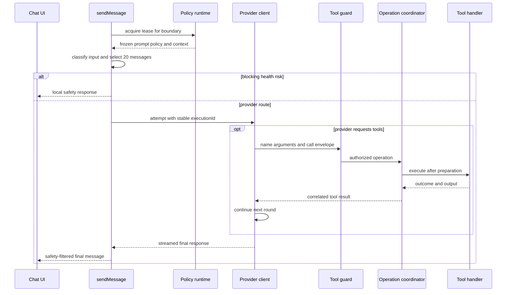
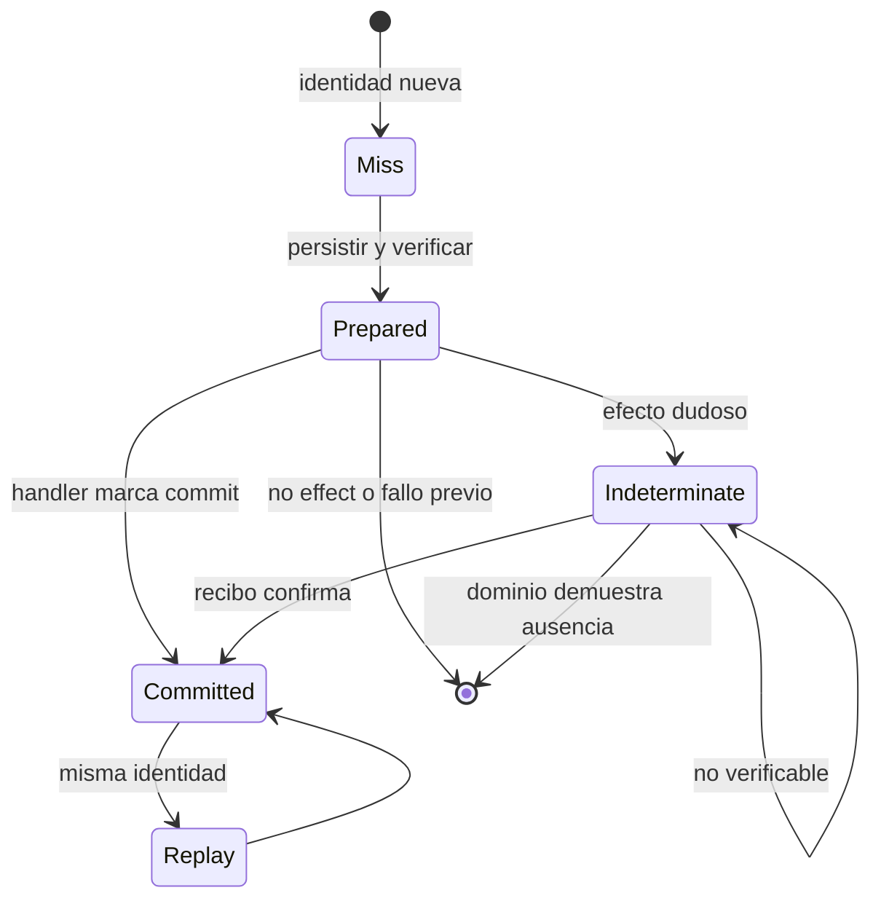

# Runtime del agente y herramientas

Esta página documenta el chat de `apps/mobile`: desde `sendMessage` hasta el proveedor, las continuaciones de tools y la recuperación de efectos. No debe confundirse con el runner que genera OpenWiki. La lectura consolidada de la muestra LangSmith y sus cautelas operativas vive en [Comportamiento en ejecución y oportunidades](../operations/runtime-behavior.md); aquí solo se conserva evidencia que cambia cómo modificar este runtime.

## Evidencia de runtime: tres registros

### Observado

El conector visible está configurado para `gymnasia-app-agent`, `gymnasia-food-agent` y `openwiki` en `https://eu.api.smith.langchain.com`. Aunque el contexto de esta actualización indica que la extracción ya se realizó, la interfaz disponible para este trabajo no expuso los raw items ni materializó el dump en el árbol. Por ello **no se publican cifras inventadas**.

| Agregado solicitado | Resultado publicable en esta actualización |
|---|---|
| Roots y llamadas remotas | No disponible |
| Llamadas repetidas | No disponible |
| Uso y latencia por tool | No disponible |
| Rondas por turno | No disponible |
| Tokens de entrada y salida | No disponible |
| Composición `error` / `outlier` / `baseline` | No disponible |

Cuando los raw items sean legibles, agréguense únicamente conteos, secuencias, firmas de error, rondas, latencias, tokens y URLs de traza autorizadas. Nunca se deben copiar entradas, salidas, argumentos, prompts, resultados de tools ni razonamiento. Los buckets `error` y `outlier` se seleccionan por anomalía, y `baseline` por normalidad reciente: su composición es una muestra deliberadamente sesgada, no una tasa de errores o latencia de la flota. Solo las medianas de `baseline` sirven como referencia normal **de esa muestra**.

### Correlacionado con archivo y símbolo

Los hechos siguientes proceden del código actual y son el marco para contrastar una futura muestra:

- **Turno y política — `App.sendMessage`, `acquireAgentPolicyLease`.** El turno obtiene un único lease antes de clasificar la entrada. El lease profundamente congelado reúne prompt, política sanitaria, `PolicyContext` y estado; la respuesta local de seguridad y el borrador del modelo conservan ese contexto. En canal `Local` procede del bundle; en canales firmados se rechaza una política sanitaria incompatible antes de usarla (`apps/mobile/App.tsx`, `sendMessage`; `apps/mobile/agent/agentPolicyRuntime.ts`, `acquireAgentPolicyLease`).
- **Ventana común — `selectCoachContext`.** Coach selecciona los **20 mensajes más recientes para todos los proveedores** después de excluir divulgaciones locales. Google no recibe el hilo completo: adapta esos 20 mensajes a pasos enriquecidos y aplica después sus límites de transporte (`apps/mobile/App.tsx`, `sendMessage`; `apps/mobile/agent/coachContext.ts`, `selectCoachContext`; `apps/mobile/agent/providerToolClient.ts`, `requestProviderToolChat`).
- **Presupuesto Google efectivo en Coach — `requestProviderToolChat`.** El presupuesto genérico de Google tiene `maxExchanges: 10`, 512 KiB sin datos de imagen y 19 000 000 bytes de petición. Coach sobrescribe únicamente `maxExchanges` a `COACH_CONTEXT_MESSAGE_LIMIT`, es decir, **20 intercambios**. Como la ventana previa contiene como máximo 20 mensajes, el límite de bytes suele ser la segunda frontera efectiva. Se eliminan imágenes de intercambios anteriores y luego intercambios completos antiguos; si el intercambio activo no cabe, se rechaza antes de red. No describa este recorrido como “Google recibe todo el historial” (`apps/mobile/agent/googleContextBudget.ts`, `DEFAULT_GOOGLE_CONTEXT_BUDGET` y `prepareGoogleInteractionRequest`; `apps/mobile/agent/providerToolClient.ts`, rama Google).
- **Tres intentos del turno — `sendMessage`.** La llamada principal tiene como máximo tres intentos. Solo repite firmas reconocidas de red, timeout, sobrecarga o HTTP 429/503/529, espera 2 s y 4 s, y reinicia el borrador y su gate sanitario. Un resultado vacío también hace avanzar el bucle sin espera; al agotar los intentos termina como `technical_error`. El mismo `userMessage.id` se conserva como `executionId` (`apps/mobile/App.tsx`, `sendMessage`).
- **Rondas — `runOpenAIToolLoop`, `runAnthropicToolLoop`, `runGoogleToolLoop`.** Dentro de un intento, las ocurrencias se asignan en orden del proveedor por nombre y argumentos canónicos antes de ejecutar. `executeToolBatch` puede solapar hasta cuatro lecturas consecutivas, pero una escritura o una tool desconocida es una barrera: se espera, y no coincide con otras calls. Los resultados conservan el orden original. Se ejecutan como máximo diez rondas de tools. Si el proveedor aún solicita otra, esa call pendiente no se ejecuta: recibe un resultado sintético y se hace una llamada final con tools prohibidas. Si el cierre falla, queda truncado o vuelve a pedir tools, se lanza `ToolRoundLimitError` (`apps/mobile/agent/providerToolLoop.ts`; `apps/mobile/agent/toolBatch.ts`; `apps/mobile/agent/providerToolClient.roundLimit.test.ts`).
- **Autorización — `executeGuardedTool`.** El catálogo asigna `read`, `local_write` o `external_write` y genera los esquemas para cada proveedor. Antes del ejecutor, el guard clasifica la entrada original y `nombre + argumentos`; una tool desconocida o no permitida devuelve un error controlado. Riesgo `elevated` admite solo lecturas, y `high` o `critical` impide proveedor y tools (`apps/mobile/agent/toolDefinitions.ts`, `AGENT_TOOL_DEFINITIONS`; `apps/mobile/App.tsx`, `callProviderChatAPIWithTools`; `apps/mobile/agent/healthSafety.ts`, `healthSafetyToolAllowed`).
- **Commit y duda — `createDetailedAgentToolExecutor`, `ToolOperationCoordinator`.** El handler debe marcar explícitamente `committed` después de su persistencia. También puede marcar `indeterminate`; una excepción se convierte en resultado controlado y no implica rollback. El coordinador prepara el journal antes del efecto y, si el registro final falla, consulta el recibo del dominio. La incapacidad de confirmar no autoriza una segunda mutación (`apps/mobile/agent/toolExecutor.ts`; `apps/mobile/agent/toolOperationLedger.ts`).

### Hipótesis que debe comprobar una muestra

1. **Más de una llamada por turno.** Separar evaluación sanitaria consentida, reintento completo, fallback de transporte Google, continuación tras tool y llamada de cierre. Son mecanismos distintos y no demuestran una escritura repetida.
2. **Latencia o tokens altos.** Agrupar primero por proveedor, intento, ronda y cierre. Para Google, añadir los contadores y razones de `GoogleContextReport`; no asumir que se envió el hilo persistido completo.
3. **Tool repetida.** Comparar `executionId`, proveedor, nombre, argumentos canónicos y ocurrencia. Una unión `inFlight` o un replay local puede producir varias solicitudes observadas pero una sola mutación.
4. **Error posterior a una escritura.** Inspeccionar journal y recibo de dominio. Un estado `indeterminate` significa “no repetir automáticamente”, no rollback.
5. **Fricción de esquema.** Una misma tool reintentada con argumentos corregidos puede señalar una descripción o validación poco clara; debe confirmarse con conteos y secuencias, sin publicar los argumentos.

## Orquestación de un turno


```mermaid
sequenceDiagram
    participant UI as Chat UI
    participant App as sendMessage
    participant Policy as Policy runtime
    participant Provider as Provider client
    participant Guard as Tool guard
    participant Coord as Operation coordinator
    participant Handler as Tool handler
    App->>Policy: acquire lease for boundary
    Policy-->>App: frozen prompt policy and context
    App->>App: classify input and select 20 messages
    alt blocking health risk
        App-->>UI: local safety response
    else provider route
        App->>Provider: attempt with stable executionId
        opt provider requests tools
            Provider->>Guard: name arguments and call envelope
            Guard->>Coord: authorized operation
            Coord->>Handler: execute after preparation
            Handler-->>Coord: outcome and output
            Coord-->>Provider: correlated tool result
            Provider->>Provider: continue next round
        end
        Provider-->>App: streamed final response
        App-->>UI: safety-filtered final message
    end
```

*El turno congela política e identidad antes de entrar en intentos y continuaciones; una escritura pasa además por guard, journal y handler.*

`sendMessage` valida proveedor y credencial antes de crear el borrador. Tras adquirir el lease, una decisión `high` o `critical` persiste el mensaje del usuario y una intervención local, sin llamar al proveedor. Para una entrada `elevated`, el evaluador remoto solo se usa con consentimiento para ese proveedor; vence a los 10 segundos y cualquier fallo conserva la decisión base con fuente `evaluator-failure`.

En la ruta normal se persisten el mensaje del usuario y un borrador `is_streaming`. `createStreamDraftFlusher` agrupa repintados en ventanas de 40 ms; cada reintento limpia contenido, razonamiento y gate. El resultado completo vuelve a pasar por el gate sanitario antes de cerrar el borrador. El error terminal conserva el mismo mensaje y lo transforma en `kind: "technical_error"`; no elimina efectos de tools que ya hayan ocurrido.

La ruta del prompt no lee memoria personal. El único mensaje de sistema que construye `sendMessage` usa `systemPromptSelection.content`; `composeAiSystemPrompt` añade la transparencia común más adelante. La memoria personal solo es accesible mediante tools. Su saneador protege la forma, no es una frontera de autorización: conserva la `key` literal porque las lecturas usan igualdad exacta.

## Repetición remota, continuación y replay local

Estas tres formas de “repetición” no son equivalentes:

| Mecanismo | Cuándo ocurre | Identidad y efecto |
|---|---|---|
| **Reintento remoto del turno** | `sendMessage` vuelve a invocar la ruta completa tras un error reintentable o resultado vacío | Conserva `executionId`; el proveedor puede asignar nuevos call IDs. Las ocurrencias vuelven a calcularse desde cero, por lo que una escritura equivalente puede encontrar el mismo `operationId` y hacer replay local. |
| **Continuación de tools** | El proveedor pidió una o más tools y necesita otra respuesta con sus resultados | Ocurre dentro del mismo intento. Las ocurrencias se asignan en orden y avanzan, de modo que dos calls iguales e intencionales del mismo loop son operaciones distintas. Las lecturas consecutivas pueden ejecutarse en paralelo, con un máximo de cuatro; las escrituras y tools desconocidas son barreras secuenciales. |
| **Replay local** | El coordinador encuentra un commit en memoria o ledger, o se une a una operación simultánea | No repite el handler. Devuelve la salida comprometida al protocolo del proveedor. No depende de que `providerCallId` sea estable. |

Google añade una protección de protocolo: un replay de una interacción con ID no vacío y contenido idéntico reutiliza sus resultados sin crear nuevas ocurrencias; una identidad contradictoria o un call ID reutilizado entre rondas se rechaza. Esto no reemplaza el replay persistente del coordinador.

OpenAI correlaciona con `function_call_output.call_id`, Anthropic con `tool_result.tool_use_id` y Google con `function_result.call_id`. Esos IDs son necesarios para continuar el protocolo, pero **no** forman la identidad durable de la escritura.

## Autorización y clasificación de efectos

`AGENT_TOOL_DEFINITIONS` es la única fuente del nombre, descripción, esquema y efecto, y de ella se derivan `CHAT_TOOLS.openai`, `CHAT_TOOLS.anthropic` y `CHAT_TOOLS.google`. Las pruebas mantienen alineado el catálogo con `AGENT_TOOL_HANDLERS`.

El guard combina el máximo riesgo entre la entrada del turno y los argumentos serializados:

| Riesgo efectivo | Tools permitidas |
|---|---|
| `none` | `read`, `local_write`, `external_write` |
| `elevated` | Solo `read` |
| `high` o `critical` | Ninguna; además la entrada bloqueante evita la ruta principal del proveedor |

La autorización no valida por sí sola el dominio. Cada handler debe validar estructura, catálogo, fecha o referencias antes de mutar. El ejecutor captura excepciones para que el loop reciba un resultado controlado, pero distingue `failed_before_commit`, `no_effect`, `committed` e `indeterminate`. Una excepción después de `markEffectCommitted` sigue siendo `committed`; no existe rollback general.

## Journal, recibos y recuperación

Para una escritura, `identifyToolOperation` calcula SHA-256 sobre versión, `executionId`, proveedor, nombre, argumentos JSON canónicos y `occurrence`. `providerCallId` queda fuera. El fingerprint separado cubre nombre y argumentos para detectar una colisión de `operationId`.


```mermaid
stateDiagram-v2
    [*] --> Miss: identidad nueva
    Miss --> Prepared: persistir y verificar
    Prepared --> Committed: handler marca commit
    Prepared --> [*]: no effect o fallo previo
    Prepared --> Indeterminate: efecto dudoso
    Indeterminate --> Committed: recibo confirma
    Indeterminate --> [*]: dominio demuestra ausencia
    Indeterminate --> Indeterminate: no verificable
    Committed --> Replay: misma identidad
    Replay --> Committed
```

*El journal evita repetir una escritura dudosa; la reconciliación puede confirmar el efecto o demostrar su ausencia, pero no lo revierte.*

El orden seguro implementado es:

1. Consultar caché, trabajo `inFlight` y ledger.
2. Para una entrada nueva, preguntar al reconciliador del dominio si ya existe el efecto.
3. Persistir y releer `prepared` antes de invocar el handler.
4. Ejecutar el handler con `operationId`.
5. Si el resultado es `committed`, persistir la salida; si falla ese registro, reconciliar el recibo de dominio.
6. Descartar `prepared` solo ante `no_effect`, `failed_before_commit` o ausencia demostrable. Conservar `indeterminate` cuando no haya certeza.

Las escrituras locales añaden un recibo mínimo (`operationId`, `toolName`, `committedAt`) al mismo valor de dominio que prepara el handler para persistir. Esto permite comprobar después una comida, medición, rutina o memoria, pero **no autoriza a inferir una transacción atómica o rollback del almacenamiento subyacente**. `create_feature_issue` usa en cambio el estado remoto del servicio; solo `created` marca commit. Véase [Worker de feedback](../services/feedback-worker.md).

El ledger de esquema 2 migra commits de esquema 1, verifica cada escritura por relectura y falla cerrado ante lectura corrupta o no disponible. Su capacidad es 256:

- los `committed` caducan a los siete días y pueden expulsarse por antigüedad;
- `prepared` e `indeterminate` no caducan ni se expulsan para abrir hueco;
- si 256 entradas no resueltas ocupan la capacidad, una escritura nueva falla antes del efecto;
- una colisión devuelve `no_effect` sin ejecutar el handler;
- `clear()` incrementa una generación para que una operación que termine después del borrado no repueble caché ni journal.

Los recibos de dominio también retienen como máximo 256 entradas durante siete días. Su ausencia solo prueba que no hubo efecto mientras el recibo no haya podido caducar ni ser expulsado. Fuera de esa ventana, el resultado es indeterminado.

Al hidratar la app, `reconcileUnresolved` recorre secuencialmente entradas pendientes. Un recibo o estado remoto confirmado promueve a `committed`; una ausencia demostrada descarta la entrada; la duda conserva `indeterminate` y muestra un aviso. La reconciliación no ejecuta otra vez el handler.

## Invariantes para cambios seguros

1. Mantenga un solo `AgentPolicyLease` por turno y no mezcle prompt, guardrail o `PolicyContext` de selecciones diferentes.
2. Mantenga `selectCoachContext` antes de la adaptación al proveedor. Para Coach, el límite efectivo Google es 20 intercambios como máximo, 512 KiB sin imágenes y 19 MB totales; no vuelva a documentar el valor genérico 10 como límite efectivo de esta ruta.
3. Al añadir una tool, declare esquema y efecto, registre su handler y decida cómo reconciliarla. Una escritura sin recibo verificable quedará necesariamente más expuesta a `indeterminate`.
4. Valide antes de mutar y llame a `markEffectCommitted` inmediatamente después de la persistencia irreversible. Use `markEffectIndeterminate` si el resultado pudo ocurrir pero no puede confirmarse.
5. Preserve `executionId`, canonicalización y `occurrence`. No añada `providerCallId` a la identidad durable.
6. No trate los tres intentos del turno como tres rondas, ni una continuación como una repetición. Instrumente intento, ronda, cierre, tool y estado de commit por separado.
7. Mantenga el orden de asignación de `occurrence` y el orden de resultados aunque se solapen lecturas. No convierta una escritura o una tool desconocida en trabajo paralelo: ambas son barreras y un fallo fatal detiene lecturas aún no iniciadas tras esperar las que ya estaban en vuelo.
8. No registre contenido sensible. Las trazas de idempotencia actuales contienen fase, estado, origen y nombre de tool, no identidad, argumentos ni salida.

## Pruebas focalizadas

Desde la raíz:

```bash
npm exec -- vitest run --config apps/mobile/vitest.config.mts apps/mobile/agent/agentPolicyRuntime.test.ts apps/mobile/agent/coachContext.test.ts apps/mobile/agent/personalData.contract.test.ts apps/mobile/agent/providerPipeline.test.ts apps/mobile/agent/providerToolClient.test.ts apps/mobile/agent/providerToolClient.roundLimit.test.ts apps/mobile/agent/providerToolLoop.test.ts apps/mobile/agent/toolBatch.test.ts apps/mobile/agent/toolDefinitions.test.ts apps/mobile/agent/toolExecutor.test.ts apps/mobile/agent/toolOperationLedger.test.ts apps/mobile/agent/toolOperationReceipts.test.ts apps/mobile/agent/googleInteractions.test.ts
```

- `agentPolicyRuntime.test.ts` fija la inmutabilidad y coherencia del lease.
- `coachContext.test.ts` fija la ventana común de 20 mensajes y el presupuesto efectivo de Google en Coach.
- `providerPipeline.test.ts`, `providerToolLoop.test.ts` y `providerToolClient.roundLimit.test.ts` cubren correlación nativa, ocurrencias, truncamiento y cierre al agotar rondas.
- `toolBatch.test.ts` fija el solapamiento de hasta cuatro lecturas consecutivas, el orden de resultados, las barreras de escrituras y tools desconocidas, y la espera de lecturas ya iniciadas ante un fallo fatal.
- `toolExecutor.test.ts` protege validación, despacho y punto de commit.
- `toolOperationLedger.test.ts` cubre identidad, write-ahead, replay, unión concurrente, colisiones, capacidad, reinicio, incertidumbre y borrado concurrente.
- `toolOperationReceipts.test.ts` cubre retención y cuándo una ausencia todavía es demostrable.
- `personalData.contract.test.ts` impide reintroducir memoria local en el prompt.

Estas pruebas demuestran contratos locales; no miden disponibilidad, latencia, tokens ni frecuencia de rutas en producción. Para esos datos, vuelva a la muestra y a [Comportamiento en ejecución y oportunidades](../operations/runtime-behavior.md).
