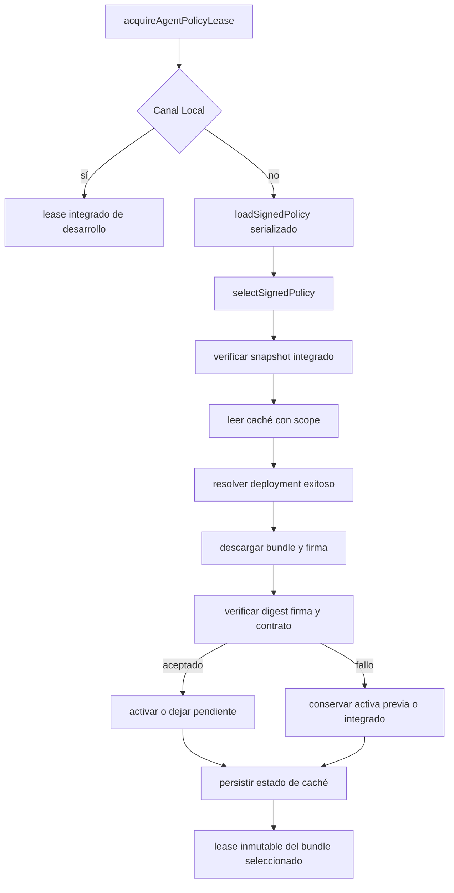
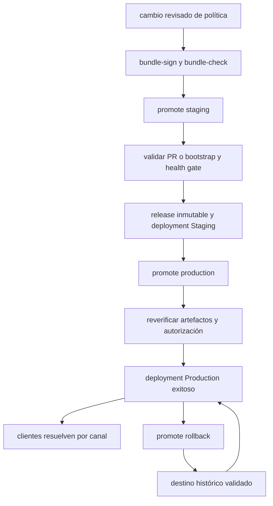

## Alcance y límites

La política ejecutable del agente se distribuye como un **bundle firmado**, no como contenido remoto de confianza implícita. El bundle agrupa el prompt del sistema, una política sanitaria de runtime, herramientas requeridas y metadatos de compatibilidad; una activación firmada decide qué bundle se aplica a cada canal. Esta página documenta contratos y operaciones, no reproduce prompts, firmas, claves privadas, valores de activación ni datos de usuarios.

La aplicación incorpora las raíces públicas confiables y un snapshot firmado durante la compilación. En `Local` no hay resolución remota: se obtiene un lease de desarrollo a partir de los artefactos integrados. Los canales `Staging` y `Production` resuelven y verifican el ciclo descrito aquí.

## Modelo de confianza y contrato verificable

El protocolo móvil actual es la versión 1. Un paquete contiene cuerpos canónicos de bundle y activación, sus envolturas de firma, entorno, canal, candidato e identificador de deployment. Las firmas son Ed25519: una raíz incluida en la app certifica la clave de firma, y esta firma por separado el bundle y la activación. La verificación exige que la fecha de emisión esté dentro de la vigencia del certificado.

La validación es deliberadamente cerrada:

- JSON canónico con claves ordenadas, campos exactos y límites de profundidad; los cuerpos no canónicos se rechazan antes de usarse.
- Tamaño máximo para bundle y activación, UTF-8 estricto y base64url canónico para material público y firmas.
- Integridad por SHA-256: la envoltura debe corresponder al cuerpo, la activación al digest del bundle, y las identidades de candidato, bundle y activación deben coincidir.
- El bundle declara versión, identificador derivado del hash del prompt, `minClientProtocol`, criticidad y una lista ordenada, no duplicada y conocida de `requiredTools`.
- La política sanitaria embebida se hashea como JSON canónico y, además, se fusiona y valida contra el contrato sanitario móvil antes de que el paquete pueda ser seleccionado.
- El entorno y canal esperados son parámetros de la verificación; un paquete de otro ámbito, una raíz no integrada o un protocolo cliente insuficiente no son reutilizables.

Por ello, agregar una herramienta requerida, cambiar el formato de bundle o elevar el protocolo mínimo exige cambios coordinados en el generador, el validador móvil, las herramientas anunciadas y pruebas de compatibilidad. Las raíces públicas son parte del artefacto de cliente: una rotación necesita una release que incluya la nueva raíz antes de aceptar paquetes que dependan de ella.

## Resolución remoto, caché e integrado

`acquireAgentPolicyLease(boundary)` es la entrada del agente. Fuera de `Local`, serializa las operaciones de carga, consulta el deployment activo, descarga sus dos assets y delega la selección. Las cachés de resolución de deployment y paquete remoto duran cinco minutos; `force` las vacía en memoria, pero no borra la caché persistente verificada.



El diagrama muestra la selección en canales firmados y su degradación; `Local` evita tanto el deployment remoto como la política firmada remota.

### Puntero remoto restringido

El cliente busca deployments del task `gymnasia-policy` para el canal solicitado y acepta el primero cuyo estado más reciente sea `success`. El payload de deployment tiene esquema 3 y solamente puede señalar las URLs exactas de los assets de una release del repositorio, con candidato, commit fuente, digest del bundle, activación y firma de activación. Así no se convierte un campo URL de GitHub en una capacidad de descarga arbitraria.

Después comprueba el digest público antes de ensamblar el paquete, limita content types, tamaño y decodificación UTF-8 de los assets, y vuelve a realizar la verificación criptográfica y contractual completa. Los errores de resolución también se cachean cinco minutos para evitar reintentos repetidos.

### Caché persistente y anti-retroceso

La caché de `AsyncStorage` está versionada (esquema actual 2), está aislada por namespace de variante y exige que `environment` y `channel` coincidan. Conserva `active`, `previous`, `pending`, `highestSequence` y `highestActivationId`, además de estado y momento de comprobación. Una caché v1 válida se migra; una lectura, JSON o estructura inválidos no se usa y se reconstruye desde el snapshot integrado.

Cada entrada recuperada —activa, anterior, pendiente e integrada— vuelve a verificarse. En ausencia de red, el orden de recuperación es activa válida, anterior válida y snapshot integrado. Un fallo de escritura no invalida la política ya resuelta para el lease actual, pero el estado queda degradado.

La secuencia de activación es monotónica por canal: un remoto con secuencia inferior, o con la misma secuencia y otro identificador de activación, se rechaza con `anti-rollback`. Una activación repetida idéntica es idempotente. Un rollback no rebaja la secuencia: es una activación nueva, firmada y de secuencia mayor que apunta a un bundle histórico y declara el bundle desde el que se vuelve.

### Fronteras seguras y leases

La comprobación remota puede ocurrir en `background`, pero nunca cambia la política en medio de trabajo: una actualización queda `pending`. Una actualización normal se activa en `new-conversation`; una crítica o con acción `rollback` puede activarse al inicio de `turn`. Ni siquiera una crítica se activa en `background`.

Al seleccionar, `createSignedAgentPolicyLease` construye un lease profundamente inmutable: prompt, política sanitaria fusionada, contexto de atribución y estado proceden del mismo bundle seleccionado. El contexto y las trazas deliberadamente sólo incluyen identificadores y metadatos públicos permitidos —candidato, digest de bundle, activación, secuencia, versión, fuente y frontera—, no contenido de prompt, entradas, salidas ni datos sanitarios. La presentación puede mostrar fuente, pendiente y degradación sin exponer el material de política.

## Promoción de una política

El archivo de configuración de firma fija metadatos de compilación tales como versión, criticidad, protocolo mínimo y herramientas requeridas. El bundle y su firma actuales son artefactos de trabajo que se verifican antes de firmar o promover; no se deben editar los generados a mano.

La operación local usa `scripts/policy-promotion/sign-policy.mjs`. Sus operaciones de clave acceden únicamente al almacén local configurado y mantienen las claves privadas fuera del repositorio; la raíz pública y los certificados públicos son los únicos materiales de confianza que se publican. Nunca pegues valores de claves, sesiones, firmas o activaciones en issues, logs, chat o documentación.



El diagrama refleja que Staging publica primero una release inmutable y que Production y rollback crean activaciones nuevas verificadas para Production.

### Receta de cambio segura

1. Cambia los insumos de política y los metadatos permitidos, sin incluir secretos ni datos de usuario. Si cambian herramientas requeridas, asegúrate de que existen en el conjunto móvil anunciado y están ordenadas como exige el contrato.
2. Ejecuta el gate sanitario y las pruebas relevantes antes de crear artefactos. Genera y comprueba el bundle con los comandos de proyecto:

   ```sh
   node scripts/policy-promotion/sign-policy.mjs bundle-sign
   node scripts/policy-promotion/sign-policy.mjs bundle-check
   npm run check:health-safety
   ```

3. Con una PR abierta autorizada, crea la activación y despacha Staging mediante `promote`; proporciona un `reason-code` permitido y el número de PR. El script calcula la siguiente secuencia del canal salvo que se indique otra válida y permite `--dry-run` para revisar el plan. El bootstrap desde `main` está limitado al único arranque inicial.
4. El workflow verifica el commit de la PR, el check `prompt-policy`, la autorización de propietario, el gate sanitario sin secretos y artefactos firmados con las raíces del checkout confiable. Sólo entonces publica la release prerelease inmutable y un deployment `Staging` exitoso.
5. Promueve a Production el candidato ya publicado en Staging. El workflow descarga la release, repite el gate y la verificación, exige una secuencia de Production mayor y que el candidato sea el último de Staging; las políticas críticas usan el entorno de aprobación `Production Critical`.
6. Para rollback, elige un candidato histórico que conste exitoso tanto en Staging como en Production. El script verifica el bundle descargado y que el origen declarado sea el Production activo; el workflow exige de nuevo esas relaciones y publica una activación `rollback` de secuencia superior. No se altera ni se reutiliza una activación anterior.

Las promociones por canal están serializadas por concurrencia y no cancelan una operación ya iniciada. Tras publicar, el workflow registra la operación y su resultado; los artefactos temporales de firma se eliminan al finalizar el script local.

## Snapshot de compilación y releases móviles

`prepare-policy-snapshot.mjs --environment staging|production` resuelve el deployment exitoso del canal, descarga y verifica los assets con las raíces del repositorio, comprueba evidencia de promoción y gate sanitario, y genera los módulos de prompt, política sanitaria, snapshot firmado y metadatos que se integran en la app. Una compilación falla si no existe un deployment válido o si identidad, digest, firmas, evidencia o contrato no coinciden. Esto ofrece un fallback verificable a los clientes sin red y evita compilar a partir de un puntero remoto no comprobado.

Al modificar este proceso, mantener alineados el verificador Node, el verificador móvil y los formatos de deployment es una condición de release. Consultar también [runtime del agente](/openwiki/agent/runtime.md), [gobernanza de prompt y política](/openwiki/operations/prompt-policy-governance.md) y [build, release y pruebas](/openwiki/operations/build-release-and-testing.md).

## Pruebas mínimas para cambios

Ejecuta la suite móvil aplicable y el gate sanitario. La cobertura enfocada debe preservar estos comportamientos:

- `signedPolicy.test.ts`: interoperabilidad Node/móvil de Ed25519 y rechazo de manipulación, raíz, entorno, canal, herramientas, protocolo y JSON no canónico.
- `policyDeployment.test.ts`: payload cerrado, URLs de release exactas, sólo deployment exitoso y caché de éxitos o fallos por cinco minutos.
- `signedPolicySelection.test.ts`: migración de caché, actualizaciones pendientes, fronteras de activación, recuperación desde copia anterior e integrada, errores de almacenamiento, idempotencia y propiedad de secuencia monotónica.
- `agentPolicyRuntime.test.ts`: el lease congela y atribuye prompt, guardrail y contexto al mismo bundle.

Para un cambio de promoción, además comprueba explícitamente el camino normal Staging → Production y un rollback simulado: una regresión que acepte una secuencia menor, active en background, mezcle artefactos entre bundles o revele contenido sensible es un fallo de seguridad, no sólo un fallo funcional.
