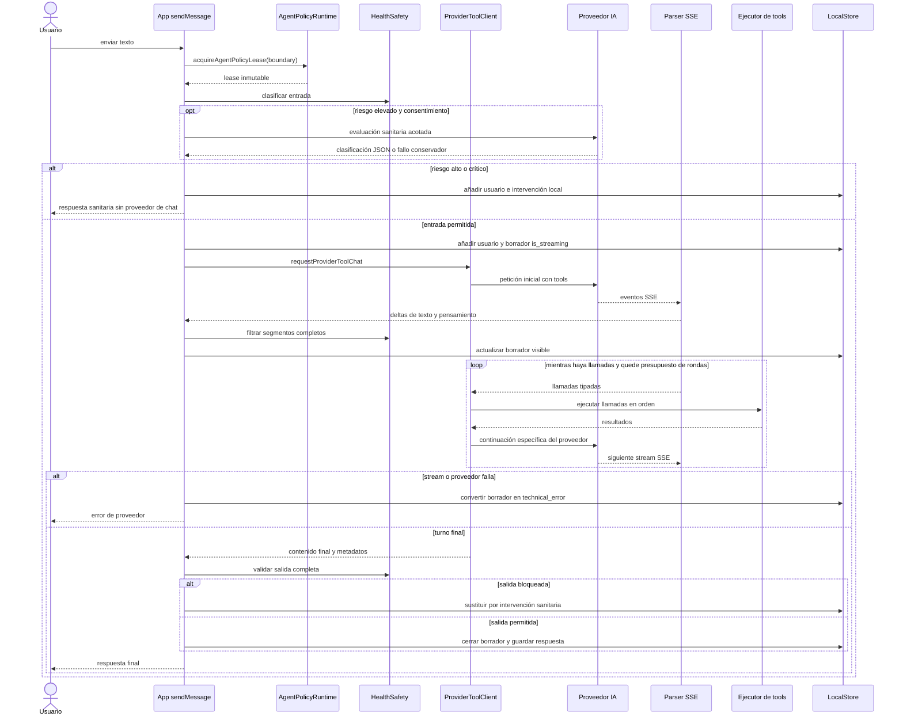

# Ciclo del agente y streaming multiproveedor

El bucle del chat principal se compone en `sendMessage` y delega el protocolo de cada proveedor en `requestProviderToolChat`. Antes de abrir una conexión adquiere una política, clasifica la entrada y puede terminar localmente; después convierte SSE en un turno tipado, ejecuta las herramientas permitidas y continúa hasta obtener texto. La salida no se considera publicable ni persistible como respuesta terminada hasta pasar el guardrail sanitario.

Esta página se centra en el chat principal con herramientas. Los clientes auxiliares sin tools usan `requestProviderText`, y el estimador de comida comparte parte del patrón de lease, streaming, filtro y reintentos, pero tiene su propio cliente. Véanse también [Herramientas del agente](agent-tools.md), [Política y seguridad sanitaria](policy-and-health-safety.md) e [Integraciones con proveedores](../integrations/ai-providers.md).

## Flujo de un turno



*El diagrama muestra el orden real del turno principal y sus terminaciones locales, de error y de filtrado de salida.*

### 1. Lease y clasificación de entrada

`sendMessage` distingue `new-conversation` de `turn` según exista ya un mensaje de usuario y llama una sola vez a `acquireAgentPolicyLease`. El lease reúne prompt, política sanitaria, contexto de atribución y estado de despliegue procedentes del mismo bundle. `deepFreeze` inmoviliza recursivamente el resultado; por tanto, las rondas de tools y los reintentos de ese envío reutilizan exactamente el prompt, el guardrail y el `policy_context` adquiridos, aunque una política nueva se active mientras el turno está en curso.

La clasificación determinista ocurre antes de crear el borrador. Un resultado `elevated` puede enviarse a un clasificador del proveedor solo si existe consentimiento; su espera está limitada a 10 segundos y un timeout, JSON inválido u otro fallo conserva la decisión base con `source: "evaluator-failure"`. El evaluador solo puede elevar el riesgo porque se combina mediante `maxHealthRisk`. Los niveles `high` y `critical` añaden el mensaje del usuario y una respuesta sanitaria local, registran que se omitió el proveedor y terminan el turno.

En una entrada permitida, cada tool vuelve a pasar por seguridad: se clasifica `name + JSON.stringify(args)` y se cruza el riesgo con el efecto declarado de la operación. Riesgo elevado admite solo lecturas; alto o crítico no admite ninguna tool. Una denegación se devuelve al modelo como un resultado estructurado, no se ejecuta el efecto. La coordinación durable, idempotencia y reconciliación de escrituras se describen en [Herramientas del agente](agent-tools.md).

### 2. Historial, prompt y borrador

La app crea primero un `ChatMessage` asistente vacío con `is_streaming: true`, proveedor, modelo y copia del contexto de política. Excluye del contexto los mensajes locales de transparencia. Para OpenAI y Anthropic limita el historial ordinario a los últimos 20 mensajes; Google conserva el historial completo porque necesita reconstruir sus pasos de interacción. El system prompt enviado procede de `policyLease.prompt.content`; `composeAiSystemPrompt` añade la transparencia de IA dentro del cliente.

Los deltas actualizan un acumulado, pero el texto no pasa directamente a pantalla. `createHealthSafeStreamGate` publica únicamente segmentos completos terminados por puntuación o salto de línea y clasifica cada candidato. Si la entrada ya era elevada, mantiene toda la salida en buffer. El pensamiento puede actualizar el borrador durante el stream, pero se elimina si la respuesta termina como intervención sanitaria. Las escrituras visuales del borrador se agrupan cada 40 ms.

### 3. Transporte y parsing SSE

OpenAI y Anthropic usan XHR en nativo; OpenAI usa `fetch` con `ReadableStream` en web. Google también usa `fetch` en web y XHR progresivo en nativo. Todos tienen timeout de 120 segundos. Google posee además un fallback nativo muy acotado: solo si el XHR progresivo falla con el error de red esperado **antes** de emitir un delta visible, repite la generación con XHR bufferizado y entrega el SSE completo al mismo parser. No es un retry general después de mostrar contenido.

Los parsers conservan un buffer entre chunks y solo procesan eventos SSE completos, por lo que una frontera de red puede caer en cualquier byte. Sus productos son distintos:

- **OpenAI Responses** ensambla `outputItems` por `output_index`, texto, resumen de reasoning, argumentos parciales de función y `responseId`.
- **Anthropic Messages** ensambla bloques `text`, `thinking` y `tool_use`, captura `stop_reason` y exige observar `message_stop` para declarar `truncated: false`.
- **Google Interactions** valida la secuencia `interaction.created` → pasos → `interaction.completed`, índices contiguos, IDs únicos, firmas de `thought`, argumentos JSON y coherencia entre `requires_action` y la existencia de llamadas.

Los eventos explícitos de error del proveedor lanzan y llegan a la rama de error del borrador. Hay una asimetría importante ante cortes silenciosos: Anthropic marca truncamiento y el transporte rechaza incluso con HTTP 2xx; Google hace fallar `finish()` si queda buffer, falta interacción terminal o hay pasos abiertos. El parser de OpenAI no mantiene una bandera terminal equivalente: ignora un fragmento JSON incompleto y puede devolver los ítems completos acumulados. Al modificar ese parser, no se debe asumir que HTTP 2xx demuestra que llegó `response.completed`; esta es una frontera que conviene endurecer junto con tests de stream cortado.

## Continuación y rondas de herramientas

Las llamadas de una ronda se ejecutan secuencialmente y en el orden emitido. Cada ejecución recibe `executionId`, proveedor, ID de llamada, nombre, argumentos y un contador `occurrence`; el coordinador de operaciones decide cómo hacer seguras las escrituras. La continuación no es intercambiable entre APIs:

| Proveedor | Señal de tools | Contrato de continuación |
| --- | --- | --- |
| OpenAI | Ítems `function_call` en `outputItems` | Envía solo ítems `function_call_output`, correlacionados por `call_id`, y `previous_response_id`. Si falta `responseId`, falla antes de ejecutar la continuación. |
| Anthropic | Bloques `tool_use` | Reenvía el historial completo, añade el turno asistente con sus bloques originales y después un turno `user` con bloques `tool_result` ligados por `tool_use_id`. |
| Google | Estado `requires_action` y pasos `function_call` | Añade los pasos del modelo y cada `function_result` al historial de `GoogleStep`, preservando `call_id`; la siguiente interacción recibe una copia profunda del snapshot acumulado. |

`MAX_TOOL_ROUNDS` vale 10, pero el borde no tiene idéntica semántica. OpenAI y Anthropic permiten como máximo diez ciclos de “ejecutar llamadas + pedir continuación” y después retornan el último turno, incluso si este aún contiene llamadas. Google comprueba explícitamente el límite cuando un turno sigue en `requires_action` y lanza en vez de devolver trabajo pendiente. Cualquier cambio debe definir si se unifica este comportamiento; aumentar el número sin revisar idempotencia, latencia y presupuesto de contexto amplía también la superficie de efectos.

Google añade defensas de replay: no permite que un mismo `interactionId` cambie de contenido ni que un `function_call.id` reaparezca en otra ronda. Una repetición idéntica de una ronda reutiliza resultados sin crear nuevas ocurrencias ni efectos. Al persistir una respuesta Google completada, la app guarda `googleTurn` con los pasos y el uso de todas sus interacciones. La hidratación rechaza conversaciones Google con `user_input`, pensamientos sin firma, IDs duplicados, resultados que no correspondan a la llamada o llamadas pendientes; así, una llamada sin resolver nunca se restaura como trabajo ejecutable.

## Finalización, reintentos y persistencia

El chat principal envuelve **todo** `requestProviderToolChat`, incluidas sus rondas, en hasta tres intentos. Solo reintenta mensajes que coinciden con errores de red, timeout, conexión, sobrecarga o códigos 429, 503 y 529, con esperas de 2 y 4 segundos. Antes de cada intento adicional borra contenido, pensamiento y estado del gate para no mezclar dos generaciones. Los errores no incluidos y el tercer fallo terminan inmediatamente. Este retry externo hace especialmente importante que las tools de escritura pasen por el ledger y no se reejecuten a ciegas.

Al éxito, `streamGate.finish` clasifica el contenido completo. Si detecta riesgo, sustituye todo lo retenido o visible por una respuesta sanitaria local, cambia `report_context.origin` y descarta el pensamiento. Si no, guarda el texto visible final, thinking y, para Google, `googleTurn`; en ambos casos pone `is_streaming: false`. Un resultado vacío se trata como fallo. En la rama de excepción, el mismo borrador se convierte en `technical_error`; un estado de tool indeterminado conserva un mensaje específico que evita prometer que la operación falló o repetirla automáticamente.

`appendMessagesToThread` y `updateThreadMessage` mutan `LocalStore.messagesByThread`. Tras cada cambio, un efecto serializa el store sin API keys y encola el commit en `LocalStoreRecoveryRepository`; por eso pueden persistirse estados intermedios del borrador y, después, su versión final o de error. Este guardado reactivo no debe confundirse con `LocalStoreRuntime.commit`, que las tools con efectos usan para persistir antes de confirmar éxito.

## Invariantes para modificar el bucle

1. **Una política por envío.** No readquirir prompt o guardrail dentro de una ronda o retry; la atribución almacenada debe seguir correspondiendo a lo ejecutado.
2. **Nada bloqueado llega al proveedor principal.** La intervención por entrada `high` o `critical` se construye localmente.
3. **Nada retenido se da por final.** La salida completa vuelve a clasificarse aunque los segmentos publicados fueran seguros.
4. **La continuación conserva los IDs opacos.** `responseId`, `call_id`, `tool_use_id`, firmas y pasos Google no se regeneran ni se traducen entre proveedores.
5. **Un retry reinicia la presentación, no la identidad de ejecución.** `executionId` sigue siendo el ID del mensaje de usuario, de modo que el ledger puede reconocer operaciones repetidas.
6. **Un fallo cierra el borrador.** Ninguna rama debe dejar `is_streaming: true` indefinidamente.

## Pruebas enfocadas

`providerPipeline.test.ts` reproduce fixtures SSE con chunks pequeños y con particiones arbitrarias generadas por propiedades; verifica el camino parser → múltiples tools → continuación para los tres dialectos, orden e IDs, errores explícitos y cortes. `providerToolLoop.test.ts` fija los tres formatos de continuación y el fallo de OpenAI sin `responseId`. `agentPolicyRuntime.test.ts` prueba que prompt, guardrail, contexto y estructuras anidadas pertenecen al mismo candidato y están congelados.

Al cambiar el bucle, el conjunto mínimo es:

```bash
npx vitest run apps/mobile/agent/providerPipeline.test.ts apps/mobile/agent/providerToolLoop.test.ts apps/mobile/agent/providerStreamTransport.test.ts apps/mobile/agent/googleInteractions.test.ts apps/mobile/agent/agentPolicyRuntime.test.ts apps/mobile/agent/healthSafety.test.ts
```

Añada un fixture crudo cuando cambie un dialecto SSE; un test unitario que entregue objetos ya parseados no cubre fronteras de chunks, terminales ausentes ni errores inyectados por proxy.

## Hallazgos de runtime y oportunidades

<!-- openwiki: broken internal link [../operations/runtime-behavior.md] file "../operations/runtime-behavior.md" does not exist. Fix the href or restore the target, then delete this comment. -->
La evidencia operativa consolidada pertenece a [Comportamiento en runtime](../operations/runtime-behavior.md), que debe enlazar de vuelta a esta página. En esta edición no se incorporan cifras de rondas, latencia, tokens, reintentos ni errores: sin una muestra LangSmith inspeccionable y atribuible a este bucle, presentarlas como comportamiento observado sería inventar o mezclar proyectos.

- **Observado:** no se afirma ningún resultado de trazas en esta página.
- **Correlacionado:** el código sí establece techos estáticos —10 rondas, tres intentos y 120 segundos por petición—, pero no demuestran cuántas rondas, retries o cuánto coste ocurren en ejecución real.
- **Hipótesis:** instrumentar cada petición de proveedor y ronda con `executionId`, proveedor, ordinal, duración, tokens/uso y motivo terminal permitiría comprobar si el retry exterior repite bucles costosos o si se alcanza el límite. Debe verificarse con una muestra futura, sin registrar prompts, argumentos ni respuestas.
