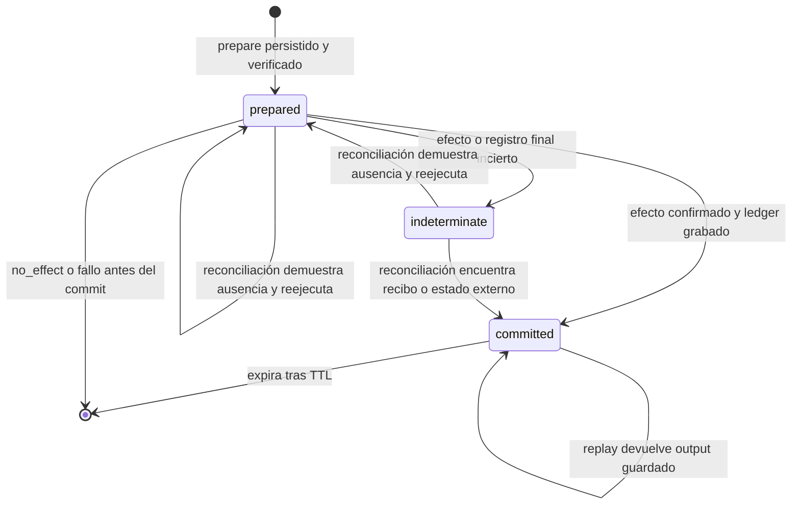

# Herramientas del agente, efectos e idempotencia

Las tools del chat forman una frontera entre texto generado por un proveedor y operaciones de dominio. `AGENT_TOOL_DEFINITIONS` es el catálogo canónico: para cada nombre fija descripción, `inputSchema` y efecto (`read`, `local_write` o `external_write`). A partir de ese catálogo se construyen las declaraciones de OpenAI, Anthropic y Google; en ejecución, el nombre se despacha a un `ToolHandler`, y las escrituras pasan además por `ToolOperationCoordinator` antes de alcanzar almacenamiento local o el servicio de feedback.

<!-- openwiki: broken internal link [../integrations/feedback-service.md] file "../integrations/feedback-service.md" does not exist. Fix the href or restore the target, then delete this comment. -->
Esta página desarrolla esa frontera y el protocolo de efectos. El bucle que obtiene las llamadas, preserva sus IDs de proveedor y envía los resultados de vuelta se describe en [Ciclo del agente y streaming multiproveedor](agent-loop.md). Los validadores reutilizados por cada handler se entienden como [contratos de dominio](../concepts/domain-contracts.md), y el único efecto externo se amplía en [Servicio de feedback](../integrations/feedback-service.md).

## Catálogo canónico y adaptación a proveedores

El catálogo contiene trece tools. La clasificación de efecto no es solo descriptiva: el guardrail sanitario consulta `agentToolEffect`; una tool desconocida o no permitida se bloquea antes del coordinador, y solo los efectos distintos de `read` usan el ledger durable.

| Efecto | Dominio | Tools | Responsabilidad |
| --- | --- | --- | --- |
| `read` | Memoria personal | `list_personal_data_keys`, `read_field_description`, `read_field_value` | Descubrir campos y leer descripción o valor sin exponer toda la memoria de una vez. |
| `read` | Medidas | `read_measurement` | Leer la medición de una fecha y señalar duplicados heredados. |
| `read` | Dieta y catálogos | `read_meal_foods`, `search_foods` | Leer una comida o buscar hasta 15 alimentos con metadatos de disponibilidad y referencias estables. |
| `read` | Entrenamiento y catálogos | `search_exercises`, `read_routines` | Buscar hasta 15 ejercicios o serializar las rutinas existentes. |
| `local_write` | Memoria personal | `save_personal_data` | Sustituir el conjunto saneado de datos personales y guardar un recibo de operación. |
| `local_write` | Medidas | `write_measurement` | Crear o parchear por fecha, conservar campos omitidos y borrar solo los incluidos en `clear_fields`. |
| `local_write` | Dieta | `add_meal_food` | Resolver una referencia de catálogo o entrada manual, validar nutrición y añadir una instantánea a una comida. |
| `local_write` | Entrenamiento | `create_routine` | Resolver ejercicios, validar la rutina completa y persistirla atómicamente. |
| `external_write` | Feedback | `create_feature_issue` | Crear una solicitud de mejora aprobada por el usuario mediante un contrato HTTP idempotente. |

`CHAT_TOOLS` proyecta cada definición sin mantener tres catálogos separados. OpenAI y Google reciben `type: "function"`, `name`, `description` y `parameters`; Anthropic recibe `name`, `description` e `input_schema`. Los tres comparten la misma instancia de `inputSchema`, de modo que nombres, enums y restricciones no divergen por proveedor. Los clientes solo adjuntan la proyección correspondiente al cuerpo de su API.

El subconjunto de JSON Schema soportado incluye objetos, arrays, strings, números y enteros, además de `required`, `enum`, límites, `minItems` y `additionalProperties`. `validateToolInput` implementa una validación recursiva y produce errores legibles; los tests también compilan todos los schemas con Ajv. Sin embargo, el despacho de producción no llama a este helper de forma centralizada: cada handler vuelve a validar y normalizar con su contrato de dominio. Por ello, endurecer el schema mejora lo que puede emitir el proveedor, pero no sustituye la validación defensiva en el ejecutor.

Hay dos compatibilidades deliberadas con schemas menos estructurados: `personal_data` y `add_meal_food.data` llegan como JSON textual y se desempaquetan dentro del handler. En cambio, `write_measurement.data` y toda la estructura de `create_routine.data` son objetos tipados. La rutina rechaza campos desconocidos, colecciones vacías, referencias inexistentes o ambiguas y valores fuera de contrato antes de crear IDs o escribir nada.

## Del proveedor al contrato de dominio

El flujo de ejecución es:

1. El loop de proveedor parsea los argumentos, asigna una `occurrence` y entrega un `ToolCallEnvelope` con `executionId`, proveedor, ID opaco de llamada, nombre y argumentos.
2. La app obtiene el efecto del catálogo y vuelve a clasificar `name + JSON.stringify(args)` con el guardrail sanitario. Un bloqueo devuelve un error estructurado al modelo y no prepara una operación.
3. Para lecturas, el coordinador llama directamente al ejecutor. Para escrituras, calcula identidad, consulta memoria y ledger, reconcilia y prepara de forma durable antes de invocar el handler.
4. `createDetailedAgentToolExecutor` busca el handler, inyecta dependencias y contexto, y traduce sus marcas a `committed`, `no_effect`, `failed_before_commit` o `indeterminate`. Una excepción no comprometida se convierte en resultado controlado en vez de abortar por sí sola todo el loop.
5. El handler delega la semántica en contratos de medidas, nutrición, catálogos, rutinas, memoria personal o feedback. Solo comunica éxito comprometido después de que la frontera durable correspondiente haya respondido.

En escrituras del `LocalStore`, `commitToolStore` espera `commitStore`; cualquier excepción se convierte en `ToolOperationIndeterminateError`, porque el llamador ya no puede distinguir “no se escribió” de “se escribió pero se perdió la confirmación”. `write_measurement`, `add_meal_food` y `create_routine` añaden el recibo en la misma transformación del store que el dato de dominio. `save_personal_data` hace lo equivalente en su store separado, serializa las escrituras, relee el valor y exige igualdad exacta. Así, el recibo prueba el commit de dominio, no meramente que el handler empezó.

### Contratos relevantes por dominio

- **Medidas:** valida fecha y patch, redondea mediante el contrato de medidas, actualiza una única medición por fecha y se niega a decidir si ya existen duplicados.
- **Dieta:** una referencia `source_id`/`item_id` resuelta toma los nutrientes canónicos por 100 g y calcula una instantánea para los gramos pedidos. El formato heredado por nombre no escribe si el match es ambiguo.
- **Rutinas:** `prepareRoutineCreation` resuelve referencias de catálogo, valida series normales, tempo y compuestas, y después pasa el candidato por `validateWorkoutTemplateForWrite`. Con `operationId`, IDs de plantilla, ejercicios, series y subseries son deterministas; una repetición de la misma operación encuentra la plantilla existente en vez de añadir otra.
- **Feedback:** el cliente envía únicamente versión de schema, tipo, título, resumen e `idempotency_key`. Solo un 2xx con número y URL verificables produce `created`; ante timeout, transporte, rate limit o error consulta el estado por la misma clave antes de concluir.

## Identidad de operación

La identidad no depende del ID de llamada que inventa el proveedor, porque este puede cambiar cuando se repite una generación. `identifyToolOperation` ordena recursivamente las claves JSON y calcula dos SHA-256:

- **`fingerprint`:** hash de nombre y argumentos canónicos. Permite detectar que un `operationId` almacenado no corresponde al mismo contenido; una colisión hace fallar cerrado sin ejecutar.
- **`operationId`:** hash versionado de `executionId`, proveedor, nombre, argumentos canónicos y `occurrence`. Es la clave que enlaza ledger, IDs deterministas, recibos locales y clave idempotente externa.

`executionId` permanece estable en los reintentos del mismo envío. `occurrence` es un contador por combinación de nombre y argumentos canónicos dentro del loop: la primera aparición vale 0; si el modelo solicita intencionadamente la misma operación otra vez en el mismo turno, vale 1 y genera otra identidad. En cambio, un replay del proveedor vuelve a producir la misma secuencia y conserva la identidad. El `providerCallId` queda fuera del hash, por lo que regenerarlo no duplica el efecto.

## Ledger, recibos y protocolo durable

El ledger de operaciones vive en una clave de `AsyncStorage` separada del dato de dominio. Antes del efecto, `prepare` persiste y relee el documento para verificar exactamente la escritura. Después, `commit` conserva también el resultado textual, lo que permite devolverlo por **replay** sin volver a ejecutar. Las escrituras concurrentes se serializan, y dos llamadas simultáneas con el mismo `operationId` se unen a la misma promesa en vuelo.

Los **recibos** viven junto al estado que demuestra el efecto: `{ operationId, toolName, committedAt }`. No contienen argumentos, conversación ni output. Son necesarios porque el dato y el ledger no comparten una transacción: el dato local puede haberse confirmado y fallar justo después la grabación de `committed` en el ledger. En ese caso el reconciliador inspecciona el store recuperable o la memoria personal y convierte el recibo en prueba positiva. Para `create_feature_issue`, la prueba equivalente es el endpoint de estado de la operación externa.



*El estado durable se prepara antes del efecto; solo una prueba de ausencia autoriza reejecutar una operación no resuelta, mientras `committed` se reproduce sin repetirla.*

La reconciliación ocurre tanto al recibir una llamada como, una vez hidratada la app, mediante `reconcileUnresolved`. Sus resultados tienen semántica estricta:

- `committed`: hay prueba positiva; se repara el ledger y se devuelve un mensaje de reconciliación o la referencia externa.
- `not_committed`: hay prueba suficiente de ausencia; se puede preparar y ejecutar, o descartar un pendiente durante la reconciliación de arranque.
- `indeterminate`: no hay prueba en ninguna dirección; se conserva el estado y se muestra el mensaje que pide revisar los datos.

Un resultado indeterminado **no se reintenta a ciegas**. La respuesta perdida puede haber ocurrido después del commit: repetir `add_meal_food` añadiría dos alimentos, repetir `create_routine` podría crear otra rutina y repetir el POST de feedback podría abrir otra incidencia. “No vi confirmación” no equivale a “no hubo efecto”. Solo un recibo/estado confirma el commit, y solo una ventana de recibos íntegra puede demostrar su ausencia.

### TTL y capacidad

Ledger y recibos usan una ventana de siete días y un máximo de 256 entradas, pero con matices importantes:

- El ledger elimina `committed` caducados y, al superar capacidad, expulsa primero los confirmados más antiguos. Nunca expulsa `prepared` o `indeterminate` para hacer sitio; si 256 operaciones siguen sin resolver, falla con `ToolOperationLedgerCapacityError` antes de abrir otra escritura. Aunque cada entrada no resuelta contiene `expiresAt`, la retención actual no la caduca automáticamente: prioriza no olvidar una incertidumbre.
- La caché volátil de resultados confirmados usa el mismo TTL y límite; acelera replays dentro del proceso, pero el ledger sigue siendo la fuente tras reiniciar.
- Los recibos se deduplican por `operationId`, descartan inválidos o mayores de siete días y retienen los 256 más recientes. La ausencia solo es demostrable si `preparedAt` aún está dentro del TTL y el recibo no pudo ser expulsado por capacidad. Si esa garantía se perdió, el resultado correcto es `indeterminate`, no `not_committed`.

El ledger acepta y migra su schema v1 de operaciones confirmadas a v2. JSON corrupto, lectura fallida, colisión de identidad o una preparación no verificable cierran el paso al efecto. Si el borrado de datos incrementa la generación del coordinador mientras una acción termina, ese resultado tardío no repuebla el journal borrado.

## Fallos e invariantes de cambio

1. **Preparar antes de actuar.** Si no se puede persistir y verificar `prepared`, el handler de escritura no se invoca.
2. **Commit de dominio antes que éxito.** Una mutación de React o un callback iniciado no basta; las tools locales esperan el commit durable y las externas una referencia verificable.
3. **Recibo y dato local son atómicos entre sí.** No añadir el recibo en una escritura posterior, porque se recrearía la ventana que la reconciliación pretende cerrar.
4. **La validación no se memoriza como efecto.** `no_effect` y `failed_before_commit` eliminan `prepared`; una corrección posterior con la misma identidad no queda atrapada por un resultado de validación anterior.
5. **Las lecturas no se deduplican.** Siempre se ejecutan contra el estado actual y no ocupan ledger.
6. **No registrar payloads.** Las trazas del coordinador contienen fase, estado, origen y nombre de tool, pero no `operationId`, argumentos, contenido ni output.
7. **No confundir `setStore` con `commitStore`.** Las rutas de escritura requieren la segunda; no deben confirmar basándose solo en estado UI en memoria.

## Extensión segura

Para añadir una tool:

1. Incorporar una única definición a `AGENT_TOOL_DEFINITIONS`, con efecto correcto y schema compatible con los tres proveedores.
2. Añadir exactamente un handler con el mismo nombre; el test de paridad catálogo–ejecutor evita tools anunciadas pero no implementadas.
3. Delegar validación y construcción al contrato de dominio. Los errores esperables deben devolver un resultado sin efecto, no lanzar después de mutar.
4. Si escribe localmente, aceptar `operationId`, generar IDs estables cuando cree entidades y añadir un recibo en el mismo commit. Registrar además un texto seguro en `RECONCILED_TOOL_OUTPUTS` y enseñar al reconciliador dónde comprobarlo.
5. Si escribe fuera del dispositivo, propagar una clave idempotente y ofrecer consulta de estado por esa clave. Sin reconciliador no existe una forma segura de recuperar un `prepared` tras reinicio.
6. Añadir pruebas de schema, handler, commit ambiguo, replay y reconciliación. Revisar también el efecto frente al guardrail sanitario.

## Pruebas enfocadas

El conjunto que protege esta arquitectura cubre responsabilidades distintas:

- `toolDefinitions.test.ts`: unicidad, efectos, compilación Ajv, paridad con handlers y proyecciones exactas por proveedor.
- `toolExecutor.test.ts`: despacho, contratos de medidas/dieta/rutinas, commits durables, estados detallados e IDs idempotentes.
- `routineCreationContract.test.ts`: rechazo atómico, resolución de catálogo, series avanzadas y propiedades sobre entradas arbitrarias.
- `toolOperationLedger.test.ts`: canonicalización, `occurrence`, prepare-before-effect, concurrencia, replay tras reinicio, TTL/capacidad, corrupción, reconciliación y privacidad de trazas.
- `toolOperationReceipts.test.ts`: forma mínima del recibo y condiciones bajo las que su ausencia es concluyente.
- `feedbackPipeline.test.ts`: recorrido SSE → loop → ejecutor → HTTP y la invariante de no anunciar una incidencia sin referencia verificable.

```bash
npx vitest run apps/mobile/agent/toolDefinitions.test.ts apps/mobile/agent/toolExecutor.test.ts apps/mobile/agent/routineCreationContract.test.ts apps/mobile/agent/toolOperationLedger.test.ts apps/mobile/agent/toolOperationReceipts.test.ts apps/mobile/agent/feedbackPipeline.test.ts
```

## Runtime: Observado, Correlacionado e Hipótesis

<!-- openwiki: broken internal link [../operations/runtime-behavior.md] file "../operations/runtime-behavior.md" does not exist. Fix the href or restore the target, then delete this comment. -->
La consolidación operativa debe vivir en [Comportamiento en runtime](../operations/runtime-behavior.md), con enlace de retorno a esta página. No se encontraron aquí datos LangSmith inspeccionables que permitan afirmar frecuencia por tool, rutas activas o inactivas, repeticiones, fricción de schema, latencia o tokens; por tanto no se reproducen argumentos, inputs ni outputs de traces ni se inventan métricas.

- **Observado:** no se incorpora ninguna afirmación procedente de trazas LangSmith en esta edición.
- **Correlacionado:** el código y los tests demuestran límites y rutas posibles —13 tools, máximo 15 resultados de búsqueda, ledger y recibos de 256 entradas y TTL de siete días—, pero no su utilización real ni coste en producción.
<!-- openwiki: broken internal link [../operations/runtime-behavior.md] file "../operations/runtime-behavior.md" does not exist. Fix the href or restore the target, then delete this comment. -->
- **Hipótesis:** métricas agregadas por nombre de tool, efecto, fase terminal, ordinal de `occurrence`, duración y tokens del turno permitirían distinguir rutas inactivas, schemas que provocan correcciones y replays frecuentes. Deben excluir argumentos, outputs, `operationId` y contenido conversacional, y validarse en [Comportamiento en runtime](../operations/runtime-behavior.md) antes de promoverse a “Observado”.
