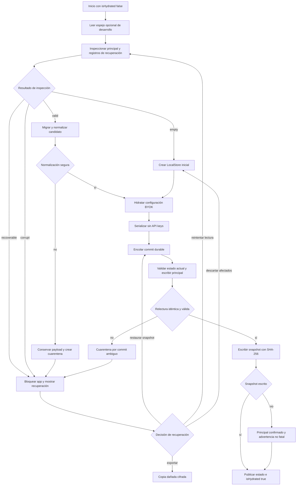

# Estado local, persistencia y recuperación

Gymnasia es *local-first*: la aplicación puede arrancar y operar con los datos del dispositivo sin depender de una base de datos remota. El centro de este diseño es `LocalStore`, un agregado en memoria respaldado por `AsyncStorage`, pero la arquitectura no trata cada cambio de React como una escritura confirmada. La hidratación valida y normaliza antes de publicar el estado; los commits durables se serializan, se releen para verificar su resultado y mantienen una copia íntegra; la corrupción activa una cuarentena que impide sobrescribir datos hasta que la persona elige una resolución.

## Qué pertenece a `LocalStore`

`LocalStore` reúne las rutinas, el historial de entrenamientos, dieta y ajustes de dieta, medidas, hilos y mensajes, configuración de proveedores, proveedores elegidos y recibos de operaciones de tools. `createInitialStore()` crea los contenedores vacíos, un primer hilo con el mensaje de identidad del asistente, la configuración de proveedores predeterminada y una lista vacía de recibos.

No todo el estado local está dentro del agregado. La sesión de entrenamiento activa, su snapshot y borrador de rutina, las preferencias, la memoria del coach, los alimentos personales, diagnósticos, catálogos y el ledger de operaciones usan claves independientes. Esta separación permite hidratar y recuperar el agregado principal sin confundir un fallo secundario con una pérdida total, y permite que el borrado de actividad conserve preferencias o credenciales cuando corresponde.

La representación durable principal se obtiene con `serializeStoreForAsyncStorage()`: conserva la forma del agregado, pero vacía `api_key`. Antes de usar datos leídos, `normalizeStore()` reconstruye una forma canónica: completa proveedores, normaliza dieta, mensajes y títulos, migra series heredadas, sella versiones, normaliza medidas, ordena y limita el historial a 180 elementos y normaliza los recibos de tools. Los problemas reparables de entrenamiento se registran por código y conteo y no deben enviar por sí solos todo el almacén a recuperación; un fallo semántico que no puede normalizarse con seguridad sí se pone en cuarentena.

## Claves y aislamiento por variante

Las claves se derivan mediante `scopedStorageKey()` y `scopedSecureStoreKey()` a partir de la variante validada en tiempo de ejecución:

| Variante | Namespace | `AsyncStorage` | `SecureStore` |
| --- | --- | --- | --- |
| `development` | `gymnasia.development` | prefijo `gymnasia.development:` | prefijo `gymnasia.development.` |
| `staging` | `gymnasia.staging` | prefijo `gymnasia.staging:` | prefijo `gymnasia.staging.` |
| `production` | `gymnasia.production` | conserva la clave histórica sin prefijo | conserva la clave histórica sin prefijo |

La configuración pública debe coincidir en entorno, canal, namespace y modo de proveedor; una configuración híbrida se rechaza. De este modo, una build de desarrollo o staging no lee ni borra accidentalmente el estado de producción. La familia principal usa las claves lógicas `gymnasia.mobile.local.v3`, `gymnasia.mobile.local.last_good.v1` y `gymnasia.mobile.local.quarantine.v1`; los datos de una sesión activa son dependencias separadas que se descartan junto con el agregado cuando una recuperación empieza desde cero.

## Hidratación y publicación del estado

El arranque mantiene `isHydrated` en `false` hasta terminar el recorrido completo:

1. Si está habilitado, intenta leer el espejo de desarrollo; después `LocalStoreRecoveryRepository.inspect()` lee primero la clave principal. El espejo solo actúa como `fallbackRaw` cuando la principal no existe, no sustituye una principal corrupta.
2. `parseLocalStoreRaw()` analiza JSON, añade contenedores raíz ausentes mediante una migración idempotente y valida la estructura y los proveedores. Un almacén realmente ausente y sin snapshot ni cuarentena se distingue de un fallo de lectura.
3. Un candidato estructuralmente válido pasa por `normalizeStore()`. Si la normalización inesperadamente falla, se conserva el payload original y se crea la cuarentena.
4. Se incorporan credenciales heredadas seguras y se hidrata el repositorio dedicado de proveedores. Después se serializa la forma canónica sin claves dentro del agregado principal y se hace un commit para crear o refrescar el snapshot recuperable.
5. Se leen y normalizan los almacenes secundarios. Sus fallos producen una advertencia no fatal y no autorizan a sobrescribir el principal.
6. Solo al final `replace()` publica el agregado hidratado y la aplicación marca `isHydrated = true`. Intentos de hidratación antiguos se invalidan mediante un número de intento para que una respuesta tardía no reemplace el resultado más reciente.

*El diagrama muestra las ramas de hidratación, commit verificado, snapshot y recuperación sin promover automáticamente datos dudosos.*

## Actualización React frente a commit durable

`LocalStoreRuntime` expone dos operaciones deliberadamente distintas:

- `update(mutator): void` es una actualización React ordinaria. Cambia el estado visible y un efecto posterior intenta persistir el snapshot más reciente. Es apropiada para estado de interfaz o cambios donde la UI puede ser optimista, pero su retorno no prueba que el dato haya llegado al almacenamiento.
- `commit(mutator): Promise<void>` es la frontera durable. Encola el trabajo, calcula el siguiente estado desde la referencia actual, espera `persist(next)` y solo entonces publica `next`. Si otra actualización React ocurrió mientras se esperaba, reaplica el mutador sobre el estado actual en vez de descartar ese cambio.

La cola continúa después de un rechazo, pero cada llamador recibe el éxito o error de su propia operación. Por eso una operación que produce un efecto externo, un recibo idempotente o un mensaje de «guardado» **no puede confirmar éxito antes de resolver `commit()`**. Un `setState`, el mero cálculo del nuevo objeto o la escritura inicial de `AsyncStorage` no bastan: el commit principal solo es confirmado después de releer exactamente el mismo JSON y volver a validarlo. Las operaciones del agente adaptan esta frontera como `commitToolStoreMutation`; la configuración BYOK usa su propio commit transaccional y no actualiza el estado visible hasta recibir `status: "committed"`.

Existe además un efecto de persistencia de respaldo para cambios realizados con `update()`. Comparte `enqueuePersistence()` con los commits explícitos, descarta snapshots React ya obsoletos y, ante un commit ambiguo o un bloqueo de recuperación, vuelve a poner la aplicación en modo no hidratado. No convierte a `update()` en una confirmación durable: los errores se notifican después y el llamador original no puede esperarlos.

## Protocolo del commit principal y snapshot

`LocalStoreRecoveryRepository` ejecuta `commit()`, `resolveCurrent()`, restauraciones y borrados de forma exclusiva. Un commit normal cumple este orden:

1. Rechaza el JSON si no supera migración y validación estructural.
2. Comprueba de nuevo el principal justo antes de reemplazarlo. Si ya existe cuarentena, la lectura falla, el principal se corrompió desde la hidratación o desapareció mientras había un snapshot, crea o conserva la cuarentena y lanza `LocalStoreRecoveryLockedError`.
3. Escribe el payload principal.
4. Lo relee y exige igualdad byte a byte y validez estructural. Si no puede demostrar ambas, registra `commit_verification_failed` y lanza `LocalStoreCommitAmbiguousError`.
5. Crea un `RecoverySnapshotRecord` versión 1 con fecha, payload y SHA-256, y actualiza la copia rodante.

El snapshot nunca se acepta solo porque sea JSON: se verifica versión, forma, hash y validez del payload. Si falla únicamente la escritura del snapshot, el principal ya está confirmado y se lanza `LocalStoreSnapshotWriteError`; la aplicación lo trata como advertencia no fatal y conserva el snapshot anterior. Esta distinción evita comunicar que «no se guardó» cuando el dato principal sí quedó durable, pero deja claro que la capacidad de recuperación no se actualizó.

## Cuarentena y estados de recuperación

La inspección produce cuatro estados:

| Estado | Significado | Comportamiento |
| --- | --- | --- |
| `empty` | No hay principal, snapshot ni cuarentena. | Se puede crear el estado inicial. |
| `valid` | Hay un candidato estructuralmente válido. | Se normaliza y se confirma canónicamente. |
| `recoverable` | Hay cuarentena y un snapshot válido, o el principal actual volvió a ser válido pero persiste un bloqueo anterior. | Se detiene la app y se ofrecen acciones explícitas. |
| `corrupt` | Hay daño o indisponibilidad sin snapshot utilizable. | Se detiene la app; no se sobrescribe el principal. |

La cuarentena conserva versión, fecha, origen, causa, payload crudo cuando pudo leerse, SHA-256 e incidencias estructuradas. Los mensajes de validación incluyen rutas y códigos, pero evitan copiar valores o nombres desconocidos potencialmente sensibles. La primera cuarentena válida se conserva a través de reinicios: un arranque posterior no la borra solo porque el principal vuelva a parecer válido.

Las resoluciones son explícitas:

- **Recuperar última copia** vuelve a confirmar el snapshot verificado y solo entonces elimina la cuarentena.
- **Volver a intentarlo** repite la lectura y, si obtiene y confirma un estado canónico, usa `resolveCurrent()` para retirar el bloqueo.
- **Guardar copia dañada** exporta el registro de recuperación cifrado con una contraseña elegida por la persona. Puede contener salud, conversaciones y, en web, credenciales.
- **Descartar y empezar de cero** elimina principal, snapshot, cuarentena y claves dependientes de sesión, crea un agregado inicial y lo confirma. Conserva almacenes independientes como preferencias, memoria, alimentos personales y configuración BYOK válida.

`resolveCurrent()` y `restoreSnapshot()` son las únicas rutas que permiten reemplazar el principal bajo recuperación y eliminan la cuarentena después del commit verificado. El borrado completo, en cambio, elimina la familia gestionada sin recrear un snapshot vacío.

## Credenciales BYOK: almacén dedicado

Las credenciales no dependen del ciclo de snapshots del agregado. `ProviderConfigurationRepository` mantiene un journal versionado con `committed`, `pending` y una `revision`, y serializa hidratación, commits y borrado en su propia cola.

- **Móvil nativo:** el journal canónico, incluidas `api_key` y configuración sensible, vive en `SecureStore`. `AsyncStorage` recibe un espejo saneado con las API keys vacías. En el cierre de un commit se escribe primero el espejo saneado y luego el registro seguro, que funciona como marcador canónico final.
- **Web:** no existe un equivalente seguro de `SecureStore`; el journal dedicado completo se guarda en `AsyncStorage` y, en el navegador, termina en `localStorage`. La interfaz debe tratarlo como almacenamiento local no seguro y advertirlo.
- **Agregado principal:** siempre elimina `api_key` al serializar. Durante una migración puede mezclar claves heredadas leídas de almacenamiento seguro, hidratar el journal nuevo y limpiar las claves antiguas; eso no vuelve al snapshot principal una bóveda de credenciales.

Cada commit de proveedor normaliza las tres configuraciones y garantiza un único proveedor activo. Primero escribe un journal con el candidato en `pending`; después verifica que la operación siga vigente, promueve el candidato a `committed` y elimina `pending`. Si una operación de UI fue reemplazada por otra o una escritura falla, restaura el commit anterior. En el siguiente arranque un `pending` superviviente nunca se promociona automáticamente: gana el último `committed`, o se migra el valor heredado con revisión 0 si no había uno.

## Diferencias móvil, web y espejo de desarrollo

Tanto móvil como web usan la interfaz `AsyncStorage`; en el export web está respaldada por `localStorage`. Las diferencias importantes son el tratamiento de BYOK descrito arriba y algunas capacidades nativas ajenas al agregado. La web sigue usando el mismo protocolo de validación, cuarentena, relectura y snapshot.

El archivo `apps/mobile/.dev-store.json` **no es almacenamiento de producción ni una fuente autoritativa**. Es un espejo opcional para desarrollo web que permite sobrevivir reinicios de Metro. Solo se consulta o escribe cuando coinciden `Platform.OS === "web"`, `__DEV__` y `EXPO_PUBLIC_DEV_STORE_MIRROR=1`; `npm --workspace apps/mobile run web:mirror` activa ese modo. El cliente ignora errores del espejo para no convertir una comodidad de desarrollo en requisito de ejecución.

El middleware `/dev-store` limita peticiones a loopback y mismo origen, no habilita CORS, acepta solo `GET` y `POST` JSON, limita el cuerpo a 5 MiB y valida un esquema cerrado. Sanea recursivamente nombres sensibles —incluidos `api_key`, `workspace_id`, tokens, contraseñas y secretos— tanto al leer como al escribir. Las escrituras se serializan y reemplazan el archivo atómicamente con permisos `0600`. Aun así, el espejo solo sirve de fallback si falta el principal del navegador; jamás se usa para ocultar corrupción del almacenamiento real.

## Invariantes para cambios seguros

- Toda nueva propiedad raíz durable debe añadirse de forma coherente a `LocalStore`, migración, validación, normalización y política del espejo de desarrollo. De lo contrario, una build nueva puede rechazar sus propios datos o el middleware puede responder `422`.
- Una migración estructural debe ser idempotente y no inventar datos de usuario. La normalización reparable pertenece después del portero estructural; la corrupción irrecuperable debe conservar el payload original.
- No se debe escribir directamente la clave principal desde una feature. Hay que pasar por `LocalStoreRuntime.commit()` o por la cola de persistencia y `LocalStoreRecoveryRepository`, para conservar orden, verificación, snapshot y bloqueo.
- No se deben volver a introducir credenciales en `serializeStoreForAsyncStorage()`, snapshots, trazas ni el espejo de desarrollo. En web, el único lugar persistente previsto para BYOK es el journal dedicado, con la limitación de seguridad comunicada al usuario.
- Añadir una clave local requiere decidir su namespace, si depende del agregado, cómo se hidrata ante fallo y qué hacen los borrados de actividad y de datos personales.
- Una pantalla no debe anunciar éxito durable al iniciar una promesa. Debe esperar el `commit()` correspondiente y representar por separado fallo del principal, commit ambiguo y fallo exclusivo del snapshot.

## Pruebas que protegen el contrato

Las pruebas de recuperación ejercitan los casos con mayor riesgo: migraciones idempotentes sobre árboles JSON arbitrarios, mensajes de validación que no filtran secretos, cuarentena byte a byte sin sobrescribir el principal, rechazo de snapshots manipulados, bloqueo durable entre reinicios, corrupción posterior a la hidratación, verificación antes del snapshot, conservación del snapshot anterior y resolución solo después de un commit confirmado. También comprueban que un fallo de lectura no se clasifique como almacén vacío y que el descarte afecte únicamente a claves dependientes.

Las pruebas del modelo verifican el saneado de credenciales y la reintegración desde almacenamiento seguro. Las del repositorio de proveedores cubren la diferencia web/nativo, rollback ante fallo de la escritura segura final, invalidación de operaciones obsoletas, concurrencia sin perder actualizaciones y descarte de journals que solo contienen `pending`. El pipeline de entrenamiento comprueba que datos reparables no bloqueen el arranque, mientras que un tipo incompatible sí sea detenido por el portero estructural.

## Puntos de entrada principales

- `useLocalStoreRuntime()` define la API de lectura, `update`, `commit`, reemplazo tras hidratación y cola compartida.
- `runLocalStoreHydration()` en `App.tsx` compone inspección, normalización, BYOK, commit canónico, almacenes secundarios y publicación React.
- `LocalStoreRecoveryRepository` es la frontera durable del agregado y de sus registros de snapshot/cuarentena.
- `ProviderConfigurationRepository` es la frontera durable independiente de configuración y credenciales BYOK.
- `LocalStoreRecoveryScreen` presenta las decisiones de restaurar, exportar, reintentar o descartar sin continuar silenciosamente con datos ambiguos.
