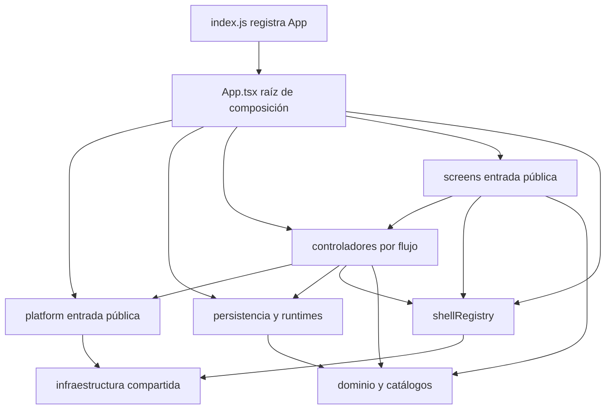
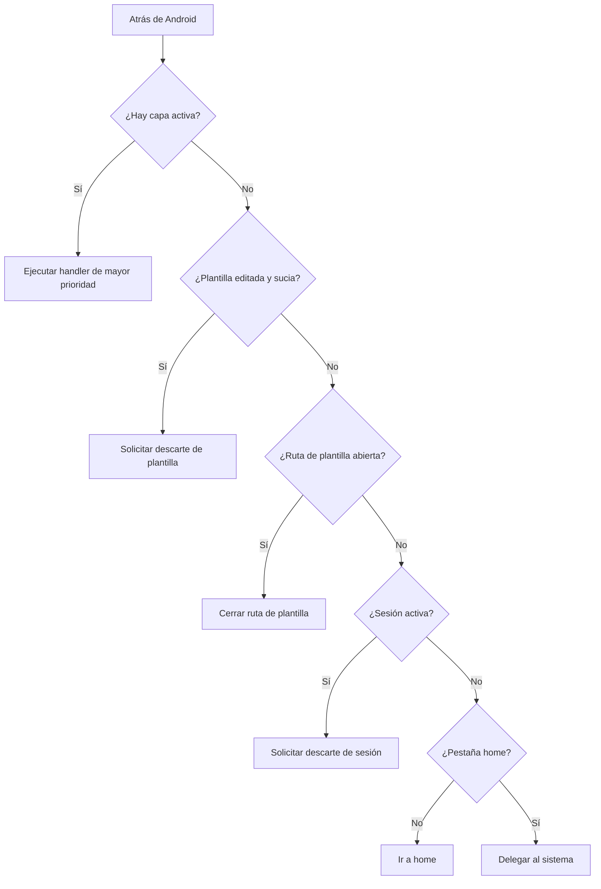

# Composición móvil, capas y shell

La aplicación Expo entra por `apps/mobile/index.js`, que registra `App`, pero **`apps/mobile/App.tsx` es la raíz de composición efectiva**. Allí se crean los runtimes de larga vida, se inyectan almacenamiento y servicios de plataforma, se conectan los controladores con las pantallas y se decide qué superficie del shell está visible. Es el lugar correcto para cablear dependencias y coordinar políticas globales; no es el lugar recomendado para añadir reglas de dominio ni implementar una pantalla completa.

Esta separación importa al cambiar UI o servicios: una pantalla debería seguir consumiendo un modelo y acciones, un controlador debería adaptar contratos y servicios sin renderizar React Native, y el acceso concreto a Expo debería cruzar la fachada de plataforma. Los cálculos y contratos de negocio relacionados se describen en [Contratos de dominio](../concepts/domain-contracts.md), mientras que la propiedad y persistencia del estado se amplían en [Estado local-first](./local-first-state.md).

## Mapa de composición y dirección permitida



*El diagrama muestra composición de arriba abajo; las flechas son dependencias permitidas, no llamadas obligatorias entre todas las capas.*

La política automática es más precisa que este resumen: clasifica cada módulo y enumera, por capa, los destinos permitidos. Sus límites principales son:

- **`App.tsx`** ensambla el sistema. Puede depender de las entradas públicas de las capas inferiores, pero una nueva operación de negocio debe extraerse al dominio o a un controlador en vez de aumentar la raíz.
- **`controllers/`** contiene hooks y estado de interacción que convierten datos de dominio, persistencia y plataforma en contratos de pantalla. La política les prohíbe importar `react-native` y los paquetes Expo concretos.
- **`screens/`** presenta la UI. Puede usar React Native y contratos públicos, pero no debe abrir por su cuenta almacenamiento, archivos, picker, notificaciones o credenciales de Expo.
- **`platform/`** concentra las implementaciones concretas de almacenamiento, almacenamiento seguro, red, audio, archivos, selección de imágenes/documentos, compartir y APIs nativas. No depende de React ni de dominios.
- **`training/`, `diet/` y `measurements/`** alojan contratos, normalización y cálculos reutilizables; el check les impide depender de React, React Native o Expo.
- **`shell/`** define destinos y política global de Atrás sin depender de controladores ni pantallas.

No toda dependencia válida permite importar cualquier archivo interno. `scripts/mobile-boundaries/policy.json` declara **entradas públicas** para los cruces de capa: por ejemplo, `platform/index.ts`, `screens/index.ts`, `shell/shellRegistry.ts`, los controladores publicados y módulos concretos de dominio o persistencia. Así, una pantalla nueva se exporta desde `screens/index.ts`; un consumidor no debe saltarse esa fachada importando su archivo privado. Dentro de una misma capa sí pueden existir colaboraciones internas.

## Qué compone la raíz

### Plataforma y persistencia

`platform/index.ts` construye `APP_PLATFORM_SERVICES`, una fachada tipada sobre implementaciones Expo y React Native. `App.tsx` la desestructura para integraciones globales y también la entrega como `services` a runtimes que la necesitan. Esto mantiene sustituible el borde de infraestructura y evita que controladores y pantallas acumulen imports nativos directos.

La raíz crea una sola instancia React de `useLocalStoreRuntime` dentro de `GymnasiaApp`. El runtime expone la instantánea actual, `update` para cambios ordinarios y `commit` para operaciones que deben persistir antes de publicar el nuevo estado; su cola serializa los commits. Sobre ese runtime se montan catálogos, preferencias, dieta, mediciones, entrenamiento, ajustes y otros flujos. Como `GymnasiaApp` no se desmonta al cambiar de pestaña, esos runtimes y su estado sobreviven a la navegación entre destinos.

La excepción intencionada es un borrado/reset global: `App` incrementa `runtimeGeneration` y lo usa como `key` de `GymnasiaApp`, forzando un remontaje limpio del árbol interior. `SafeAreaProvider` permanece por encima de ese límite.

### Arranque y recuperación

La hidratación es una barrera del shell, no una responsabilidad de cada pantalla. La raíz inspecciona el almacén recuperable, normaliza la instantánea, mezcla configuración segura y restaura los runtimes. Mientras tanto muestra carga; si detecta datos recuperables o corruptos devuelve `LocalStoreRecoveryScreen`, y ante un fallo de arranque devuelve `LocalStoreStartupFailureScreen`. Solo tras completar la hidratación marca `isHydrated` y habilita efectos dependientes de datos, como reconciliación de operaciones o persistencia posterior.

Este orden evita que una pantalla actúe sobre el estado inicial vacío y evita confirmar escrituras cuando el almacén está en cuarentena. Un fallo ambiguo o un bloqueo durante una persistencia vuelve a cerrar la barrera y deriva de nuevo a recuperación o fallo de arranque. Véase [Estado local-first](./local-first-state.md) para las garantías de commit y recuperación.

### Controladores como contrato de pantalla

El contrato común es:

```ts
type ScreenController<Model, Actions, Layer extends ShellLayerId = never> = {
  model: Readonly<Model>;
  actions: Readonly<Actions>;
  back: {
    layers: Record<Layer, boolean>;
    handlers: Record<Layer, () => boolean>;
  };
};
```

- `model` es la proyección de solo lectura que renderiza la vista.
- `actions` expresa intenciones de UI sin exponer setters o servicios concretos.
- `back` declara qué capas del flujo están activas y cómo cerrarlas.

`useHomeController` ilustra la adaptación: selecciona la rutina destacada, combina historial, catálogo, dieta y mediciones para formar `HomeScreenModel`, y ofrece acciones para abrir o iniciar entrenamiento. `useChatController` proyecta el estado del chat y registra `byok-explanation` como capa cerrable. Ambos conservan callbacks estables mediante refs a los destinos más recientes, por lo que una pantalla memorizada no necesita recibir una función nueva en cada render para ejecutar la acción actual.

En el render, la raíz elige el destino por `tab` y entrega normalmente `controller.model` y `controller.actions`. Entrenamiento tiene rutas anidadas exclusivas —sesión, historial, detalle, editor o lista— y los overlays se montan junto al contenido principal para que su visibilidad participe en el shell. `AppShell.tsx` contiene piezas transversales de presentación como cabecera, navegación compacta/escritorio, skeletons y acciones flotantes; no es otro router ni propietario del estado global.

## Navegación y contrato de Atrás

### Un registro, dos presentaciones

`TAB_DESTINATIONS` es la fuente única de los seis destinos (`home`, `training`, `diet`, `measures`, `chat`, `settings`), sus etiquetas, iconos y `testID`. Tanto la barra compacta como `DesktopSidebar` iteran ese registro. El layout de escritorio solo se activa en web desde `DESKTOP_WEB_MIN_WIDTH` (960 px); Android e iOS conservan navegación compacta aunque la ventana sea ancha.

Cambiar un destino exige actualizar el registro y sus consumidores, no duplicar un array local en `App.tsx`. Además, debe conservarse la capacidad del shell de volver a `home` desde cualquier pestaña secundaria.

### Prioridad global de capas

`SHELL_BACK_LAYERS` es una lista ordenada con prioridades explícitas y únicas. Cada entrada declara identidad, alcance, propietario, comportamiento esperado y `testID`. `resolveShellBackCommand` recorre esa lista y selecciona **una sola capa activa: la de mayor prioridad**. Si ninguna capa está activa, aplica esta secuencia:

1. un editor de plantilla sucio solicita confirmación de descarte;
2. cualquier otra ruta de plantilla abierta se cierra;
3. una sesión activa solicita confirmación de descarte;
4. una pestaña distinta de `home` vuelve a `home`;
5. en `home`, sin capas ni rutas activas, devuelve `delegate-system` y no consume Atrás.



*La resolución de Atrás cierra primero la superficie visual superior y solo después aplica los fallbacks de ruta, sesión, pestaña y sistema.*

`App.tsx` agrega los `back.layers` de todos los controladores y los estados que todavía son globales en un `ShellLayerState` exhaustivo; compone, asimismo, un handler para cada `ShellBackCommand`. En Android instala exactamente una suscripción estable a `BackHandler`. Esa función consulta un ref actualizado en cada render, de modo que no captura estado obsoleto ni reinstala listeners cuando cambia una capa.

Las superficies propiedad de un `Modal` nativo o del sistema de arranque están registradas aparte en `SYSTEM_OWNED_SHELL_SURFACES`: no entran en el listener global. Su cierre se delega a `onRequestClose` o a la propia pantalla de recuperación. Mezclarlas con `SHELL_BACK_LAYERS` produciría doble manejo o permitiría atravesar una barrera de arranque.

### Invariantes al añadir UI

Para una nueva capa, modal o ruta anidada:

1. registrar su ID, prioridad única, alcance, comportamiento y `testID` en `shellRegistry.ts`;
2. hacer que su controlador publique visibilidad y cierre en `back`, salvo que sea estado verdaderamente global de composición;
3. agregar de forma exhaustiva estado y handler en la composición de `App.tsx`;
4. aplicar el `testID` canónico a la superficie renderizada;
5. colocarla en el orden visual compatible con su prioridad y verificar superposiciones;
6. si es un `Modal` nativo o una barrera de arranque, registrarla como propiedad nativa/sistema y no en el `BackHandler` global.

El handler debe cerrar el estado acoplado completo, no solo ocultar un booleano. También debe respetar operaciones ocupadas: por ejemplo, el borrado de datos consume Atrás pero no se cierra mientras está en curso.

## Control automático de límites

Ejecutar desde la raíz del repositorio:

```bash
npm run check:mobile-boundaries
npm run test:mobile-boundaries
```

El checker usa el parser de TypeScript para recoger `import`, reexports, `import =`, `require()` e imports dinámicos con literal. Resuelve extensiones e `index`, clasifica todos los módulos no excluidos, construye el grafo local y falla ante:

- archivos o destinos sin capa;
- imports locales no resolubles;
- dependencias entre capas no autorizadas;
- cruces que evitan una entrada pública;
- paquetes externos prohibidos para una capa;
- ciclos locales;
- excepciones `legacyImports` que ya no se usan.

La política actual tiene `legacyImports: []`: no existe una vía heredada aceptada para saltarse los límites. El check estructural no demuestra que un modelo de pantalla sea correcto ni que una prioridad corresponda al orden visual; para eso están las pruebas del shell.

## Validación enfocada

- `npm run test:mobile-boundaries` prueba que se acepten entradas públicas e imports dinámicos y que se rechacen imports privados, APIs de plataforma prohibidas y ciclos.
- Las pruebas de `shellRegistry` verifican destinos, umbral responsive, unicidad y orden de prioridades, selección determinista de la capa superior y toda la secuencia de fallback. También comprueban que el callback estable lea el ref más reciente.
- El contrato estático del shell comprueba una única suscripción `BackHandler`, cobertura exhaustiva de estados/handlers, uso de los `testID` registrados y separación de superficies nativas.
- `npm run test:shell:e2e` exporta la app web y recorre los seis destinos a 390 y 960 px, abre y cierra capas representativas y comprueba que el estado contextual sobreviva al cierre.

Al modificar composición, conviene ejecutar al menos los checks de límites y las pruebas deterministas del workspace; si cambia navegación, overlays o responsive, añadir `npm run test:shell:e2e`. La estrategia global de pruebas se resume en [Estrategia de validación](../testing/validation-strategy.md) y el contexto del sistema en [Vista general del sistema](./system-overview.md).
