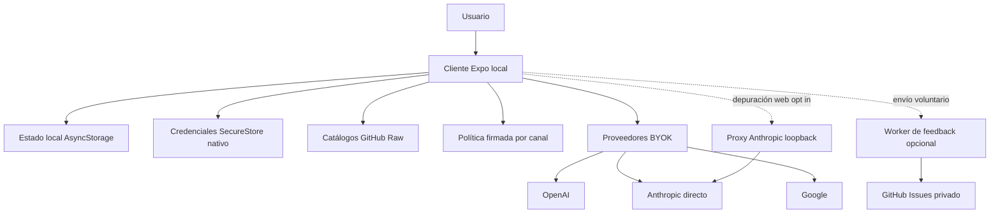

# Arquitectura local-first

Gymnasia tiene una única superficie de producto: `apps/mobile`. `index.js` registra el mismo `App` de Expo para Android, iOS y web. Entrenamientos, dieta, medidas, conversaciones y preferencias no dependen de una cuenta ni de una API de Gymnasia: se crean y conservan localmente. La red puede enriquecer una función concreta, pero no confirma ni autoriza las mutaciones de esos dominios.

La excepción remota es `apps/feedback-worker`: recibe voluntariamente propuestas e informes y crea *issues* en GitHub sin exponer al cliente la credencial de escritura. Si no se configura o falla, la aplicación sigue siendo utilizable. La política firmada y los catálogos son entradas remotas verificadas o cacheables, no servicios que sincronicen datos personales. El sitio `arquitectura-agente/` es un tablero estático independiente y no forma parte del runtime de `App`.



*Figura 1. El límite local-first: el cliente posee el estado; catálogos, política, proveedores y feedback son integraciones remotas independientes.*

## Límites y responsabilidades

| Límite | Responsabilidad | No debe convertirse en |
|---|---|---|
| `apps/mobile` | Shell Expo, dominios de entrenamiento y dieta, agente, persistencia, backup y adaptadores de red. | Cliente de una API central, identidad de Gymnasia o sincronización implícita. |
| Capas de la app | Los `controllers` adaptan dominios a flujos y memorizan acciones; `screens` y superposiciones no acceden directamente a servicios Expo; `platform` concentra sus puertos e implementaciones. | Lógica de plataforma dispersa en pantallas o acoplamiento directo de UI con almacenamiento y red. |
| Política del agente | Snapshot integrado en `Local`; en `Staging` y `Production`, resolución y verificación de un artefacto firmado para el canal. | Prompt remoto libre o almacén de datos del usuario. |
| Catálogos | Referencias de alimentos, productos, recetas y ejercicios publicadas como JSON, validadas y cacheadas en el cliente. | Estado personal o fuente de autoridad sobre los registros del usuario. |
| Proveedores de IA | OpenAI, Anthropic y Google reciben una clave que aporta el usuario y el contexto necesario para su petición. | Backend o cuenta compartida de Gymnasia. |
| `apps/feedback-worker` | Valida feedback e informes y custodia la credencial para crear *issues* privados. | Autenticación, base de datos de producto o sincronización. |
| `apps/anthropic_proxy` | Pasarela local opt-in para depurar Anthropic desde web. | Infraestructura desplegada o ruta de producción. |

No se deben inferir base de datos, cuentas centralizadas o API de producto a partir de documentos históricos. Un cambio que haga que guardar actividad, dieta o conversaciones requiera una respuesta de red rompe este límite y exige diseñar explícitamente identidad, sincronización, conflictos, recuperación y borrado.

## Arranque, dominios y aislamiento por variante

`app.config.ts` exige `APP_ENV` y compila `development`, `staging` o `production`. La variante fija nombre, identificador de aplicación, canal de política y *namespace* de almacenamiento. Desarrollo usa el canal `Local` y, salvo que se pida `DEV_PROVIDER_MODE=byok`, proveedores falsos deterministas; Staging y Production usan BYOK. El runtime vuelve a validar que la configuración pública no mezcle versión, entorno, canal, *namespace* y modo de proveedor, y rechaza metadatos de política sin candidato o hash SHA-256 válido.

Las claves de `AsyncStorage` y de SecureStore se derivan de la variante. Development y Staging se prefijan para no mezclar instalaciones; producción conserva las claves de producción y excluye los prefijos no productivos. Por ello, una migración de claves o de backup debe respetar el ámbito activo, no enumerar o borrar indiscriminadamente el almacenamiento del dispositivo.

`LocalStore` reúne plantillas, historial de entrenamiento, dieta, medidas, hilos y mensajes, además de selección de proveedor. El repositorio de recuperación mantiene la copia principal, un último snapshot válido y una cuarentena. Durante la hidratación puede normalizar datos reparables, pero detiene la carga para recuperar o tratar datos corruptos; una cola serializa los commits para no competir entre sí. El borrado local debe eliminar y verificar las familias administradas, incluidas las copias de recuperación y las sesiones dependientes.

## Persistencia, secretos y copias

El estado general se serializa en `AsyncStorage`. Las claves API no deben ir en esa serialización: en nativo, la configuración de proveedores usa `expo-secure-store` cuando está disponible y deja en AsyncStorage un espejo saneado sin `api_key`; si el almacén seguro falla, la app lo informa sin descartar el estado principal. En web la configuración de proveedor se guarda con el almacenamiento local disponible en el navegador; no tiene la garantía de un secreto de servidor ni la protección equivalente a SecureStore nativo.

Las trazas de depuración son otro dato local sensible: `trace.ts` conserva hasta 1.000 entradas en `AsyncStorage` dentro del ámbito de la variante y además las escribe en consola. Incluyen metadatos de compilación y diagnósticos de selección de política; el borrado total las trata explícitamente como una familia que debe eliminarse y verificarse. Al añadir instrumentación, no incluya prompts, argumentos, resultados ni otros valores personales en `data`.

Una exportación `.gymnasia` es una copia local iniciada por la persona usuaria. Incluye los datos locales y fotos de progreso normalizadas, excluye claves API y las cachés remotas, y las exportaciones nuevas se cifran y autentican con una contraseña que la app no conserva. El importador todavía acepta, con aviso, los formatos antiguos JSON v1 y ZIP v2. Conversaciones y otros datos incluidos siguen siendo sensibles: importar, exportar o añadir una categoría de datos debe mantener la exclusión de credenciales y el borrado verificable.

El espejo `/dev-store` solo se habilita en preview web de desarrollo con `EXPO_PUBLIC_DEV_STORE_MIRROR=1`. Es una comodidad local, no un mecanismo de persistencia publicado, y no escribe claves BYOK. La exportación web es estática mediante `expo export --platform web`; no se debe asumir que la web tenga las mismas capacidades nativas de notificación, audio o almacén seguro.

## Catálogos: referencias remotas recuperables

Los catálogos de alimentos, productos comerciales y recetas se obtienen desde sus `all.json` en GitHub Raw. Cada definición aporta URL, procedencia, clave de caché y parser. Antes de aceptar una descarga se comprueba el esquema; el sobre persistido incluye versión, fuente, fecha, ETag, procedencia y hash SHA-256 del contenido validado.

El catálogo de ejercicios usa un protocolo distinto pero con el mismo límite de confianza: descarga un manifiesto versionado de `ejercicios/catalog-v1`, valida sus descriptores y hashes, y obtiene por separado páginas, fragmentos de búsqueda e índices por ID. Solo activa una versión tras validar el manifiesto y su primera página; así conserva una instantánea utilizable sin conexión y evita descargar el agregado completo para buscar o abrir una ficha.

Al arrancar puede utilizarse una caché válida marcada como `cached` o `stale`. Al refrescar, un HTTP inválido, JSON malformado, esquema inválido o fallo de red conserva el snapshot anterior y señala el fallo en vez de borrar datos disponibles. Los alimentos personales son otro origen, `local://device`, y no se envían ni se sustituyen por GitHub Raw. Este diseño permite uso offline sin convertir el catálogo en una dependencia de arranque.

## Política y llamadas de IA

El agente obtiene un *lease* de política al iniciar una conversación o un turno. En `Local` usa el snapshot integrado. En los canales remotos, el runtime resuelve una activación, descarga el bundle y su firma, y comprueba hash, firma Ed25519, entorno, canal y contrato de herramientas contra raíces públicas integradas. Puede recurrir a caché o snapshot integrado según el resultado de verificación, pero no debe aceptar contenido remoto no autenticado.

El *lease* congela prompt, política sanitaria combinada, procedencia y contexto de activación para ese uso. Los flujos de conversación y estimación nutricional usan esa selección para clasificar la entrada y para adjuntar `policy_context` a respuestas, incluso cuando el guardrail bloquea la llamada al proveedor. Modificar la entrega de política exige preservar los contratos sanitarios y de herramientas.

En modo BYOK, OpenAI, Anthropic y Google se consumen desde el cliente con la clave aportada por la persona usuaria. En web, la llamada directa a Anthropic declara `anthropic-dangerous-direct-browser-access`; por tanto la clave y el contenido de la solicitud quedan dentro de la frontera del navegador y se transmiten al proveedor. BYOK no transforma una clave de navegador en un secreto de servidor ni crea identidad de Gymnasia.

`EXPO_PUBLIC_API_BASE_URL` está vacío por defecto. Solo una configuración explícita en web redirige Anthropic al proxy local. El proxy escucha en loopback, rechaza clientes demostrablemente remotos y falla al arrancar si se solicita un host no local; no debe desplegarse. Sus rutas de salud, verificación, modelos y mensajes sirven para depurarlo, no son una dependencia de la aplicación publicada.

## Feedback: integración remota opcional

La URL de feedback queda vacía por defecto en desarrollo y se configura con el endpoint HTTPS del Worker para Staging y Production; un override solo sirve para desarrollo. El resolver rechaza URLs inválidas, credenciales embebidas, query o fragmento, y solo permite HTTP loopback en desarrollo. Si falta o falla la validación, devuelve `unavailable` sin impedir el arranque.

El Worker expone salud y acepta únicamente `POST /feedback/issues`. Puede apagarse con `FEEDBACK_ENABLED=false`, aplica CORS a orígenes configurados, valida el payload y limita la tasa con un identificador de IP pseudonimizado mediante HMAC. Reserva una clave de idempotencia antes de crear la issue: un reintento ya completado devuelve la misma issue y una reserva en curso solicita reintento, evitando duplicados. El token y el repositorio de GitHub viven exclusivamente en el entorno del Worker.

La tarea programada redacta informes que superan 30 días y poda contadores de límite de tasa. D1 conserva solo lo necesario para idempotencia, límites y ese ciclo de retención. No amplíe este Worker hacia perfiles, sesiones, telemetría de producto o copias de los dominios locales sin una excepción de arquitectura explícita y sus controles de privacidad.

## Invariantes para cambios seguros

1. **El dispositivo es la autoridad del producto.** Las funciones principales deben operar sin red y recuperar estado localmente.
2. **Las variantes aíslan estado y comportamiento.** Toda clave persistente o segura nueva debe usar el ámbito de `runtimeEnvironment`.
3. **Lo remoto se valida antes de usarse.** Mantenga esquema, hash, firma, procedencia y fallback al cambiar catálogos o política.
4. **Los secretos y la observabilidad tienen fronteras distintas del estado.** No serialice claves BYOK en `LocalStore`, backups, trazas ni el espejo de desarrollo; no introduzca contenido personal en trazas y comunique la menor garantía de web.
5. **El contexto de IA sale del cliente.** Documente y minimice qué se transmite a cada proveedor; no presente BYOK como confidencialidad de servidor.
6. **Feedback sigue siendo opcional e idempotente.** Mantenga custodia del token, validación, límites, deduplicación y retención.

## Validación enfocada

Antes de cambiar estos límites, ejecute al menos:

```bash
npm --workspace apps/mobile exec tsc --noEmit
npm test
npm run check:health-safety
npm run policy:bundle:check
npm run check:policy-trust
npm run check:anthropic-proxy
npm --workspace apps/mobile run build:web
npm --workspace apps/feedback-worker run test
```

Para catálogos, añada `npm run check:catalogs`, `npm run test:catalogs` y `npm run test:catalogs:e2e`; para el proxy, `npm run test:proxy`. Los scripts de raíz incluyen pruebas deterministas de la app y del espejo de desarrollo, contratos de catálogos y política, compilación web y E2E específicos del agente, recuperación de almacenamiento, shell y flujos de entrenamiento o dieta. La suite del Worker usa una base de datos y un entorno falsos, por lo que verifica creación, rechazo, límites, deduplicación y retención sin token ni red reales.
