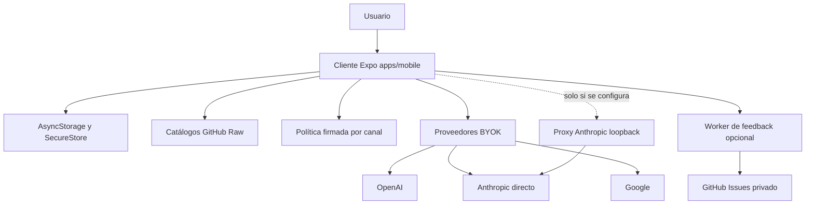

# Arquitectura actual de ejecución

Gymnasia se ejecuta principalmente como un único cliente Expo en `apps/mobile`. `index.js` registra `App` mediante `registerRootComponent`, y el mismo árbol se usa en Android, iOS y web con `react-native-web`. El producto es **local-first**: entrenamientos, dieta, medidas, conversaciones, preferencias y configuración residen en el dispositivo o navegador; las dependencias de red enriquecen funciones concretas, pero no son una API de producto que confirme las mutaciones locales.

La topología actual sí tiene dos excepciones remotas deliberadas: el Worker de feedback, que custodia la credencial de GitHub para crear incidencias, y la distribución de política firmada para las variantes Staging y Production. Ninguna de ellas almacena ni sincroniza el estado de entrenamiento del usuario. El tablero `arquitectura-agente/` también es un sitio estático independiente y no participa en la ejecución de `App`.



*Figura 1. El cliente conserva el estado; catálogo, política, proveedores y feedback son salidas independientes. Anthropic se llama directamente por defecto, incluso desde web; el proxy es opt-in y local.*

## Componentes ejecutables y límites de responsabilidad

| Componente | Responsabilidad actual | No es |
|---|---|---|
| `apps/mobile` | Shell Expo, dominios de entrenamiento y dieta, agente, persistencia local, backups y adaptadores de red. | Un cliente de una API o cuenta central de Gymnasia. |
| Política del agente | En Local usa el snapshot integrado; en Staging/Production resuelve, descarga y verifica un paquete firmado apropiado para el canal. | Un prompt remoto sin verificación ni una fuente de datos del usuario. |
| Catálogos `alimentos/`, `productos_comerciales/`, `recetas/`, `ejercicios/` | Datos de referencia e imágenes publicados desde GitHub Raw y cacheados localmente tras validación. | Estado personal o política del agente. |
| `apps/feedback-worker` | Endpoint opcional que valida feedback y crea/redacta incidencias en un repositorio privado de GitHub. | Autenticación, sincronización o backend general de la aplicación. |
| `apps/anthropic_proxy` | Herramienta de desarrollo local opcional para reenviar Anthropic cuando se configura explícitamente. | Infraestructura desplegable o ruta necesaria para Anthropic en web. |

Los documentos o directorios históricos que describan una API central, cuentas, Postgres/Supabase o sincronización no describen esta topología salvo que el código de ejecución los introduzca expresamente. La fuente de verdad para cambios operativos es la configuración y las pruebas actuales.

## Arranque, variantes y almacenamiento

La configuración exige `APP_ENV` y construye tres variantes: `development`, `staging` y `production`. Cada una aporta identificador de aplicación, namespace de almacenamiento y canal de política; solo desarrollo puede usar `DEV_PROVIDER_MODE`, cuyo valor por defecto es `fake`, mientras que Staging y Production usan `byok`. Las claves de almacenamiento se derivan del namespace de la variante, de modo que una instalación no debe mezclar datos de otro canal.

`App` mantiene un `LocalStore` con plantillas, historial, dieta, medidas, hilos y mensajes, además de claves de proveedor y la selección de proveedor. El almacenamiento general usa `AsyncStorage`; el repositorio de recuperación mantiene copia válida y cuarentena para el store principal. La configuración de proveedores se separa hacia `expo-secure-store` cuando está disponible y se elimina de la serialización general. En web, donde no se garantiza ese almacén seguro, las credenciales BYOK tienen la protección del almacenamiento local del navegador, no la de un secreto de servidor.

La app ofrece borrado verificable de familias de datos locales y puede incluir SecureStore, fotos de progreso y notificaciones en las plataformas que los soportan. Un espejo de archivo `/dev-store` existe exclusivamente para el preview web de desarrollo cuando `EXPO_PUBLIC_DEV_STORE_MIRROR=1`; no pertenece a la aplicación publicada ni conserva claves BYOK.

La exportación web es estática: `build:web` ejecuta `expo export --platform web` y Vercel publica `dist`. Las diferencias nativas son explícitas en `app.json`, que configura SecureStore, notificaciones, audio y permisos Android; no se debe asumir que la web tenga capacidades equivalentes.

## Política firmada y ciclo de una conversación

El agente adquiere un *lease* de política al cruzar límites como nueva conversación o turno. En el canal `Local`, el lease es el prompt y la política sanitaria integrados. En `Staging` y `Production`, el runtime consulta GitHub Deployments para el canal, acepta únicamente deployments exitosos con una estructura y URLs de release esperadas, descarga bundle y firma, comprueba el hash anunciado y verifica la firma, el entorno, canal y herramientas declaradas contra raíces públicas integradas. El resultado se guarda en AsyncStorage y el selector puede degradar a caché o snapshot integrado conforme a sus reglas, en vez de aceptar contenido remoto sin verificar.

El lease congela conjuntamente el prompt, la política sanitaria combinada, la procedencia y el contexto de activación. El flujo de chat usa esa misma selección para clasificar texto de entrada y salida y para adjuntar `policy_context` a los mensajes; por tanto, una modificación de política debe conservar los contratos de política sanitaria y herramientas, no limitarse a cambiar texto de prompt.

## Catálogos y llamadas directas de IA

Los cuatro catálogos remotos se descargan como `all.json` desde GitHub Raw. Antes de usar una respuesta se valida contra el esquema de la fuente y, al persistirla, se guarda un sobre con versión, procedencia y hash de contenido. Al iniciar se puede usar la caché válida —marcada como fresca, cacheada o obsoleta— y un fallo de red conserva el último snapshot en vez de borrar datos. Los alimentos personales son un origen separado, `local://device`, almacenado localmente.

Los proveedores de IA son BYOK: el cliente envía la clave elegida directamente a OpenAI, Anthropic o Google para sus APIs de modelos y generación. No crean una identidad ni una cuenta de Gymnasia. Para Anthropic, la aplicación añade `anthropic-dangerous-direct-browser-access` en web, lo que permite la llamada directa desde el navegador; OpenAI y Google también se consumen directamente. La ruta de Open Food Facts es otra llamada de referencia para productos y no una persistencia del producto.

### Corrección: el proxy Anthropic ya no es obligatorio

`EXPO_PUBLIC_API_BASE_URL` está vacío por defecto. Solo si una persona lo define en web se construyen URLs para el proxy; sin esa configuración, la aplicación llama a Anthropic directamente. El proxy escucha por defecto en `127.0.0.1`, rechaza clientes demostrablemente remotos y rechaza arrancar con un host no loopback. Aunque permite CORS para poder servir a un navegador local, no debe desplegarse ni usarse como depósito de claves: recibe una clave BYOK en el cuerpo, la convierte en cabecera upstream y procura no reenviarla en el cuerpo ni filtrarla en errores.

El proxy conserva rutas de salud, verificación, modelos y mensajes para el caso opt-in. Sus límites de cuerpo, timeouts y conversión de fallos hacen visible un upstream inaccesible; para SSE, inyecta un evento de error si la transmisión se corta sin `message_stop`. Esto es útil para depurar el puente, pero no cambia que la ruta normal web y móvil sea directa.

## Feedback: excepción remota con datos mínimos

La URL de feedback se configura por variante: desarrollo queda deshabilitado por defecto; Staging y Production usan el endpoint HTTPS del Worker, salvo override de desarrollo válido. Si falta o es inválida, la app degrada esa función a `unavailable` sin impedir el arranque ni la operación local.

El Worker solo acepta `POST /feedback/issues`, aplica CORS a orígenes permitidos, puede deshabilitarse con `FEEDBACK_ENABLED=false`, valida el esquema y reserva una clave de idempotencia antes de crear la issue. Limita la tasa por un identificador de IP pseudonimizado con HMAC; un reintento de una creación ya completada devuelve la misma incidencia en lugar de duplicarla. El token de GitHub solo existe en el entorno del Worker. Una tarea horaria redacta en GitHub los informes que superan 30 días y poda contadores de límite de tasa; D1 mantiene la información necesaria para esas operaciones.

## Invariantes y consecuencias para cambios

1. **La autoridad del estado de producto es local.** No introduzca una dependencia de servidor como si fuera requisito para guardar entrenamiento, dieta o conversaciones sin diseñar expresamente sincronización, identidad y recuperación.
2. **Las variantes aíslan estado y comportamiento.** Las claves persistentes y seguras están prefijadas por namespace; los artefactos y metadatos de política deben corresponder al entorno y canal compilados.
3. **La política remota es contenido privilegiado, pero verificable.** Mantenga hash, firmas Ed25519, raíces públicas, restricción de URLs, anti-rollback y contrato de herramientas al modificar la entrega; no sustituya este flujo por descargar un prompt libre.
4. **Los catálogos son recuperables y no autoritativos.** Respete validación, hash y fallback de caché. Un error de GitHub Raw no debe borrar ni reinterpretar registros personales existentes.
5. **BYOK sigue siendo una frontera de privacidad.** La clave y el contexto enviado al proveedor salen del cliente; en web no se convierten mágicamente en secretos de servidor.
6. **El proxy no es parte de producción.** No revierta la llamada directa de Anthropic ni configure un proxy por defecto; cualquier proxy compartido requeriría una nueva excepción de backend con controles propios.
7. **Feedback debe continuar siendo opcional e idempotente.** Cambiar su contrato exige mantener la custodia del token en el Worker, validación, límites de tasa, deduplicación y retención/redacción.

## Validación enfocada

Antes de cambiar esta topología, ejecute al menos:

```bash
npm --workspace apps/mobile exec tsc --noEmit
npm test
npm run check:health-safety
npm run policy:bundle:check
npm run check:policy-trust
npm run check:anthropic-proxy
npm --workspace apps/mobile run build:web
npm --workspace apps/feedback-worker run test
```

Las pruebas deterministas móviles cubren contratos del agente, selección y verificación de política, persistencia de proveedores y runtime de catálogos. Las pruebas del Worker cubren creación de incidencias, esquema, saneado, límites y deduplicación sin credenciales reales. Para un cambio del proxy ejecute también `npm run test:proxy`; para catálogo, `npm run check:catalogs` y `npm run test:catalogs`; y para flujos visibles del cliente, el E2E específico (`npm run test:agent:e2e`, recuperación de storage o navegación que corresponda).

## Planes históricos frente a ejecución actual

No confundir mecanismos existentes con planes: el tablero de arquitectura es un espejo manual estático; los proveedores falsos solo son un modo de desarrollo; el espejo `/dev-store` solo existe en preview web opt-in; y el proxy de Anthropic queda disponible para depurar una configuración explícita, pero ya no resuelve una limitación obligatoria de CORS. Ninguno implica un backend de producto, cuentas centralizadas ni sincronización de datos personales.
