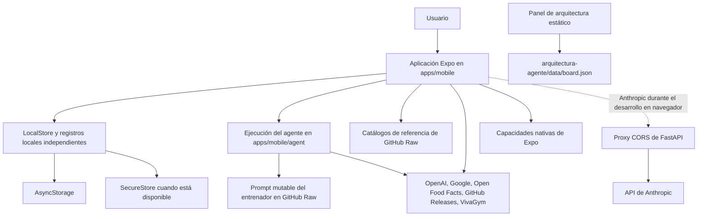

# Arquitectura actual de ejecución

Gymnasia es una aplicación Expo con prioridad local, no un cliente para una API de producto de Gymnasia. La única ejecución del producto es `apps/mobile`: `apps/mobile/index.js` importa la exportación predeterminada `App` desde `apps/mobile/App.tsx` y la registra con Expo mediante `registerRootComponent(App)`. El mismo árbol de React Native se ejecuta como aplicación para Android/iOS y, mediante `react-native-web`, como una exportación web estática.

En el repositorio **no existe actualmente ningún `apps/api`, `apps/web`, base de datos de Supabase, sistema de cuentas del lado del servidor ni servicio de sincronización**. En particular, `docs/architecture/stack-and-systems.md` y los documentos incluidos en `docs/backend/` describen una antigua arquitectura planificada de FastAPI/Postgres y están **obsoletos para la ejecución actual**. No deben utilizarse para inferir endpoints desplegados, autenticación, persistencia ni propiedad de los datos.

## Mapa del sistema



*Figura 1. Componentes desplegables actuales y dependencias salientes; el tráfico discontinuo representa la ruta opcional de desarrollo en navegador, no un backend del producto.*

La arquitectura tiene dos artefactos independientes orientados al usuario:

- **Aplicación Gymnasia:** `apps/mobile`, con el punto de entrada del paquete en `apps/mobile/index.js` y la composición de la aplicación en `apps/mobile/App.tsx::App`. `apps/mobile/package.json` ofrece desarrollo nativo con Expo, vista previa web, exportación web estática y pruebas deterministas.
- **Panel de arquitectura:** `arquitectura-agente/index.html` junto con `arquitectura-agente/script.js` y `arquitectura-agente/data/board.json`. Es un sitio estático de seguimiento independiente; ni lo carga `App` ni forma parte del flujo de datos del producto. Consulte [Panel de arquitectura](../services/architecture-board.md).

`apps/anthropic_proxy/cors-proxy.py::app` es un puente de desarrollo limitado basado en FastAPI. Su ruta `/health` y sus tres rutas `/chat/providers/anthropic/*` actúan como proxy para la verificación de Anthropic, el listado de modelos y los mensajes. Existe porque las llamadas a Anthropic desde el navegador encuentran restricciones de CORS; los clientes nativos llaman directamente a Anthropic. No es un backend general de Gymnasia ni es propietario de registros del producto. Consulte [Proxy de Anthropic](../services/anthropic-proxy.md).

## Composición de la ejecución y dirección de las dependencias

| Capa | Rutas y símbolos canónicos | Responsabilidad | Puede depender de |
|---|---|---|---|
| Arranque y shell | `apps/mobile/index.js`, `apps/mobile/App.tsx::App`, `TabKey`, `DesktopSidebar` | Registrar la raíz de Expo, hidratar el estado, seleccionar la navegación adaptable y componer todas las pantallas y superposiciones | Lógica de dominio, agente, API de Expo/React Native, persistencia local y servicios remotos |
| Dominios del producto | Principalmente funciones, tipos, estado y ramas de renderizado en `apps/mobile/App.tsx` | Entrenamiento, dieta, mediciones, Inicio, ajustes, copias de seguridad, actualizaciones y VivaGym | Estado y adaptadores propiedad del shell |
| Ejecución del agente | `apps/mobile/agent/toolDefinitions.ts`, `toolExecutor.ts`, `providerToolLoop.ts`, `providerStreamParsers.ts`, `sse.ts` | Contrato canónico de herramientas, ejecución, rondas independientes del proveedor y análisis de transmisiones | Contexto proporcionado por `App`; transportes de proveedores |
| Persistencia local | `LocalStore` y auxiliares de almacenamiento en `apps/mobile/App.tsx` | Hidratación, normalización, efectos de almacenamiento, separación de claves seguras, copia de seguridad/importación | `AsyncStorage`, `expo-secure-store`; un reflejo de archivos exclusivo para desarrollo |
| Catálogos de referencia | `alimentos/`, `productos_comerciales/`, `recetas/`, `ejercicios/` | JSON e imágenes de ejecución servidos desde GitHub Raw; enriquecen los registros locales, pero no definen la política del agente | Archivos del repositorio y disponibilidad de GitHub |
| Política mutable del agente | `prompts/AGENTS.md`, `App.tsx::loadChatSystemPrompt`, `DEFAULT_CHAT_SYSTEM_PROMPT` | Seleccionar el prompt de GitHub Raw, después el último prompt conocido almacenado en caché y, finalmente, el recurso alternativo integrado; añadir el campo exacto `debug` de memoria personal | GitHub Raw, caché de AsyncStorage y memoria personal |
| Servicio opcional | `apps/anthropic_proxy/cors-proxy.py` | Reenviar las solicitudes a Anthropic durante el desarrollo en navegador | Solo la API de Anthropic |
| Servicio estático independiente | `arquitectura-agente/` | Renderizar datos de planificación mantenidos manualmente | Su propio `data/board.json` |

La dirección de las dependencias va deliberadamente desde el cliente hacia el exterior: el estado del producto y las mutaciones de dominio residen dentro del proceso de la aplicación; los proveedores y repositorios remotos son dependencias de ese cliente. Ningún servicio remoto de este repositorio es la fuente autoritativa de los entrenamientos, comidas, mediciones, conversaciones o ajustes del usuario.

Para obtener más información, consulte [Shell de la aplicación](../mobile/application-shell.md), [Estado local y copias de seguridad](../mobile/local-state-and-backup.md), [Ejecución del agente](../agent/runtime.md) y [Repositorios de contenido](../content/repositories.md).

## Propiedad de los datos y límites de confianza

### Estado del usuario

`App` inicializa un `LocalStore`, normaliza los datos persistidos durante `hydrate` y vuelve a escribir los cambios después de que `isHydrated` pasa a ser verdadero. `AsyncStorage` es el almacén duradero de uso general. Las claves de API de los proveedores se separan en `expo-secure-store` cuando está disponible; el `LocalStore` serializado se censura en consecuencia. En la web, AsyncStorage es un almacenamiento local del navegador y SecureStore puede no estar disponible, por lo que la interfaz advierte explícitamente que las claves se almacenan sin cifrado seguro. Las claves exactas, el mecanismo alternativo, el esquema de copia de seguridad y el comportamiento de migración se documentan en [Estado local y copias de seguridad](../mobile/local-state-and-backup.md).

Esto crea un límite estricto: cambiar el perfil del navegador o el dispositivo, borrar el almacenamiento de la aplicación o desinstalarla puede eliminar el estado, a menos que el usuario haya exportado una copia de seguridad. No existe una copia en el servidor ni reconciliación entre varios dispositivos.

### Contenido remoto y proveedores

`apps/mobile/App.tsx` obtiene dos clases de datos de GitHub Raw arquitectónicamente distintas. Los repositorios `ejercicios`, `alimentos`, `productos_comerciales` y `recetas` son catálogos de referencia. `prompts/AGENTS.md` es una política privilegiada mutable: cada envío de chat da preferencia a su texto de GitHub Raw con invalidación de caché, recurre a `gymnasia.mobile.chat.system_prompt.v1` y solo entonces utiliza el prompt integrado. Las copias del prompt presentan actualmente divergencias: el archivo remoto/incluido en el repositorio solo documenta el comportamiento de la memoria, mientras que el recurso alternativo integrado también contiene políticas de dieta y entrenamiento, por lo que los clientes pueden comportarse de manera diferente según el estado de la red o la caché. Un campo de memoria personal no vacío con la clave exacta y sensible a mayúsculas y minúsculas `debug` se añade al prompt del sistema seleccionado. Consulte [Ejecución del agente](../agent/runtime.md) para conocer la precedencia, la memoria de propiedad compartida, el comportamiento de sustitución/borrado y las carencias de las pruebas.

La aplicación también realiza llamadas salientes directas a:

- Las API Responses y Models de OpenAI;
- Las API Messages y Models de Anthropic en entornos nativos, o al proxy configurado en la web;
- Los modelos y endpoints de generación de Google Generative Language;
- La búsqueda de productos de Open Food Facts;
- GitHub Releases para detectar actualizaciones del APK. Existe código para escribir incidencias en GitHub, pero todos los escritores actuales de alimentos, ejercicios y funcionalidades regresan antes de realizar E/S de red porque su token compartido codificado de forma fija está vacío; por tanto, Issues no es actualmente una dependencia efectiva. No obstante, la herramienta de funcionalidades informa de un éxito falso. La duplicación de incidencias durante los reintentos del chat solo constituye un riesgo futuro si se habilita la escritura;
- Los endpoints de VivaGym para el inicio de sesión y el acceso mediante QR.

Estas llamadas trasladan datos de usuario o credenciales almacenados localmente a dominios de confianza de terceros. Las claves de los proveedores son credenciales BYOK; no establecen una cuenta de Gymnasia. El comportamiento de los proveedores, la ejecución de herramientas y la transmisión se describen en [Configuración de proveedores](../agent/provider-configuration.md), [Transmisión de proveedores](../agent/provider-streaming.md) y [Ejecución del agente](../agent/runtime.md).

### Límite de capacidades nativas

`apps/mobile/app.json` configura SecureStore, las notificaciones y los sonidos incluidos, mientras que el límite generado de Android puede verse en `apps/mobile/android/app/src/main/AndroidManifest.xml` y `MainActivity.kt`. Las compilaciones nativas pueden utilizar notificaciones, comportamiento relacionado con el audio en segundo plano, almacenamiento seguro, uso compartido de archivos/documentos, selección de imágenes e intents de APK. La compilación web estática no puede garantizar un comportamiento equivalente. El shell mantiene una interfaz compartida, pero las comprobaciones de capacidades y el comportamiento degradado siguen siendo específicos de cada plataforma.

## Formas de plataforma y despliegue

| Forma | Compilación/entrada | Persistencia | Topología de red |
|---|---|---|---|
| Ejecución Expo para Android/iOS | `apps/mobile/index.js`; `expo start`, `expo run:android` o `expo run:ios` | AsyncStorage junto con SecureStore cuando está disponible | Llamadas directas a proveedores/contenido; no se requiere proxy para las llamadas nativas a Anthropic |
| Ejecución web estática | `npm --workspace apps/mobile run build:web`; salida `apps/mobile/dist` configurada mediante `apps/mobile/vercel.json` | AsyncStorage respaldado por el navegador; no se garantiza un equivalente de almacenamiento seguro | Llamadas directas a OpenAI/Google/contenido; Anthropic requiere un proxy compatible configurado |
| Desarrollo en navegador con Anthropic | Expo web junto con `apps/anthropic_proxy/cors-proxy.py` en la URL base de API configurada | El mismo estado local del navegador | Solo la verificación, los modelos y los mensajes de Anthropic pasan por el proxy local |
| Panel de arquitectura | Archivos estáticos en `arquitectura-agente/` y su propio `vercel.json` | Preferencias locales de la interfaz del panel junto con datos JSON incluidos en el repositorio | Sin dependencia de la aplicación Gymnasia |

Los comandos de compilación y publicación, el comportamiento de EAS, la integración continua y el despliegue estático se detallan en [Compilación, publicación y pruebas](../operations/build-release-and-testing.md).

## Invariantes arquitectónicas

1. **El cliente es autoritativo.** Las mutaciones actuales de los dominios de usuario se producen en `App` o mediante un `ToolExecutionContext` del agente respaldado por `App`; ningún backend del producto las confirma.
2. **La hidratación precede a los efectos de persistencia.** Los efectos que guardan `store`, preferencias, alimentos personales y sesiones activas regresan mientras `isHydrated` es falso, lo que evita que los valores predeterminados sobrescriban el estado persistido durante el inicio.
3. **Los catálogos remotos son datos de referencia, no almacenamiento del usuario ni políticas.** Los archivos JSON agregados y las imágenes alojados en GitHub enriquecen los registros locales; sus fallos no deben interpretarse como la pérdida de datos de usuario persistidos localmente. El prompt del entrenador, obtenido por separado, es una política mutable del sistema y sigue la precedencia remoto → caché → integrado.
4. **GitHub Issues está deshabilitado actualmente.** Un token vacío codificado de forma fija hace que todos los escritores de incidencias no realicen ninguna operación. No modele Issues como un requisito saliente actual ni confíe en el texto de éxito de `create_feature_issue` como prueba de creación.
5. **El proxy es opcional y específico de Anthropic.** El tráfico nativo de OpenAI, Google y Anthropic no depende de `apps/anthropic_proxy`; el proxy no debe convertirse en una autoridad de datos no documentada.
6. **La web es estática y tiene prioridad local.** `apps/mobile/vercel.json` compila `dist`; el despliegue no introduce ninguna ejecución de servidor ni base de datos.
7. **El panel de arquitectura está aislado.** Sus datos de tickets y pruebas no determinan el comportamiento de la aplicación.
8. **Los secretos de proveedores dependen del entorno.** Se prefiere SecureStore donde sea compatible; el mecanismo alternativo web/local es menos seguro y debe seguir siendo visible para los usuarios.

## Pruebas y validación

La cobertura automatizada es intencionadamente desigual:

- `npm test` ejecuta Vitest con `apps/mobile/vitest.config.mts`, que solo incluye `apps/mobile/agent/**/*.test.ts`. Estas pruebas validan las definiciones/ejecución de herramientas, los bucles de proveedores, el análisis de SSE y las canalizaciones de proveedores sin credenciales de red.
- `npm run test:agent:e2e` exporta la aplicación web, inicializa el almacenamiento del navegador, intercepta el tráfico de GitHub Raw y OpenAI, y valida el flujo de interfaz a SSE, herramienta y segunda ronda en `apps/mobile/scripts/agent-chat.e2e.mjs`.
- `npm run test:train:e2e` inicia Expo web y prueba la navegación del shell, el restablecimiento de ajustes, la edición de rutinas, la finalización de entrenamientos y el comportamiento de descarte en `apps/mobile/scripts/train-usability.e2e.mjs`.
- `npm run test:board` y `npm run test:board:e2e` validan el panel estático independiente.
- `.github/workflows/agent-tests.yml` ejecuta `npm test` y `npm --workspace apps/mobile exec tsc --noEmit` para los cambios móviles. Los flujos de Playwright son comandos explícitos y no forman parte de ese trabajo determinista de CI.

Un cambio arquitectónico específico debe ejecutar, como mínimo:

```bash
npm --workspace apps/mobile exec tsc --noEmit
npm test
npm --workspace apps/mobile run build:web
```

Ejecute el flujo de Playwright pertinente al cambiar la navegación del shell, el comportamiento visible durante la hidratación, el entrenamiento o el chat. Los cambios en el proxy requieren comprobaciones directas de `/health`, verificación, modelos, mensajes sin transmisión y mensajes con transmisión, ya que no existe ningún conjunto de pruebas del proxy.

## Riesgos y restricciones de cambio

- **Propiedad monolítica:** `apps/mobile/App.tsx` contiene el shell, la mayoría de los dominios, los transportes, la persistencia y grandes ramas de renderizado. Una edición local puede afectar a pantallas no relacionadas y la cobertura de pruebas unitarias específicas fuera de `apps/mobile/agent` es limitada.
- **Sin sincronización ni recuperación desde el servidor:** la prioridad local es una propiedad deliberada de la ejecución, pero las copias de seguridad siguen dependiendo del usuario y las escrituras en claves de almacenamiento independientes no constituyen una transacción de base de datos.
- **Exposición de secretos en la web:** cuando SecureStore no está disponible, las credenciales BYOK residen en un almacenamiento accesible desde el navegador. Por tanto, XSS, los perfiles compartidos, las extensiones del navegador y el acceso al dispositivo son riesgos importantes.
- **Disponibilidad remota, divergencia de esquemas y política mutable:** los catálogos sin procesar de GitHub y las API de terceros pueden degradar funcionalidades debido a cambios de disponibilidad o respuesta. Aún más importante, `prompts/AGENTS.md` puede cambiar el comportamiento privilegiado del chat sin una publicación móvil, mientras que las copias en caché e integradas pueden conservar semánticas diferentes. No existen pruebas específicas de precedencia, paridad, mutación ni inyección de `debug`.
- **Propiedad compartida de la memoria personal:** los ajustes y las herramientas del agente sobrescriben un único array independiente de AsyncStorage. Las claves son exactas y sensibles a mayúsculas y minúsculas, los guardados de herramientas realizan una sustitución completa, y un JSON de herramienta mal formado guarda `[]` mientras informa de éxito; además, un valor exacto de `debug` pasa a formar parte del texto del prompt del sistema. La copia de seguridad/importación incluye el array y la acción específica de memoria lo borra, pero el restablecimiento general de datos locales no lo hace. Un estado obsoleto de Ajustes puede sobrescribir los cambios de las herramientas sin detección de conflictos.
- **Ruta inactiva de escritura de incidencias:** los escritores de incidencias actuales no realizan ninguna operación debido a que el token está vacío, y la herramienta de funcionalidades informa falsamente de éxito. Si se habilitan más adelante, los estados/fallos HTTP ignorados y los reintentos de solicitudes completas del chat generarán riesgos de corrección y duplicación, a menos que el escritor incorpore propagación de errores e idempotencia.
- **Confianza en el proxy:** `CORSMiddleware` permite todos los orígenes y el proxy acepta claves de API en los cuerpos de las solicitudes. Es adecuado como el puente local documentado, no como un intermediario de secretos de producción expuesto a Internet sin autenticación, restricción de orígenes, limitación de frecuencia y observabilidad.
- **Divergencia del código nativo generado:** `apps/mobile/app.json` es la configuración de Expo, mientras que `apps/mobile/android/` es el estado nativo generado incluido en el repositorio. Los cambios de permisos o del ciclo de vida deben conciliarse en ambas superficies.
- **Narrativa de backend obsoleta:** los antiguos `docs/backend/*` y `docs/architecture/stack-and-systems.md` pueden generar suposiciones falsas sobre autenticación JWT, recursos REST, Postgres, Supabase Storage o trabajos. Trátelos como planes históricos, salvo que el código fuente introduzca esos componentes.