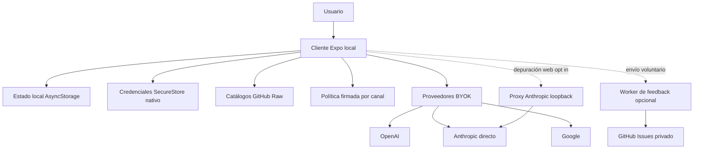

# Arquitectura local-first

Gymnasia tiene una única superficie de producto: `apps/mobile`. `index.js` registra el mismo `App` de Expo para Android, iOS y web. Entrenamientos, dieta, medidas, conversaciones y preferencias se crean y conservan en el dispositivo: la red puede enriquecer funciones concretas, pero no confirma ni autoriza mutaciones de esos dominios.

La excepción autorizada es `apps/feedback-worker`: recibe voluntariamente propuestas e informes y crea *issues* en GitHub sin exponer el token de escritura al cliente. Si no está configurado o falla, la app sigue siendo utilizable. La política firmada y los catálogos son entradas remotas verificadas o cacheables, no servicios que sincronicen datos personales. El sitio `arquitectura-agente/` es un tablero estático independiente y no forma parte del runtime de `App`.



*Figura 1. El cliente posee el estado. Catálogos, política, proveedores y feedback son integraciones remotas independientes.*

## Límites y responsabilidades

| Límite | Responsabilidad | No debe convertirse en |
|---|---|---|
| `apps/mobile` | Shell Expo, dominios de entrenamiento y dieta, agente, persistencia, backup y adaptadores de red. | Cliente de una API central, identidad de Gymnasia o sincronización implícita. |
| Política del agente | Snapshot integrado en `Local`; en `Staging` y `Production`, resolución y verificación de un artefacto firmado para el canal. | Prompt remoto libre o almacén de datos del usuario. |
| Catálogos | Referencias publicadas como JSON; se validan y cachean en el cliente. | Estado personal o autoridad sobre los registros del usuario. |
| Proveedores de IA | OpenAI, Anthropic y Google reciben una clave aportada por el usuario y el contexto de su petición. | Backend o cuenta compartida de Gymnasia. |
| `apps/feedback-worker` | Valida feedback e informes y custodia la credencial para crear *issues* privados. | Autenticación, base de datos de producto o sincronización. |
| `apps/anthropic_proxy` | Pasarela local opt-in para depurar Anthropic desde web. | Infraestructura desplegada o ruta de producción. |

No se deben inferir base de datos, cuentas centralizadas ni API de producto de documentos históricos. Un cambio que haga que guardar actividad, dieta o conversaciones requiera red rompe este límite y exige diseñar explícitamente identidad, sincronización, conflictos, recuperación y borrado.

## Arranque, variantes y estado local

`app.config.ts` exige `APP_ENV` y compila `development`, `staging` o `production`. Cada variante fija nombre, identificador de aplicación, canal de política y *namespace* de almacenamiento. Desarrollo usa `Local` y proveedores falsos deterministas, salvo `DEV_PROVIDER_MODE=byok`; Staging y Production usan BYOK. El runtime vuelve a validar que la configuración pública no mezcle versión, entorno, canal, namespace, modo de proveedor o metadatos de política.

Las claves de `AsyncStorage` y SecureStore se derivan de la variante. Development y Staging se prefijan; producción conserva las claves de producción y excluye los prefijos no productivos. Toda clave persistente o segura nueva debe pasar por `scopedStorageKey` o `scopedSecureStoreKey`, en vez de enumerar o borrar indiscriminadamente el almacenamiento del dispositivo.

`LocalStore` contiene plantillas, historial de entrenamiento, dieta, medidas, hilos, mensajes y selección de proveedor. Su repositorio de recuperación serializa las operaciones: inspecciona la copia principal, el último snapshot íntegro y la cuarentena. Una corrupción, lectura ambigua o escritura no verificable bloquea la hidratación y conserva una cuarentena; se puede restaurar el snapshot, resolver la copia actual o descartar la familia afectada. Las normalizaciones reparables se aplican al hidratar, pero un fallo de normalización se pone en cuarentena antes de sobrescribir el original.

## Secretos, backup y privacidad

El estado general se serializa en `AsyncStorage`. Las claves API no deben ir en esa serialización: en nativo, `ProviderConfigurationRepository` usa `expo-secure-store` cuando está disponible; un fallo de ese almacén se comunica sin perder el estado principal. En web la configuración del proveedor usa el almacenamiento disponible del navegador: no tiene la garantía de un secreto de servidor ni la protección equivalente a SecureStore nativo.

Una exportación `.gymnasia` es una copia local iniciada por la persona usuaria. Incluye datos seleccionados y fotos de progreso normalizadas, pero excluye claves API y cachés remotas; conversaciones y otros datos sensibles del backup no se cifran automáticamente. Importar, exportar o añadir una categoría de datos debe preservar esa distinción y el borrado verificable.

El espejo `/dev-store` solo se habilita en preview web de desarrollo con `EXPO_PUBLIC_DEV_STORE_MIRROR=1`. Es una comodidad local, no persistencia publicada, y no escribe claves BYOK. La exportación web es estática mediante `expo export --platform web`; no se deben asumir en web las mismas capacidades nativas de notificación, audio o almacenamiento seguro.

## Catálogos: instantáneas recuperables, no backend

Alimentos, productos comerciales y recetas se descargan desde sus respectivos `all.json` en GitHub Raw. Cada definición declara URL, procedencia, clave de caché y parser. La caché acepta solo un sobre con versión, `sourceId`, hash SHA-256 del contenido validado, fecha, ETag y procedencia; al leerla se recalcula el hash y se vuelve a aplicar el parser. Un fallo HTTP, JSON inválido, esquema inválido o de red conserva el snapshot anterior, con aviso, en lugar de borrar los datos disponibles.

El catálogo de ejercicios ya no usa ese agregado como runtime principal. Descarga de GitHub Raw un manifiesto de `ejercicios/catalog-v1`, cuya versión, páginas de 30 fichas y *shards* de búsqueda/directorio incluyen hashes. El cliente valida la estructura del manifiesto y los paths antes de activar una versión, y valida el hash de cada artefacto descargado. Esta granularidad permite consultar o buscar sin descargar todo el catálogo y conservar la instantánea previa offline.

Los alimentos personales son otro origen: `local://device`. No se envían ni se sustituyen desde GitHub Raw. Por tanto, los catálogos son referencias recuperables y no autoridad sobre datos creados por la persona usuaria.

## Política y llamadas de IA

El agente adquiere un *lease* de política en el límite de conversación o turno. En `Local` usa prompt y política sanitaria integrados. En canales remotos, el runtime resuelve la activación, descarga el bundle y verifica hash, firma Ed25519, entorno, canal y contrato antes de seleccionarlo; puede usar una copia validada o el integrado según el resultado, pero no contenido remoto no autenticado.

El *lease* congela prompt, política sanitaria combinada, procedencia y contexto de activación. El chat clasifica entrada y salida con la política del lease y persiste `policy_context` también en respuestas bloqueadas y errores. Cambiar la entrega de política exige mantener juntos prompt, guardrail sanitario y ese contexto trazable.

Los proveedores son BYOK y se llaman desde el cliente. En web, Anthropic usa `anthropic-dangerous-direct-browser-access`; la clave del usuario y el contenido de la petición quedan dentro de la frontera del navegador y se transmiten al proveedor. OpenAI y Google también se llaman directamente. BYOK no convierte una clave de navegador en secreto de servidor ni crea identidad de Gymnasia.

`EXPO_PUBLIC_API_BASE_URL` está vacío por defecto. Solo una configuración explícita en web redirige Anthropic al proxy local. El proxy escucha en loopback, rechaza clientes remotos y no debe desplegarse; sus rutas de salud, verificación, modelos y mensajes sirven para depuración, no como dependencia de la aplicación publicada.

## Feedback: servicio remoto opcional y acotado

La URL de feedback está vacía por defecto en desarrollo y se configura como HTTPS para Staging y Production; el override es solo para desarrollo. El resolver rechaza URLs inválidas, credenciales embebidas, query o fragmento, y solo admite HTTP loopback en desarrollo. Si falta o no pasa la validación devuelve `unavailable`, sin impedir el arranque.

El Worker expone salud y únicamente `POST /feedback/issues`; `FEEDBACK_ENABLED=false` lo puede desactivar. Aplica CORS para orígenes configurados, valida el payload y limita por identificador de IP pseudonimizado con HMAC. Reserva una clave de idempotencia antes de crear la issue: un reintento completado recibe la misma issue y una reserva en curso solicita reintento, evitando duplicados. El token y el repositorio de GitHub viven exclusivamente en el entorno del Worker.

El cron horario redacta en GitHub los informes de más de 30 días y poda los contadores de rate limit. D1 se limita a idempotencia, límites y ese ciclo de retención. No se debe ampliar hacia perfiles, sesiones, telemetría de producto ni copias de dominios locales sin una excepción explícita de arquitectura y privacidad.

## Invariantes para cambios seguros

1. **El dispositivo es la autoridad del producto.** Las funciones principales deben operar sin red y recuperar estado localmente.
2. **Las variantes aíslan estado y comportamiento.** Toda clave nueva usa el ámbito de `runtimeEnvironment`.
3. **Lo remoto se valida antes de usarse.** Mantenga validación de esquema, hash, firma, procedencia y fallback al cambiar catálogos o política.
4. **Los secretos tienen otra frontera.** No serialice claves BYOK en `LocalStore`, backups, trazas ni espejo de desarrollo; explique la menor garantía de web.
5. **El contexto de IA sale del cliente.** Documente y minimice qué se transmite a cada proveedor; no presente BYOK como confidencialidad de servidor.
6. **Feedback sigue siendo opcional e idempotente.** Mantenga custodia del token, validación, límites, deduplicación y retención.

## Validación enfocada

Antes de cambiar estos límites, ejecute al menos:

```bash
npm --workspace apps/mobile exec tsc --noEmit
npm test
npm run check:health-safety
npm run policy:bundle:check
npm run check:policy-trust
npm run check:anthropic-proxy
npm --workspace apps/mobile run build:web
npm --workspace apps/feedback-worker run test
```

Para catálogos, añada `npm run check:catalogs`, `npm run test:catalogs` y `npm run test:catalogs:e2e`; para el proxy, `npm run test:proxy`. Los scripts de raíz cubren pruebas deterministas de app, contratos de catálogos y política, compilación web y E2E de agente, recuperación de almacenamiento, entrenamiento, dieta, shell y preferencias. La suite del Worker usa una base y dependencias falsas, así que cubre creación, rechazo, límites, deduplicación y retención sin token ni red reales.
