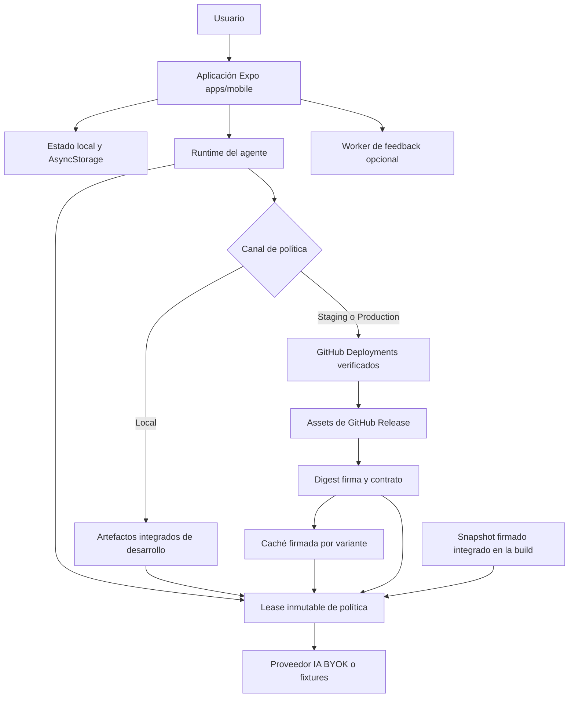

# Arquitectura actual de ejecución

Gymnasia se ejecuta principalmente como una aplicación Expo local-first en `apps/mobile`. `index.js` registra `App` como raíz; el shell y gran parte del estado de producto viven en el proceso cliente. El estado de entrenamientos, dieta, conversaciones y ajustes no depende de una API de producto autoritativa ni de sincronización remota: las dependencias salientes enriquecen funciones concretas o proporcionan IA, pero no son propietarios del estado del usuario.

La corrección esencial de este mapa es el límite de confianza de la IA: **el prompt y la protección sanitaria de los canales no locales no se descargan desde GitHub Raw en cada envío**. Proceden conjuntamente de un bundle firmado y verificado. GitHub publica y señala candidatos, pero el cliente sólo acepta un deployment exitoso con formato cerrado, assets de Release con URL exacta, digest, firmas Ed25519 y contrato compatibles. La app conserva un snapshot firmado integrado y una caché verificada para operar sin red y evitar retrocesos.

## Mapa de ejecución y confianza



*Figura 1. El cliente conserva el estado local y adquiere un único lease de política por frontera segura; GitHub es un canal de distribución sujeto a verificación, no una fuente implícitamente confiable de instrucciones.*

## Componentes y dirección de dependencias

| Capa | Responsabilidad actual | Límite relevante |
|---|---|---|
| Arranque y shell | `apps/mobile/index.js` registra `App`; `App.tsx` compone la interfaz, el estado local y las integraciones. | No introduce un backend de producto al arrancar. |
| Estado de usuario | Los datos de producto y las conversaciones se mantienen en el cliente y se persisten localmente. | El dispositivo o navegador es el límite de durabilidad; la variante separa namespaces de almacenamiento. |
| Runtime del agente | `AgentPolicyLease` entrega prompt, política sanitaria, contexto de activación y estado de selección al chat. | Una petición no debe volver a resolver ni mezclar por separado prompt y guardrail. |
| Política Local | Development usa canal `Local`; su modo de proveedor predeterminado es `fake`. | No consulta deployments remotos de política. |
| Política Staging/Production | Resuelve deployments `gymnasia-policy`, descarga assets de Release y los verifica. | Sólo acepta el canal y entorno instalados; URLs, digest, firmas, herramientas y contrato están restringidos. |
| Feedback | Staging y Production pueden configurar el Worker de feedback; desarrollo lo deja vacío por defecto. | Es un endpoint de función específica, no un almacén ni autenticación del producto. |

`APP_ENV` es obligatorio y selecciona variantes instalables distintas: `development` usa `Local`, `staging` usa `Staging` y `production` usa `Production`. Los IDs de aplicación y los namespaces de almacenamiento son distintos; `development` usa fixtures salvo opt-in explícito a `DEV_PROVIDER_MODE=byok`, mientras Staging y Production usan BYOK. La configuración pública se valida como un conjunto coherente antes de aceptarse, para impedir combinaciones híbridas de entorno, canal o namespace.

## Política firmada: control de flujo y fallos

### Entrada y lease

`acquireAgentPolicyLease(boundary)` es la entrada para consumidores de política. En `Local` construye un lease a partir de los artefactos integrados. En Staging y Production serializa la carga firmada y después crea un lease profundamente inmutable. El prompt, la política sanitaria fusionada, el candidato, la activación y la secuencia de ese lease corresponden a la **misma** selección; se registra una traza de metadatos públicos, no el prompt ni datos del usuario.

La política sanitaria remota no sustituye libremente las protecciones compiladas: se fusiona con la política sanitaria integrada y el resultado debe cumplir el contrato móvil. Si no lo cumple, la adquisición falla. El chat utiliza ese mismo lease para clasificar entrada y salida, formar el mensaje de sistema y atribuir la respuesta persistida; esto impide que una actualización cambie las reglas a mitad de una petición. Véase [Entorno de ejecución del agente](../agent/runtime.md).

### Resolución de los canales no locales

1. La build debe contener `BUNDLED_SIGNED_POLICY_PACKAGE`; si falta, el runtime firmado no continúa.
2. Se lee la caché de `AsyncStorage`, aislada mediante la clave de la variante, y se verifica de nuevo todo paquete recuperado.
3. El cliente consulta GitHub Deployments para el `environment` y task `gymnasia-policy` del canal, y sólo considera entradas schema 3 cuyo estado más reciente sea `success`.
4. El payload debe tener exactamente los campos previstos y apuntar exactamente a `policy.bundle.json` y `policy.bundle.signature.json` de una Release del candidato en `maximofn/gymnasia`; no admite URLs Raw, `main` ni hosts arbitrarios.
5. Descarga los assets con límites de tipo, tamaño y UTF-8, comprueba el SHA-256 anunciado y verifica paquete, activación, raíz confiable, firma y contrato contra el entorno, canal y herramientas anunciadas por el móvil.
6. Persiste los resultados verificados y devuelve la selección activa, una actualización pendiente o el fallback válido acompañado de estado de degradación.

Las cachés en memoria de resolución de deployment y paquete remoto duran cinco minutos; una comprobación manual con `force` las limpia, pero no borra la caché persistente verificada. Los errores de resolución de deployment también se cachean durante ese periodo para limitar reintentos.

### Caché, activación y anti-retroceso

El registro persistente schema 2 conserva `active`, `previous`, `pending`, la mayor secuencia e ID de activación observados, y el resultado de comprobación. Su ámbito debe coincidir exactamente con entorno y canal. Una caché v1 válida se migra; un registro ilegible, mal estructurado o que no vuelva a verificar se rechaza y se reconstruye desde el snapshot integrado.

Sin red, el orden de recuperación es copia activa válida, copia anterior válida y snapshot integrado. Un remoto con secuencia menor —o igual pero con otro ID de activación— se rechaza como `anti-rollback`; una activación idéntica es idempotente. Por tanto, un rollback seguro es una activación nueva y firmada de secuencia superior que señala un bundle histórico, no la repetición de un deployment antiguo.

Una actualización ordinaria verificada queda `pending` en `background` y se activa al iniciar una conversación (`new-conversation`). Una actualización crítica o una activación `rollback` puede activarse al inicio de un `turn`; `background` nunca cambia la política activa. La interfaz refresca el estado en segundo plano cada cinco minutos y ofrece una comprobación forzada, pero esas operaciones respetan esa frontera de activación. El detalle operativo está en [Ciclo de vida de la política firmada](../agent/signed-policy-lifecycle.md).

## Distribución, compilación y operación

La confianza empieza antes del dispositivo. `policy/signing/trusted-roots.json` contiene raíces públicas Ed25519; las claves privadas no se incluyen en la app. Para una build Staging o Production, `prepare-policy-snapshot.mjs` localiza el deployment exitoso del canal, verifica assets y firmas contra las raíces del repositorio, valida evidencia de promoción y el gate sanitario, y genera los módulos de prompt, guardrail y paquete firmado incorporados por la app. La preparación falla ante identidad, digest, firma, evidencia o contrato no válidos.

Una build de Production que omita esa preparación puede compilar, pero no aporta un snapshot firmado utilizable a una instalación sin caché. El procedimiento de release y sus gates se documentan en [Compilación, publicación y pruebas](../operations/build-release-and-testing.md); el cambio de contenido privilegiado se rige por [Gobernanza de prompts y política](../operations/prompt-policy-governance.md).

Para desarrollo normal:

```bash
npm --workspace apps/mobile run start
```

Para una build web estática:

```bash
npm --workspace apps/mobile run build:web
```

La exportación web se publica como `dist`; sigue siendo un cliente estático y no introduce una base de datos ni ejecución de servidor para el estado del producto.

## Invariantes y riesgos de cambio

1. **Local-first permanece siendo la autoridad de datos.** No diseñe cambios suponiendo una confirmación, recuperación o reconciliación desde un backend de producto.
2. **GitHub no es autoridad criptográfica.** Un deployment exitoso sólo es un puntero: el runtime debe conservar las validaciones de URL, digest, firma, raíz, ámbito y contrato antes de utilizar contenido de política.
3. **Prompt y guardrail son atómicos por petición.** Los consumidores interactivos deben adquirir un `AgentPolicyLease`, no llamar a adaptadores de prompt y salud por separado ni hacer fetch de texto remoto.
4. **El fallback debe seguir verificándose.** Caché y snapshot son mecanismos de disponibilidad, no una vía para aceptar artefactos heredados, de otro canal o manipulados.
5. **La secuencia no retrocede.** No borre la caché ni reutilice activaciones para forzar una reversión; publique un rollback firmado con secuencia superior.
6. **Las fronteras de activación preservan conversaciones.** No active actualizaciones ordinarias en `background` o a mitad de turno.
7. **Los secretos siguen siendo BYOK y locales.** El canal de política no protege credenciales de proveedor ni convierte a los proveedores externos en depósitos seguros de datos personales.

## Validación focalizada

Los cambios a este límite requieren pruebas de contrato, no sólo una prueba visual del chat:

```bash
npm --workspace apps/mobile exec vitest run --config vitest.config.mts agent/policyDeployment.test.ts agent/signedPolicy.test.ts agent/signedPolicySelection.test.ts agent/agentPolicyRuntime.test.ts
npm run check:health-safety
npm run check:chat-prompt
npm --workspace apps/mobile exec tsc --noEmit
```

`policyDeployment.test.ts` cubre payload cerrado, Release URLs exactas, estado exitoso y TTL. `signedPolicySelection.test.ts` cubre migración, fallbacks, actualizaciones pendientes, fronteras de activación y anti-retroceso. `agentPolicyRuntime.test.ts` comprueba que el lease congela y atribuye los artefactos del mismo bundle. La CI determinista además valida snapshot de prompt, política sanitaria, pruebas móviles y comprobación de tipos.

Al modificar promoción, roots, formato de paquete o herramientas requeridas, ejecute también la validación de promoción y un recorrido Staging → Production más un rollback simulado. Una regresión que acepte GitHub Raw, una URL libre, una firma ajena, una secuencia menor o artefactos de bundles distintos es un fallo de seguridad.
