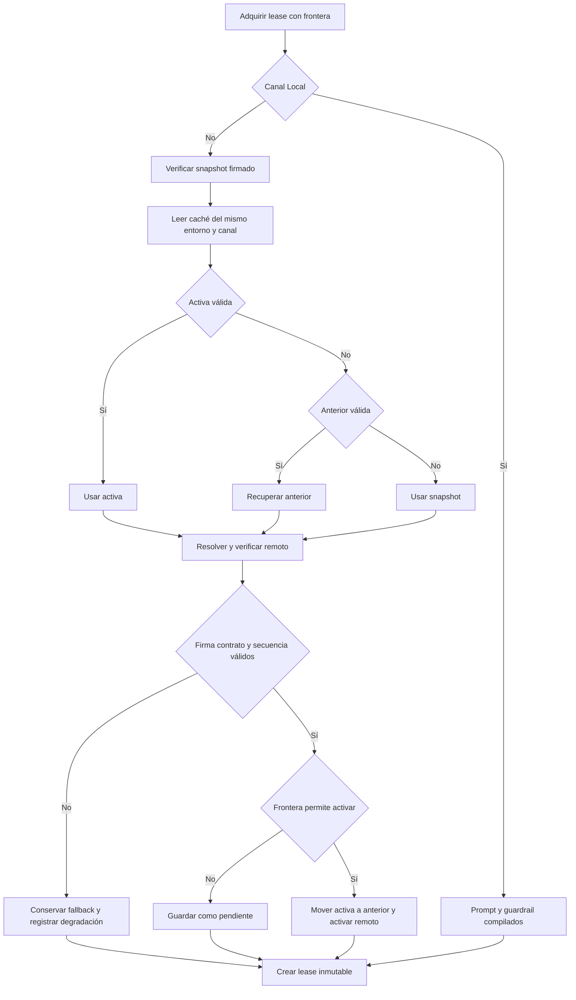
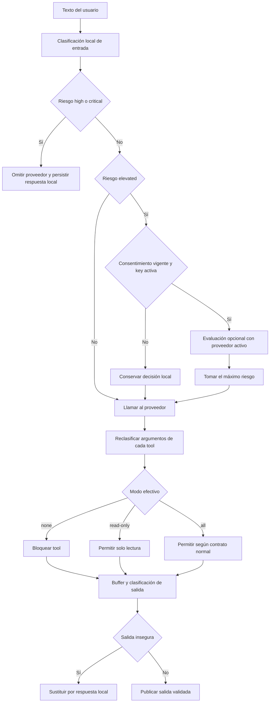

# Política firmada, prompt y seguridad sanitaria

La política del agente no es solo texto de prompt. En Staging y Production, la unidad desplegable es un **bundle firmado** que contiene el system prompt, la política sanitaria de runtime, la compatibilidad mínima y la lista de tools requeridas. La app selecciona y arrienda ambas partes juntas; no puede tomar el prompt de un candidato y el guardrail de otro. En Development, el canal `Local` usa exclusivamente los snapshots compilados.

Esta capa complementa el [bucle del agente](agent-loop.md) y la ejecución de [tools](agent-tools.md): decide qué política gobierna una petición antes de llamar al proveedor, vuelve a aplicar controles en cada tool call y retiene la salida hasta que sea publicable.

## Fuentes editables y artefactos derivados

| Clase | Archivos | Regla de cambio |
| --- | --- | --- |
| Fuente editable del prompt | `prompts/AGENTS.md` fuera de `HEALTH-SAFETY:START` / `HEALTH-SAFETY:END` | Editar aquí el comportamiento no sanitario. El bloque sanitario no se edita a mano. |
| Fuente editable sanitaria | `policy/health-safety/manifest.json`, `rules.json`, `runtime.json`, casos, esquemas y ejemplos | Mantener IDs y versiones, actualizar `currentRelease.changedRuleIds` y los casos afectados. |
| Configuración del candidato | `policy/signing/bundle.config.json` | Incrementar la versión cuando cambien las fuentes y declarar protocolo, criticidad y tools requeridas. |
| Snapshots y módulos generados | `apps/mobile/agent/generated/chatSystemPrompt.generated.ts`, `healthSafetyPolicy.generated.ts`, `policySnapshot.generated.json`, `signedPolicySnapshot.generated.ts` y `trustedPolicyRoots.generated.ts` | No editar manualmente. Se regeneran desde las fuentes o, para builds no locales, desde el deployment verificado. |
| Artefactos públicos firmados | `policy/signing/current.bundle.json`, `current.bundle.signature.json`, `signer-certificate.json` y `trusted-roots.json` | Son salidas versionadas o material público de confianza, no una segunda fuente editorial. Las claves privadas no pertenecen al repositorio. |

`policy/health-safety/` genera dos representaciones coordinadas: el bloque humano del prompt y `runtime.json`, consumido por el clasificador local. Así, las instrucciones al modelo y la barrera determinista parten de la misma política, pero la seguridad no depende de que el modelo obedezca el prompt.

Las reglas `provisional` se publican de forma conservadora y siguen pendientes de revisión profesional. `approved` requiere la revisión y metadatos profesionales definidos por la política. Ni la aprobación del cambio de software, ni una prueba determinista, ni una eval LLM convierten una regla provisional en aprobación clínica. `policy/health-safety/llm-evaluation.json` declara expresamente `authorizing: false` y `requiredForPullRequests: false`.

## Bundle, firmas y aislamiento

Un `PolicyBundle` tiene un máximo de 256 KiB y liga por digest el prompt y el objeto sanitario. El verificador exige JSON canónico, campos exactos, hashes SHA-256, IDs y versiones válidos, protocolo compatible y una lista ordenada de tools que existan en el binario. A continuación verifica:

1. la firma Ed25519 de la activación;
2. que la activación corresponda al canal y al SHA-256 del bundle;
3. la firma Ed25519 del bundle;
4. el certificado del firmante y su firma por una raíz compilada;
5. la vigencia del certificado en la fecha firmada;
6. la coincidencia entre candidato, bundle, activación y marca `critical`.

La descarga no hereda confianza de GitHub: una respuesta servida por el canal sigue siendo inútil sin una cadena de firma válida. El paquete también debe pertenecer exactamente al `environment` y `channel` instalados. La caché está scopeada por variante mediante `scopedStorageKey`; Production nunca cae a Staging, otro entorno, `main` o una caché heredada sin verificar.

La protección anti-rollback conserva `highestSequence` y `highestActivationId`. Se rechaza una secuencia menor y también una misma secuencia con otra identidad. Reobservar exactamente la misma activación es idempotente. Volver legítimamente a un bundle histórico exige una activación firmada con `action: "rollback"`, `fromBundleId` coherente y una **secuencia nueva y mayor**.

## Selección y activación

La caché conjunta guarda `active`, `previous`, `pending`, la mayor secuencia observada y el resultado de la última comprobación. Cada paquete leído —incluidos caché y snapshot— se vuelve a verificar. El orden de recuperación de la política efectiva es: activa válida, anterior válida si la activa está corrupta y snapshot firmado integrado. En paralelo, un remoto válido puede activarse o quedar pendiente según la frontera de la petición.



*Selección del paquete verificable y activación controlada antes de construir el lease.*

Las fronteras son deliberadas:

- `background`: comprueba y persiste, pero nunca cambia la política activa;
- `new-conversation`: puede activar cualquier actualización normal pendiente;
- `turn`: conserva las actualizaciones normales pendientes, pero activa una política `critical` o una activación `rollback` al comienzo del siguiente envío seguro.

Por ello una actualización normal no cambia una conversación existente a mitad de flujo. Un chequeo manual con `force: true` vacía las cachés de resolución de red, no esta regla de activación.

`acquireAgentPolicyLease` produce un `AgentPolicyLease` profundamente inmutable. El lease contiene `prompt`, `healthSafety`, `context` y `status` del mismo candidato. Se adquiere una vez al empezar cada envío y se reutiliza durante reintentos, streaming y rondas de tools. El `policy_context` persistido con la respuesta conserva candidato, versión, hash del bundle, fuente, activación y secuencia, pero no el contenido del prompt.

Si falla la red, se mantiene caché o snapshot y se marca degradación `offline`; una remota inválida produce `invalid-remote`; una activa corrupta puede recuperar `previous`; un error de escritura marca `storage-error` pero no invalida para esa petición una política que ya fue verificada. Si el snapshot firmado no existe o no verifica en un entorno no local, la resolución no puede continuar de forma segura.

## Composición del system prompt

El prompt enviado al proveedor se deriva de la selección del lease. En el límite del transporte, `composeAiSystemPrompt` elimina cualquier bloque remoto que intente ocupar los marcadores reservados y añade exactamente una política local de identidad y transparencia. Las superficies de estimación pueden sumar su prompt fijo de función, pero no datos del usuario.

El invariante es estricto: **memoria personal, preferencias, backups, contenido de stores y cualquier otro dato local nunca pueden inyectar texto en el system prompt**. Esos datos solo pueden entrar como mensajes o resultados de tools por las rutas explícitas del agente. El chat principal construye el mensaje `system` con `systemPromptSelection.content`, no lee memoria durante esa composición y registra `localPromptOverrides: 0`. Las trazas incluyen metadatos como hash, versión, candidato y longitud, nunca el prompt ni la conversación.

Aunque `chatSystemPrompt.ts` conserva contratos de normalización y caché del prompt, el entrypoint de runtime `loadChatSystemPrompt` ya obtiene su valor de `acquireAgentPolicyLease("background")`: la selección operativa no es una ruta independiente que pueda separar prompt y guardrail.

## Overlay sanitario monotónico

Antes de exponer la política sanitaria del bundle, `createSignedAgentPolicyLease` la fusiona con `BUNDLED_RUNTIME_HEALTH_SAFETY_POLICY`. La fusión es **monotónica**:

- conserva todas las reglas y señales compiladas;
- une señales nuevas por ID, sin reemplazar las existentes;
- para una regla existente solo acepta un riesgo igual o más severo;
- para permisos conserva el `toolMode` más restrictivo;
- nunca acepta mensajes remotos para sustituir las respuestas locales compiladas;
- una regla remota nueva necesita `fallbackRuleId` hacia una regla compilada, de la que hereda los mensajes.

Un schema, versión o regla inválida hace fallar la fusión completa; no se aplica parcialmente un overlay dudoso. Esta propiedad limita lo que una política remota puede cambiar: puede añadir detección o endurecer una barrera, no retirar la protección mínima incluida en la app.

## Decisión sanitaria de extremo a extremo

El clasificador determinista normaliza el texto y compara las señales `all`, `any` y `none` de cada regla. Se ejecuta sobre la entrada antes del proveedor y sobre la salida antes de hacerla visible. La decisión conserva nivel (`none`, `elevated`, `high`, `critical`), reglas, señales, locale, razón, fuente y versión de política.



*La decisión local domina entrada, evaluación opcional, tools y publicación de salida.*

### Entrada y fallback local

`high` y `critical` son bloqueantes: el proveedor no recibe la consulta y la app crea una respuesta local ES, EN o PT desde mensajes compilados. Esa intervención queda diferenciada de un error técnico y se persiste con metadatos sanitarios y `policy_context`.

Una entrada `elevated` puede solicitar una segunda clasificación al mismo proveedor BYOK activo, pero solo con consentimiento. El resultado estructurado solo admite niveles válidos e IDs conocidos. La combinación usa `maxHealthRisk`, por lo que el evaluador jamás rebaja la decisión determinista. Un timeout, JSON inválido o error conserva la decisión local con fuente `evaluator-failure`.

### Consentimiento

El consentimiento es un único interruptor, desactivado por defecto y ligado a `consentVersion`. Solo habilita la evaluación si la superficie tiene un proveedor activo con una API key no vacía. Si cambia la versión de consentimiento, el documento es inválido o se borra la última key, vuelve al estado apagado. La migración del esquema antiguo no transforma el permiso huérfano de un proveedor sin key en permiso para otro proveedor.

La evaluación recibe el texto ambiguo citado como datos y un prompt clasificador restringido; no recibe memoria, fotos ni historial por esta ruta. El consentimiento habilita esa clasificación adicional, no autoriza atención sanitaria ni sustituye las barreras locales.

### Tools

Antes de ejecutar una tool, la ruta con tools clasifica también `name + JSON.stringify(args)` y combina ese riesgo con el de la consulta. El efecto declarado por `agentToolEffect` se traduce en tres modos efectivos:

| Riesgo combinado | Modo | Resultado |
| --- | --- | --- |
| `none` | `all` | Puede continuar cualquier efecto reconocido. |
| `elevated` | `read-only` | Solo se permiten tools con efecto `read`. |
| `high` o `critical` | `none` | No se permite ninguna tool. |

Una tool desconocida o no permitida devuelve `tool_blocked_by_health_safety`; no llega al ejecutor. Los controles de idempotencia, confirmación y efectos descritos en [Tools del agente](agent-tools.md) siguen aplicando después de esta puerta sanitaria.

### Streaming de salida

`createHealthSafeStreamGate` recibe agregados, no confía en deltas aislados. Con una entrada `none`, solo libera segmentos completos terminados por puntuación o salto de línea después de clasificarlos. Si detecta una señal en un segmento, fija `blockedDecision` y no revela ese segmento. Con entrada `elevated`, mantiene **toda** la respuesta en buffer hasta `finish`. En todos los casos `finish` clasifica el contenido completo; una coincidencia sustituye la salida del modelo por la respuesta local y elimina el razonamiento visible asociado.

Cada reintento crea una puerta nueva, pero conserva el mismo lease y decisión de entrada. Esto evita tanto mezclar políticas durante una petición como filtrar una frase peligrosa por una fragmentación distinta del stream.

## Operación y cambios seguros

### Cambio sanitario

1. Editar reglas, runtime, casos y manifest bajo `policy/health-safety/`; incrementar versiones y declarar los IDs modificados.
2. Regenerar el bloque administrado y snapshots locales:

   ```bash
   npm run sync:health-safety
   ```

3. Incrementar `policy/signing/bundle.config.json`, firmar y comprobar el candidato:

   ```bash
   npm run policy:bundle:sign
   npm run policy:bundle:check
   ```

4. Verificar coherencia y pruebas:

   ```bash
   npm run check:health-safety
   npm run test:health-safety
   npm run check:chat-prompt
   npm run check:policy-trust
   npm test
   npm run test:agent:e2e
   npm --workspace apps/mobile exec tsc --noEmit
   ```

`check:health-safety` es la puerta determinista: valida schemas, referencias, cobertura, tools, fixtures, bloque generado y snapshot. `report:health-safety` produce evidencia con `authorizing: false`; una eval probabilística mediante `npm run test:llm` es complementaria y no autoriza promoción ni aprobación clínica.

### Cambio no sanitario del prompt

Editar únicamente `prompts/AGENTS.md` fuera del bloque administrado y ejecutar:

```bash
npm run sync:chat-prompt
npm run policy:bundle:sign
npm run policy:bundle:check
npm run check:chat-prompt
npm run check:policy-trust
npm run check:health-safety
npm test
npm run test:agent:e2e
npm --workspace apps/mobile exec tsc --noEmit
```

`check:chat-prompt` regenera en memoria y compara byte por byte, por lo que detecta una fuente sin sincronizar o un módulo generado editado a mano.

### Confianza y build no local

Un cambio de raíces públicas exige regenerar el módulo de confianza:

```bash
npm run sync:policy-trust
npm run check:policy-trust
```

Antes de una build Staging o Production se prepara el snapshot desde el deployment del entorno, inmediatamente antes de EAS:

```bash
node scripts/policy-promotion/prepare-policy-snapshot.mjs --environment production
```

El script verifica bundle, firma, activación y evidencias; una ausencia o discordancia falla la build. El procedimiento de promoción, rollback y evidencias operativas vive en [Promoción de políticas](../operations/policy-promotion.md). No se debe “recuperar” reduciendo secuencias, borrando cachés ni editando una Release: se firma una activación de rollback nueva.

## Pruebas que protegen los invariantes

Las pruebas focalizadas importantes son:

- `agentPolicyRuntime.test.ts`: prompt, guardrail y atribución comparten candidato y quedan profundamente congelados;
- `signedPolicy.test.ts` y `signedPolicySelection.test.ts`: cadena de confianza, contratos exactos, aislamiento, anti-rollback, activación pendiente, recuperación de caché y snapshot;
- `healthSafety.test.ts`: casos bloqueantes y normales, fusión monotónica, modos de tools, parser del evaluador y propiedades de fragmentación del stream;
- `healthSafetyConsent.test.ts`: versión, migración y propiedad de que nunca quede consentimiento activo sin key;
- `chatSystemPrompt.contract.test.ts` y `personalData.contract.test.ts`: snapshot reproducible y ausencia de una vía de inyección desde memoria local;
- `healthSafety.contract.test.ts`: integración previa al proveedor en las superficies y presencia de barreras distintas para streaming, tools y errores técnicos.

Para la estrategia transversal y los límites entre checks deterministas, contratos y E2E, véase [Estrategia de validación](../testing/validation-strategy.md).
