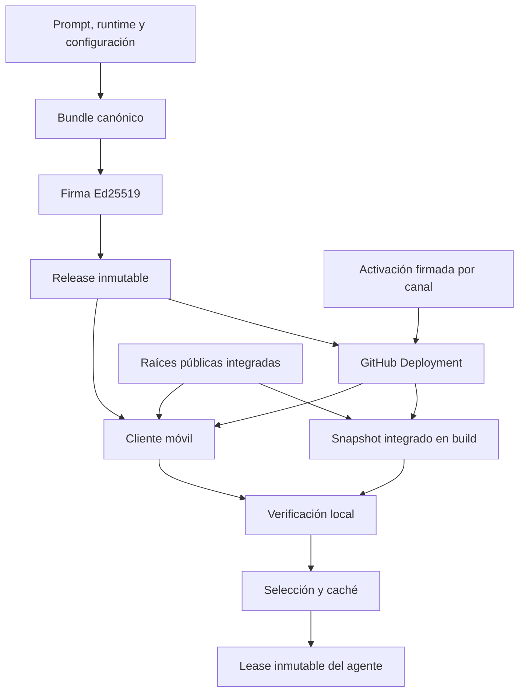
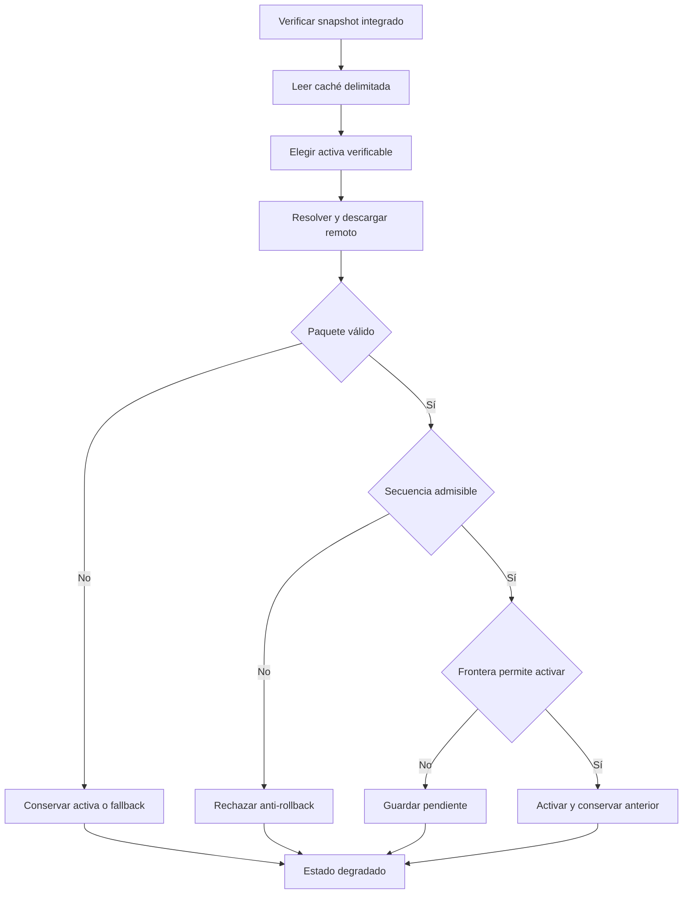

# Entrega y verificación de política

La política ejecutable no es un prompt remoto arbitrario: es un **bundle canónico firmado** que reúne el prompt, el runtime de salud-seguridad, las herramientas requeridas y metadatos de compatibilidad. Una activación firmada lo asocia con un canal (`Staging` o `Production`) y una secuencia. La aplicación solo puede usar un paquete cuya cadena verifique contra raíces públicas integradas en la build.

## Límites de confianza y artefactos actuales

| Elemento | Responsabilidad y límite |
| --- | --- |
| Fuentes canónicas | `prompts/AGENTS.md`, `policy/health-safety/runtime.json` y `policy/signing/bundle.config.json` son las entradas del bundle. Las `requiredTools` deben existir en `AGENT_TOOL_DEFINITIONS`. |
| Bundle y firma | `policy/signing/current.bundle.json` contiene el prompt, runtime sanitario, versión, criticidad, protocolo mínimo y tools. `current.bundle.signature.json` lleva una firma Ed25519 y un certificado firmado. |
| Raíces de confianza | `policy/signing/trusted-roots.json` contiene solamente claves públicas Ed25519 autorizadas. La build genera e integra su representación; el cliente no acepta raíces descargadas. |
| Activación | Una activación canónica firmada declara `activate` o `rollback`, canal, candidato, digest, criticidad y secuencia monotónica; un rollback además identifica el bundle de origen. |
| Puntero de despliegue | El cliente consulta GitHub Deployments con tarea `gymnasia-policy`. Solo admite un payload v3 exacto, URLs de assets de la release del candidato y un estado más reciente `success`. |

La frontera verificable es: **raíz pública integrada → certificado de firmante para `gymnasia-policy` y dentro de vigencia → firma del bundle y de la activación → identidades, digest, entorno y canal coherentes**. El repositorio no almacena las claves privadas: los comandos de firma las obtienen localmente mediante Bitwarden CLI.



*El recorrido vigente va desde las fuentes y la firma hasta la selección local; la red solo aporta candidatos que el cliente vuelve a verificar.*

## Generación, firma y promoción

`buildCurrentBundle` normaliza el prompt, lee el runtime sanitario y la configuración, y rechaza tools requeridas que el catálogo móvil no anuncia. El bundle se serializa como JSON canónico; su id incorpora versión y el prefijo del digest del prompt. `npm run policy:bundle:sign` firma los inputs actuales y vuelve a verificar que los archivos generados correspondan con las fuentes canónicas. `npm run policy:bundle:check` verifica esa correspondencia y la firma sin requerir una clave privada.

La promoción se inicia con `npm run policy:promote`. La operación de staging exige exactamente una PR abierta autorizada o el bootstrap único desde `main`; el workflow verifica en el commit candidato la puerta determinista `npm run check:health-safety`, el bundle, la activación y las fuentes usando el verificador confiable. Después publica una release prerelease inmutable con el bundle, su firma, el informe sanitario y la evidencia de promoción, y registra un deployment exitoso de `Staging`.

Production descarga el candidato de la release, repite la puerta sanitaria y la verificación contra el código fuente exacto, exige que el candidato sea el último de Staging y que la secuencia sea mayor que las de Production. Las operaciones se serializan por canal; una política crítica se publica en el entorno protegido `Production Critical`.

### Rollback firmado

Un rollback no restaura una caché local ni reduce la secuencia. `policy:promote -- --operation rollback` exige un candidato histórico distinto del activo que haya tenido un deployment correcto en Staging y Production; descarga y verifica de nuevo su bundle y firma una activación `rollback` de Production con una secuencia nueva y `fromBundleId` igual al activo. El cliente conserva así la monotonía anti-rollback aunque el contenido vuelva a una versión anterior.

## Snapshot integrado en la build

`npm run prepare:policy-snapshot -- --environment staging|production` busca el deployment exitoso del canal y descarga sus dos assets con límites de tamaño y tipos de contenido permitidos. Comprueba el digest publicado y verifica el paquete frente a `trusted-roots.json` y el catálogo de tools. Además exige que el informe sanitario no sea autorizante, no tenga fallos y coincida con el prompt, y que la evidencia de promoción corresponda al candidato, commit y digest.

Solo tras esas comprobaciones genera los módulos de prompt, runtime sanitario y `signedPolicySnapshot.generated.ts`, junto con metadatos del snapshot. La build de APK de producción ejecuta este paso para una transacción nueva y conserva esos inputs inmutables como artefactos de release; en reintentos restaura los inputs previamente guardados en vez de resolver otra política.

`Local` no resuelve un deployment remoto firmado: crea el lease desde los snapshots de desarrollo. `staging` usa `Staging` y `production` usa `Production`; el almacenamiento se delimita por entorno y canal.

## Verificación y descarga en el cliente

`verifySignedPolicyPackage` no expone contenido al agente hasta que valida lo siguiente:

1. JSON canónico, objetos con claves exactas y límites de 256 KiB para el bundle y 16 KiB para la activación.
2. SHA-256 del contenido y firmas Ed25519; certificado encadenado a una raíz integrada, propósito `gymnasia-policy` y fecha de emisión dentro de su vigencia.
3. Vínculo entre activación y bundle: canal, digest, candidato, id y `critical`, además del entorno esperado del paquete.
4. Digest y formato del prompt y runtime sanitario, protocolo mínimo compatible y una lista ordenada, única y conocida de `requiredTools`.
5. Fusión del runtime sanitario firmado con la política compilada. Las reglas existentes solo pueden elevar riesgo o restringir tools; una regla nueva requiere un `fallbackRuleId` compilado. Un contrato inválido descarta el paquete entero.

El descargador remoto resuelve primero el deployment y solo descarga las URLs exactas de GitHub Releases previstas para el candidato. Comprueba el SHA-256 del asset antes de montar el paquete. La resolución de deployments, incluidos errores, y el paquete remoto se conservan en memoria cinco minutos; `force` limpia ambas cachés. Las cargas se serializan para que resoluciones concurrentes no reordenen la selección.

## Selección, caché y degradación segura

Antes de leer red o caché, el selector verifica el snapshot integrado. La caché de `AsyncStorage`, delimitada por entorno y canal, guarda `active`, `previous`, `pending`, el máximo de secuencia e id de activación, y el estado de comprobación. Los registros v1 se migran a v2; uno ilegible, incompatible o que falle verificación se descarta y se reconstruye desde el snapshot.



*La selección mantiene una política verificada disponible incluso cuando falla la red, la caché o un candidato remoto.*

| Situación | Resultado |
| --- | --- |
| Remoto verificable con secuencia nueva | En `background` queda pendiente; se activa en `new-conversation`. También puede activarse al comienzo de `turn` si es crítico o un rollback. |
| Misma activación | Es idempotente: no se reactiva ni queda pendiente. |
| Secuencia menor, o misma secuencia con id distinto | Se rechaza como `anti-rollback` aunque tenga firma válida. |
| Red, resolución o asset no disponible | Conserva la activa verificable; sin ella prueba `previous` y finalmente el snapshot integrado. Informa degradación `offline`. |
| Activa de caché corrupta | Recupera `previous` si verifica; si no, usa el snapshot integrado e informa recuperación de caché. |
| Remoto o contrato inválido | No sustituye la activa; informa `invalid-remote`. |
| Error de almacenamiento | La selección verificada de la petición sigue utilizable, pero el estado pasa a `storage-error`. |

Los diagnósticos se reducen a frontera, origen, candidato, secuencia y código de razón. No incluyen el prompt, mensajes, entradas, salidas ni datos sanitarios.

## Lease y atribución en el runtime

`acquireAgentPolicyLease(boundary)` es la entrada al runtime del agente. En canales firmados convierte la selección en un `AgentPolicyLease` profundamente inmutable: prompt, salud-seguridad fusionada, `PolicyContext`, estado y deployment proceden del mismo candidato. La interfaz adquiere este lease antes de clasificar una entrada sanitaria o enviar el turno; así no mezcla un prompt, un guardrail y atribución de políticas distintas en una petición.

El contexto contiene candidato, digest del bundle, versión, secuencia, origen e id/acción de activación. El estado expone activa, pendiente, degradación, resultado de comprobación y latencia de propagación para la presentación y diagnóstico local, sin registrar contenido sensible. Véase [Runtime del agente](../agent/runtime.md) para el consumidor de este lease y [Estado local y copias de seguridad](../mobile/local-state-and-backup.md) para el aislamiento de estado.

## Operación actual frente a procedimientos históricos

Los comandos, workflows y artefactos descritos arriba son el mecanismo ejecutable actual. Los bundles de releases anteriores solo se consultan como candidatos históricos para un rollback firmado: no son una fuente alternativa de política ni se copian directamente al cliente.

Los comentarios de incidentes y de transacciones anteriores que aparecen en workflows de build son contexto histórico de mantenimiento. No sustituyen las comprobaciones actuales ni deben convertirse en una receta operativa. Para un cambio presente en `prompts/` o `policy/health-safety/`, describe primero en lenguaje natural qué tools, acciones o recomendaciones se permiten, prohíben o restringen, y obtén la aprobación requerida antes de firmar o promocionar.

La comprobación local mínima antes de promover es:

```bash
npm run check:health-safety
npm run check:chat-prompt
npm run policy:bundle:check
npm run check:policy-trust
npm run test:prompt-policy
```

La autorización de rutas sensibles se describe en [Gobierno de cambios sensibles y política de prompt](../operations/prompt-policy-governance.md); la integración con builds y releases, en [Compilación, publicación y pruebas](../operations/build-release-and-testing.md).

## Pruebas enfocadas

- `signedPolicy.test.ts` cubre interoperabilidad Node/móvil de Ed25519 y rechaza alteraciones de bundle, activación o firmas, raíces no integradas, canal/entorno/tools/protocolo incompatibles y JSON no canónico.
- `policyDeployment.test.ts` cubre el schema exacto del puntero, rechazo de URLs arbitrarias, requisito de `success` y caché de cinco minutos para éxitos y fallos.
- `signedPolicySelection.test.ts` cubre migración, fronteras de activación, actualizaciones críticas y rollback, recuperación desde la copia anterior, fallback integrado, error de almacenamiento, idempotencia y monotonía de secuencia.
- `agentPolicyRuntime.test.ts` garantiza que el lease congela prompt, guardrail y atribución del mismo bundle.
