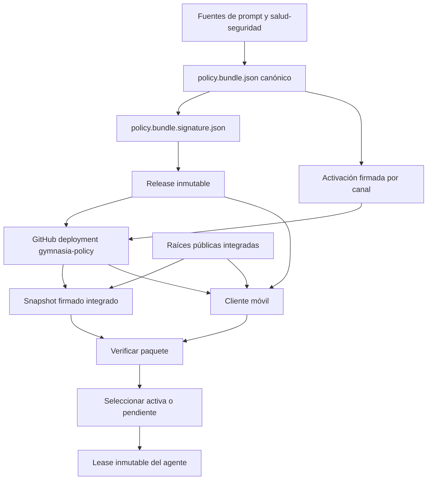

# Entrega y verificación de política del agente

La política ejecutable del agente no es un prompt remoto arbitrario. Es un **bundle canónico firmado** que une el prompt, el runtime de salud-seguridad, las herramientas requeridas y metadatos de compatibilidad. Una activación firmada lo enlaza a un canal (`Staging` o `Production`) y a una secuencia. La aplicación verifica esa cadena contra raíces públicas incluidas en la build antes de poder usarla.

Este documento describe el mecanismo actual. Los bundles ya publicados se usan únicamente como candidatos históricos para el rollback firmado; no son un plan histórico ni una fuente alternativa de política.

## Límites de confianza y artefactos públicos

| Elemento | Responsabilidad y límite |
| --- | --- |
| Fuentes canónicas | `prompts/AGENTS.md`, `policy/health-safety/runtime.json` y `policy/signing/bundle.config.json` alimentan el bundle; sus tools requeridas deben existir en `AGENT_TOOL_DEFINITIONS`. |
| Bundle y firma | `policy/signing/current.bundle.json` contiene prompt, runtime sanitario, versión, criticidad, protocolo mínimo y tools. `current.bundle.signature.json` aporta una firma Ed25519 y certificado firmado. Ambos son artefactos públicos versionados. |
| Raíz de confianza | `policy/signing/trusted-roots.json` registra únicamente claves públicas Ed25519 autorizadas. La app integra una representación generada de ese registro y no descarga ni acepta raíces remotas. |
| Activación | Una activación canónica y firmada declara acción `activate` o `rollback`, canal, candidato, digest del bundle, criticidad, secuencia monotónica y, para rollback, el bundle de origen. |
| Puntero de despliegue | El cliente consulta deployments de GitHub con tarea `gymnasia-policy`; solo acepta un payload v3 exacto que apunte a los dos assets de la release inmutable esperada y cuyo estado más reciente sea `success`. |

Las claves privadas y los mecanismos que las custodian quedan fuera de esta página y del repositorio público. El límite verificable por el cliente es: raíz pública integrada → certificado de firmante con propósito `gymnasia-policy` y vigencia → firma del bundle y de la activación → identidades, digest, canal y entorno coherentes.

## Flujo de publicación, integración y selección



*El flujo actual publica assets firmados en una release, los referencia mediante un deployment exitoso, integra un snapshot verificado durante la build y hace que el cliente verifique y seleccione una política antes de crear el lease.*

### Construcción, firma y promoción

`buildCurrentBundle` normaliza el prompt, lee el runtime sanitario y la configuración del bundle, y rechaza tools requeridas que no estén anunciadas por móvil. El bundle se serializa como JSON canónico; su identidad incluye versión y el prefijo del digest del prompt. `policy:bundle:sign` firma el bundle actual y vuelve a verificar los archivos y su correspondencia con las fuentes canónicas.

La promoción se solicita mediante `policy:promote`. Para staging exige una PR abierta autorizada (salvo el bootstrap único de `main`), y el workflow vuelve a ejecutar `npm run check:health-safety` sin secretos, verifica bundle, firma, activación y fuentes con el verificador de confianza, publica una release inmutable y registra un deployment exitoso. Production vuelve a verificar el candidato de la release y su evidencia antes de publicar su activación. Las operaciones están serializadas por canal en el workflow.

Un rollback es una operación firmada normal: exige un candidato histórico distinto del activo que conste como deployment correcto en Staging y Production; descarga y vuelve a verificar su bundle antes de firmar una activación `rollback` con una secuencia nueva. Por tanto, retroceder de contenido no rebaja la barrera anti-rollback.

### Snapshot de build

`npm run prepare:policy-snapshot -- --environment staging|production` busca el deployment exitoso del canal, descarga bundle y firma con límites de tamaño y tipos de contenido, compara el digest público, y verifica el paquete contra `trusted-roots.json` y el catálogo de tools. Además exige evidencia de una pasada autorizable de salud-seguridad. Solo entonces genera el prompt, runtime sanitario, metadatos y `signedPolicySnapshot.generated.ts` que viajan con la aplicación. La build de producción ejecuta este paso antes de empaquetar los inputs inmutables de política.

Development usa el canal `Local`: crea un lease exclusivamente a partir de los snapshots de desarrollo y no intenta resolver una política remota firmada. Staging y Production están ligados respectivamente a los canales `Staging` y `Production`, y usan namespaces de almacenamiento separados fuera de producción.

## Verificación en el cliente

`verifySignedPolicyPackage` aplica una validación estricta antes de exponer contenido al agente:

1. Exige JSON canónico, objetos con claves exactas y límites de tamaño: bundle de hasta 256 KiB y activación de hasta 16 KiB.
2. Comprueba SHA-256 del contenido y firmas Ed25519; valida que la firma de certificado proceda de una raíz pública autorizada, que el certificado sea para `gymnasia-policy` y que la emisión caiga dentro de su vigencia.
3. Vincula activación y bundle: canal esperado, digest, id de candidato y bit `critical` deben coincidir; el paquete también debe ser del entorno esperado.
4. Valida el prompt y el runtime sanitario por sus propios digests, el protocolo mínimo y una lista ordenada, única y conocida de `requiredTools`.
5. Fusiona la salud-seguridad firmada con la política sanitaria compilada. Las reglas existentes solo pueden aumentar el riesgo o restringir el modo de tools; una regla nueva necesita un `fallbackRuleId` compilado. Un contrato sanitario inválido descarta el paquete completo.

El cargador remoto limita el puntero a URLs exactas de GitHub Releases del candidato y comprueba el SHA-256 del asset antes de construir el paquete. Las respuestas de deployments, tanto válidas como fallidas, se cachean cinco minutos; un `force` limpia esa caché de memoria. Las operaciones de carga se serializan para evitar que resoluciones concurrentes reordenen la selección.

## Selección, caché y degradación segura

La selección siempre verifica primero el snapshot integrado. Después lee una caché de `AsyncStorage`, delimitada por entorno y canal, con `active`, `previous`, `pending`, la máxima secuencia/activación observada y estado de comprobación. La caché v1 se migra a v2; un registro ilegible o incompatible se descarta y se reconstruye desde el snapshot.

| Situación | Resultado |
| --- | --- |
| Remoto verificable con secuencia nueva | Se guarda como pendiente en `background`; se activa al empezar una conversación nueva. Una política crítica o un rollback puede activarse al comienzo de un `turn`. |
| Misma activación | Es idempotente; no vuelve a activar ni deja pendiente. |
| Secuencia menor, o misma secuencia con distinto id | Se rechaza como `anti-rollback`, aunque tenga firma válida. |
| Red, resolución o asset remoto no disponible | Conserva activa verificable; si no existe, intenta `previous` y finalmente el snapshot integrado. El estado informa degradación `offline`. |
| Activa de caché corrupta | Recupera `previous` si la verificación pasa; de lo contrario usa el snapshot integrado. |
| Remoto inválido o contrato/firma inválidos | No sustituye la activa; informa `invalid-remote`. |
| Error de lectura/escritura de almacenamiento | La selección verificada de esta petición sigue siendo utilizable, pero el estado queda `storage-error`. |

Las trazas de selección se reducen a frontera, origen, candidato, secuencia y código de razón; no incluyen prompt, mensajes, entradas/salidas ni datos de salud.

## Lease del agente y atribución

`acquireAgentPolicyLease(boundary)` es el punto de entrada para el runtime del agente. Para canales firmados, convierte la selección verificada en un `AgentPolicyLease` profundamente inmutable: prompt, salud-seguridad fusionada, `PolicyContext` y estado provienen del mismo candidato y deployment. La interfaz de chat adquiere el lease antes de clasificar la entrada sanitaria o enviar el turno, y adjunta el contexto de política a mensajes y respuestas relevantes. Esto evita mezclar un prompt, un guardrail y una atribución de políticas distintas durante una misma petición.

El `PolicyContext` conserva candidato, digest del bundle, versión, secuencia, origen y activación; se normaliza con una allowlist estricta al consumirlo. El estado de runtime expone política activa y pendiente, degradación, resultado y momento de la última comprobación, y latencia de propagación, para presentación y diagnóstico sin registrar contenido sensible.

## Cambio seguro y operación

Los cambios a `prompts/` o `policy/health-safety/` son cambios de comportamiento y de seguridad, no solo de texto. Antes de promoción o merge se debe describir en lenguaje natural qué permisos de tools, acciones o recomendaciones se **permiten** ahora y cuáles se **prohíben o restringen**; se debe esperar una aprobación explícita del responsable. Después, reconstruye/firma el bundle y revisa que las fuentes, el digest y la criticidad reflejen exactamente la decisión aprobada.

Secuencia operativa mínima:

```bash
npm run check:health-safety
npm run check:chat-prompt
npm run policy:bundle:check
npm run check:policy-trust
npm run test:prompt-policy
```

Para generar un snapshot destinado a una build no local:

```bash
npm run prepare:policy-snapshot -- --environment production
```

Usa `npm run policy:promote -- --operation staging ...` o la operación correspondiente solo tras la aprobación explícita y las verificaciones. La receta de autorizaciones de rutas sensibles se detalla en [Gobierno de cambios sensibles y política de prompt](../operations/prompt-policy-governance.md); la integración con builds y releases se detalla en [Compilación, publicación y pruebas](../operations/build-release-and-testing.md).

## Pruebas que protegen la frontera

- `policyDeployment.test.ts` prueba el schema exacto del puntero, el rechazo de URLs arbitrarias, el requisito de `success` y la caché de cinco minutos de éxitos y fallos.
- `signedPolicy.test.ts` comprueba interoperabilidad Node/móvil de Ed25519 y rechaza alteraciones de bundle, activación o firmas, raíces no integradas, canal/entorno/tools/protocolo incompatibles y JSON no canónico.
- `signedPolicySelection.test.ts` cubre migración de caché, activación pendiente por frontera, actualizaciones críticas y rollback, recuperación desde la copia anterior, fallback integrado, fallo de almacenamiento, idempotencia y monotonía de secuencia con pruebas generativas.
- `agentPolicyRuntime.test.ts` garantiza que el lease congela prompt, guardrail y atribución del mismo bundle.

Para el diseño de ejecución que consume este lease, véase [Runtime del agente](../agent/runtime.md). Para el aislamiento de estado local y sus namespaces, véase [Estado local y copias de seguridad](../mobile/local-state-and-backup.md).
