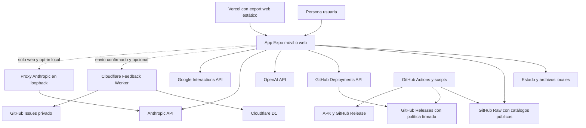

# Arquitectura del sistema y límites de despliegue

Gymnasia es **una sola aplicación Expo React Native**, ejecutable como app móvil y como export web estático. El límite funcional principal está en el dispositivo o navegador: entrenamiento, dieta, medidas, conversaciones y configuración se mantienen localmente. **No hay cuentas, autenticación, sincronización entre dispositivos ni un backend funcional obligatorio.**

La red amplía el producto, pero no posee su estado principal. Sirve para descargar datos públicos, obtener política firmada, invocar al proveedor de IA elegido por la persona y, si se confirma expresamente, remitir una incidencia. La app conserva snapshots integrados o en caché para degradarse de forma explícita cuando esos destinos no están disponibles.

> [!WARNING]
> **Documentación histórica que no describe el producto actual.** `docs/architecture/stack-and-systems.md` enumera Next.js, FastAPI, Supabase, JWT y dominios de backend; `docs/architecture/offline-and-sync.md` propone SQLite, IndexedDB, colas de sincronización y resolución `last-write-wins`. Son diseños antiguos, no la topología ejecutable. En particular, el web actual usa `AsyncStorage` sobre `localStorage`, no IndexedDB, y no existe sincronización con servidor. Los documentos de `docs/backend/` y `docs/specs/` tampoco son fuente de verdad para el despliegue actual.

## Topología ejecutable



*El diagrama separa conexiones de ejecución verificadas: las líneas discontinuas son integraciones opcionales, no dependencias de arranque.*

### 1. Aplicación y estado local: el núcleo obligatorio

`apps/mobile/index.js` carga `App.tsx`; la composición interna usa controladores, pantallas, persistencia y un adaptador de plataforma Expo, pero todo se empaqueta como la misma aplicación. `createExpoPlatformServices()` concentra `AsyncStorage`, `SecureStore`, ficheros, multimedia, notificaciones, sharing y `fetch`, de modo que las capas de producto no necesitan otro proceso para operar.

El almacén funcional local contiene plantillas y sesiones, dieta, medidas, hilos y mensajes, configuración de proveedores y recibos de operaciones. Las escrituras que requieren confirmación durable pasan por una cola de persistencia serializada: primero se persiste el nuevo valor y después se publica en el estado React. En móvil, las claves BYOK se separan del JSON funcional y se guardan mediante `SecureStore`; el estado serializado borra `api_key` y las vuelve a combinar al hidratar. En web no existe un almacén seguro equivalente y las credenciales permanecen en el almacenamiento del navegador, circunstancia que la interfaz debe advertir.

Las variantes `development`, `staging` y `production` tienen identificador de aplicación, canal de política y namespace de almacenamiento distintos. `APP_ENV` es obligatorio al construir; desarrollo usa proveedor falso por defecto y solo admite `DEV_PROVIDER_MODE=byok` como opt-in, mientras staging y producción usan BYOK. La validación de runtime rechaza mezclas de canal, namespace, modo y versión de configuración, evitando que una build lea accidentalmente el estado de otra variante.

La publicación web es un `expo export --platform web` servido como contenido estático desde `apps/mobile/dist/`. Vercel aloja esos archivos, no una API ni una base de datos de Gymnasia. El modo `web:mirror` es otra herramienta local y opt-in de Metro; no forma parte de la publicación.

## Fuentes públicas estáticas

### Catálogos

Alimentos, productos comerciales y recetas se publican como JSON bajo `raw.githubusercontent.com`. Al abrirlos, la app lee primero su caché versionada, valida esquema y hash, intenta refrescar y conserva el snapshot anterior si falla la red o el JSON remoto no es válido. Un fallo al escribir caché no invalida los datos recién descargados durante esa sesión, pero se expone como advertencia porque no estarán garantizados para el siguiente arranque.

El catálogo de ejercicios usa un contrato paginado distinto: manifiesto, páginas de 30 elementos, shards de búsqueda y directorio por ID. Cada artefacto se comprueba contra el SHA-256 anunciado. Una versión remota solo se activa después de validar el manifiesto y cargar su primera página; se conserva una versión anterior válida y las páginas ya cacheadas permiten búsquedas y rutinas offline. Por tanto, GitHub Raw es **origen de publicación**, no backend transaccional ni dueño de los datos personales.

### Política del agente

Development usa exclusivamente el snapshot de política integrado. Staging y Production consultan la GitHub Deployments API para localizar un deployment exitoso del canal, descargan desde GitHub Releases el bundle y su firma, verifican URL, digest, entorno, canal y firma Ed25519, y cachean el paquete. La selección conserva también un snapshot firmado dentro de la build y una copia local verificada: una indisponibilidad de GitHub no convierte ese servicio en requisito de arranque ni autoriza política no verificada.

## Proveedores de IA: BYOK y tráfico directo

La persona configura y activa exactamente uno de `openai`, `anthropic` o `google`; la aplicación verifica y persiste su modelo y credencial. En modo BYOK, las conversaciones salen directamente del cliente hacia:

- OpenAI Responses API (`https://api.openai.com/v1/responses`);
- Anthropic Messages API (`https://api.anthropic.com/v1/messages`);
- Google Interactions API (`https://generativelanguage.googleapis.com/v1beta/interactions`).

La app añade la credencial del usuario a la petición del proveedor. No hay relay de producción de Gymnasia, cuenta compartida ni almacenamiento remoto propio de claves. En web, Anthropic también se llama directamente y se añade `anthropic-dangerous-direct-browser-access`; esto hace explícito que la clave ya está expuesta al contexto del navegador. Sin red o sin una clave válida, fallan las funciones de IA, no el registro local de entrenamiento, dieta o medidas.

### Proxy Anthropic: herramienta de desarrollo, no despliegue

`apps/anthropic_proxy/cors-proxy.py` queda como puente FastAPI **solo para depuración local**. La app web lo usa únicamente si se define deliberadamente `EXPO_PUBLIC_API_BASE_URL`; el valor por defecto es vacío para que una build publicada nunca intente usar el `localhost` de otra persona. El proxy recibe la clave en el cuerpo, la transforma en cabecera para Anthropic y no la almacena.

Este límite está reforzado en runtime: el proceso falla si `ANTHROPIC_PROXY_HOST` no es loopback y el middleware devuelve `403` a clientes demostrablemente remotos, aunque se arranque Uvicorn con otra interfaz. No debe desplegarse, contener sesiones ni convertirse en backend compartido. El guard rail `npm run check:anthropic-proxy` vigila además que no aparezca infraestructura de despliegue asociada.

## Worker de incidencias: única excepción opcional de producto

`apps/feedback-worker` es un Cloudflare Worker separado porque crear una issue requiere una credencial de escritura que nunca puede incluirse en un cliente estático. Staging y Production reciben por defecto `https://gymnasia-feedback.maximofn.com`; Development no recibe endpoint salvo override explícito. Una URL ausente o inválida degrada solo esta función a `unavailable` y no impide arrancar.

Tras confirmación de la persona, el cliente envía a `POST /feedback/issues` un esquema cerrado con tipo, título, resumen e idempotency key. El Worker valida y sanea, aplica rate limiting sobre un HMAC de la IP, reserva la identidad en D1 y crea una issue en el repositorio privado configurado por el servidor. El cliente no puede elegir repositorio, ruta, método ni etiquetas. Si se pierde la respuesta de una operación del agente, `GET /feedback/issues/status` permite reconciliar la reserva sin repetir automáticamente el `POST`; solo una referencia verificable se presenta como creación confirmada.

El Worker es anónimo porque no hay cuentas. Puede desactivarse con `FEEDBACK_ENABLED=false`; la caída, un `503` o un fallo de GitHub no afecta a ninguna otra capacidad. D1 no es una base de datos de usuario: mantiene rate limits, deduplicación y recibos de estas operaciones. Un cron horario poda contadores y, para denuncias de respuestas de IA, sustituye el cuerpo de la issue al cumplir 30 días; solo marca la redacción en D1 después de que GitHub la acepte, de modo que un fallo se reintenta en la siguiente ejecución.

## Límites de despliegue y operación

| Límite | Se despliega | Responsabilidad | Obligatorio para usar el núcleo |
|---|---|---|---|
| App Expo móvil | APK/cliente instalado | UI, lógica, estado y ficheros locales | Sí |
| App Expo web | Export estático en Vercel | La misma app sobre capacidades web | Sí, solo para el canal web |
| GitHub Raw y Releases | Artefactos públicos | Catálogos y política firmada | No; existen cachés/snapshots |
| APIs OpenAI, Anthropic o Google | Servicio de terceros elegido | Inferencia con clave BYOK | No; solo IA |
| Feedback Worker + D1 | Cloudflare | Incidencias confirmadas, deduplicación y retención | No |
| Proxy Anthropic | Proceso loopback del desarrollador | Depuración web opt-in | Nunca en producción |
| GitHub Actions y scripts | Automatización operativa | Validar/generar catálogos y política, construir y publicar releases | No en runtime |

La generación de catálogos (`sync:catalogs`) y sus puertas (`check:catalogs`, `test:catalogs`, `test:catalogs:e2e`) producen artefactos deterministas y comprueban consumidores con caché y sin servicios externos. La promoción de política es una operación manual autorizada: vuelve a ejecutar la puerta sanitaria, verifica activación y firmas, publica un release inmutable y registra el deployment de canal. La release Android usa una transacción durable, vuelve a validar la fuente exacta y construye el APK de Production por separado; estas automatizaciones publican artefactos, pero no participan en una sesión normal de la app.

## Fallos y reglas para cambios seguros

- **No introducir dependencia de cuenta o servidor** para editar datos locales. Una nueva salida de red debe ser explícita, inventariada y degradable.
- **No tratar una fuente estática como autoridad de datos personales.** Catálogos y políticas son contenido público descargable; el estado de usuario permanece local.
- **No trasladar BYOK a un servicio propio.** Las llamadas de IA son cliente-proveedor; el proxy de Anthropic no es un punto de extensión de producción.
- **No declarar éxito de una incidencia por intención.** Solo una respuesta 2xx con referencia válida, o una reconciliación `created`, confirma el efecto.
- **No activar artefactos sin verificar.** Los catálogos validan esquema/hash y la política valida digest, firma, canal y entorno antes de reemplazar un snapshot utilizable.
- **Desplegar primero el Worker** cuando cambie su contrato y después distribuir el cliente compatible; en particular, el endpoint de estado debe existir antes de que una app nueva dependa de la reconciliación.

## Comprobaciones enfocadas

Desde la raíz del repositorio:

```bash
npm --workspace apps/mobile exec tsc --noEmit
npm run check:mobile-boundaries
npm run test:deterministic
npm run check:catalogs
npm run test:catalogs
npm run test:catalogs:e2e
npm --workspace apps/feedback-worker run test
npm run check:anthropic-proxy
npm run test:proxy
npm run check:health-safety
npm run policy:bundle:check
npm run test:production-release
```

Estas pruebas cubren los límites que más fácilmente alteran la topología: imports entre capas móviles, persistencia y proveedores falsos sin red, validación/caché de catálogos, contrato e idempotencia del Worker, encierro loopback del proxy, política sanitaria firmada y transacciones de release. Las evaluaciones con LLM reales permanecen fuera de CI y no deben convertirse en requisito para validar la arquitectura.
