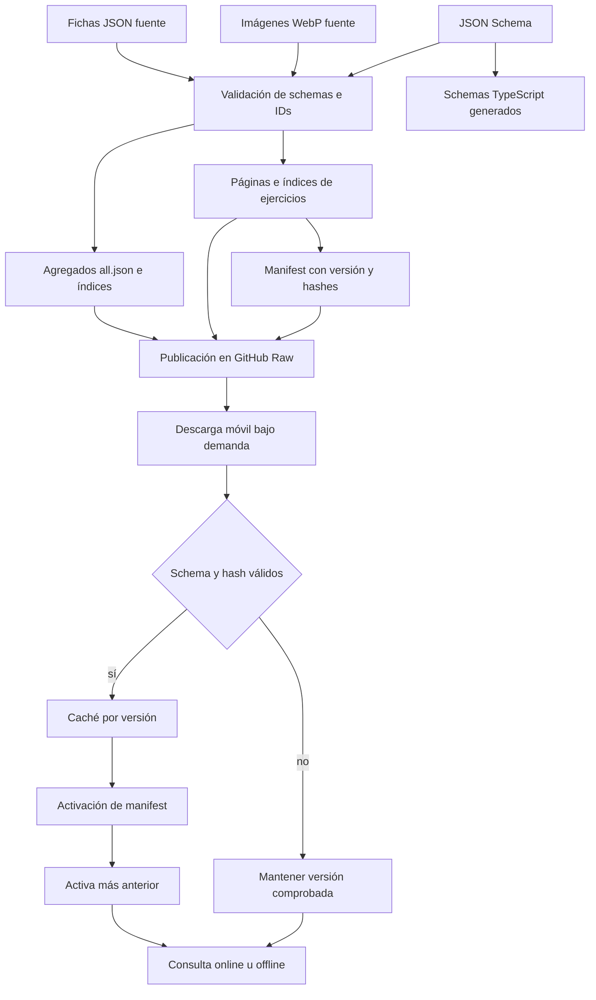

# Catálogos: generación, publicación, caché y uso offline

Los catálogos comparten una identidad estable —`sourceId` más `id`—, validación de esquema y distribución como JSON, pero no se sirven de la misma forma. Alimentos, productos comerciales y recetas se descargan como agregados completos `all.json`; ejercicios dispone además de un catálogo versionado, paginado y buscable bajo `ejercicios/catalog-v1/`. La aplicación añade `sourceId` al leer los registros: no forma parte de las fichas fuente.

## Fuentes de verdad y artefactos derivados

Las **fuentes editables** son las fichas individuales situadas directamente en `alimentos/`, `productos_comerciales/`, `recetas/` y `ejercicios/`, las imágenes referenciadas de sus respectivos directorios `images/` y los contratos JSON Schema de `scripts/catalogs/schemas/`. El nombre de cada ficha debe ser exactamente `<id>.json`. Una ficha nutricional contiene identidad, nombre, categoría, nutrientes por 100 g, ración e imagen opcional; una ficha de ejercicio contiene identidad, imágenes masculina y femenina, grupo muscular, músculos secundarios, equipamiento, dificultad e instrucciones.

Los siguientes archivos son **derivados y no deben editarse a mano**:

- `*/all.json`, agregado ordenado de las fichas del dominio;
- `alimentos/index.json`, índice ligero de `id` y `name`;
- `ejercicios/index.json`, lista compacta de IDs;
- todo `ejercicios/catalog-v1/`: `manifest.json`, páginas `pages/*.json`, índices invertidos `search/*.json` y directorio `by-id/*.json`;
- `apps/mobile/catalogs/generated/catalogSchemas.generated.ts`, copia de los esquemas que usa el runtime móvil.

No se generan `index.json` para `productos_comerciales` ni `recetas`. `inspectCatalogs` ignora `all.json`, `index.json` y `package.json` al descubrir fichas, por lo que un derivado nunca vuelve a entrar como fuente. La generación es determinista: ordena las fichas por nombre de archivo, canonicaliza los objetos antes de calcular SHA-256 y conserva el orden de los arrays.



*Flujo desde las fuentes editables hasta artefactos publicados, verificación móvil, activación y retención de caché.*

## Validación antes de publicar

`node scripts/catalogs/generate.mjs --check` inspecciona siempre los cuatro dominios y comprueba también que los derivados versionados coincidan byte a byte con lo que se generaría. `npm run sync:catalogs` ejecuta el modo `--write`; también se puede limitar una escritura con `--domain alimentos|productos_comerciales|recetas|ejercicios`, aunque `--check` deliberadamente no admite ese filtro. Una violación impide escribir o dar por publicable el inventario.

Las invariantes importantes son:

- cada ficha cumple el JSON Schema estricto, sin propiedades extra, y no usa números negativos donde el contrato exige mínimos;
- el `id` coincide con el nombre del archivo, no se repite dentro del dominio y tampoco colisiona entre los tres dominios nutricionales;
- una ruta de imagen es relativa, no absoluta, no contiene `..`, segmentos vacíos ni barras invertidas, y respeta exactamente mayúsculas y minúsculas;
- el archivo referenciado existe, se puede decodificar, sus bytes son WebP y sus dimensiones son positivas;
- las imágenes nutricionales tienen proporción exacta 1:1; las de ejercicio, 16:9;
- en ejercicios, las rutas deben ser exactamente `images/<id>-male.webp` y `images/<id>-female.webp`;
- no se permiten imágenes huérfanas ni artefactos JSON antiguos que ya no figuren en el manifiesto.

La escritura se trata como una transacción de archivos. Primero prepara temporales; después sustituye contenido e índices, elimina artefactos obsoletos y publica `manifest.json` al final. Si falla una sustitución o la limpieza, restaura tanto los archivos reemplazados como los eliminados. Publicar el manifiesto al final evita que un cliente descubra una versión cuyos fragmentos aún no estén instalados.

## Contrato publicado de ejercicios

La versión de catálogo es `sha256:` del array completo de ejercicios canonicalizado. El manifiesto declara la versión de esquema, `sourceId: "gymnasia_exercises"`, recuentos, páginas de 30 elementos, caducidad de siete días, grupos musculares y descriptores de cada artefacto con su hash. El inventario actual puede cambiar; los consumidores deben obedecer esos metadatos y no codificar un número de fichas o páginas.

Cada página incluye `schemaVersion`, `catalogVersion`, número de página y fichas completas. Los shards de búsqueda contienen resúmenes sin `instructions`, postings por campo y unigramas/bigramas normalizados; eliminan tildes, pasan a minúsculas y normalizan separadores. Esto permite encontrar globalmente un resumen situado en una página aún no descargada. Al abrir el detalle, `getEntry` carga la página indicada y recupera la ficha completa.

El directorio `by-id` agrupa por el primer byte hexadecimal del ID y traduce cada ID a `[ordinal, page]`. `resolveByIds` agrupa peticiones por shard, localiza las páginas y las descarga por lote. Descargas simultáneas de la misma URL comparten una sola promesa. Así, tanto la interfaz como el agente pueden resolver identidades estables sin cargar el catálogo completo.

`browse` devuelve una página; `search` admite texto, grupo muscular, músculo secundario, equipo y dificultad. Ambos producen resúmenes, `nextCursor`, `done`, `globalCoverage` y `cachedResults`. El cursor codifica:

- la `catalogVersion` activa;
- una firma de la consulta normalizada (o de la operación `browse`);
- el desplazamiento.

Por tanto, un cursor **no es reutilizable** tras una publicación nueva ni con filtros distintos: se rechaza con `exercise-catalog-cursor-invalid`. Esta ligadura evita saltos, duplicados o resultados mezclados entre snapshots.

## Descarga, hash y activación

El runtime general de alimentos, productos y recetas descarga cada `all.json`, valida el esquema y guarda un sobre con versión de caché, `sourceId`, `fetchedAt`, hash del contenido, `etag`, procedencia y datos. Al leerlo vuelve a validar forma y hash; una caché manipulada, truncada o incompatible se descarta como `cache_invalid`. El hash se calcula sobre JSON canonicalizado, no sobre el texto o su formato.

Ejercicios usa un protocolo más estricto y granular:

1. `initialize()` solo inspecciona almacenamiento local; no hace red. Acepta la entrada activa únicamente si metadatos, manifiesto y primera página cacheada son válidos, y puede recuperar la entrada `previous` si la activa está dañada.
2. `open()` descarga y valida `manifest.json`, después descarga o lee de caché la página cero y verifica su hash, versión, esquema y recuento.
3. Solo entonces `activate()` persiste metadatos y cambia el manifest activo en memoria. Una publicación nueva corrupta no desplaza a la versión comprobada.
4. Los demás fragmentos se descargan bajo demanda con `?v=<catalogVersion>`, se verifican contra `contentHashSha256` antes de guardarse y se almacenan en claves que incluyen versión y ruta.
5. Se conserva la versión activa y, si es distinta, la anterior; las más antiguas se podan cuando el backend ofrece enumeración y borrado de claves.

La activación es atómica desde el punto de vista de descubrimiento: el generador publica el manifiesto al final y el cliente no conmuta antes de comprobar la página cero. Un fallo al persistir metadatos no invalida los datos ya comprobados en memoria, pero produce `cache_write_failed`: esa sesión puede continuar, sin prometer que la versión estará disponible en el próximo arranque.

## Estados y degradación offline

`CatalogAvailability` distingue `fresh`, `cached`, `stale` y `unavailable`; al combinar fuentes nutricionales puede aparecer `partial`. Una copia pasa a `stale` después de siete días o si no tiene fecha conocida. Estos estados describen frescura y cobertura, mientras `warning` explica el fallo (`remote_failed`, `cache_invalid` o `cache_write_failed`). No deben ocultarse: las herramientas del agente devuelven disponibilidad, estado por fuente y advertencias junto con los resultados.

Ante un fallo remoto, los catálogos nutricionales mantienen el snapshot anterior. Para ejercicios:

- si existe una versión activa válida, sigue activa y se recalcula si es `cached` o `stale`;
- sin versión válida, el servicio intenta migrar una vez la caché monolítica v3 a páginas locales, marcada `localMigration` y `stale`;
- si tampoco hay legado válido, queda `unavailable` y las consultas devuelven vacío con cobertura global falsa;
- si falla un shard de búsqueda, `search` filtra únicamente las páginas ya cacheadas. La cobertura es parcial (`globalCoverage: false`), salvo la migración local, que sí contiene el antiguo catálogo completo;
- si falla el índice por ID, todavía se resuelven referencias presentes en páginas cacheadas; IDs no disponibles quedan sin resolver, no se sustituyen por coincidencias de nombre;
- si falla una página durante navegación, no se fabrica un cursor de continuación ni se presentan resultados como globales.

Esta distinción evita interpretar “no encontrado” como certeza cuando el dispositivo solo tiene una parte del catálogo.

## Referencias estables y sincronización

Los dominios persistidos y las herramientas no deben guardar una posición de página ni depender del texto visible. `CatalogItemRef` es el enlace seguro:

```ts
{
  schemaVersion: 1,
  sourceId: "gymnasia_exercises",
  itemId: "sentadilla"
}
```

La clave real es `(sourceId, itemId)`: permite que distintos catálogos tengan espacios de identidad separados y que una futura tabla `CATALOG_ID_ALIASES` migre IDs sin reescribir todos los llamadores. `CatalogLink` diferencia `linked` —con procedencia `selection`, `tool`, `legacy_exact` o `legacy_alias`— de `unresolved`, que conserva por qué no hay referencia segura (`manual`, `external_estimate`, `legacy_unknown`, `ambiguous` o `not_found`). Una ambigüedad nunca se elige arbitrariamente.

Los enlaces creados por selección o por herramientas permiten resincronizar nombre, músculo e imagen desde la ficha actual. La migración heredada enlaza por nombre exacto normalizado y, para ejercicios, por una clave de alias conservadora; solo enlaza si existe un único candidato. Las herramientas `search_foods` y `search_exercises` entregan siempre `source_id` e `item_id`; las operaciones de escritura vuelven a resolver esa pareja y calculan datos nutricionales o contenido de rutina desde la ficha, en vez de confiar en valores inventados por el modelo. Véase también [Herramientas del agente](/openwiki/architecture/agent-tools.md) y [Contratos de dominio](/openwiki/concepts/domain-contracts.md).

Las URLs de imagen se derivan del dominio y de la ruta validada de la ficha. Las imágenes personales no se convierten en URL remota. La referencia persistida sigue siendo el ID de catálogo; una URL de GitHub Raw es una proyección para presentación, no identidad de negocio.

## Cómo cambiar el pipeline con seguridad

1. Edite o añada la ficha fuente y sus imágenes; no toque agregados ni `catalog-v1/`.
2. Si cambia el contrato, actualice primero los JSON Schema y el código consumidor compatible.
3. Ejecute `npm run sync:catalogs` para regenerar todos los artefactos.
4. Ejecute `npm run check:catalogs` y `npm run test:catalogs`.
5. Para cambios de runtime, ejecute las pruebas de Vitest del workspace móvil y, cuando afecten al recorrido completo, `npm run test:catalogs:e2e`.

Las pruebas focales cubren estabilidad de generación, drift y limpieza de derivados, rollback transaccional, rutas seguras mediante property tests, schemas e IDs duplicados, decodificación/MIME/proporción/huérfanos de imágenes, partición y búsqueda equivalentes al catálogo completo, cursores ligados a versión y consulta, deduplicación de descargas, migración v3, fallback ante publicación corrupta y retención de activa más anterior. La estrategia general se amplía en [Estrategia de validación](/openwiki/testing/validation-strategy.md).
