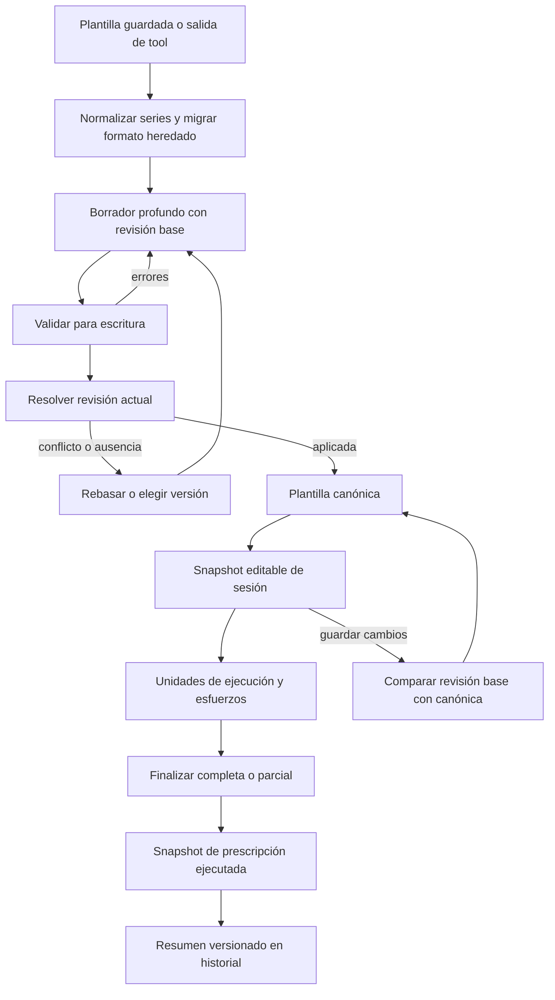

# Contratos de entrenamiento, dieta y mediciones

Estos contratos son la frontera entre datos no confiables —almacenamiento antiguo, formularios, catálogos y argumentos de tools— y el estado durable. La regla transversal es **normalizar al hidratar, validar antes de escribir y mutar atómicamente sobre el estado más reciente**. `LocalStore` reúne `templates`, `workoutHistory`, `dietByDate`, `dietSettings` y `measurements`; su normalización delega en cada dominio en vez de duplicar sus reglas ([`localStoreModel.ts`](repo://apps/mobile/persistence/localStoreModel.ts#L59-L73), [`localStoreModel.ts`](repo://apps/mobile/persistence/localStoreModel.ts#L140-L150)).

## Entrenamiento: de plantilla a evidencia histórica

*El ciclo conserva una copia independiente durante la edición y la sesión, y fija en el historial la prescripción realmente ejecutada.*

### Normalización y migración de series

`TRAINING_SERIES_SCHEMA_VERSION` vale `1` y se sella **por rutina**, no en la raíz del almacén. Una versión ausente o no entera positiva se trata como anterior; una versión futura se conserva para no afirmar falsamente que el contenido es v1 ([`seriesContract.ts`](repo://apps/mobile/training/seriesContract.ts#L4-L11), [`seriesContract.ts`](repo://apps/mobile/training/seriesContract.ts#L77-L99)). Al hidratar:

- Si un ejercicio contiene `series`, se normalizan los textos, tipos, tempo, enlaces de catálogo, series y mini-series. Los números heredados en campos textuales se convierten a texto; tipos o tempos desconocidos se eliminan con una incidencia. Los IDs ausentes o repetidos se regeneran dentro de su ámbito ([`seriesContract.ts`](repo://apps/mobile/training/seriesContract.ts#L203-L218), [`seriesContract.ts`](repo://apps/mobile/training/seriesContract.ts#L261-L285), [`seriesContract.ts`](repo://apps/mobile/training/seriesContract.ts#L325-L399)).
- Si no hay `series` utilizables, se migran `sets`, `load_kg` y `rest_seconds`. La proyección inversa `seriesToLegacySets` sigue guardándose por compatibilidad, pero solo incluye repeticiones positivas legibles y puede ser más corta que `series` ([`seriesContract.ts`](repo://apps/mobile/training/seriesContract.ts#L405-L460), [`seriesContract.ts`](repo://apps/mobile/training/seriesContract.ts#L474-L483)).
- Las mini-series se preservan aunque el tipo pase a ser simple, para no perder trabajo oculto. Al entrar por primera vez en un tipo compuesto, la operación de edición crea una mini-serie inicial; duplicar rutinas, ejercicios o series regenera todas las identidades y remapea referencias internas de superseries ([`seriesContract.ts`](repo://apps/mobile/training/seriesContract.ts#L379-L399), [`workoutTemplateOperations.ts`](repo://apps/mobile/training/workoutTemplateOperations.ts#L129-L175), [`workoutTemplateOperations.ts`](repo://apps/mobile/training/workoutTemplateOperations.ts#L192-L211)).

Hay dos políticas deliberadamente distintas:

| Contexto | Política | Fallo observable |
|---|---|---|
| Hidratación normal | `repair` | Reconstruye o descarta hojas inválidas, devuelve incidencias `repaired` y mantiene utilizable la rutina. |
| Lectura estricta | `strict` | Solo `expected_object`, `expected_array` y `expected_string` pasan a `unrecoverable` y bloquean el resultado. |
| Escritura de plantilla | `validateWorkoutTemplateForWrite` | No repara el borrador funcional: devuelve rutas y errores y no produce valor escribible. |
| Snapshot histórico incompatible | `repair` conserva totales; `strict` lanza | En reparación elimina la capacidad de recalcular, pero no altera los totales históricos. |

La severidad y la resolución se centralizan en el mismo sumidero de incidencias ([`seriesContract.ts`](repo://apps/mobile/training/seriesContract.ts#L101-L176)). `normalizeStore` informa versiones futuras, normaliza plantillas, historial y espejos heredados, y aborta solo si la política elegida deja incidencias irrecuperables ([`localStoreModel.ts`](repo://apps/mobile/persistence/localStoreModel.ts#L160-L205), [`localStoreModel.ts`](repo://apps/mobile/persistence/localStoreModel.ts#L233-L265)).

### Escritura estricta, revisiones y conflictos

Antes de guardar, una plantilla debe tener nombre, categoría e icono conocidos, al menos un ejercicio y una serie por ejercicio. Las repeticiones son enteros positivos; peso y descanso son no negativos; el descanso es entero; `duration_minutes` es entero positivo y como máximo `999`. Un tipo compuesto necesita mini-series, `tempo` requiere sus tres tiempos y cada objetivo de `superset` requiere nombre. Una versión de series superior a la soportada no se puede sobrescribir. Solo tras pasar estas reglas se clona, se sella v1 y se recalculan los espejos `sets`, `load_kg` y `rest_seconds` ([`workoutTemplateContract.ts`](repo://apps/mobile/training/workoutTemplateContract.ts#L119-L193), [`workoutTemplateContract.ts`](repo://apps/mobile/training/workoutTemplateContract.ts#L201-L268)).

La edición usa copias profundas y control optimista:

1. `createWorkoutTemplateDraft` guarda `original`, `draft` y `baseRevision` en modo edición. Una rebase automática solo reemplaza un borrador limpio.
2. La revisión serializa el contenido funcional completo, pero omite `series_schema_version` y los espejos heredados para evitar conflictos falsos ([`workoutTemplateOperations.ts`](repo://apps/mobile/training/workoutTemplateOperations.ts#L309-L318)).
3. En el commit, crear sobre un ID existente da `conflict`; editar una plantilla eliminada da `missing`; una revisión canónica distinta da `conflict`. Solo `overwriteConflict` permite aplicar conscientemente el borrador ([`workoutTemplateTransactions.ts`](repo://apps/mobile/training/workoutTemplateTransactions.ts#L44-L103)).
4. El flujo manual valida y resuelve dentro de `commitLocalStoreMutation`, es decir, compara con el valor durable actual y no con una captura obsoleta ([`App.tsx`](repo://apps/mobile/App.tsx#L6738-L6770)). La tool de creación pasa por el mismo validador estricto mediante `prepareRoutineCreation` ([`routineCreationContract.ts`](repo://apps/mobile/agent/routineCreationContract.ts#L591-L609)).

### Sesión, unidades y snapshots

Al iniciar, se exige al menos una unidad ejecutable y se crea un `WorkoutSessionTemplateDraftRecord` v1 con revisión base, revisión incremental del borrador y snapshot profundo. Ese borrador mantiene ejecutable la sesión aunque la plantilla canónica cambie o desaparezca ([`App.tsx`](repo://apps/mobile/App.tsx#L7101-L7139), [`workoutTemplateTransactions.ts`](repo://apps/mobile/training/workoutTemplateTransactions.ts#L106-L145)).

Las claves de esfuerzo son estables: `exerciseId:seriesId` para la serie primaria y `exerciseId:seriesId:subSeriesId` para una mini-serie. Solo los tipos compuestos expanden mini-series, y claves duplicadas se omiten. Los resúmenes también deduplican por clave y cuentan volumen/repeticiones únicamente para esfuerzos completados; valores negativos o no numéricos aportan cero ([`workoutExecution.ts`](repo://apps/mobile/training/workoutExecution.ts#L52-L127), [`workoutExecution.ts`](repo://apps/mobile/training/workoutExecution.ts#L193-L228)).

Al finalizar se genera un `WorkoutPrescriptionSnapshot` v1 ligado al esquema de ejecución v1 y unidad `kg`. Guarda nombres, tipo, prescripción numérica, estado completado y mini-series, pero no imágenes, músculos ni enlaces de catálogo. Así, ediciones posteriores de la plantilla no cambian la evidencia histórica ([`workoutHistory.ts`](repo://apps/mobile/training/workoutHistory.ts#L13-L67), [`workoutHistory.ts`](repo://apps/mobile/training/workoutHistory.ts#L206-L249)). El resumen actual usa esquema `2` y cálculo `2`; clasifica `completed` solo si existe al menos un esfuerzo y todos están completados. La recalculación compara snapshot y totales, pero informa `match` o `mismatch` sin sobrescribir lo almacenado ([`workoutHistory.ts`](repo://apps/mobile/training/workoutHistory.ts#L285-L297), [`workoutHistory.ts`](repo://apps/mobile/training/workoutHistory.ts#L361-L368)).

En una sesión que modificó la rutina, guardar esa versión vuelve a comparar `base_revision` con la canónica dentro del commit. El historial se inserta una sola vez por ID y se limita a `180` entradas ([`App.tsx`](repo://apps/mobile/App.tsx#L6953-L6984), [`localStoreModel.ts`](repo://apps/mobile/persistence/localStoreModel.ts#L59-L66)). Las rachas y el progreso semanal solo consideran resúmenes completos y agrupan `finished_at` por día **local**, no por fecha UTC ([`workoutHistory.ts`](repo://apps/mobile/training/workoutHistory.ts#L335-L358), [`workoutHistory.ts`](repo://apps/mobile/training/workoutHistory.ts#L443-L489)).

## Dieta

| Área | Invariante antes de escribir | Normalización o cálculo | Consumidores |
|---|---|---|---|
| Categoría | Solo `Desayuno`, `Almuerzo`, `Comida`, `Merienda` o `Cena`; se comparan sin distinguir espacios redundantes ni mayúsculas. | Las comidas se ordenan por ese catálogo fijo. | Formulario y `add_meal_food`/`read_meal_foods`. |
| Alimento | Nombre no vacío y `grams`, `calories_kcal`, `protein_g`, `carbs_g`, `fat_g` numéricos, finitos y `>= 0`. Cero es válido. | El formulario acepta coma decimal y convierte blancos a cero; el contrato estructurado no convierte strings. | Editor manual, selección de catálogo, estimador y tool. |
| Salida AI | Además de nutrientes válidos, `food_type` debe ser `producto_comercial`, `receta` o `alimento`. | Se traduce `dish_name` al nombre del ítem validado. | Cliente del estimador. |
| Plan | Objetivo diario, si existe, debe ser finito y `> 0`; asignaciones y g/kg son no negativos. | Proteína/carbohidrato usan 4 kcal/g y grasa 9; en modo g/kg se multiplica por peso corporal válido. El exceso y el remanente nunca son negativos. | Ajustes y modelos de planificación/presentación. |
| Fecha | Las claves son `YYYY-MM-DD` construidas con componentes locales; el parseo usa mediodía local para evitar desplazamientos de día. | `dietByDate` se normaliza por clave y rellena IDs/campos heredados. | Navegación manual y LocalStore. |

Las validaciones base están en [`nutritionContract.ts`](repo://apps/mobile/diet/nutritionContract.ts#L1-L35), [`nutritionContract.ts`](repo://apps/mobile/diet/nutritionContract.ts#L102-L202) y [`nutritionContract.ts`](repo://apps/mobile/diet/nutritionContract.ts#L226-L295); la evaluación del presupuesto está en [`nutritionContract.ts`](repo://apps/mobile/diet/nutritionContract.ts#L338-L420). Las fechas locales y la hidratación de días están en [`model.ts`](repo://apps/mobile/diet/model.ts#L131-L180) y [`model.ts`](repo://apps/mobile/diet/model.ts#L275-L332).

El editor manual valida primero los strings del formulario y vuelve a validar el ítem resultante del catálogo antes de persistir ([`dietController.ts`](repo://apps/mobile/controllers/dietController.ts#L622-L686), [`dietController.ts`](repo://apps/mobile/controllers/dietController.ts#L869-L903)). La tool resuelve categoría, catálogo o ambigüedad, valida nutrientes y solo entonces ejecuta `commitStore`; un `operationId` determina IDs estables y un recibo evita duplicar el efecto en reintentos ([`toolExecutor.ts`](repo://apps/mobile/agent/toolExecutor.ts#L333-L397), [`toolExecutor.ts`](repo://apps/mobile/agent/toolExecutor.ts#L406-L466)). Importante: el contrato nutricional valida contenido y categoría, no una fecha de calendario para la tool; quien extienda `add_meal_food` no debe asumir que el `date` no vacío ya es una fecha real.

## Mediciones

| Área | Contrato |
|---|---|
| Identidad temporal | `measured_on` es una fecha local real `YYYY-MM-DD`, no futura. `measured_at` conserva un timestamp válido o se reconstruye al mediodía local. |
| Métricas | Diez claves permitidas. Vacío equivale a `null`; un valor presente debe ser finito, positivo y se redondea a dos decimales. Solo `body_fat_pct` tiene máximo explícito de `100`. |
| Upsert por fecha | Crea o completa el único registro de ese día sin borrar campos omitidos. Si ya hay más de uno, devuelve `duplicate_date_conflict` en vez de elegir arbitrariamente. |
| Reemplazo por ID | Permite reparar un duplicado en su misma fecha, pero no moverlo a otra fecha ocupada. No se puede dejar una medición sin métrica ni foto. |
| Tool patch | Acepta objeto estructurado; por compatibilidad, un JSON string antiguo admite números como texto. `clear_fields` escribe `null`, pero no puede borrar y asignar el mismo campo ni producir un patch vacío. |
| Orden y límite | Orden descendente por `measured_on`, después timestamp y finalmente ID. Se conservan como máximo `MAX_MEASUREMENTS = 1826`; la mutación devuelve los registros expulsados. |
| Lecturas derivadas | Latest/previous y gráficos deduplican por día de calendario. Los periodos se cortan por claves locales, no por milisegundos UTC. |

La fecha y las métricas se validan en [`measurementContract.ts`](repo://apps/mobile/measurements/measurementContract.ts#L90-L225). La hidratación puede derivar `measured_on` de un `measured_at` antiguo válido, pero no inventa “hoy” para un timestamp roto; si cualquier registro falla, `normalizeMeasurements` falla como conjunto, y `normalizeStore` aborta la hidratación con el mensaje agregado ([`measurementContract.ts`](repo://apps/mobile/measurements/measurementContract.ts#L237-L323), [`localStoreModel.ts`](repo://apps/mobile/persistence/localStoreModel.ts#L233-L239)). Los duplicados históricos se detectan y conservan: el conflicto aparece solo al hacer un upsert ambiguo ([`measurementContract.ts`](repo://apps/mobile/measurements/measurementContract.ts#L325-L333), [`measurementContract.ts`](repo://apps/mobile/measurements/measurementContract.ts#L450-L503)).

El controlador manual prepara fotos y valores, pero la decisión final ocurre dentro de `localStore.commit` mediante `replaceMeasurementById` o `upsertMeasurementByDate`; después elimina archivos propios que hayan quedado sin referencia ([`measurementsController.ts`](repo://apps/mobile/controllers/measurementsController.ts#L703-L768)). `write_measurement` usa exactamente el parser de patch y el upsert por fecha, genera un ID estable a partir de `operationId` y añade su recibo en el mismo commit durable ([`toolExecutor.ts`](repo://apps/mobile/agent/toolExecutor.ts#L267-L306)). `read_measurement` también se niega a elegir entre duplicados del mismo día ([`toolExecutor.ts`](repo://apps/mobile/agent/toolExecutor.ts#L254-L265)).

## Guía para cambios seguros

1. **Añadir un campo persistido:** actualizar tipo, normalizador/migración, validador de escritura, clon/proyección de revisión y, si corresponde, snapshot histórico. Un campo funcional omitido de la revisión permitiría sobrescrituras silenciosas.
2. **Subir una versión:** no reutilizar números. Definir cómo lee la versión anterior, cómo reacciona `repair`, qué rechaza `strict` y si una app antigua debe preservar una versión futura sin escribirla.
3. **Añadir una entrada manual y una tool:** ambas deben terminar en el mismo contrato puro y validar antes del commit. La tool necesita además semántica idempotente mediante `operationId`/recibo.
4. **Cambiar fechas:** probar zonas horarias y cambios de horario; usar claves locales y constructores a mediodía donde el dato representa un día civil.
5. **Cambiar límites:** conservar orden determinista y exponer los elementos expulsados para poder limpiar recursos asociados.

## Pruebas que protegen los invariantes

- Series: propiedades de no lanzar en `repair`, bloqueo exactamente por incidencias irrecuperables, idempotencia, unicidad de IDs, conservación de tipos/mini-series y proyección heredada sin entradas inventadas ([`seriesContract.property.test.ts`](repo://apps/mobile/training/seriesContract.property.test.ts#L46-L138)).
- Transacciones: copia sin mutar original, rebase solo de borradores limpios, conflictos por revisión/ausencia/ID, validación estricta y round-trip del borrador versionado de sesión ([`workoutTemplateTransactions.test.ts`](repo://apps/mobile/training/workoutTemplateTransactions.test.ts#L31-L126)).
- Historial: snapshot mínimo e independiente, comparación sin sobrescritura, migración v1/v2 y degradación frente a rechazo estricto de snapshots incompatibles ([`workoutHistory.test.ts`](repo://apps/mobile/training/workoutHistory.test.ts#L140-L225), [`workoutHistory.test.ts`](repo://apps/mobile/training/workoutHistory.test.ts#L228-L295)).
- Dieta: cero válido, rechazo de negativos/no finitos, diferencia formulario-estructurado, enums, presupuestos y propiedad de que nunca sale un nutriente inválido ([`nutritionContract.test.ts`](repo://apps/mobile/diet/nutritionContract.test.ts#L21-L118), [`nutritionContract.test.ts`](repo://apps/mobile/diet/nutritionContract.test.ts#L120-L191)).
- Mediciones: calendario real/no futuro, migración temporal, compatibilidad del patch, conflictos por duplicado, límite, orden y selectores invariantes ante permutaciones ([`measurementContract.test.ts`](repo://apps/mobile/measurements/measurementContract.test.ts#L53-L134), [`measurementContract.test.ts`](repo://apps/mobile/measurements/measurementContract.test.ts#L136-L220), [`measurementContract.test.ts`](repo://apps/mobile/measurements/measurementContract.test.ts#L223-L288)).

## Relación con otras páginas

- [Estado local-first](../architecture/local-first-state.md): propiedad y commits durables de `LocalStore`.
- [Tools del agente](../architecture/agent-tools.md): ejecución, recibos e incertidumbre de efectos.
- [Pipeline de catálogos](catalog-pipeline.md): enlaces resueltos/no resueltos usados por rutinas y alimentos.
- [Estrategia de validación](../testing/validation-strategy.md): reparto entre pruebas unitarias, contractuales y property-based.
