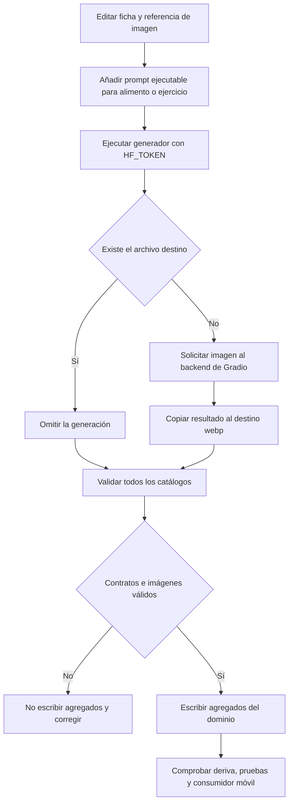

# Generación y validación de imágenes de catálogo

La generación de imágenes es una operación manual, externa y no determinista para los catálogos versionados; no forma parte de la ejecución de la aplicación móvil. El script Python `image-generation/generate_images.py` produce recursos para **alimentos** y **ejercicios**, y después delega la validación y la regeneración de agregados en el generador común `scripts/catalogs/generate.mjs`. La aplicación publica y consume los agregados validados, no el resultado directo de un backend de IA.

Este es el flujo generador actual. Los archivos `alimentos/prompts.md` y `ejercicios/prompts.md` y los ejemplos históricos del docstring pueden servir de orientación, pero las asignaciones y plantillas ejecutables en `generate_images.py` son las que controlan la operación.

## Límites y contratos que no se deben romper

| Dominio | Ficha editable | Referencia en ficha | Recurso requerido | Proporción exacta |
| --- | --- | --- | --- | --- |
| Alimentos | `alimentos/<id>.json` | `image: "<archivo>.webp"` | `alimentos/images/<archivo>.webp` | 1:1 |
| Ejercicios | `ejercicios/<id>.json` | `image_male` e `image_female` | `ejercicios/images/<id>-male.webp` y `...-female.webp` | 16:9 |
| Productos comerciales | `productos_comerciales/<id>.json` | `image` opcional | `productos_comerciales/images/<archivo>.webp` | 1:1 |
| Recetas | `recetas/<id>.json` | `image` opcional | `recetas/images/<archivo>.webp` | 1:1 |

El generador de IA solo automatiza las dos primeras filas. Productos y recetas no tienen subcomando ni mapas de prompts; si se les añade una imagen por otro medio, deben respetar el mismo contrato y pasar la sincronización general. Una imagen nutricional puede ser compartida por varias fichas, pero cada imagen de ejercicio debe usar exactamente el ID y género declarados.

La puerta de publicación rechaza JSON o schema inválidos, IDs duplicados o distintos del nombre de la ficha, rutas inseguras, diferencias de mayúsculas, imágenes ausentes o huérfanas, bytes que no sean WebP decodificable y proporciones distintas de las exigidas. La extensión `.webp` no es evidencia suficiente: el validador decodifica los bytes y exige `width === height` para nutrición o `width * 9 === height * 16` para ejercicios.

## Flujo actual



*El script no transforma la imagen recibida: la validación común posterior es el control que impide publicar codificación, referencias o dimensiones incorrectas.*

Para cada ficha seleccionada, el script recorre los JSON de hoja ordenados y omite `all.json`, `index.json` y `package.json`. Un alimento con ID incluido en `FOOD_PROMPTS` genera `images/<id>.webp`; un ejercicio incluido en `EXERCISE_PROMPTS` genera dos solicitudes, `man`/`male` y `woman`/`female`. Una ficha sin prompt se registra y se omite. `--id` solamente filtra: un ID inexistente no produce un diagnóstico específico y aun así puede llegar a la sincronización del catálogo.

Los destinos existentes nunca se sobrescriben. Por tanto, cambiar un prompt no regenera una imagen confirmada y un archivo existente corrupto tampoco se repara con una ejecución normal. No hay `--force`: para regenerar, conserve una copia para comparación, mueva o elimine deliberadamente el destino y ejecute de nuevo el ID.

## Preparación y CLI

El proyecto de generación requiere Python 3.12 o posterior y se ejecuta con `uv`. Carga `HF_TOKEN` desde el entorno o desde el archivo `.env` de la raíz del repositorio; el mensaje de error que menciona `image-generation/.env` es histórico e impreciso respecto a la implementación. El token es obligatorio incluso si se acaba usando un backend cuyo `Client` se crea sin token. Nunca se confirma en Git.

```bash
cd image-generation
uv sync
uv run generate_images.py exercises --id press-banca
uv run generate_images.py --backend z-image-turbo foods --id arroz-blanco
```

`--backend` pertenece al analizador superior y debe situarse antes del subcomando. Los valores permitidos son `nano-banana`, `z-image-turbo` y `flux2-dev`; si se omite, se prueba esa secuencia. El modo automático cambia al siguiente backend únicamente si falla la **conexión**; una excepción durante `predict` no activa una alternativa. Con backend explícito, una conexión fallida termina el proceso.

| Backend | Espacio de Gradio y llamada | Relación solicitada | Riesgo operativo |
| --- | --- | --- | --- |
| `nano-banana` | `multimodalart/nano-banana`; `Nano Banana 2`, `1K`, endpoint interno `fn_index=2` | Recibe 16:9 para ejercicio y 1:1 para alimento | Depende del orden y firma del endpoint remoto; además pasa el token al cliente y a la predicción. |
| `z-image-turbo` | `mrfakename/Z-Image-Turbo`; `/generate_image`, 1024×1024, 9 pasos | Siempre cuadrada | Puede fallar el contrato 16:9 de ejercicio. |
| `flux2-dev` | `black-forest-labs/FLUX.2-dev`; `/infer`, 1024×1024, 30 pasos | Siempre cuadrada | Puede fallar el contrato 16:9 de ejercicio. |

Los dos últimos declaran una semilla pero también solicitan `randomize_seed=True`; Nano Banana no fija semilla aquí. A ello se suman modelos y Spaces remotos no versionados. No trate una regeneración como reproducible; revise visualmente el resultado y conserve la imagen anterior hasta aceptar el cambio.

## Prompts, procedencia y revisión humana

Los diccionarios `FOOD_PROMPTS` y `EXERCISE_PROMPTS` se indexan por el campo `id` de la ficha. Las plantillas añaden el estilo común: fotografía gastronómica de estudio y composición cuadrada para alimentos; ilustración de fitness, género, vista, sin texto ni marca de agua y composición 16:9 para ejercicios. El texto del prompt es una instrucción, no una garantía del archivo que devuelve el proveedor.

Al añadir una ficha, primero haga coincidir nombre de archivo, `id`, referencia de recurso y clave del mapa de prompts. Para ejercicios, describa equipo, postura y vista con precisión y revise ambas variantes por corrección biomecánica, extremidades extra, equipo erróneo, texto, marcas de agua y seguridad de la representación. Para alimentos, compruebe sujeto, legibilidad de miniatura y ausencia de texto o alegaciones nutricionales engañosas.

La procedencia de metadatos e instrucciones de ejercicios se conserva en `ejercicios/SOURCES.md`. La licencia allí documentada permite adaptar texto y estructura del dataset indicado, pero excluye copiar, redistribuir o usar como referencia sus imágenes y GIF de Gym Visual. Las ilustraciones del catálogo deben generarse desde cero con el sistema visual propio.

## Sincronización y validación posterior

Al terminar el recorrido, `generate_exercises` o `generate_foods` invoca:

```bash
node scripts/catalogs/generate.mjs --write --domain ejercicios
# o
node scripts/catalogs/generate.mjs --write --domain alimentos
```

Antes de escribir, ese comando inspecciona **los cuatro dominios**. Si cualquiera viola el contrato, falla y no publica los agregados seleccionados. Si pasa, reemplaza mediante archivos temporales y renombres los agregados del dominio indicado: `all.json` e `index.json` cuando corresponden y, para ejercicios, también el árbol paginado `catalog-v1/`. El escritor publica el manifiesto de ejercicios después de sus páginas, directorios por ID e índices de búsqueda; además elimina los JSON paginados que ya no se esperan y revierte sustituciones y eliminaciones si ocurre un fallo. Esto reemplaza el mecanismo histórico que reconstruía agregados directamente desde Python: no hay un segundo formato de agregados.

Después de una operación de imágenes —incluida una ejecución de un único ID— ejecute la comprobación completa, que además detecta artefactos derivados obsoletos:

```bash
npm run check:catalogs
npm run test:catalogs
npm run test:catalogs:e2e
```

`check:catalogs` no acepta limitar el dominio porque su propósito es bloquear una publicación inconsistente entre catálogos y schemas generados. `test:catalogs` usa fixtures y cubre, entre otros casos, generación estable, schema e IDs, mayúsculas, MIME falso, corrupción, proporción y huérfanos. El E2E valida el consumo web con respuestas controladas; no sustituye la inspección en cliente nativo.

## Procedimiento seguro de cambio

1. Cree o corrija la ficha JSON y su referencia antes de generar. Para ejercicio, las rutas deben ser exactamente `images/<id>-male.webp` e `images/<id>-female.webp`; para nutrición, `image` solo contiene el nombre WebP, sin `images/`.
2. Añada la clave del ID al mapa de prompts ejecutable si el dominio es alimento o ejercicio. Actualice la documentación auxiliar solo como acompañamiento, no como sustitución.
3. Ejecute un único ID primero y use Nano Banana cuando necesite que la solicitud remota respete la relación de ejercicio; los respaldos cuadrados solo son aceptables si el validador posterior pasa, lo que normalmente no sucederá para ejercicios.
4. Inspeccione visualmente el archivo y compruebe sus bytes, dimensiones, ruta y mayúsculas. Si el resultado no es aceptable, restaure o retire el archivo antes de seguir.
5. Ejecute `npm run check:catalogs` y las pruebas focalizadas. Revise `git diff`: deben aparecer solo fichas, prompts, recursos y agregados derivados esperados.
6. Confirme todos esos cambios juntos y verifique la carga de miniaturas y detalle en los consumidores móviles correspondientes: alimentos en dieta y ejercicios en entrenamiento.

La llamada de generación no es transaccional: puede haber creado algunos recursos antes de que falle una predicción, una copia o la sincronización. La copia de bytes tampoco convierte ni redimensiona. La recuperación segura consiste en restaurar los recursos previos o completar las referencias requeridas, ejecutar la validación común y no confirmar un árbol que falle.

Para el contrato de catálogos y su consumo local-first, véase [Catálogos locales y artefactos generados](repositories.md). Para las superficies de usuario que muestran estos recursos, véanse [Dieta y estimación de alimentos](../mobile/diet-and-food-estimation.md) y [Plantillas de entrenamiento](../mobile/training.md); la matriz general de comprobaciones está en [Compilación, publicación y validación](../operations/build-release-and-testing.md).
