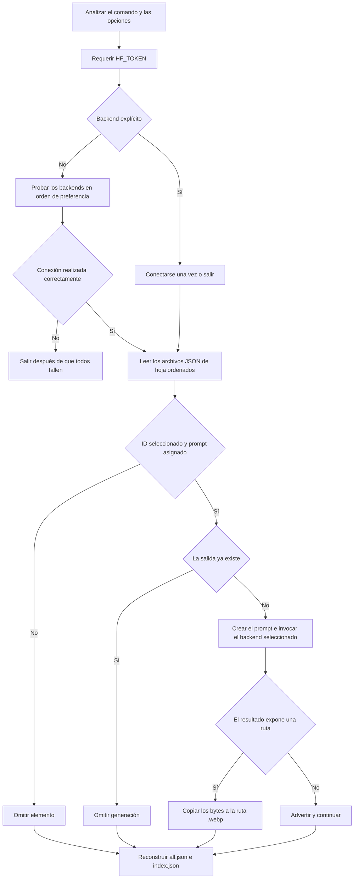

# Generación de imágenes

`image-generation/generate_images.py` es una utilidad de Python ejecutada por un operador para producir los recursos genéricos de alimentos y ejercicios que consume la aplicación móvil. No es un servidor y no se invoca durante la ejecución de la aplicación. Se conecta a un Space de Gradio de Hugging Face, genera los archivos que faltan, copia en el repositorio los artefactos devueltos y, a continuación, reconstruye los agregados de los catálogos.

Actualmente, el script solo admite `alimentos/` y `ejercicios/`. Las imágenes de productos comerciales y recetas deben añadirse mediante un flujo de trabajo manual independiente. Para conocer los contratos de registros y URL posteriores, consulta [Repositorios de contenido](repositories.md).

## Entorno y punto de entrada

El paquete requiere Python 3.12 o una versión posterior y está bloqueado para `uv`. `pyproject.toml` declara `gradio-client`, `python-dotenv`, `httpx` y `websockets`; el punto de entrada ejecutable es el propio script, en lugar de un comando de consola empaquetado.

Desde la raíz del repositorio:

```bash
cd image-generation
uv sync
# Put HF_TOKEN in ../.env, or export it in the shell.
uv run generate_images.py exercises
```

En el momento de la importación, `load_dotenv(Path(__file__).parent.parent / ".env")` carga el archivo `.env` de la raíz del repositorio. El único nombre de variable de entorno aceptado es `HF_TOKEN`. No documentes ni confirmes su valor en el repositorio. Hay un mensaje de fallo engañoso en `get_hf_token()` que menciona `image-generation/.env`; en realidad, la implementación lee el archivo `.env` de la raíz, a menos que la variable ya esté presente en el entorno del proceso.

Se requiere un token antes de seleccionar cualquier backend, incluidas las rutas nominalmente gratuitas de Z-Image-Turbo y FLUX.2-dev. Nano Banana, además, pasa ese mismo token tanto a `Client(...)` como en forma de campo posicional de predicción.

## Contrato de la CLI

El comando posicional es obligatorio:

```text
uv run generate_images.py [--backend BACKEND] exercises [--id ID]
uv run generate_images.py [--backend BACKEND] foods [--id ID]
```

`BACKEND` debe ser `nano-banana`, `z-image-turbo` o `flux2-dev`. Dado que `--backend` está registrado en el analizador de nivel superior, colócalo **antes** de `exercises` o `foods`; el ejemplo del docstring del módulo que sitúa `--backend` después del subcomando no es válido con esta disposición de argparse.

Ejemplos:

```bash
# Auto-select the first connectable backend and visit all exercise leaves.
uv run generate_images.py exercises

# One food, with an explicitly selected backend.
uv run generate_images.py --backend z-image-turbo foods --id arroz-blanco

# One exercise; this still considers male and female outputs separately.
uv run generate_images.py exercises --id press-banca
```

`--id` es un filtro, no un validador. Si ninguna hoja tiene ese ID, el comando no muestra ningún error explícito del tipo «ID no encontrado» y aun así reconstruye todos los agregados. Del mismo modo, una hoja sin una entrada en el mapa de prompts se registra y se omite, tras lo cual continúa la reconstrucción de los agregados.

## Flujo de trabajo de extremo a extremo



*La generación crea archivos solo si no existen; la reconstrucción de los agregados se ejecuta después de la iteración, incluso cuando se omiten imágenes individuales o estas no producen una ruta.*

Para los ejercicios, cada hoja seleccionada genera dos prompts, utilizando `man`/`male` y `woman`/`female`, y tiene como destino `ejercicios/images/<id>-male.webp` y `<id>-female.webp`. Los alimentos generan un único archivo `alimentos/images/<id>.webp`. Las rutas de salida existentes nunca se sobrescriben, por lo que cambiar un prompt no actualiza un recurso hasta que el archivo anterior se elimina o se mueve deliberadamente.

## Propiedad de los prompts

Los prompts forman parte del código; no se derivan de las descripciones JSON:

- `EXERCISE_PROMPTS` asigna cada ID de ejercicio admitido a una descripción del movimiento y una vista de cámara en inglés.
- `FOOD_PROMPTS` asigna cada ID de alimento admitido a una descripción visual en inglés.
- `EXERCISE_PROMPT_TEMPLATE` proporciona el género, un fondo de color carbón oscuro, un contorno verde lima, un estilo de aplicación de fitness, la ausencia de texto o marcas de agua y una composición solicitada de 16:9.
- `FOOD_PROMPT_TEMPLATE` proporciona un fondo oscuro, un estilo de fotografía gastronómica de estudio, la ausencia de texto, marcas de agua, manos o utensilios, legibilidad como miniatura y una composición cuadrada solicitada.

Una hoja solo es apta cuando el campo `id` de su registro está presente en el mapa de prompts correspondiente. La asignación por ID de registro, en lugar de por nombre de archivo, implica que una discrepancia entre el nombre de archivo y el ID puede reconstruir un agregado con un nombre base y, al mismo tiempo, producir un recurso con otra identidad. La validación del repositorio debe rechazar esta condición. La primera importación GYM-12 añadió diez IDs tanto al catálogo como a `EXERCISE_PROMPTS`: `peso-muerto-barra`, `peso-muerto-rumano-barra`, `remo-inclinado-barra`, `curl-biceps-barra`, `zancadas-mancuernas`, `press-arnold-mancuernas`, `swing-pesa-rusa`, `fondos-paralelas`, `puente-gluteos-barra` y `burpee`.

`alimentos/prompts.md` y `ejercicios/prompts.md` son documentación auxiliar de los prompts, pero los diccionarios ejecutables y las plantillas de `generate_images.py` son la fuente autoritativa. Editar únicamente un archivo Markdown de prompts no afecta a la generación. Cuando una hoja adapte metadatos o instrucciones externos, registra además su procedencia, revisión y licencia en `ejercicios/SOURCES.md`; ese archivo no controla la generación, pero conserva la atribución que debe acompañar al catálogo. Las imágenes generadas deben ser propias: la atribución actual excluye expresamente copiar, redistribuir o usar como referencia las imágenes y GIF de Gym Visual presentes en el dataset de origen. Consulta el contrato completo de procedencia en [Repositorios de contenido](repositories.md).

## Adaptadores de backend y conmutación por error

| Nombre de la CLI | Space de Gradio | Autenticación en el código | Características de la solicitud | Comportamiento de la relación de aspecto |
|---|---|---|---|---|
| `nano-banana` | `multimodalart/nano-banana` | token pasado al cliente y a la predicción | `predict` posicional, índice de endpoint 2 forzado, modelo `Nano Banana 2`, resolución `1K` | recibe `16:9` para los ejercicios o `1:1` para los alimentos |
| `z-image-turbo` | `mrfakename/Z-Image-Turbo` | cliente creado sin token, aunque la CLI sigue requiriendo `HF_TOKEN` | 1024×1024, 9 pasos, semilla 42, `randomize_seed=True`, `/generate_image` | siempre cuadrado; ignora la relación solicitada para los ejercicios |
| `flux2-dev` | `black-forest-labs/FLUX.2-dev` | cliente creado sin token, aunque la CLI sigue requiriendo `HF_TOKEN` | 1024×1024, 30 pasos, semilla 0, semilla aleatoria, guía 4, ampliación del prompt, `/infer` | siempre cuadrado; ignora la relación solicitada para los ejercicios |

El modo automático prueba los backends exactamente en el orden de la tabla y solo pasa al siguiente cuando la **conexión** genera una excepción. Una vez establecida la conexión, los fallos de predicción no se capturan ni activan otro backend. El modo explícito `--backend` solo prueba ese backend y termina si falla la conexión.

Nano Banana contiene una solución alternativa de compatibilidad frágil: accede internamente a `client.endpoints[2]`, marca ese endpoint como válido y posteriormente lo invoca con `fn_index=2` y argumentos posicionales. Cualquier cambio de orden o de firma en el Space de Gradio remoto puede romperla sin que haya ningún cambio en el código local. Los demás adaptadores utilizan parámetros con nombre y nombres de API, pero siguen estando acoplados a los esquemas de los Spaces remotos.

### Reproducibilidad

La generación no es reproducible en sentido estricto. Z-Image-Turbo y FLUX especifican semillas nominales, pero también establecen `randomize_seed=True`; Nano Banana no expone aquí ninguna semilla. Los backends, las revisiones de los modelos alojados y las implementaciones de los Spaces son remotos y no están fijados a una versión. La omisión de archivos existentes mantiene estables las salidas confirmadas una vez que están presentes, pero regenerarlas tras eliminarlas puede producir píxeles, dimensiones o estilos diferentes.

## Contrato de resultados y archivos

`_extract_image_path` solo acepta estas formas de resultado:

1. una ruta en forma de cadena;
2. una lista o tupla cuyo primer elemento sea una ruta en forma de cadena;
3. una lista o tupla cuyo primer elemento sea un objeto con una propiedad `path`;
4. un objeto con una propiedad `path`.

Cuando se reconoce un resultado, `shutil.copy` copia los bytes del archivo devuelto a un destino que termina en `.webp`. El script **no** decodifica, redimensiona, recorta, optimiza ni convierte la imagen. Por tanto, la extensión no demuestra que la codificación sea WebP: el backend remoto debe devolver realmente bytes adecuados. Esto es especialmente importante para la decodificación móvil y el ancho de banda de GitHub.

Los contratos solicitados son:

| Dominio | Destino | Composición prevista | Referencia del registro |
|---|---|---|---|
| Alimento | `alimentos/images/<id>.webp` | miniatura 1:1 | nombre de archivo sin ruta en `image` |
| Ejercicio masculino | `ejercicios/images/<id>-male.webp` | 16:9 | `images/...` en `image_male` |
| Ejercicio femenino | `ejercicios/images/<id>-female.webp` | 16:9 | `images/...` en `image_female` |

Solo Nano Banana recibe la relación de aspecto del dominio. Los dos adaptadores de respaldo siempre solicitan 1024×1024, por lo que la salida de los ejercicios puede incumplir el contrato 16:9 previsto, aunque el prompt textual siga indicando «16:9 aspect ratio». No se comprueban las dimensiones ni se recorta la imagen después de generarla.

## Efecto secundario de la reconstrucción de agregados

Después del procesamiento, el script examina todos los archivos de hoja `*.json` del dominio seleccionado, excepto `package.json`, `index.json` y `all.json`, en orden lexicográfico de ruta.

Para los ejercicios, escribe:

- `ejercicios/all.json`: los objetos completos y analizados de las hojas, con formato legible y conservando Unicode;
- `ejercicios/index.json`: un array JSON en línea con los nombres base de los archivos.

Para los alimentos, escribe:

- `alimentos/all.json`: los objetos completos y analizados de las hojas, con formato legible y conservando Unicode;
- `alimentos/index.json`: objetos `{id, name}` con formato legible, donde `id` es el **nombre base del archivo**, no el campo `id` del registro.

Esto ocurre tanto después de ejecuciones completas como de ejecuciones para un único ID. Por tanto, un comando destinado a generar una sola imagen puede modificar el formato de los agregados o incorporar todos los cambios pendientes de las hojas. Revisa esas diferencias. El script no reconstruye productos ni recetas y tampoco actualiza los campos de imagen de las hojas; el registro JSON ya debe hacer referencia al nombre de archivo de salida esperado.

## Procedimientos seguros para añadir contenido

### Añadir y generar un alimento

1. Añade `alimentos/<id>.json` con el esquema nutricional exacto y `"image": "<id>.webp"`.
2. Añade `<id>` a `FOOD_PROMPTS` con una descripción en inglés concreta y visualmente distintiva que sea adecuada a 48×48 px.
3. Ejecuta `uv run generate_images.py foods --id <id>` o selecciona un backend explícito antes del subcomando.
4. Inspecciona el recurso generado para comprobar la exactitud del sujeto, la presencia de texto o marcas de agua, la codificación, las dimensiones y el tamaño del archivo.
5. Revisa los archivos `all.json` e `index.json` reconstruidos automáticamente; verifica que el nombre base del archivo sea igual al ID del registro.
6. Prueba la URL directa de la imagen y la miniatura o vista detallada del alimento dentro de la aplicación.

### Añadir y generar un ejercicio

1. Añade primero la hoja completa del ejercicio, incluidas las dos referencias previstas a `images/<id>-<gender>.webp`.
2. Añade `<id>: (movement description, camera view)` a `EXERCISE_PROMPTS`. Describe con precisión el equipamiento y la posición corporal; ambos géneros comparten el mismo texto de movimiento y vista.
3. Si adaptas metadatos o instrucciones externos, actualiza `ejercicios/SOURCES.md` con una revisión fijada, la licencia y los límites de reutilización antes de generar recursos propios.
4. Ejecuta `uv run generate_images.py exercises --id <id>`.
5. Inspecciona ambas salidas para comprobar la corrección biomecánica y la coherencia del encuadre. Que la generación de la imagen finalice correctamente no demuestra que la representación de un ejercicio sea segura o precisa.
6. Valida ambos archivos de agregados y prueba en la aplicación la ruta correspondiente a cada género.

### Regenerar un recurso existente

La CLI no tiene `--force`. Conserva el archivo anterior para revisarlo, elimina o mueve el destino y vuelve a ejecutar el ID seleccionado. Compara los resultados antes de confirmar los cambios. Si la regeneración falla, restaura el recurso anterior; de lo contrario, el agregado puede seguir haciendo referencia a una ruta que ya no existe. En el caso de una imagen de alimento compartida, primero identifica todos los registros cuyo campo `image` utilice ese nombre de archivo: regenerar `aceite-oliva.webp`, `atun-lata.webp` o `leche.webp` modifica a la vez varias entradas del catálogo.

### Productos y recetas

No existe ningún subcomando `products` o `recipes`, mapa de prompts ni implementación de salida o reconstrucción para esos directorios. Genera la imagen externamente o amplía el script, verifica que la codificación sea realmente WebP, coloca el archivo en el directorio `images/` correspondiente y reconstruye su archivo `all.json` por separado. Nunca dirijas una imagen de producto o receta a `alimentos/images/`; la anotación del origen durante la ejecución selecciona una URL base específica del dominio.

## Modos de fallo

| Fallo | Comportamiento actual | Consecuencia o recuperación |
|---|---|---|
| Ausencia de `HF_TOKEN` | muestra un error y termina con código 1 | Define la variable exacta en el archivo `.env` de la raíz o en el entorno; no la confirmes en el repositorio. |
| Backend desconocido | argparse rechaza las opciones o el adaptador termina | Utiliza uno de los tres nombres exactos de la CLI. |
| Falla la conexión del backend explícito | muestra el fallo y termina con código 1 | No hay conmutación por error en el modo explícito. |
| Fallan todas las conexiones automáticas | muestra cada fallo y después termina con código 1 | Vuelve a intentarlo más tarde o selecciona o repara un Space. |
| La predicción genera una excepción | una excepción no capturada termina la ejecución | No hay conmutación por error durante la predicción; es posible que ya existan archivos anteriores. |
| Forma de resultado inesperada | muestra una advertencia y continúa | El destino sigue ausente, pero los agregados se reconstruyen de todos modos. |
| La salida ya existe | se omite sin comprobar su validez | Los archivos corruptos, con codificación incorrecta u obsoletos persisten. |
| El ID no tiene una asignación de prompt | registra la omisión | El registro puede publicarse sin imagen. |
| El ID solicitado no existe | no muestra un error específico | Los agregados se reconstruyen de todos modos; inspecciona la salida o las diferencias. |
| JSON de hoja mal formado o clave ausente | error de análisis o de clave no capturado | La ejecución se detiene, posiblemente después de haber generado archivos anteriores. |
| Falla la copia al destino | error del sistema de archivos no capturado | Comprueba los permisos, el disco y la vigencia del resultado temporal. |
| Generación de ejercicios mediante respaldo | produce una solicitud cuadrada | El texto solicita 16:9, pero ningún recorte o validación lo garantiza. |

El flujo de trabajo no es transaccional. Puede dejar un conjunto de recursos generado parcialmente, y la sustitución de los agregados utiliza escrituras ordinarias en lugar de cambios de nombre atómicos mediante archivos temporales. Tampoco incluye reintentos, configuración de tiempos de espera, limitación de solicitudes, una etapa de moderación de contenido, un manifiesto de modelo, prompt y semilla, ni limpieza de los archivos temporales descargados más allá de lo que gestione `gradio_client`.

## Validación y pruebas

No hay pruebas automatizadas para `generate_images.py`, su analizador, la cobertura de prompts, los adaptadores de resultados de los backends, la reconstrucción de agregados, la codificación de imágenes ni las dimensiones. Ejecutar el generador es una operación externa, potencialmente de pago y no determinista, y no debe ser la única forma de validar el JSON del catálogo.

Para cada cambio relacionado con la generación, realiza estas comprobaciones específicas:

1. `uv run generate_images.py --help` y la ayuda de los subcomandos siguen describiendo las posiciones aceptadas de los argumentos.
2. Cada ID de hoja está representado en el mapa de prompts correspondiente o cuenta con una excepción intencionada y documentada.
3. Cada imagen referenciada por un registro existe con la ruta y las mayúsculas y minúsculas exactas.
4. Una herramienta de identificación mediante firma de archivos reconoce los destinos `.webp` generados como imágenes WebP reales.
5. Los alimentos son cuadrados; los ejercicios tienen la relación 16:9 prevista, o la desviación se revisa conscientemente.
6. Las imágenes no contienen texto, marcas de agua, movimientos inseguros, equipamiento incorrecto, extremidades adicionales ni marcas nutricionales engañosas.
7. El contenido de los agregados coincide con el contenido ordenado de las hojas y los índices utilizan los esquemas exactos de sus dominios.
8. `git diff` solo contiene los recursos, cambios de prompts y actualizaciones deterministas de agregados previstos.
9. La aplicación móvil carga las imágenes de GitHub Raw y muestra las miniaturas y los detalles tanto en los destinos web como nativos.

Las carencias de alto valor que conviene resolver incluyen pruebas unitarias con clientes de Gradio simulados para todas las formas de resultado y fallos aceptados, pruebas del analizador para la posición de la opción de backend, pruebas de cobertura entre los mapas de prompts y las hojas, una política de `--dry-run` y `--force`, conmutación por error durante la predicción con una procedencia clara, conversión real de imágenes y aplicación de dimensiones, escritura atómica de agregados, un comando independiente de validación de agregados, manifiestos con SHA-256, backend, modelo, prompt y semilla, y comprobaciones de CI que no contacten con servicios de pago.