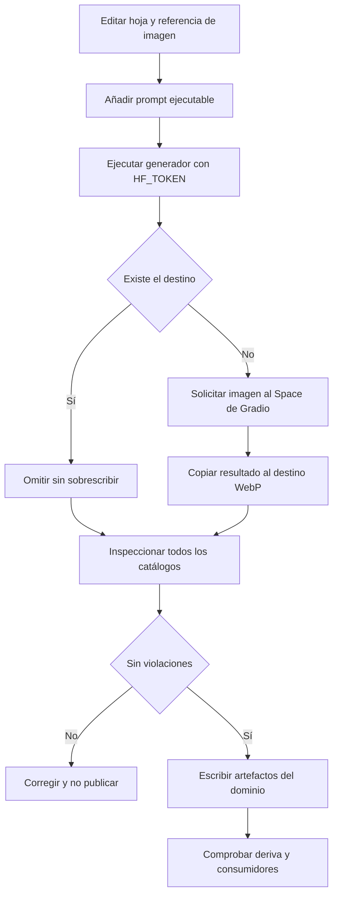

# Generación y publicación de imágenes

La IA no es un servicio de la aplicación ni un paso de su ejecución. `image-generation/generate_images.py` es una herramienta manual para mantener recursos versionados de **alimentos** y **ejercicios**; descarga el resultado de un Space de Gradio y, al final, llama al generador común de catálogos. La app consume los JSON y recursos publicados, incluido el baseline local de alimentos y el catálogo paginado de ejercicios, no resultados directos de IA.

El resultado de un modelo remoto es no determinista y solo es un candidato. La publicación la decide el contrato de catálogo y una revisión humana: no confundir este flujo con introducir un alimento, una receta o un ejercicio manual en la app.

## Contrato de recursos

| Dominio | Hoja fuente | Campo de imagen | Recurso y proporción |
| --- | --- | --- | --- |
| Alimentos | `alimentos/<id>.json` | `image: "<archivo>.webp"` | `alimentos/images/<archivo>.webp`, 1:1 |
| Ejercicios | `ejercicios/<id>.json` | `image_male`, `image_female` | `ejercicios/images/<id>-male.webp` y `...-female.webp`, 16:9 |
| Productos comerciales | `productos_comerciales/<id>.json` | `image` opcional | `productos_comerciales/images/<archivo>.webp`, 1:1 si existe |
| Recetas | `recetas/<id>.json` | `image` opcional | `recetas/images/<archivo>.webp`, 1:1 si existe |

La herramienta Python solo automatiza alimentos y ejercicios. Para cualquier imagen añadida por otro medio, el generador común exige que la ruta sea relativa y segura, coincida exactamente en mayúsculas con el archivo y no deje recursos huérfanos. Decodifica los bytes con `sharp`: una extensión `.webp` o un prompt que pida una proporción no prueba que el archivo sea WebP ni que cumpla la relación exacta. En ejercicios, además, los dos campos deben nombrar exactamente los archivos derivados de su `id`.

## Flujo de publicación


```mermaid
flowchart TD
    A["Editar hoja y referencia de imagen"] --> B["Añadir prompt ejecutable"]
    B --> C["Ejecutar generador con HF_TOKEN"]
    C --> D{"Existe el destino"}
    D -->|"Sí"| E["Omitir sin sobrescribir"]
    D -->|"No"| F["Solicitar imagen al Space de Gradio"]
    F --> G["Copiar resultado al destino WebP"]
    E --> H["Inspeccionar todos los catálogos"]
    G --> H
    H --> I{"Sin violaciones"}
    I -->|"No"| J["Corregir y no publicar"]
    I -->|"Sí"| K["Escribir artefactos del dominio"]
    K --> L["Comprobar deriva y consumidores"]
```

*El diagrama muestra que generar bytes no equivale a publicar un catálogo.*

Las hojas se recorren en orden y se excluyen `all.json`, `index.json` y `package.json`. Solo una clave presente en `FOOD_PROMPTS` o `EXERCISE_PROMPTS` se genera; una hoja sin prompt se registra y se omite. En ejercicios se solicitan las variantes `man`/`male` y `woman`/`female`; en alimentos, `images/<id>.webp`. `--id` únicamente filtra el recorrido. Un destino existente siempre se conserva: no existe `--force`, así que para regenerar hay que apartar o borrar deliberadamente el archivo y conservar una copia hasta aceptar el reemplazo.

La operación no es transaccional: una ejecución puede haber creado algunos archivos antes de fallar una predicción, una copia o la sincronización. La copia no convierte ni redimensiona. Restaure los recursos anteriores o complete las referencias y valide de nuevo antes de confirmar cambios.

## Ejecutar la herramienta de IA

El proyecto `image-generation` requiere Python 3.12 o posterior y usa `uv`. Carga `HF_TOKEN` del entorno o del `.env` en la raíz del repositorio; el mensaje de error que menciona `image-generation/.env` no refleja esa ruta de carga. El token es obligatorio, incluso para los clientes de respaldo que se construyen sin token, y no debe entrar en Git.

```bash
cd image-generation
uv sync
uv run generate_images.py exercises --id press-banca
uv run generate_images.py --backend z-image-turbo foods --id arroz-blanco
```

`--backend` es una opción del analizador superior: colóquela antes de `exercises` o `foods`. Si se omite, intenta conectar en este orden: `nano-banana`, `z-image-turbo`, `flux2-dev`. El fallback solo cubre excepciones al crear el cliente; un fallo de `predict` termina la ejecución y no prueba el siguiente proveedor. Un backend explícito también termina ante un error de conexión.

| Backend | Invocación remota | Relación solicitada | Consecuencia |
| --- | --- | --- | --- |
| `nano-banana` | `multimodalart/nano-banana`, `fn_index=2` | la del dominio | Es el único que recibe 16:9 para ejercicios; pasa el token al cliente y a la predicción. |
| `z-image-turbo` | `mrfakename/Z-Image-Turbo`, `/generate_image` | 1024×1024 | Normalmente no podrá publicar una imagen de ejercicio. |
| `flux2-dev` | `black-forest-labs/FLUX.2-dev`, `/infer` | 1024×1024 | Normalmente no podrá publicar una imagen de ejercicio. |

Los dos últimos activan `randomize_seed=True`; los modelos y Spaces tampoco están fijados por el repositorio. No se debe asumir reproducibilidad. Revise visualmente sujetos, postura, equipamiento, texto o marcas de agua y, para ejercicios, corrección biomecánica y ambas variantes de género.

Los mapas de prompts ejecutables son la fuente de control, no los Markdown auxiliares. Al dar de alta una ficha, mantenga alineados el nombre del JSON, su `id`, la referencia de recurso y la clave del mapa. `ejercicios/SOURCES.md` permite adaptar los metadatos e instrucciones del dataset allí fijado, pero prohíbe copiar, redistribuir o usar como referencia sus imágenes y GIF de Gym Visual; las ilustraciones de Gymnasia se generan desde cero.

## Sincronización de catálogos

Al acabar incluso un recorrido filtrado, Python invoca uno de estos comandos:

```bash
node scripts/catalogs/generate.mjs --write --domain ejercicios
node scripts/catalogs/generate.mjs --write --domain alimentos
```

Antes de escribir, `generate.mjs` inspecciona los cuatro dominios. Por tanto, una violación en productos o recetas también bloquea la publicación provocada por una imagen de ejercicio. Si todo es válido, `--domain` limita qué artefactos se escriben: cada dominio tiene `all.json`; alimentos añade `index.json` y `apps/mobile/catalogs/generated/foodBaseline.generated.json`; ejercicios añade `index.json` y `catalog-v1/`. Sin `--domain`, también se actualiza el schema TypeScript de runtime para móvil.

La escritura prepara temporales. Para el catálogo paginado publica el contenido, elimina páginas obsoletas y publica el manifiesto al final; ante fallo intenta restaurar reemplazos y borrados. Por ello no se deben editar a mano `all.json`, índices, `catalog-v1/`, el baseline ni el schema generado: son resultados del mismo generador, no un formato alternativo de Python.

## Validación mínima antes de confirmar

```bash
npm run sync:catalogs   # tras cambios manuales que deban regenerar todos los derivados
npm run check:catalogs
npm run test:catalogs
npm run test:catalogs:e2e
```

`check:catalogs` no admite `--domain`: valida el inventario y la deriva completos. Los unitarios cubren estabilidad de agregados, páginas paginadas obsoletas, schemas, IDs, rutas, mayúsculas, decodificación y proporciones de imágenes, huérfanos y rollback de escritura. El E2E exporta el cliente web de desarrollo y sustituye respuestas remotas por fixtures para verificar consumo de alimentos y ejercicios, persistencia de caché, arranque sin red, rechazo de caché manipulada y disponibilidad parcial. Complementa, pero no sustituye, la comprobación visual en clientes nativos.

Procedimiento seguro:

1. Cree o corrija primero la hoja y su referencia; para nutrición `image` no lleva `images/`, y para ejercicio use las dos rutas exactas.
2. Añada el prompt ejecutable y pruebe un ID. Para ejercicios, prefiera el backend que solicita 16:9.
3. Inspeccione el archivo producido antes de sincronizar; si no es aceptable, restáurelo o retírelo.
4. Ejecute las comprobaciones anteriores y revise `git diff`. Confirme juntos hojas, prompts, recursos y derivados esperados.
5. Verifique las miniaturas y detalles en el consumidor móvil correspondiente.

Para el contrato general y el consumo local-first, véase [Catálogos locales y artefactos generados](repositories.md). Para la superficie de alimentos, véase [Dieta y estimación de alimentos](../mobile/diet-and-food-estimation.md); para la matriz operativa general, [Compilación, publicación y validación](../operations/build-release-and-testing.md).
