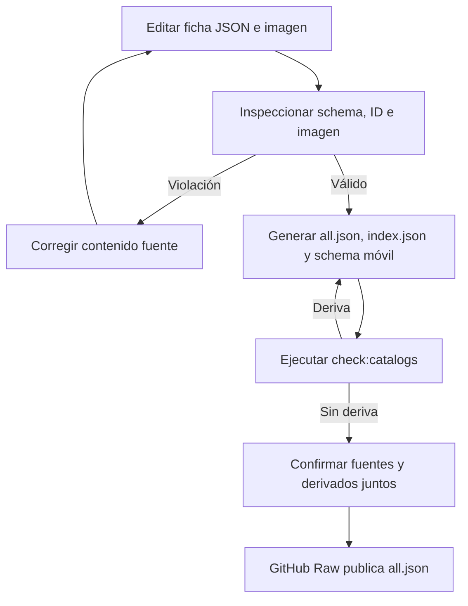
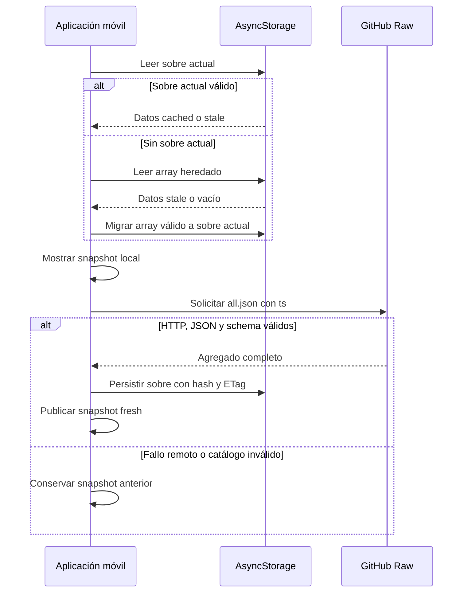

# Catálogos nutricionales y de ejercicios

Los cuatro directorios versionados son la fuente compartida de alimentos genéricos, productos comerciales, recetas y ejercicios. Las **fichas JSON individuales** y sus recursos de imagen son el contenido curado editable; los agregados, índices y el artefacto de schemas del cliente son productos deterministas. La app móvil descarga los agregados `all.json` desde GitHub Raw, los valida y conserva una copia local comprobada para poder seguir funcionando sin red.

Este límite separa el contenido público curado del estado de la persona usuaria: los alimentos personales viven en el dispositivo y no se publican en estos repositorios. Para su uso funcional, véanse [Dieta y estimación de alimentos](../mobile/diet-and-food-estimation.md) y [Plantillas de entrenamiento](../mobile/training.md); para crear recursos, [Generación de imágenes](image-generation.md).

## Qué se edita y qué se genera

| Dominio | Fuente editable | Recursos | Salidas generadas | Consumidor remoto |
| --- | --- | --- | --- | --- |
| `alimentos/` | `<id>.json` | `images/<archivo>.webp` | `all.json`, `index.json` | alimentos genéricos |
| `productos_comerciales/` | `<id>.json` | `images/<archivo>.webp` | `all.json` | productos de marca |
| `recetas/` | `<id>.json` | `images/<archivo>.webp` cuando se declara imagen | `all.json` | recetas |
| `ejercicios/` | `<id>.json` | `images/<id>-male.webp`, `images/<id>-female.webp` | `all.json`, `index.json` | ejercicios |
| `apps/mobile/catalogs/generated/` | No admite edición manual | — | `catalogSchemas.generated.ts` | validador móvil |

**No se editan manualmente `all.json` ni `index.json`.** El generador ordena las fichas por nombre de archivo y construye `all.json` con las entradas completas. El índice de alimentos contiene pares `{id, name}` y el de ejercicios contiene IDs; productos y recetas no tienen índice. La misma generación copia los schemas canónicos al archivo TypeScript usado por el cliente, por lo que tampoco debe editarse `catalogSchemas.generated.ts` a mano.

Una ficha nueva o modificada no está lista para publicar hasta que sus salidas derivadas se hayan regenerado y confirmado junto con ella. El validador también prohíbe recursos de imagen sin referencia: `images/` no es un directorio de borradores.

## Contratos de contenido e imágenes

Los tres catálogos nutricionales comparten un schema estricto: no permiten propiedades adicionales, requieren un ID en kebab-case, nombre y categoría, los valores de energía, macronutrientes y fibra por 100 g, y la descripción y masa de la porción. Los números deben ser finitos y no negativos. `image` es opcional, pero si existe solo puede ser un nombre seguro de archivo WebP relativo a `images/` del dominio.

```ts
type RawFoodCatalogEntry = {
  id: string;
  name: string;
  category: string;
  calories_per_100g: number;
  protein_per_100g: number;
  carbs_per_100g: number;
  fat_per_100g: number;
  fiber_per_100g: number;
  serving_size_g: number;
  serving_description: string;
  image?: string;
};
```

Los nutrientes expresan valores por 100 g; `serving_size_g` y `serving_description` describen una porción sugerida. Así, una receta es una ficha nutricional calculada por 100 g, no una receta ejecutable basada en ingredientes.

Una ficha de ejercicio también rechaza campos extra y exige texto no vacío para sus metadatos, un array de músculos secundarios y dos imágenes. Sus rutas deben ser exactamente `images/<id>-male.webp` y `images/<id>-female.webp`, y el ID declarado debe coincidir con el nombre del archivo JSON. Las imágenes nutricionales han de ser cuadradas; las de ejercicio, 16:9. En todos los dominios se exige WebP realmente decodificable, coincidencia exacta de mayúsculas y una ruta que no pueda escapar del catálogo. Varias fichas nutricionales pueden compartir una imagen, mientras que las ilustraciones de ejercicios están nominalmente asociadas a ID y género.

## Edición, validación y publicación

El punto de entrada es `scripts/catalogs/generate.mjs`, expuesto por estos comandos:

```bash
npm run sync:catalogs
npm run check:catalogs
npm run test:catalogs
npm run test:catalogs:e2e
```

`sync:catalogs` inspecciona todos los dominios y escribe las salidas mediante archivos temporales y renombres. Si falla una sustitución, revierte las ya efectuadas. Para regenerar solo un dominio se puede usar `node scripts/catalogs/generate.mjs --write --domain alimentos`; en cambio, `--check` siempre inspecciona el conjunto completo y además detecta deriva entre las fichas y los artefactos generados.



*Flujo de edición: solo se publica contenido cuya ficha, recurso y artefactos derivados superan la inspección.*

La inspección detiene la publicación ante JSON o schema inválido, discordancia entre fichero e ID, duplicados —incluidos IDs repetidos entre dominios nutricionales—, rutas de imagen inseguras, ausentes o con mayúsculas distintas, recursos huérfanos, bytes que no son WebP o proporciones incorrectas. Las pruebas del productor cubren esas guardas, la estabilidad de la generación, la seguridad de rutas y el rollback de la escritura.

La generación de imágenes es un flujo operativo separado; cambiar un recurso sigue requiriendo ejecutar la sincronización de catálogos. En ejercicios, `ejercicios/SOURCES.md` registra la atribución de los metadatos e instrucciones importados: se adapta contenido bajo MIT, pero no se copian ni reutilizan las imágenes o GIF de Gym Visual.

## Fuentes remotas, validación y caché local-first

El registro cerrado de fuentes remotas identifica `gymnasia_foods`, `gymnasia_products`, `gymnasia_recipes` y `gymnasia_exercises`. Cada definición apunta a su `all.json` de `main`, mantiene claves de caché con ámbito de entorno y una clave heredada, y aporta procedencia para mostrar atribución. Los alimentos personales (`user_personal_foods`) son una quinta fuente local privada: no tienen URL remota ni URI de imagen remota.

Tras hidratar el almacenamiento de la app, se lee primero la caché de cada fuente. Los tres catálogos nutricionales se cargan y refrescan en paralelo; los ejercicios siguen un flujo independiente. La interfaz puede presentar de inmediato los datos locales aceptados mientras se realiza el refresco. Cada petición añade `ts=<milisegundos>` a la URL; solo una respuesta HTTP correcta, JSON analizable y un **arreglo completo** que pase el schema sustituye el snapshot. El cargador añade `sourceId` y el origen legado a las fichas remotas después de validarlas, y ese origen determina el directorio de imagen correcto.



*Lectura local-first: el fallo de red o de validación no reemplaza una copia previamente aceptada.*

El sobre actual contiene versión, `sourceId`, fecha de descarga, hash SHA-256 del JSON canónico, ETag, procedencia y datos. Al leerlo, la app vuelve a comprobar estructura, fuente, fecha, schema de entradas y hash. Una caché actual corrupta se rechaza sin intentar ocultarlo leyendo la clave heredada; un array heredado válido se migra como `stale`, sin fecha conocida. Una copia con hasta siete días de antigüedad es `cached`; después pasa a `stale`.

Las fuentes muestran `fresh`, `cached`, `stale` o `unavailable`; al combinar fuentes con estados distintos, el agregado es `partial`. Si el refresco falla se preservan los datos anteriores y un snapshot `fresh` se degrada según su antigüedad. Si falla la persistencia, los datos nuevos siguen disponibles durante la sesión, pero se expone el aviso de que no quedarán para uso offline tras reiniciar. Los reintentos de nutrición y ejercicios son independientes; la eliminación de datos invalida la generación de ejecución para impedir escrituras tardías de caché.

## Identidad persistida y cambios compatibles

Las selecciones no se atan al nombre visible, sino a la referencia versionada `{ schemaVersion, sourceId, itemId }`. Un enlace puede estar `linked`, con el método que lo creó, o `unresolved`, con un motivo explícito. Tras refrescar ejercicios, la app busca el vínculo por ID y sincroniza nombre, grupo muscular e imagen de las plantillas. Por ello un cambio de nombre puede propagarse sin romper la referencia.

Para ejercicios heredados sin enlace, la migración automática solo crea uno ante una coincidencia exacta o alias con un único candidato. Una ambigüedad no se resuelve por conjetura y requiere elección manual. Si se cambia o retira un ID, debe añadirse una equivalencia de compatibilidad en `CATALOG_ID_ALIASES` mientras existan referencias persistidas que lo usen.

## Cambio seguro y pruebas enfocadas

Para añadir contenido, cree una ficha con ID estable, incorpore las imágenes que declara y ejecute `npm run sync:catalogs`; confirme ficha, recursos y derivados en el mismo cambio. Cambiar un ID, una ruta de imagen o un schema es una migración de contrato que debe evaluar agregados, schema móvil generado, cachés existentes y enlaces persistidos.

Además de las pruebas unitarias del productor y del runtime, `npm run test:catalogs:e2e` intercepta GitHub Raw y comprueba el consumo de agregados por dieta y entrenamiento, la continuidad offline, la migración de caché heredada, la disponibilidad parcial, el rechazo íntegro de una caché manipulada y la selección manual ante coincidencias alimentarias ambiguas. También verifica que un ejercicio renombrado mantiene su vínculo por ID.
