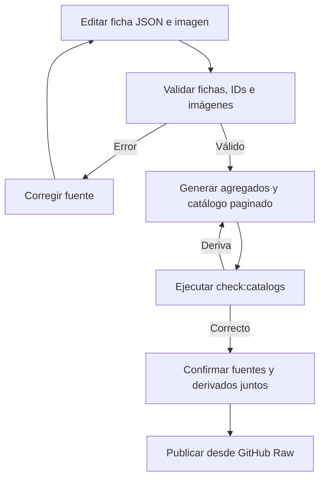
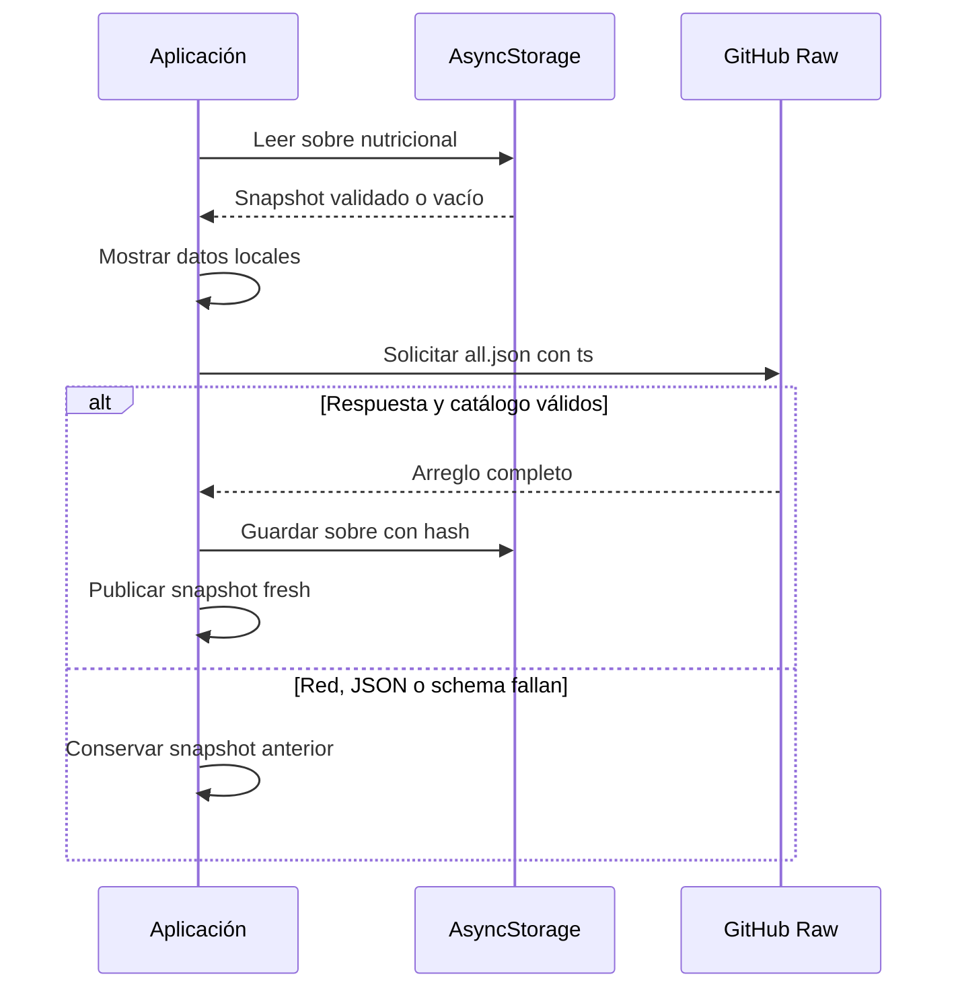
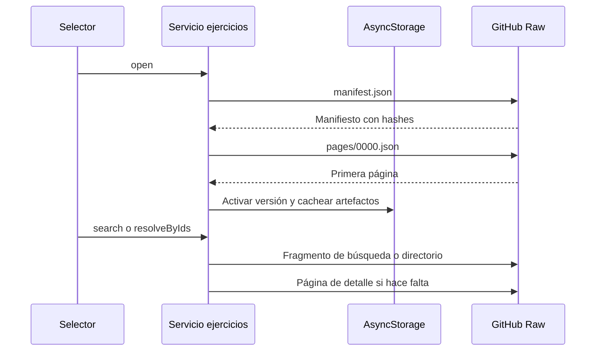

# Repositorios de contenido y consumo de catálogos

Los directorios versionados son la fuente curada compartida para `alimentos/`, `productos_comerciales/`, `recetas/` y `ejercicios/`. Se editan fichas JSON e imágenes; los agregados e índices son derivados reproducibles que se confirman junto a las fichas. La separación es también de privacidad: los alimentos personales pertenecen al almacenamiento local del usuario, no a estos repositorios ni a una URL de imagen remota.

La aplicación móvil tiene dos protocolos de consumo distintos. Los tres catálogos nutricionales descargan su `all.json`; ejercicios publica un manifiesto con páginas e índices fragmentados para no descargar el catálogo completo al abrirlo. Ambos protocolos validan antes de aceptar contenido y mantienen una copia local para tolerar falta de red. Para el uso funcional, véanse [Dieta y estimación de alimentos](../mobile/diet-and-food-estimation.md) y [Plantillas de entrenamiento](../mobile/training.md).

## Autoría, derivados y puerta de publicación

| Dominio | Fuente editable | Derivados publicados |
| --- | --- | --- |
| `alimentos/` | `<id>.json` e `images/` | `all.json` e `index.json` (`id`, `name`) |
| `productos_comerciales/` | `<id>.json` e `images/` | `all.json` |
| `recetas/` | `<id>.json` e `images/` | `all.json` |
| `ejercicios/` | `<id>.json` e imágenes por sexo | `all.json`, `index.json` y `catalog-v1/` |
| `apps/mobile/catalogs/generated/` | No editable a mano | `catalogSchemas.generated.ts` |

El generador enumera fichas raíz —no los derivados— en orden de nombre de archivo y produce los agregados. En ejercicios también construye `catalog-v1`: páginas de 30 entradas, índice de búsqueda y directorio por ID, más un `manifest.json` que describe cada artefacto y su hash. El manifiesto se escribe al final de una actualización, de modo que es el punto de activación de una publicación coherente. No edite manualmente `all.json`, `index.json`, `catalog-v1/` ni el schema TypeScript generado.



*La publicación depende de que fuentes y artefactos derivados superen la misma inspección.*

Los comandos operativos son:

```bash
npm run sync:catalogs
npm run check:catalogs
npm run test:catalogs
npm run test:catalogs:e2e
```

`sync:catalogs` valida y escribe; admite limitar la escritura con `node scripts/catalogs/generate.mjs --write --domain alimentos`. `check:catalogs` no admite esa limitación: inspecciona todos los dominios y falla si falta un derivado, hay deriva o queda un JSON obsoleto dentro de `ejercicios/catalog-v1/`. La escritura prepara temporales, sustituye los contenidos antes que el manifiesto de ejercicios y, si una operación falla, restaura los reemplazos y eliminaciones ya realizados.

## Contrato de contenido y recursos

Las fichas nutricionales son objetos cerrados: ID kebab-case, nombre, categoría, nutrientes y fibra por 100 g, tamaño y descripción de porción; los números son finitos y no negativos. `image` es opcional y, cuando existe, es un nombre de archivo WebP seguro dentro de `images/`. Una receta es por tanto una entrada nutricional por 100 g, no una receta ejecutable por ingredientes.

Las fichas de ejercicio son igualmente cerradas y requieren `name`, grupo y músculos secundarios, equipo, dificultad, instrucciones y las dos imágenes. El ID debe coincidir con el nombre del JSON y las rutas deben ser exactamente `images/<id>-male.webp` e `images/<id>-female.webp`. La inspección además rechaza duplicados —también entre dominios nutricionales—, JSON o schema inválido, rutas que escapen del catálogo, diferencias de mayúsculas, imágenes ausentes o huérfanas, bytes que no decodifiquen como WebP y proporciones distintas de 1:1 para nutrición o 16:9 para ejercicios.

Estas guardas importan para consumidores de sistemas de archivos con distinta sensibilidad de mayúsculas y para impedir que una referencia publicada lea fuera de su directorio. Una imagen nutricional puede reutilizarse por varias fichas; cualquier archivo presente en `images/` debe, aun así, estar referenciado.

## Fuentes móviles y caché nutricional

El registro de fuentes nombra tres catálogos nutricionales remotos (`gymnasia_foods`, `gymnasia_products`, `gymnasia_recipes`) y una fuente local privada (`user_personal_foods`). Las tres URLs apuntan a su `all.json` en GitHub Raw y llevan claves de caché actual y heredada, además de procedencia. El catálogo de ejercicios usa el mismo repositorio y procedencia, pero su runtime dedicado obtiene `ejercicios/catalog-v1/manifest.json`, no `all.json`.

Después de hidratar el estado general, la app lee primero las cachés nutricionales, las muestra y refresca sus tres fuentes en paralelo. Un refresco añade `ts` a la URL y solo publica el nuevo snapshot si HTTP, JSON y el arreglo completo pasan el parser; luego persiste un sobre con versión, fuente, fecha, hash SHA-256 canónico, ETag, procedencia y datos. Al leer, vuelve a validar estructura, fuente, fecha, entradas y hash. Una caché actual inválida se rechaza sin retroceder a la clave heredada; un array heredado válido se migra como `stale` sin fecha.



*El fallo remoto no sustituye una copia previamente aceptada.*

Una copia fechada de hasta siete días es `cached`; después es `stale`. Las fuentes pueden estar `fresh`, `cached`, `stale` o `unavailable`; el agregado nutricional es `partial` cuando sus estados no coinciden. Una escritura de caché que falle no descarta los datos frescos de la sesión, pero deja el aviso de que no estarán offline al reiniciar. La carga y el reintento de ejercicios son independientes; las dependencias de almacenamiento incorporan una generación para impedir que una operación tardía persista después de que la eliminación de datos invalide el runtime.

El parser nutricional agrega `sourceId` y el origen histórico tras validar. Ese origen decide si la imagen vive en `alimentos`, `productos_comerciales` o `recetas`; para un alimento personal devuelve `null`, incluso si la entrada tuviera `image`.

## Catálogo paginado y verificable de ejercicios

El servicio de ejercicios mantiene metadatos de caché v4 con una versión activa y, opcionalmente, la anterior. Al inicializar solo lee y valida esa caché; al abrir, descarga el manifiesto y la página 0. Para aceptar una publicación nueva, valida el manifiesto y descarga y valida esa primera página antes de activarla. Si falla cualquiera de esos pasos, conserva la versión activa comprobada. Los artefactos se cachean por `catalogVersion` y ruta, se comprueban contra el hash declarado y la poda conserva únicamente versiones activa y anterior.



*La apertura está acotada al manifiesto y primera página; la búsqueda y resolución cargan fragmentos bajo demanda.*

El manifiesto impone versión de schema, `sourceId`, tamaño de página 30, conteos coherentes, rutas relativas predecibles y hashes. Las búsquedas normalizan texto español, usan índices de unigramas y bigramas por campos, y pueden devolver resúmenes globales sin descargar la página que contiene las instrucciones. `getEntry` carga esa página solo cuando se abre el detalle. La resolución de IDs consulta primero páginas ya cacheadas y, para los faltantes, el directorio fragmentado que señala la página correspondiente. Cursores incluyen versión y firma de consulta: no se pueden reutilizar entre una búsqueda, otra búsqueda o una versión distinta.

Sin un fragmento remoto, la búsqueda usa las páginas verificadas que ya estén en caché y señala que no hay cobertura global. Como compatibilidad, si falla red y existe la caché v3 completa, se convierte localmente a páginas v4 y queda `stale`; esa migración no tiene los índices publicados, por lo que la búsqueda se limita a sus páginas locales.

## Identidad persistida y cambio seguro

Las referencias persistidas no dependen del nombre: usan `{ schemaVersion, sourceId, itemId }`. Tras abrir o actualizar el catálogo, la aplicación resuelve enlaces de rutinas por ID y sincroniza los campos mostrados; renombrar una ficha no rompe el vínculo. Para elementos heredados, la migración automática solo crea el enlace ante una coincidencia exacta o alias con un único candidato. Una ambigüedad requiere decisión explícita; no se adivina un alimento o ejercicio. Si se renombra o retira un ID, mantenga un alias de compatibilidad mientras existan referencias almacenadas.

Al añadir contenido, mantenga el ID estable, incorpore las imágenes declaradas, ejecute `npm run sync:catalogs` y confirme fuentes y derivados juntos. Cambiar ID, schema, rutas de imagen, tamaño de página o estrategia de índice es un cambio de contrato: exige revisar enlaces persistidos, cachés, manifiesto y clientes. La atribución de ejercicios se mantiene en `ejercicios/SOURCES.md`: pueden adaptarse metadatos e instrucciones bajo MIT según la fuente fijada, pero no reutilizar imágenes ni GIF de Gym Visual.

## Pruebas que protegen el contrato

Las pruebas del productor cubren la inspección, generación determinista, seguridad de rutas y rollback. Las pruebas del runtime paginado prueban que la apertura no pide `all.json`, que sigue limitada a manifiesto más primera página incluso con 10.000 ejercicios, búsqueda global con carga diferida del detalle, cursores ligados a versión y consulta, deduplicación de descargas, migración v3, fallback ante publicación corrupta y retención de dos versiones.

`npm run test:catalogs:e2e` intercepta GitHub Raw y verifica consumo de dieta y entrenamiento, scroll infinito y búsqueda del selector, continuidad offline, migración de cachés antiguas, disponibilidad parcial, arranque sin red, rechazo de caché manipulada y elección manual ante coincidencias alimentarias ambiguas. También demuestra que, tras renombrar un ejercicio publicado, una plantilla conservada mantiene el mismo `itemId` y actualiza su nombre mostrado.
