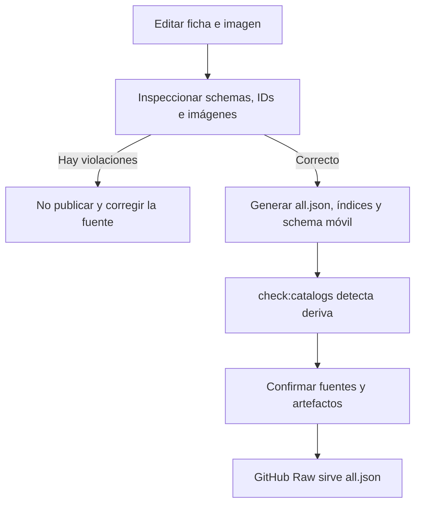
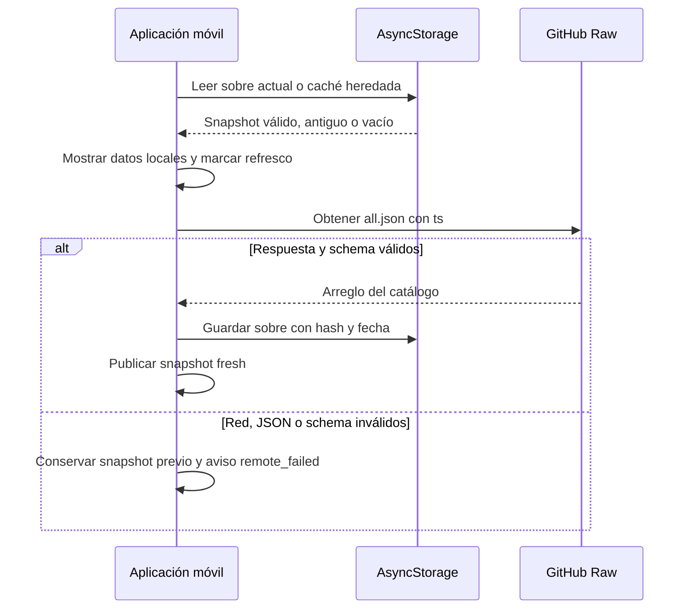

# Catálogos locales y artefactos generados

Los catálogos versionados son la fuente compartida de alimentos genéricos, productos comerciales, recetas y ejercicios. Sus **fichas JSON individuales** e imágenes son contenido editable; los agregados, índices y el artefacto TypeScript de esquemas son salidas deterministas que no deben editarse a mano. La aplicación móvil consume exclusivamente los agregados `all.json` publicados en GitHub Raw, los valida antes de usarlos y conserva copias locales comprobadas para seguir funcionando sin red.

Este límite separa el contenido curado del estado del usuario: los alimentos personales pertenecen al dispositivo, no a estos directorios ni a la publicación de catálogos. Véanse [Dieta y estimación de alimentos](../mobile/diet-and-food-estimation.md), [Plantillas de entrenamiento](../mobile/training.md) y [Generación de imágenes](image-generation.md).

## Fuente editable frente a salida generada

| Dominio | Fuente editable | Recursos | Salidas generadas | Consumidor remoto |
| --- | --- | --- | --- | --- |
| `alimentos/` | `<id>.json` | `images/<archivo>.webp` | `all.json`, `index.json` | alimentos genéricos |
| `productos_comerciales/` | `<id>.json` | `images/<archivo>.webp` | `all.json` | productos de marca |
| `recetas/` | `<id>.json` | `images/<archivo>.webp` cuando existan recetas | `all.json` | recetas |
| `ejercicios/` | `<id>.json` | `images/<id>-male.webp`, `images/<id>-female.webp` | `all.json`, `index.json` | ejercicios |
| `apps/mobile/catalogs/generated/` | Ninguna edición manual | — | `catalogSchemas.generated.ts` | validador móvil |

`all.json` contiene las fichas completas ordenadas por nombre de archivo. El índice de alimentos es un arreglo de `{id, name}`; el de ejercicios es un arreglo de IDs. Productos y recetas no tienen índice. Por ello, una modificación de una ficha no se publica hasta sincronizar y confirmar las salidas generadas correspondientes. El script también trata los recursos no referenciados como errores, de modo que una imagen no debe usarse como almacén informal de borradores.

## Contratos de las fichas

Los tres dominios nutricionales comparten el mismo JSON Schema: no admiten propiedades adicionales, exigen ID en kebab-case, nombre no vacío, los seis valores numéricos y descripción de porción; los números deben ser finitos y no negativos. `image` es opcional y, si se proporciona, es solamente el nombre de un archivo WebP seguro, relativo a `images/` del dominio.

```ts
type RawFoodCatalogEntry = {
  id: string;
  name: string;
  category: string;
  calories_per_100g: number;
  protein_per_100g: number;
  carbs_per_100g: number;
  fat_per_100g: number;
  fiber_per_100g: number;
  serving_size_g: number;
  serving_description: string;
  image?: string;
};
```

Los nutrientes son valores por 100 g; `serving_size_g` y `serving_description` describen la porción sugerida. Una receta es, por tanto, una ficha nutricional ya calculada por 100 g, no una lista de ingredientes ejecutable. La ausencia actual de fichas de receta es válida: su agregado puede ser `[]`.

Una ficha de ejercicio también prohíbe campos adicionales. Requiere texto no vacío para sus metadatos, un array de músculos secundarios y las dos rutas de imagen. Las rutas tienen que ser exactamente `images/<id>-male.webp` y `images/<id>-female.webp`, donde `<id>` coincide con el nombre de la ficha y con el ID declarado.

```ts
type RawExerciseCatalogEntry = {
  id: string;
  name: string;
  image_male: string;
  image_female: string;
  muscle_group: string;
  secondary_muscles: string[];
  equipment: string;
  difficulty: string;
  instructions: string;
};
```

Las imágenes referenciadas se comprueban con coincidencia exacta de mayúsculas, contra escapes de ruta, como WebP realmente decodificable y con proporción cuadrada para nutrición o 16:9 para ejercicio. Varias fichas nutricionales pueden compartir intencionadamente una misma imagen; en cambio, las imágenes de ejercicio están ligadas de forma nominal a su ID y género.

## Generación y guarda de publicación

El punto de entrada es `scripts/catalogs/generate.mjs`:

```bash
npm run sync:catalogs
npm run check:catalogs
npm run test:catalogs
npm run test:catalogs:e2e
```

`sync:catalogs` inspecciona los cuatro dominios y escribe las salidas mediante sustituciones temporales y renombres; si falla una sustitución, revierte las que ya se hubieran reemplazado. Puede limitar la escritura a un dominio con `node scripts/catalogs/generate.mjs --write --domain alimentos`, pero `--check` valida siempre el conjunto completo. La inspección bloquea la publicación ante JSON inválido, incumplimiento de schema, ID duplicado o discordante con el archivo, ID nutricional repetido entre dominios, imagen ausente o inválida, imagen huérfana o deriva de los artefactos generados.

Además de los agregados e índices, el proceso copia los schemas canónicos a `apps/mobile/catalogs/generated/catalogSchemas.generated.ts`. Ese archivo permite que el cliente aplique la misma forma estructural al JSON remoto; editarlo directamente rompería la correspondencia entre validación local y validación de publicación.



*La publicación solo es segura cuando las fichas editables, los recursos y las salidas regeneradas pasan juntos la inspección.*

La generación de imágenes es un flujo operativo distinto: actualmente automatiza alimentos y ejercicios, pero no productos ni recetas. Sus prompts ejecutables no sustituyen la validación del catálogo; tras añadir o cambiar un recurso hay que ejecutar la sincronización anterior. Para los ejercicios importados, `ejercicios/SOURCES.md` registra la procedencia de metadatos e instrucciones y excluye copiar o reutilizar las imágenes y GIF de Gym Visual.

## Carga local-first y estado de disponibilidad

Cada definición remota enlaza un `all.json` de `main` con una fuente estable (`gymnasia_foods`, `gymnasia_products`, `gymnasia_recipes` o `gymnasia_exercises`), una clave de caché v3/v2 con ámbito de entorno y una clave heredada v1/v2. Al terminar la hidratación local, la aplicación lee primero cada caché y muestra inmediatamente los datos aceptados; después actualiza alimentos, productos y recetas en paralelo y ejercicios de forma independiente. Cada petición añade `ts=<milisegundos>` a la URL y requiere una respuesta HTTP correcta, JSON analizable y catálogo completo válido antes de reemplazar el snapshot.



*El catálogo nunca acepta parcialmente un agregado: una ficha inválida hace que se rechace el arreglo completo y se preserve la copia local anterior.*

La caché actual es un sobre versionado con `sourceId`, fecha de obtención, hash SHA-256 del JSON canónico, ETag y procedencia. Al leerla, el cliente vuelve a validar su schema, el origen y el hash; una caché actual corrupta se rechaza sin volver silenciosamente a la clave heredada. Un array heredado válido se migra a un sobre sin fecha y se marca `stale`. La fecha se considera `cached` hasta siete días inclusive y `stale` después; la escritura fallida no descarta los datos frescos de la sesión, pero se expone como aviso porque no quedan disponibles offline tras reiniciar.

Cada fuente se muestra como `fresh`, `cached`, `stale` o `unavailable`; si las fuentes de un agregado difieren, el estado combinado es `partial`. Los errores de red preservan los datos previos y degradan un snapshot `fresh` a `cached` o `stale` según su antigüedad. La interfaz puede reintentar alimentos o ejercicios, y las operaciones de borrado de datos invalidan la generación de ejecución para impedir escrituras de caché tardías.

## Procedencia, imágenes e identidad persistida

Durante el parseo, los agregados remotos no aportan procedencia de aplicación: el cargador añade `sourceId` y el origen legado (`alimento`, `producto_comercial` o `receta`). Esto selecciona la base correcta para `foodCatalogImageUri`; los alimentos personales usan `user_personal_foods`, son privados y no reciben una URL remota. Las rutas de ejercicio ya incluyen `images/` y se resuelven bajo `ejercicios/`, eligiendo el género solicitado.

Las selecciones persistidas se identifican con `{ schemaVersion, sourceId, itemId }`, no con el nombre visible. Un enlace puede estar `linked` —incluye cómo se vinculó— o `unresolved` con una razón explícita. Al refrescar un catálogo de ejercicios, la aplicación resuelve los enlaces por ID y sincroniza nombre, músculo e imagen de la plantilla. Para datos heredados sin vínculo solo crea uno cuando la coincidencia de nombre exacta o alias produce un único candidato; los casos ambiguos no se adivinan. Esto permite renombrar un ejercicio sin romper una plantilla ya vinculada, pero convertir o retirar IDs requiere una entrada de compatibilidad en `CATALOG_ID_ALIASES` mientras existan referencias almacenadas.

## Cambio seguro y pruebas enfocadas

Para añadir contenido, cree la ficha con un ID estable, añada el recurso que declara y ejecute `npm run sync:catalogs`; confirme tanto la fuente como las salidas. Un cambio de ID, de nombre de imagen o de schema es una migración de contrato: debe considerar fichas, recursos, agregados, schema generado, enlaces persistidos, cualquier alias de ID y clientes con una caché anterior.

Las pruebas de Node del productor cubren generación determinista, schema e IDs, exclusividad entre catálogos nutricionales, seguridad de rutas, decodificación/formato/proporción de imágenes, huérfanos y rollback atómico. Las pruebas Vitest cubren la validación móvil, el hash canónico, la migración de caché, el límite de antigüedad, fallos de persistencia y degradación ante error remoto; las de migración verifican que una coincidencia ambigua no enlace datos heredados y que un cambio de nombre se resuelva por ID. El E2E web intercepta GitHub Raw y comprueba la descarga, consumo por dieta y entrenamiento, funcionamiento offline, migración de caché heredada, disponibilidad parcial, rechazo de caché manipulada y selección manual ante ambigüedad.
