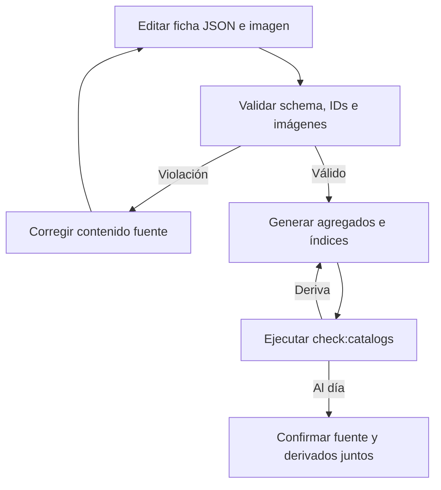
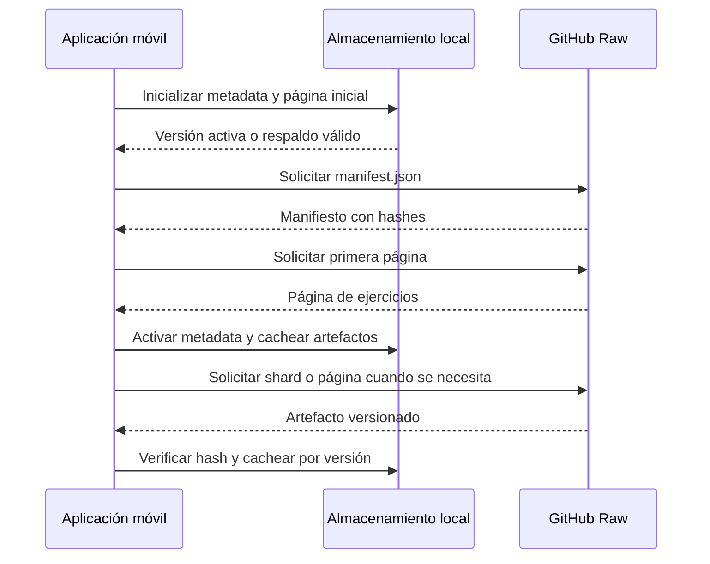

# Repositorios de catálogos

Los directorios versionados `alimentos/`, `productos_comerciales/`, `recetas/` y `ejercicios/` son la fuente curada pública. Las fichas JSON individuales y sus imágenes son lo que se edita; los agregados e índices son derivados comprobables. La aplicación móvil trata los catálogos nutricionales y el de ejercicios de manera distinta: descarga los primeros como agregados completos, pero consulta el segundo mediante un manifiesto versionado, páginas y shards bajo `ejercicios/catalog-v1/`.

Este límite separa contenido público y estado personal: `user_personal_foods` vive en el dispositivo, es privado y no tiene URL ni imagen remota. Para el uso de estos datos, véanse [Dieta y estimación de alimentos](../mobile/diet-and-food-estimation.md) y [Plantillas de entrenamiento](../mobile/training.md).

## Contenido fuente y artefactos

| Dominio | Fuente editable | Recursos | Derivados principales | Consumo móvil |
| --- | --- | --- | --- | --- |
| `alimentos/` | `<id>.json` | `images/<archivo>.webp` | `all.json`, `index.json` | agregado nutricional |
| `productos_comerciales/` | `<id>.json` | `images/<archivo>.webp` | `all.json` | agregado nutricional |
| `recetas/` | `<id>.json` | `images/<archivo>.webp` si se declara imagen | `all.json` | agregado nutricional |
| `ejercicios/` | `<id>.json` | `images/<id>-male.webp`, `images/<id>-female.webp` | `all.json`, `index.json`, `catalog-v1/` | manifiesto, páginas e índices fragmentados |
| `apps/mobile/catalogs/generated/` | No admite edición manual | — | `catalogSchemas.generated.ts` | validación de agregados nutricionales |

El generador enumera las fichas por nombre de archivo, por lo que los `all.json` son deterministas. El índice de alimentos conserva pares `{id, name}` y el de ejercicios contiene IDs. Para ejercicios también genera un catálogo paginado de 30 entradas: el manifiesto fija un hash de versión, describe las páginas, los shards de búsqueda por unigrama/bigrama normalizado y los directorios por primer byte del ID. Cada descriptor lleva su hash SHA-256; el manifiesto se escribe al final para no publicar una referencia a contenido aún no sustituido.

**No se editan manualmente los derivados.** Una modificación de ficha, imagen o schema exige regenerarlos y confirmarlos en el mismo cambio. El validador también rechaza cualquier recurso en `images/` que no esté referenciado: ese directorio no es un área de borradores.

## Contratos e integridad del contenido

Las fichas nutricionales no admiten campos extra. Exigen ID kebab-case, nombre, categoría, energía, macronutrientes, fibra y datos de porción; los números nutricionales y la masa han de ser no negativos. `image`, si existe, es un nombre de archivo WebP seguro. Los nutrientes se expresan por 100 g, por lo que una receta es una ficha nutricional calculada por 100 g y no una receta ejecutable con ingredientes.

Las fichas de ejercicio también son estrictas: requieren nombre, grupo muscular, músculos secundarios, equipo, dificultad, instrucciones y dos rutas de imagen. Las rutas deben ser exactamente `images/<id>-male.webp` e `images/<id>-female.webp` y el ID declarado debe coincidir con el archivo JSON. La inspección comprueba que las imágenes referenciadas existen con la misma capitalización, se pueden decodificar y son WebP; exige proporción 1:1 para nutrición y 16:9 para ejercicios. Además bloquea IDs duplicados —también entre dominios nutricionales—, rutas inseguras, imágenes huérfanas y deriva de derivados.

## Generación y publicación segura

Los puntos de entrada son:

```bash
npm run sync:catalogs
npm run check:catalogs
npm run test:catalogs
npm run test:catalogs:e2e
```

`sync:catalogs` ejecuta la inspección y escribe artefactos con archivos temporales y renombres. Si falla una sustitución, revierte tanto los artefactos ya reemplazados como los ficheros obsoletos que hubiese borrado. Puede limitar la escritura con `node scripts/catalogs/generate.mjs --write --domain alimentos`. `check:catalogs`, en cambio, siempre valida los cuatro dominios y compara todos los derivados esperados, incluido el schema móvil y los ficheros de `catalog-v1/`; falla ante artefactos ausentes, distintos o ya no esperados.



*Flujo de publicación: el contenido solo es publicable cuando fuente, recursos y productos derivados superan la misma inspección.*

La atribución de `ejercicios/SOURCES.md` permite adaptar los metadatos e instrucciones del dataset fijado bajo MIT, pero excluye copiar, redistribuir o utilizar como referencia imágenes y GIF de Gym Visual.

## Fuentes remotas y caché nutricional

El registro nutricional define tres fuentes remotas de GitHub Raw: `gymnasia_foods`, `gymnasia_products` y `gymnasia_recipes`, cada una apuntando a su `all.json`, con clave de caché actual, clave heredada y procedencia. Al terminar la hidratación local, `useFoodCatalogRuntime` lee las tres cachés en paralelo, las presenta de inmediato y refresca las tres fuentes en paralelo. El parser elimina cualquier `sourceId` o `source` almacenado que contradiga la fuente esperada, valida el arreglo completo y solo después vuelve a añadir esos campos de procedencia. Ese origen decide si una imagen alimentaria se busca en `alimentos`, `productos_comerciales` o `recetas`; los alimentos personales no producen URI remota.

El snapshot nutricional actual es un sobre versionado con fuente, fecha, hash SHA-256 del JSON canónico, ETag, procedencia y datos. En lectura se revalidan forma, fuente, fecha, entradas y hash. Si existe un sobre actual inválido se rechaza sin recurrir a la clave heredada; si falta el sobre y el array heredado es válido, se migra como `stale`. Una copia con fecha de hasta siete días es `cached`; una más antigua o sin fecha, `stale`.

Cada refresco añade `ts` a la URL y solamente publica datos `fresh` si HTTP, JSON y schema son correctos. Un fallo remoto conserva el snapshot anterior; una escritura de caché fallida conserva el contenido nuevo durante la sesión, pero lo marca para advertir que no sobrevivirá offline. Al combinar estados diferentes de las tres fuentes, la disponibilidad global es `partial`.

## Catálogo de ejercicios bajo demanda

El catálogo de ejercicios remoto se abre desde `https://raw.githubusercontent.com/maximofn/gymnasia/main/ejercicios/catalog-v1`. Primero se descarga y valida `manifest.json` y, si hay entradas, su primera página; solo entonces se activa el manifiesto. Los artefactos se cachean por `(catalogVersion, path)` y se verifican contra el hash del descriptor antes de usarse. La metadata conserva una versión activa y, como respaldo, la versión activa anterior; al iniciar, se rechaza una metadata cuya página inicial no pueda comprobarse. Al activar una versión nueva se mantienen únicamente sus artefactos y los de ese respaldo.



*El manifiesto activa una versión coherente antes de que el selector consulte páginas, búsqueda o resolución de IDs.*

El selector pagina la exploración y usa shards de búsqueda para texto y filtros. La búsqueda normaliza minúsculas, acentos y puntuación; verifica la estructura del shard y filtra candidatos con los criterios completos. Para resolver referencias persistidas, consulta primero páginas ya cacheadas y luego un shard de directorio que indica la página del ID. Las descargas duplicadas de la misma URL se comparten; al cerrar el selector o cambiar la consulta se abortan solicitudes, y una revisión evita que resultados tardíos sobrescriban la consulta actual. Si no puede recuperar un shard, la búsqueda se degrada a las páginas cacheadas y declara que no tiene cobertura global.

La caché heredada V3 de ejercicios puede migrarse localmente a páginas sin índice; queda `stale` y su búsqueda solo cubre el contenido cacheado hasta descargar un manifiesto actual. Si red, manifiesto o página inicial fallan, la app conserva una versión válida ya activa; sin ninguna versión utilizable queda `unavailable`.

## Identidad persistida y cambio compatible

Las selecciones persistidas usan `{ schemaVersion, sourceId, itemId }`, no el nombre visible. Un enlace puede ser `linked`, con el método que lo creó, o `unresolved`, con un motivo explícito. Tras resolver ejercicios de la versión activa, la app sincroniza en las plantillas nombre, grupo muscular e imagen por ID. Por eso un ejercicio renombrado conserva su vínculo y actualiza su presentación.

Para ejercicios heredados sin enlace, solo se crea automáticamente una referencia ante una coincidencia exacta o alias con un único candidato. Una coincidencia ambigua no se adivina y requiere elección manual. Los reintentos y operaciones de carga capturan una generación de ejecución; el borrado de datos la incrementa y bloquea escrituras de caché, de modo que una petición tardía no puede volver a persistir datos eliminados.

## Pruebas y cambio seguro

Para añadir contenido, cree una ficha con un ID estable, añada los recursos declarados y ejecute `npm run sync:catalogs`; confirme fuentes y derivados juntos. Cambiar un ID, schema, ruta de imagen o la estructura de `catalog-v1/` es un cambio de contrato: debe considerar artefactos generados, cachés existentes y referencias persistidas.

Además de pruebas unitarias del generador y de ambos runtimes, `npm run test:catalogs:e2e` intercepta GitHub Raw. Verifica consumo de agregados nutricionales y catálogo paginado de ejercicios, scroll infinito y búsqueda, continuidad offline, migración de cachés heredadas, disponibilidad parcial, rechazo de una caché manipulada y resolución manual de coincidencias alimentarias ambiguas. También comprueba que, al renombrar un ejercicio servido, una plantilla mantiene el mismo `itemId` y recibe el nuevo nombre.
