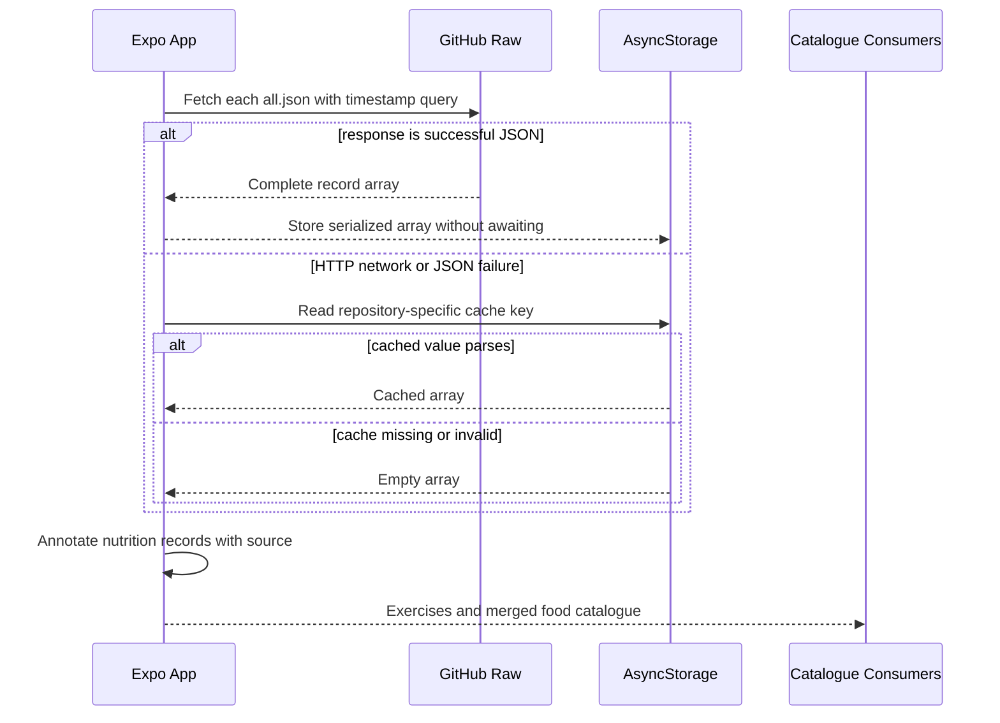
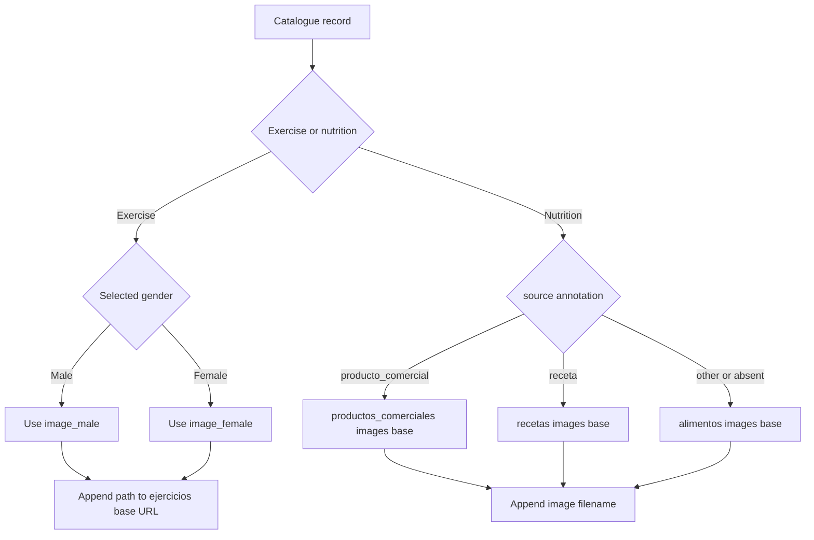

# Repositorios de contenido

Gymnasia mantiene sus catálogos compartidos de alimentos y ejercicios como archivos versionados en el repositorio. No son datos iniciales para una base de datos: la aplicación Expo descarga los archivos `all.json` confirmados directamente desde GitHub Raw en tiempo de ejecución. Por consiguiente, un archivo agregado y todas las rutas que este menciona son superficies públicas de la API en tiempo de ejecución.

La fuente de verdad se divide deliberadamente:

- un archivo JSON hoja es el registro mantenible de un elemento;
- `all.json` es el agregado en tiempo de ejecución que consume la aplicación;
- `index.json`, cuando está presente, es un inventario ligero para personas o herramientas, pero la aplicación actual no lo obtiene;
- `images/` contiene recursos públicos referenciados por los registros;
- `apps/mobile/App.tsx` contiene los contratos de TypeScript, el comportamiento de obtención y caché, la anotación de origen, la coincidencia y la construcción de URL de imágenes.

## Inventario del repositorio

Inventario observado en el árbol incluido en el repositorio:

| Directorio | Dominio | Registros hoja | Registros en `all.json` | `index.json` | Imágenes referenciadas | Consumidor en tiempo de ejecución |
|---|---|---:|---:|---|---:|---|
| `alimentos/` | Alimentos genéricos | 39 | 39 | arreglo de `{id, name}` | 39 referencias que comparten 31 archivos | búsqueda de dieta, detalle de alimentos, herramientas de alimentos del agente |
| `productos_comerciales/` | Productos de marca | 1 | 1 | ausente | 1 | el mismo catálogo de alimentos después de la anotación de origen |
| `recetas/` | Recetas preparadas | 0 | 0 | ausente | 0 | el mismo catálogo de alimentos; actualmente vacío |
| `ejercicios/` | Ejercicios | 47 | 47 | arreglo de cadenas de ID | 94 referencias WebP | selector de ejercicios, sincronización de plantillas, búsqueda de ejercicios del agente |

Los nombres repetidos de imágenes de alimentos son intencionales actualmente: las variantes de aceite comparten imágenes de aceite, las variantes de latas de atún comparten una imagen y tres variantes de leche comparten `leche.webp`. Por tanto, la cardinalidad de las imágenes no tiene que ser igual a la cardinalidad de los registros. `ejercicios/images/` también contiene un archivo heredado adicional, `flexiones-female.png`; el agregado apunta a la versión WebP.

### Repositorio de instrucciones en tiempo de ejecución

`prompts/AGENTS.md` también es una fuente de la política de chat alojada en el repositorio, pero no es un catálogo JSON ni se consume desde GitHub Raw arbitrario. `agent/chatSystemPromptRuntime.ts::loadChatSystemPrompt` usa solo el snapshot integrado en Local; en Staging/Production acepta un asset `policy.md` de release anunciado por un deployment exitoso, con hash verificado, y recurre a una caché `gymnasia.mobile.chat.system_prompt.v3` del mismo entorno/canal y finalmente al snapshot. La política puede cambiar el comportamiento sin publicar una nueva versión móvil, pero debe atravesar esa frontera de release. Consulte [Tiempo de ejecución del agente](../agent/runtime.md) y [Seguridad sanitaria y transparencia de IA](../agent/health-safety.md); los catálogos de esta página siguen siendo una superficie de contenido distinta.

## Esquemas exactos de los registros

Estos son contratos estructurales que los consumidores de TypeScript solo aplican en tiempo de compilación. El JSON remoto se convierte mediante una aserción de tipo después de `response.json()`; no existe ningún validador de esquemas en tiempo de ejecución.

### Registro de ejercicio

Cada archivo hoja de ejercicio y cada elemento de `ejercicios/all.json` deben tener exactamente la estructura representada por `ExerciseRepoEntry`:

```ts
type ExerciseRepoEntry = {
  id: string;
  name: string;
  image_male: string;
  image_female: string;
  muscle_group: string;
  secondary_muscles: string[];
  equipment: string;
  difficulty: string;
  instructions: string;
};
```

Algunos ejemplos de convenciones de rutas son `ejercicios/press-banca.json`, el ID `press-banca` y los valores de imagen `images/press-banca-male.webp` y `images/press-banca-female.webp`. Los campos de imagen son rutas relativas a `ejercicios/`, no nombres de archivo simples. El código no valida enumeraciones. Los datos existentes suelen usar valores de músculo/equipamiento en español y en minúsculas, así como valores de dificultad en inglés, como `intermediate`, a pesar de que las opciones de la interfaz para ejercicios personalizados, definidas por separado, usan etiquetas en español con mayúscula inicial; no normalice los datos del repositorio según esas listas de la interfaz sin modificar los consumidores.

### Registro de alimento, producto y receta

Los tres repositorios remotos de nutrición comparten `FoodRepoEntry`:

```ts
type FoodSource = "alimento" | "producto_comercial" | "receta" | "personal";

type FoodRepoEntry = {
  id: string;
  name: string;
  category: string;
  calories_per_100g: number;
  protein_per_100g: number;
  carbs_per_100g: number;
  fat_per_100g: number;
  fiber_per_100g: number;
  serving_size_g: number;
  serving_description: string;
  image?: string;
  source?: FoodSource;
};
```

Los registros remotos deben omitir `source`: el cargador lo asigna según el directorio. `image`, cuando está presente, es un nombre de archivo relativo al directorio `images/` de ese repositorio, a diferencia de las rutas de imágenes de ejercicios. Los valores nutricionales son por cada 100 g; `serving_size_g` es la porción predeterminada que usan los flujos de dieta y `serving_description` es texto de presentación. Las cadenas vacías se aceptan técnicamente y actualmente aparecen en el único producto, pero es preferible proporcionar una categoría y un texto de porción significativos.

Las recetas no tienen un esquema independiente. Un futuro `recetas/<id>.json` debe usar el mismo contrato de nutrición y proporcionar totales por cada 100 g ya calculados. Actualmente, `recetas/all.json` es exactamente un arreglo JSON vacío, lo cual es válido y no provoca ningún error.

### Contratos de agregados e índices

Para cada repositorio con contenido, `all.json` es un arreglo JSON de registros completos. Debe ser igual a los registros hoja ordenados lexicográficamente por nombre de archivo, porque el generador de imágenes lo reconstruye de esa manera. El entorno de ejecución nunca consulta los archivos hoja ni `index.json`; confirmar únicamente un archivo hoja no produce ningún cambio en producción.

Los dos formatos de índice existentes son deliberadamente diferentes:

```ts
// alimentos/index.json
type FoodIndex = Array<{ id: string; name: string }>;

// ejercicios/index.json
type ExerciseIndex = string[];
```

No aplique un formato al otro. Los productos y las recetas no tienen actualmente ningún índice y el entorno de ejecución no requiere ninguno.

## Obtención, caché y composición en tiempo de ejecución



*La aplicación prioriza los datos remotos en cada inicio tras la hidratación, con el último arreglo obtenido correctamente como alternativa y un arreglo vacío como alternativa final.*

Después de hidratar la aplicación local, un efecto inicia `loadExercisesRepo()` y, de forma independiente, un `Promise.all` de los tres cargadores de nutrición. Cada URL recibe `?ts=<current milliseconds>`, lo que evita intencionalmente las cachés HTTP obsoletas. Los arreglos obtenidos correctamente se escriben sin esperar a que finalice la operación en estas claves independientes:

| Repositorio | Sufijo de GitHub Raw | Clave de AsyncStorage |
|---|---|---|
| Ejercicios | `ejercicios/all.json` | `gymnasia.mobile.exercises_repo.v2` |
| Alimentos | `alimentos/all.json` | `gymnasia.mobile.foods_repo.v1` |
| Productos | `productos_comerciales/all.json` | `gymnasia.mobile.products_repo.v1` |
| Recetas | `recetas/all.json` | `gymnasia.mobile.recipes_repo.v1` |

Una obtención solo es correcta cuando `response.ok` y el análisis del JSON tienen éxito. Cualquier error lanzado recurre a la caché de ese repositorio. Las lecturas de caché no comprueban la estructura: un JSON válido del tipo incorrecto puede salir del cargador y fallar más adelante. Las escrituras en caché pueden fallar silenciosamente. No existe TTL, hash de integridad, negociación de versiones, catálogo integrado ni indicador de caché obsoleta.

La aplicación combina los arreglos de nutrición en un orden fijo de precedencia —alimentos genéricos, productos y, después, recetas— y añade los valores de `source` `alimento`, `producto_comercial` y `receta`. Los alimentos personales se cargan por separado desde `gymnasia.mobile.personal_foods.v1`; usan el mismo tipo estructural, pero son datos locales propiedad del usuario, no integrantes de estos repositorios.

## Enrutamiento de imágenes



*Los registros de ejercicios contienen rutas relativas al repositorio, mientras que los registros de nutrición contienen nombres base de imágenes que se enrutan según el origen asignado por su cargador.*

`getExerciseImageUrl` concatena la URL base de ejercicios y la ruta `image_male` o `image_female` elegida. No comprueba su existencia ni proporciona una alternativa. Durante la hidratación, la coincidencia con el repositorio también actualiza las imágenes de ejercicios almacenadas en las plantillas si el URI actual está vacío o ya apunta al repositorio remoto de ejercicios; se conservan las imágenes propiedad del usuario que usan `file:`, `data:` o `content:`. Si falta el músculo de una plantilla, se completa con `muscle_group`, pero no se sobrescribe un músculo existente.

`foodRepoImageUri` devuelve `null` cuando `image` está ausente. De lo contrario, selecciona la base `/images` de productos, recetas o alimentos a partir de `source`. Un registro remoto utilizado sin anotación usa de forma predeterminada el directorio de imágenes de alimentos. Los nombres de archivo se concatenan sin codificación de URL, por lo que la puntuación y el uso de mayúsculas y minúsculas pasan a formar parte del contrato público de la URL; para contenido nuevo, use preferiblemente nombres en minúsculas que sean seguros para URL.

## Coincidencia y procedencia

La coincidencia de alimentos convierte el texto a minúsculas, elimina espacios al principio y al final y quita los acentos; después intenta encontrar una igualdad exacta con el nombre mostrado y, a continuación, la primera coincidencia bidireccional de subcadenas. Busca en la lista remota suministrada antes que en los alimentos personales. Dado que la lista remota combinada está ordenada como alimentos → productos → recetas, los nombres duplicados o solapados pueden resolverse a un elemento genérico anterior. Este comparador no usa los ID.

La coincidencia de ejercicios compara primero los nombres sin distinguir entre mayúsculas y minúsculas. Su clave tolerante elimina después acentos y signos de puntuación, descarta las palabras conectoras en español, elimina una `s` final de cada token, ordena los tokens y compara la cadena de tokens resultante. Esto permite vincular con imágenes del repositorio nombres que contienen paréntesis y variantes con «con». También puede crear colisiones; los nombres exactos y estables obtenidos de la búsqueda del repositorio siguen siendo el contrato más seguro. Los ID se usan para la identidad en el repositorio y los nombres de archivo, pero no para la coincidencia de plantillas.

La anotación `source` representa la procedencia en tiempo de ejecución y no se conserva en los archivos hoja remotos. Controla el enrutamiento de imágenes de alimentos y distingue las secciones del catálogo. Los valores nutricionales no incluyen citas, revisiones, códigos de barras, campos de identidad de marca ni metadatos de confianza.

### Procedencia y licencias de ejercicios importados

`ejercicios/SOURCES.md` es el registro de atribución del catálogo. La primera importación GYM-12 adapta estructura, metadatos e instrucciones de [`hasaneyldrm/exercises-dataset`](https://github.com/hasaneyldrm/exercises-dataset), fijado en el commit `7455efae41b330c265e7cd4b78dfa848e7ce5ebd` y publicado bajo licencia MIT. El contenido se tradujo, normalizó y revisó para `ExerciseRepoEntry`; esta procedencia no cambia el esquema ni la forma en que `loadExercisesRepo` consume `all.json`.

La licencia de los textos y datos no autoriza a reutilizar indiscriminadamente los recursos visuales de la fuente. `ejercicios/SOURCES.md` indica expresamente que las imágenes y GIF del dataset pertenecen a Gym Visual y **no** se copian, redistribuyen ni usan como referencia. Las imágenes del catálogo de Gymnasia se generan desde cero mediante el flujo documentado en [Generación de imágenes](image-generation.md). Por ello, una importación futura debe tratar como superficies coordinadas: la hoja traducida, `all.json`, `index.json`, las dos imágenes propias, la entrada ejecutable de `EXERCISE_PROMPTS` y la atribución/licencia en `SOURCES.md`.

## Añadir o modificar contenido

### Añadir un alimento genérico

1. Elija un ID estable en minúsculas y con formato kebab-case, y cree `alimentos/<id>.json` usando todos los campos nutricionales obligatorios.
2. Coloque su recurso en `alimentos/images/<filename>` y establezca `image` únicamente en el nombre base. Puede reutilizar deliberadamente una imagen compartida existente.
3. Si va a generar la imagen, añada el mismo ID a `FOOD_PROMPTS` en `image-generation/generate_images.py`; consulte [Generación de imágenes](image-generation.md).
4. Reconstruya `alimentos/all.json` y `alimentos/index.json`. Ejecutar el generador de alimentos hace esto incluso cuando se omite la generación de recursos existentes; como alternativa, reconstrúyalos de forma determinista con un script revisado.
5. Valide antes de confirmar los cambios la igualdad entre los archivos hoja y el agregado, la unicidad de los ID, los valores numéricos, la existencia de las imágenes y el análisis del JSON.

### Añadir un ejercicio

1. Cree `ejercicios/<id>.json` con el esquema completo de ejercicios.
2. Establezca las rutas de las imágenes en `images/<id>-male.webp` y `images/<id>-female.webp`, salvo que use intencionalmente otras rutas existentes.
3. Añada a `EXERCISE_PROMPTS` una asignación en inglés de `(description, view)` que sea visualmente precisa.
4. Genere o proporcione manualmente ambos recursos.
5. Reconstruya ambos agregados. Confirme que `ejercicios/index.json` contiene la cadena del ID y que `all.json` contiene el registro completo.
6. Si el registro adapta datos o texto de una fuente externa, actualice `ejercicios/SOURCES.md` con el repositorio, la revisión fijada, la licencia y el alcance exacto de lo reutilizado. No importe imágenes cuyo contrato de licencia no permita su redistribución.
7. Compruebe la búsqueda de ejercicios, el detalle, las imágenes de ambos géneros y la vinculación desde el nombre de una rutina existente.

### Añadir un producto o una receta

El generador no tiene ningún comando para productos o recetas. Cree manualmente el archivo hoja y la imagen en el directorio correspondiente y, después, reconstruya el `all.json` de ese directorio como un arreglo ordenado lexicográficamente por nombre de archivo. Mantenga el esquema compartido de alimentos. La imagen de un producto debe estar en `productos_comerciales/images/`; la imagen de una receta debe estar en `recetas/images/`, aunque ese directorio todavía no existe. El entorno de ejecución actual no requiere ningún índice.

### Modificar un registro de forma segura

Trate el cambio de nombre de un ID o de una ruta de imagen como una migración pública. Actualice conjuntamente el archivo hoja, el agregado, la clave del mapa de instrucciones, el nombre del recurso y cualquier suposición sobre nombres almacenados o mostrados. Como los clientes pueden conservar arreglos antiguos en caché, mantener una copia de compatibilidad de una imagen renombrada evita miniaturas rotas hasta que las cachés se actualicen. Cambiar una clave de caché es actualmente la única forma explícita de invalidar todos los registros almacenados en caché a nivel de la aplicación.

## Fallos y comportamiento operativo

- Una interrupción de GitHub, una respuesta que no sea 2xx, un agregado mal formado o un error de análisis de JSON seleccionan silenciosamente la caché o `[]`; los usuarios no reciben ningún error específico del repositorio.
- `Promise.all` continúa resolviéndose porque cada cargador de nutrición captura internamente sus errores. Por tanto, un repositorio puede estar obsoleto mientras otro está actualizado.
- Una carga útil mal formada pero analizable se almacena en caché y se devuelve porque no existe validación en tiempo de ejecución.
- Las imágenes ausentes no invalidan los registros; React Native recibe una URL que puede fallar de forma independiente.
- La divergencia entre los archivos hoja y el agregado es invisible para la aplicación porque los archivos hoja nunca se obtienen.
- Forzar un push o servir contenido de `main` no revisado modifica los datos de producción sin publicar una nueva versión de la aplicación.
- Los alimentos personales se conservan por separado y no forman parte de la generación del agregado remoto.

## Pruebas, validación y carencias conocidas

No existe ninguna prueba automatizada específica para comprobar el esquema, la paridad o los enlaces de imágenes de estos repositorios. Las pruebas del agente ejercitan el comportamiento de búsqueda con datos de prueba, y los flujos E2E de entrenamiento y dieta cubren indirectamente a los consumidores, pero no demuestran que los agregados incluidos en el repositorio coincidan con los archivos hoja ni que los recursos de GitHub Raw se devuelvan correctamente.

Un cambio de contenido debe validar como mínimo:

1. que todos los archivos JSON se analicen correctamente y que la raíz de cada agregado sea un arreglo;
2. que el número de archivos hoja y su contenido ordenado sean iguales a `all.json`;
3. que los ID no estén vacíos, sean únicos y coincidan con la raíz del nombre de su archivo hoja;
4. que todas las claves obligatorias tengan los tipos primitivos documentados;
5. que los valores nutricionales y los tamaños de porción sean finitos y no negativos, con una decisión de proyecto sobre si se permiten tamaños de porción de cero;
6. que las rutas de imágenes de ejercicios y las rutas de nutrición `images/<image>` existan respetando exactamente las mayúsculas y minúsculas;
7. que el contenido de los índices coincida con el inventario de archivos hoja previsto y use el esquema específico del repositorio;
8. que `all.json` sea accesible desde su URL de GitHub Raw después de fusionar los cambios;
9. que la aplicación móvil pueda iniciarse con datos de red nuevos, datos almacenados en caché, una caché mal formada y sin conexión de red.

Una comprobación específica válida del comportamiento del agente respaldado por el catálogo es `npm --workspace apps/mobile exec -- vitest run --config vitest.config.mts agent/toolExecutor.test.ts`; no existe ningún script `npm run test:agent`. Ejecute también el escenario E2E móvil pertinente de dieta o entrenamiento descrito en [Compilación, publicación y pruebas](../operations/build-release-and-testing.md). Entre las medidas de protección que faltan y convendría añadir se encuentran la validación mediante JSON Schema o Zod, un generador determinista de agregados independiente de la generación de imágenes de pago, comprobaciones de paridad y unicidad en CI, comprobaciones de decodificación y dimensiones de recursos, pruebas de URL rotas, informes sobre antigüedad y procedencia de la caché y migraciones versionadas explícitas para los cambios de esquema.