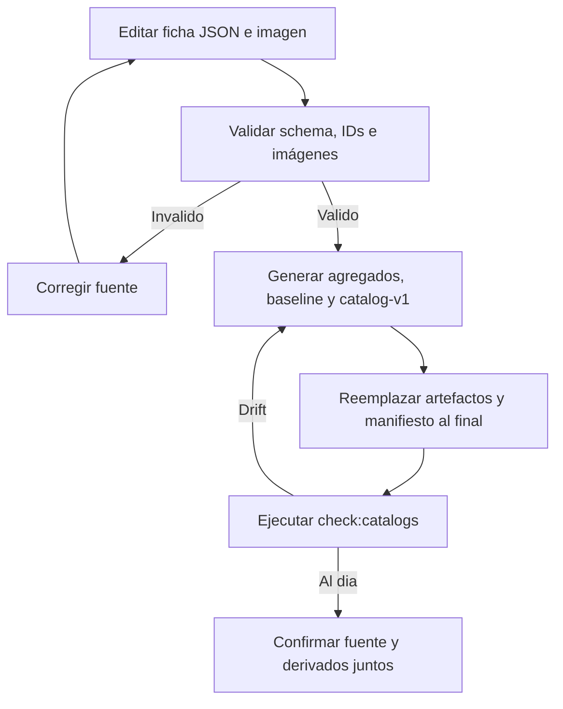
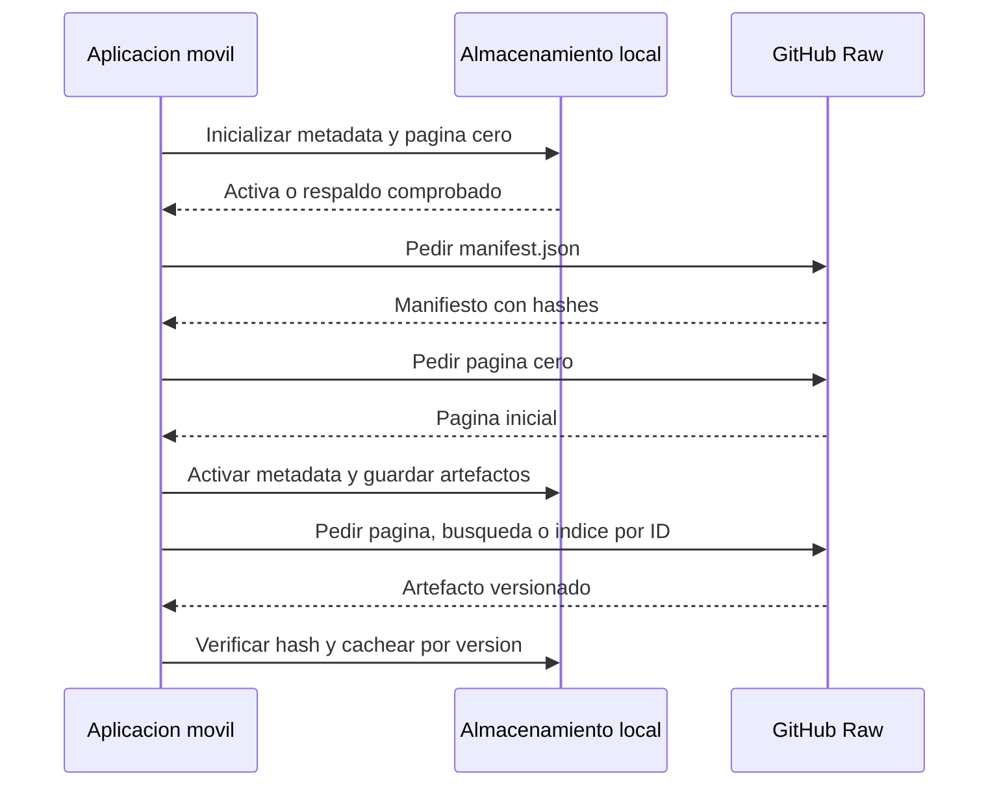

# Catálogos de contenido y publicación

Los directorios versionados `alimentos/`, `productos_comerciales/`, `recetas/` y `ejercicios/` contienen contenido curado público. Se editan fichas JSON individuales y los recursos que estas declaran; los agregados, índices y schemas de cliente son derivados reproducibles, no una segunda fuente de verdad. La app es local-first: los tres catálogos nutricionales se consumen como agregados completos, mientras que ejercicios usa un catálogo paginado y versionado en `ejercicios/catalog-v1/`.

El límite de propiedad es deliberado: `user_personal_foods` es una fuente local, privada y sin URL remota. Para su uso en comidas, véase [Dieta y estimación de alimentos](../mobile/diet-and-food-estimation.md).

## Fuente editable, derivados y contratos

| Dominio | Fichas y recursos editables | Derivados | Consumidor móvil |
| --- | --- | --- | --- |
| `alimentos/` | `<id>.json`, `images/<archivo>.webp` | `all.json`, `index.json`, `foodBaseline.generated.json` | agregado remoto y baseline integrado |
| `productos_comerciales/` | `<id>.json`, `images/<archivo>.webp` | `all.json` | agregado remoto |
| `recetas/` | `<id>.json`, imagen si la ficha la declara | `all.json` | agregado remoto |
| `ejercicios/` | `<id>.json`, `images/<id>-male.webp`, `images/<id>-female.webp` | `all.json`, `index.json`, `catalog-v1/` | manifiesto, páginas y shards bajo demanda |
| `apps/mobile/catalogs/generated/` | No se edita a mano | `catalogSchemas.generated.ts` | validación en el dispositivo |

El generador recorre las fichas por nombre de archivo y produce los agregados en ese orden estable. El índice de alimentos contiene `{id, name}`; el de ejercicios, IDs. Además copia `alimentos/all.json` como baseline integrado y transpone los schemas de alimento y ejercicio al TypeScript que usa el parser móvil. Por tanto, al cambiar contenido o schemas hay que regenerar y confirmar tanto fuente como derivados.

Las fichas nutricionales comparten un contrato estricto: ID, nombre, categoría, valores nutricionales y porción obligatorios, sin propiedades adicionales; los valores numéricos son finitos y no negativos. Una receta es, a estos efectos, una ficha nutricional calculada por 100 g, no una receta ejecutable. Las fichas de ejercicio requieren sus metadatos, instrucciones y ambas imágenes; sus rutas deben ser exactamente `images/<id>-male.webp` y `images/<id>-female.webp`, y el ID debe coincidir con el nombre del JSON.

Antes de generar, la inspección detecta JSON o schema inválido, discrepancia fichero/ID, IDs repetidos —también entre los tres dominios nutricionales—, rutas inseguras o con capitalización distinta, recursos ausentes o huérfanos, bytes que no decodifican como WebP y proporciones erróneas. Las imágenes nutricionales han de ser 1:1 y las de ejercicio 16:9; `images/` no es un área de borradores.

## Generar, comprobar y activar artefactos

Los puntos de entrada del repositorio son:

```bash
npm run sync:catalogs
npm run check:catalogs
npm run test:catalogs
npm run test:catalogs:e2e
```

`sync:catalogs` valida el inventario y escribe derivados. `check:catalogs` siempre inspecciona los cuatro dominios y compara todos los derivados esperados; falla ante un archivo faltante, con drift o, para `catalog-v1/`, que haya dejado de pertenecer al manifiesto. Para regenerar solo un dominio se puede usar `node scripts/catalogs/generate.mjs --write --domain alimentos`; esa restricción no existe en `--check` precisamente para impedir una validación parcial de publicación.

La escritura es transaccional a nivel de conjunto: primero prepara temporales, reemplaza el contenido y elimina obsoletos, y publica `catalog-v1/manifest.json` al final. Si cualquier renombre o limpieza falla, revierte los reemplazos y restaura los obsoletos eliminados. Así el manifiesto nunca debe apuntar a páginas aún no publicadas y una falla de publicación no deja un conjunto mezclado.


```mermaid
flowchart TD
    Edit["Editar ficha JSON e imagen"] --> Inspect["Validar schema, IDs e imágenes"]
    Inspect -->|"Invalido"| Fix["Corregir fuente"]
    Fix --> Edit
    Inspect -->|"Valido"| Derive["Generar agregados, baseline y catalog-v1"]
    Derive --> Atomic["Reemplazar artefactos y manifiesto al final"]
    Atomic --> Check["Ejecutar check:catalogs"]
    Check -->|"Drift"| Derive
    Check -->|"Al dia"| Commit["Confirmar fuente y derivados juntos"]
```

*Publicación local: la validación precede a toda escritura y el manifiesto de ejercicios es el último artefacto activado.*

Para ejercicios, `catalog-v1` fija una versión como hash SHA-256 del catálogo canónico. El manifiesto enumera páginas de 30 fichas con hash, shards de búsqueda por unigramas y bigramas normalizados, y shards de directorio por primer byte de ID; cada descriptor también aporta su hash. Esto permite descargar y verificar unidades pequeñas sin confiar en `all.json` para la exploración.

## Fuentes nutricionales, procedencia y caché offline

El registro define `gymnasia_foods`, `gymnasia_products` y `gymnasia_recipes`, todos publicados desde GitHub Raw hacia sus respectivos `all.json`. `gymnasia_foods` incluye el baseline generado para que una instalación nueva conserve una base de alimentos sin red; productos y recetas no. Cada fuente tiene claves de caché actual y heredada, procedencia y parser propio.

El parser rechaza un array cuyo `sourceId` o `source` declarado contradiga la fuente desde la que se lee. Tras validar la forma de las fichas, vuelve a añadir esa procedencia. `sourceId` también decide el directorio remoto de imágenes (`alimentos`, `productos_comerciales` o `recetas`); para alimentos personales el resultado es `null`.

Un snapshot nutricional actual es un sobre con versión, fuente, fecha, hash SHA-256 del JSON canónico, ETag opcional, procedencia y datos. Se revalida íntegramente al leer. Una caché actual inválida se rechaza y **no** cae silenciosamente a la clave heredada; solo si falta la actual se migra el array heredado como `stale`. Una copia con antigüedad máxima de siete días es `cached`; una más antigua o sin fecha es `stale`.

Una vez hidratado el almacenamiento, el runtime expone primero las copias locales y refresca las tres fuentes en paralelo. Un refresco solo produce `fresh` tras HTTP correcto, JSON parseable y schema válido; una falla remota conserva el snapshot previo. Si no se puede persistir una descarga válida, los datos siguen disponibles durante la sesión pero se señalan con `cache_write_failed`, por lo que no se promete continuidad offline. La disponibilidad agregada es `partial` cuando las fuentes no comparten el mismo estado.

## Ejercicios paginados: activación y degradación

El runtime de ejercicios usa `gymnasia_exercises` y la base `ejercicios/catalog-v1`. Al abrir, descarga `manifest.json`, lo valida y, si contiene entradas, verifica también la página cero antes de activar la versión. Las páginas, shards de búsqueda y directorio se guardan por `(catalogVersion, path)` y se comprueban contra el hash del descriptor antes de usarse. La metadata guarda una versión activa y, opcionalmente, su predecesora; en arranque una versión no es utilizable si su primera página cacheada no supera esa comprobación.


```mermaid
sequenceDiagram
    participant App as Aplicacion movil
    participant Store as Almacenamiento local
    participant Raw as GitHub Raw
    App->>Store: Inicializar metadata y pagina cero
    Store-->>App: Activa o respaldo comprobado
    App->>Raw: Pedir manifest.json
    Raw-->>App: Manifiesto con hashes
    App->>Raw: Pedir pagina cero
    Raw-->>App: Pagina inicial
    App->>Store: Activar metadata y guardar artefactos
    App->>Raw: Pedir pagina, busqueda o indice por ID
    Raw-->>App: Artefacto versionado
    App->>Store: Verificar hash y cachear por version
```

*La app activa una versión nueva solo después de comprobar el manifiesto y una página que este describe.*

Después de una activación, el runtime conserva artefactos de la versión activa y la anterior, y poda las demás si el almacenamiento permite enumerarlos. Si la nueva publicación es inválida o la red falla, conserva la versión válida ya activa; sin versión válida intenta migrar la caché V3 completa como páginas locales `stale`, sin índices remotos. Sin ninguna alternativa queda `unavailable`.

La exploración solicita una página por cursor. La búsqueda normaliza minúsculas, acentos y puntuación, usa el shard que corresponde al primer carácter y aplica después todos los filtros al candidato. Resolver referencias persistidas busca primero las páginas cacheadas y después usa el directorio de IDs para descargar la página necesaria. Si un shard no puede cargarse, la búsqueda devuelve solo coincidencias de páginas cacheadas y declara cobertura no global; las solicitudes duplicadas comparten descarga y el selector aborta la anterior al cerrarse o cambiar consulta para que resultados tardíos no reemplacen la revisión actual.

## Identidad persistida y evolución compatible

Las referencias persistidas no dependen del nombre visible: usan `{ schemaVersion, sourceId, itemId }` dentro de un enlace `linked`, que registra cómo se creó, o `unresolved`, que conserva el motivo. Al resolver los IDs enlazados, la app sincroniza nombre, grupo muscular e imagen en las plantillas. Un cambio de nombre publicado mantiene así el vínculo y actualiza su presentación.

Para contenido heredado sin enlace, la migración automática solo acepta una coincidencia exacta o un alias con candidato único. Una coincidencia ambigua no se adivina: sigue sin resolver y requiere selección explícita. Los runtimes de UI también capturan una generación de ejecución y bloquean escrituras cuando se invalida, evitando que solicitudes tardías reintroduzcan datos después de borrar el almacenamiento.

## Cambio seguro y pruebas enfocadas

Al añadir contenido, cree una ficha con ID estable, añada exactamente los recursos declarados, ejecute `npm run sync:catalogs` y confirme los derivados. Cambiar un ID, un schema, una ruta de imagen o el formato de `catalog-v1/` es un cambio de contrato: afecta a publicación, caché offline y referencias persistidas, por lo que requiere migración o compatibilidad explícita.

Las pruebas unitarias cubren determinismo, drift y eliminación de derivados obsoletos, validación de imágenes y rutas, reversión de escritura y límites de caché. La E2E intercepta GitHub Raw y verifica descarga y consumo de agregados, selector paginado con scroll y filtros, persistencia offline, migración heredada, disponibilidad parcial, rechazo de caché manipulada, el baseline de alimentos en arranque limpio y selección manual ante una coincidencia alimentaria ambigua. También prueba que renombrar un ejercicio publicado conserva el `itemId` de una plantilla.
