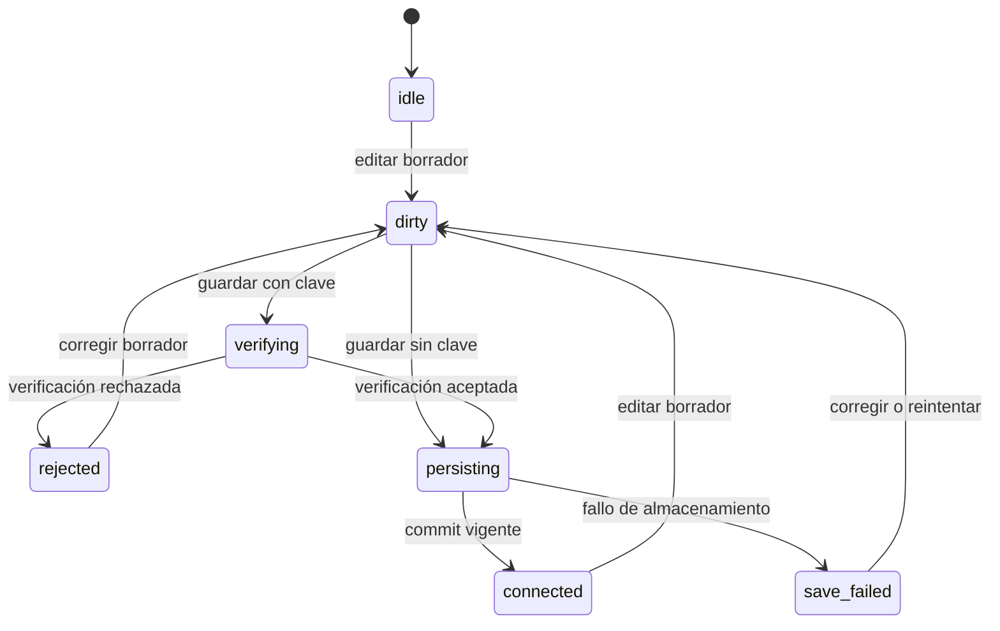

# Proveedores BYOK y proxy Anthropic de desarrollo

Gymnasia integra OpenAI, Anthropic y Google con un modelo **BYOK** (*bring your own key*): la credencial que introduce la persona se usa desde su propia instalación para hablar con el proveedor elegido. No existe un backend de producto que custodie estas claves. La única pieza intermedia, `apps/anthropic_proxy/cors-proxy.py`, es una herramienta opcional de desarrollo local para Anthropic; no forma parte de la arquitectura de producción.

Esta integración se cruza con el [bucle del agente](/openwiki/architecture/agent-loop.md), pero tiene un límite propio: aquí se decide qué configuración es vigente, cómo se verifica y guarda, y qué transporte entrega la petición al API externo. La conversación y las operaciones locales siguen perteneciendo a la arquitectura [local-first](/openwiki/architecture/local-first-state.md).

## Modos de ejecución: fake frente a BYOK

El modo forma parte de la variante pública de la app, no de una preferencia mutable durante la sesión:

- `APP_ENV=development` usa `DEV_PROVIDER_MODE=fake` por defecto. `DEV_PROVIDER_MODE=byok` es un opt-in explícito para probar proveedores reales.
- `staging` y `production` siempre resuelven a `byok`; definir `DEV_PROVIDER_MODE` fuera de desarrollo es un error de configuración.
- La resolución en runtime rechaza metadatos híbridos —por ejemplo, canal, namespace o modo que no correspondan al entorno— en vez de arrancar con una identidad ambigua.

En `fake`, la verificación devuelve éxito sin red, el catálogo ofrece modelos `fixture-*` y las superficies de chat producen respuestas locales deterministas. `providerCredential` puede aportar el marcador interno `development-fixture` si no hay clave configurada. Por tanto, **fake no valida credenciales ni compatibilidad real con un modelo**; sirve para desarrollo y pruebas reproducibles. En `byok`, una clave no vacía activa verificación real antes del commit.

## Configuración normalizada e invariantes

Cada `ProviderConfiguration` contiene `provider`, `is_active`, `api_key`, `model` y, cuando corresponde, `workspace_id` para Anthropic o `reasoning_effort` para OpenAI. La normalización garantiza que:

- siempre existen exactamente las entradas conocidas `openai`, `anthropic` y `google`;
- solo una queda activa; si ninguna lo estaba, se elige la primera, OpenAI;
- claves, modelos y Workspace ID se recortan;
- modelos predeterminados antiguos de OpenAI y Google migran al predeterminado actual;
- `reasoning_effort` se ajusta a lo soportado por la familia del modelo OpenAI;
- el Workspace ID solo se conserva para Anthropic y la UI rechaza, antes de verificar, un valor no vacío que no empiece por `wrkspc_`.

Guardar una configuración con clave activa además ese proveedor. Guardarla sin clave permite borrar su credencial sin forzar una verificación; la selección activa se normaliza de nuevo.

## Ciclo de edición, verificación y commit

La UI mantiene borradores separados de la configuración comprometida. Cada proveedor tiene `draftRevision`, `saveRevision`, `discoveryRevision` y una fase. Un token de guardado captura esas revisiones y también la revisión global de configuración. Editar el borrador, iniciar otro guardado o mutar globalmente la configuración invalida el trabajo anterior; un resultado tardío de verificación, descubrimiento o persistencia no puede mezclarse con el borrador nuevo.



*Fases observables del guardado; cualquier respuesta cuyo token ya no sea vigente se descarta sin cambiar de fase ni promover datos pendientes.*

La secuencia efectiva es:

1. Normalizar el borrador y emitir un `ProviderSaveToken`.
2. Si hay clave, marcar `verifying` y comprobar el proveedor. Una ausencia de clave es una advertencia en una verificación aislada, pero el flujo de borrado omite esta llamada.
3. Ante rechazo, conservar la configuración anterior y pasar a `rejected`.
4. Ante éxito —también el éxito con advertencia por modelo Anthropic inexistente— pasar a `persisting`.
5. El repositorio escribe un journal `pending`, vuelve a comprobar la vigencia y solo entonces escribe `committed`. Si el token caducó o falla el almacenamiento, restaura el commit anterior.
6. Solo después de un commit vigente se actualizan el estado visible, el proveedor activo y el borrador comprometido.

La verificación y el descubrimiento de modelos usan un timeout de 15 segundos. Los fallos se degradan a estados y mensajes de error; no deben bloquear indefinidamente ni convertir un resultado antiguo en la configuración actual. En particular, Anthropic considera un `404` directo una credencial válida con advertencia de “modelo no disponible”, mientras que un error de autenticación o red rechaza el guardado.

## Persistencia y frontera de credenciales

`ProviderConfigurationRepository` serializa todas las escrituras mediante una cola y guarda snapshots versionados en un journal con `committed` y `pending`:

- **Web:** el journal dedicado vive en `AsyncStorage` y contiene la configuración completa, incluida la clave. Es almacenamiento del navegador, no un secreto protegido por hardware; quien tenga acceso al perfil o a las herramientas del navegador puede verla.
- **iOS/Android con almacenamiento seguro disponible:** el journal canónico completo vive en `SecureStore`. El espejo de `AsyncStorage` conserva modelos, selección y revisiones, pero reemplaza cada `api_key` por una cadena vacía.
- **Móvil sin `SecureStore`:** no se crea un repositorio escribible. El intento de guardar falla de forma visible y mantiene la configuración anterior, en lugar de degradar silenciosamente las claves a almacenamiento inseguro.

Al hidratar, un `committed` válido gana siempre. Un `pending` superviviente nunca se promociona automáticamente: se repara al último commit. Si no existe journal, se intenta migrar una vez la configuración heredada a revisión `0`; un fallo de migración no impide arrancar con la última configuración legible. Los namespaces de almacenamiento distinguen development y staging de production.

Estas garantías protegen la persistencia local, no la exposición inherente al uso de un proveedor: en BYOK la clave sale del dispositivo hacia el API correspondiente y, en web, es observable por el propio navegador. No debe registrarse, incluirse en URLs, copiarse a errores, colocarse en variables versionadas ni almacenarse en el repositorio.

## Endpoints, cabeceras y transportes

Las credenciales se envían en cabeceras de proveedor, nunca en la URL. La excepción de forma es el proxy local: el navegador entrega `api_key` y el Workspace ID en el cuerpo local, y el proxy los transforma en cabeceras antes de contactar Anthropic.

| Proveedor y operación | Endpoint externo | Autenticación y transporte |
|---|---|---|
| OpenAI, verificar o descubrir | `GET https://api.openai.com/v1/models` | `Authorization: Bearer …`; petición acotada por timeout. |
| OpenAI, generar | `POST https://api.openai.com/v1/responses` | JSON; los flujos con herramientas consumen SSE. El cliente usa `fetch` en web y XHR incremental en nativo para streaming. |
| Anthropic, verificar o generar directamente | `POST https://api.anthropic.com/v1/messages` | `x-api-key`, `anthropic-version: 2023-06-01` y `anthropic-workspace-id` opcional. En web añade `anthropic-dangerous-direct-browser-access: true`; en nativo no. El streaming usa XHR incremental. |
| Anthropic, descubrir directamente | `GET https://api.anthropic.com/v1/models?limit=100` y cursores `after_id` | Mismas cabeceras Anthropic; web directo añade la cabecera de acceso del navegador. |
| Google, verificar | `GET https://generativelanguage.googleapis.com/v1beta/models/{model}` | `x-goog-api-key`; la clave no entra en la URL. |
| Google, descubrir | `GET https://generativelanguage.googleapis.com/v1beta/models` | `x-goog-api-key`; se filtran modelos incompatibles con `generateContent`. |
| Google, generar | `POST https://generativelanguage.googleapis.com/v1beta/interactions` | `x-goog-api-key` y SSE. Web usa `fetch`; nativo intenta XHR incremental y, solo si falla antes de mostrar deltas, reintenta con XHR bufferizado. |

El catálogo Anthropic se pagina tanto en el cliente directo como en el proxy. Se deduplican IDs y hay tres cortafuegos: máximo de 20 páginas, cursor ausente o repetido y página sin modelos nuevos. Si falla la primera página, falla la operación; si falla una posterior, se ofrece lo acumulado con advertencia de catálogo parcial. Así se degrada la selección sin presentar una lista incompleta como completa.

### Diferencia web/móvil para Anthropic

La ruta normal ya es directa en ambas plataformas. En web, `anthropic-dangerous-direct-browser-access` hace que Anthropic devuelva las cabeceras CORS necesarias; su nombre también recuerda que la clave queda disponible al contexto del navegador. En móvil no hay CORS y esa cabecera no se envía.

Solo si una compilación web recibe deliberadamente `EXPO_PUBLIC_API_BASE_URL`, la app construye las rutas locales `/chat/providers/anthropic/verify`, `/models` y `/messages` sobre esa base. El valor predeterminado es vacío, de modo que una app publicada no intenta llamar por accidente al `localhost` de quien la abre. OpenAI y Google no pasan por este proxy.

## Proxy CORS Anthropic: alcance estrictamente local

El proxy es un único archivo FastAPI y no tiene base de datos, cuentas, sesiones ni almacén persistente de claves. Recibe la credencial para una petición, la mueve a `x-api-key`, mueve el Workspace ID opcional a `anthropic-workspace-id`, fija `anthropic-version: 2023-06-01` y excluye ambos campos del cuerpo enviado upstream. No es un backend de producción ni una solución para compartir claves.

Su contrato local es:

| Ruta | Upstream | Límite |
|---|---|---|
| `GET /health` | ninguno | devuelve `{"ok": true}` |
| `POST /chat/providers/anthropic/verify` | `POST /v1/messages` con un token | 15 s |
| `POST /chat/providers/anthropic/models` | `GET /v1/models`, paginado | 15 s por lectura |
| `POST /chat/providers/anthropic/messages` | `POST /v1/messages`, normal o SSE | 120 s |

`/verify` y `/models` rechazan campos desconocidos; `/messages` acepta campos adicionales para seguir siendo compatible con extensiones de Messages API, aunque valida los campos conocidos. El cuerpo máximo es 4 MiB. Los errores tienen forma `{"error":{"type","message"}}`: entrada inválida produce `422`, exceso de tamaño `413`, timeout upstream `504`, imposibilidad de conexión o JSON inválido `502`, y los errores HTTP JSON de Anthropic conservan su estado. Los mensajes se truncan y redactan para no devolver claves; el detalle de validación omite el valor de entrada rechazado.

En SSE, una vez enviado `200` ya no se puede cambiar el estado. Si el upstream lanza durante la lectura o termina sin `message_stop`, el proxy inyecta un evento `error` con `upstream_stream_error` o `truncated_stream`. El parser del cliente lo convierte en excepción para evitar aceptar una respuesta parcial como correcta.

### Cerrojos contra despliegue

La defensa es ejecutable, no solo documental:

- por defecto escucha en `127.0.0.1:8000`;
- `ANTHROPIC_PROXY_HOST` no loopback hace que el proceso termine con código `2`;
- el middleware devuelve `403` a una IP cliente demostrablemente remota, aunque alguien arranque Uvicorn con otro host, contenedor o túnel;
- `npm run check:anthropic-proxy` falla ante infraestructura de despliegue junto al proxy, workflows que lo arranquen/publiquen o un host de proxy fijo en el inventario de red.

`ANTHROPIC_PROXY_UPSTREAM_BASE_URL` solo permite apuntar pruebas a un Anthropic falso local y `ANTHROPIC_PROXY_PORT` cambia el puerto. Ninguna de estas variables autoriza exposición remota. Si alguna vez se necesitara un puente compartido, sería otro componente con autorización explícita, autenticación, custodia de secretos y operación de backend; no una ampliación accidental de este proxy.

## Operación local

```bash
uv sync --project apps/anthropic_proxy --extra dev
apps/anthropic_proxy/.venv/bin/python apps/mobile/cors-proxy.py
curl -sS http://127.0.0.1:8000/health
```

Después, solo para la sesión web que se quiera probar, se puede apuntar `EXPO_PUBLIC_API_BASE_URL` a `http://127.0.0.1:8000`. No se deben añadir claves a este comando, a ficheros `.env` versionados ni a ejemplos de la wiki.

## Validación enfocada

Los cambios en esta frontera deberían cubrir, como mínimo:

```bash
npm run test:proxy
npm run check:anthropic-proxy
npm run test:anthropic-proxy
```

Además de la suite móvil descrita en la [estrategia de validación](/openwiki/testing/validation-strategy.md), las pruebas relevantes verifican:

- fake sin ninguna llamada de red y BYOK solo como opt-in de development;
- cabeceras correctas y ausencia de claves en URLs o cuerpos directos;
- descarte de tokens obsoletos tras editar, descubrir de nuevo o mutar la configuración;
- journal pendiente no promocionado, rollback ante fallo seguro y serialización de commits concurrentes;
- secreto presente en `SecureStore` pero ausente del espejo nativo en `AsyncStorage`, y la limitación explícita de web;
- validación, redacción, CORS de errores, paginación parcial y streams truncados del proxy;
- rechazo de clientes remotos y detección de cualquier intento de desplegar el proxy.
