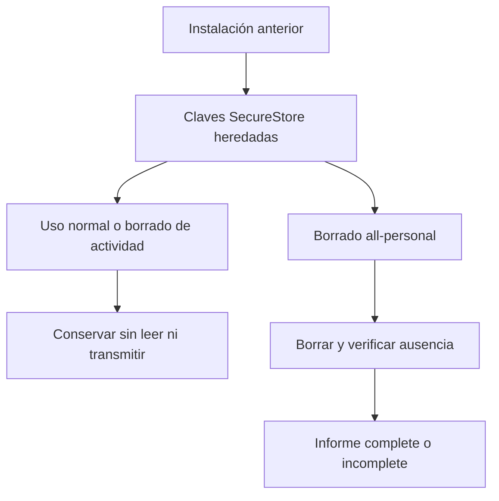
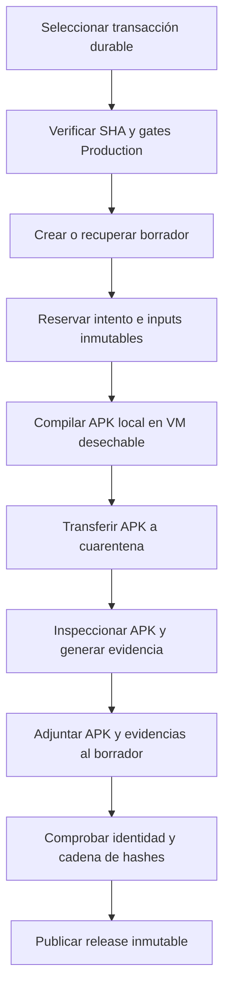

# VivaGym heredado y actualizaciones

Gymnasia es local-first y no requiere VivaGym ni un servidor de actualizaciones para arrancar, navegar o conservar los dominios locales. Ambas superficies están retiradas del *runtime*: VivaGym queda como dato histórico controlado y la distribución de APK es un proceso externo. Esta página separa esos límites de los componentes de release ejecutables. Véanse también [Arquitectura local-first](../architecture/overview.md), [Estado local y copias de seguridad](../mobile/local-state-and-backup.md), [Permisos Android](../operations/android-permissions.md) y [Compilación, publicación y pruebas](../operations/build-release-and-testing.md).

## VivaGym: retirada, no integración latente

No hay flujo activo de VivaGym: el contrato analiza las fuentes TypeScript/TSX de runtime —sin pruebas ni scripts— y prohíbe la UI, los símbolos de autenticación/QR, el host MyVitale, sus rutas HTTP y `react-native-qrcode-svg`; también exige que la dependencia no esté declarada. En consecuencia, los nombres o documentos heredados no autorizan una conexión ni el tratamiento de credenciales.

La lista cerrada `RETAINED_LEGACY_SECURE_STORE_KEYS` contiene exclusivamente `vivagym.email` y `vivagym.password`. Una instalación anterior pudo haberlas guardado en SecureStore. La aplicación actual no las lee ni escribe; el uso normal y el borrado de actividad las preservan. Solo el borrado explícito `all-personal` las incorpora como claves literales a `LOCAL_SECURE_DATA_MANIFEST`, borra cada destino y verifica su ausencia. Las tareas se ejecutan en paralelo, con timeout por destino, y el informe distingue fallos de borrado, verificación y timeout: un resultado `incomplete` no debe presentarse como eliminación confirmada.



*Figura 1. Las credenciales heredadas son pasivas hasta un borrado total verificable.*

Las variantes aíslan sus claves seguras: Production usa la clave base y Development/Staging añaden un namespace mediante `scopedSecureStoreKey`. Esto delimita almacenes de variantes, no migra credenciales entre identificadores de aplicación.

Los documentos de investigación sobre MyVitale o QR son contexto histórico, no especificación de producción. Reintroducir VivaGym exige una integración nueva y autorizada: revisión de términos y privacidad, límite de módulo, modelo de secretos y borrado, control de peticiones/QR, cancelación y errores, además de pruebas de comportamiento habilitado. Eliminar el contrato de ausencia no basta.

## Cliente sin actualizador propio

`App.tsx` no conserva servicio, estado, comprobación, interfaz ni navegación para comparar releases, descargar un APK o abrir GitHub Releases. El contrato prohíbe además `/releases/latest`. La clave antigua `gymnasia.mobile.lastUpdateCheck` solo permanece para eliminarse como dato heredado al arrancar y en el borrado total; ya no se vuelve a escribir ni dirige una solicitud.

Android bloquea `REQUEST_INSTALL_PACKAGES` en `app.json`; la política y sus pruebas exigen tanto la ausencia de la declaración como su presencia en `blockedPermissions`, y revisan contribuciones de dependencias. Por ello Gymnasia no puede solicitar instalar paquetes externos. Esta barrera no impide que una persona obtenga e instale manualmente un APK fuera del cliente. La inspección del APK final complementa el control de configuración frente al *manifest merger*.

La razón textual de ese permiso aún afirma que Production se actualiza exclusivamente mediante Google Play, pero el workflow ejecutable publica `gymnasia.apk` en GitHub Releases. Es una contradicción documental que debe corregirse al cambiar esta política; no cambia la frontera de runtime: el cliente no descubre, descarga ni instala el paquete.

## Pipeline externo de APK Production

El workflow `.github/workflows/build-apk.yml` se ejecuta manualmente o ante cambios elegibles de `apps/mobile/` en `main`, excluyendo scripts, documentación, recursos públicos y tests. Su grupo de concurrencia `android-production-release` no cancela ejecuciones ya iniciadas. El perfil `production-apk` hereda Production, fija `APP_ENV=production`, activa incremento automático y produce un APK; la política de release fija identidad, canal Production, modo BYOK, certificado esperado y límites de tamaño/MIME.

La unidad durable es `AndroidReleaseTransactionV1`, asociada a una versión, tag, SHA fuente, perfil `production-apk` y tipo `apk`. El selector procesa la transacción pendiente más antigua por orden semver y no permite saltarla: una fallida requiere `retry-failed` o `supersede-failed` con motivo; una transacción sustituida no se compila. El input `target_version` sirve para restringir la operación a esa transacción, pero no es una sustitución del control de orden. La transacción y sus evidencias se conservan como assets del borrador de GitHub para posibilitar reconciliación auditable.



*Figura 2. La release se publica solo después de enlazar una transacción durable, el APK local y su evidencia verificable.*

La compilación actual no adopta ni envía un build EAS remoto. Tras reservar el intento, `compile-android` usa un runner autoalojado desechable y `eas build --local --profile production-apk --freeze-credentials`. El script comprueba repositorio, rama, identidad no privilegiada del proceso, SHA y versión de la transacción, toolchain fijada e integridad de los inputs. El APK y sus metadatos se transfieren para verificación independiente; al finalizar el trabajo se eliminan checkout y material de compilación. El controlador impide duplicar un intento activo y marca un intento interrumpido como fallido para que requiera un reintento manual motivado.

En `verify-and-release`, el workflow descarga exactamente los dos ficheros esperados a cuarentena, liga los metadatos al intento mediante `finish-local` y ejecuta `verify:production-artifact`. El verificador inspecciona configuración incluida, manifiesto, certificado, recursos, paquete, versiones, permisos, tamaño, SHA-256 y MIME contra la política, evidencia de fuente y snapshot de política. Solo si pasa, la transacción alcanza `validated`, se adjuntan APK y evidencias, y el borrador debe conservar SHA fuente, MIME y tamaño admitidos y la cadena de digests antes de dejar de ser borrador. Ante fallo o cancelación se conserva el borrador y se persiste la transacción fallida; no se publica una release parcial.

El perfil `production` para AAB y `submit.production` en `eas.json` existen, pero no son la ruta que ejecuta este workflow de APK.

## Validación enfocada y cambios seguros

Los contratos separan la ausencia de integraciones del contexto heredado:

- `apps/mobile/agent/vivagymRemoval.contract.test.ts` bloquea la superficie VivaGym y QR, restringe las dos claves heredadas y exige que solo el borrado total las consuma.
- `apps/mobile/agent/updateRemoval.contract.test.ts` bloquea servicio, UI y consulta de releases, exige limpiar la marca antigua y confirma que la publicación de Production permanece separada del cliente.
- Las E2E Development y Production fallan si aparecen las superficies retiradas o se solicitan MyVitale o la URL histórica de GitHub Releases.
- `scripts/android-permissions/permissions.test.mjs` comprueba `REQUEST_INSTALL_PACKAGES`; el pipeline añade gates de fuente, inputs y artefacto sobre el APK real.

Para cambios en estos límites, ejecute como mínimo:

```bash
npm --workspace apps/mobile run test:deterministic
npm run test:agent:e2e
npm run test:update-removal:e2e
npm run check:android-permissions
npm run test:android-permissions
```

Para modificar release, preserve los invariantes de transacción, SHA fuente, inputs inmóviles, toolchain y evidencia; no convierta una E2E web o el escaneo de manifests en sustituto de inspeccionar el APK Production final.
