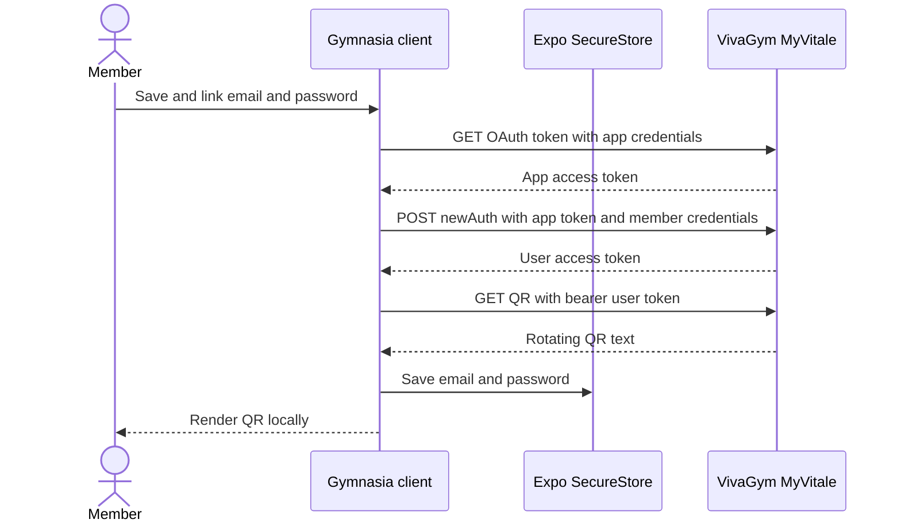

# Acceso a VivaGym y distribución manual de APK

En `apps/mobile/App.tsx`, dentro de Configuración, permanece la vinculación de cuentas y la obtención de códigos QR de VivaGym. Es una integración del lado del cliente y no dispone de un backend intermediario de Gymnasia. La publicación manual de APK pertenece al proceso de entrega y no tiene ningún consumidor dentro de la aplicación.

## Acceso mediante QR de VivaGym

### Nombres de configuración y responsabilidad

La implementación declara estas constantes de configuración en el código fuente:

| Nombre | Función |
|---|---|
| `VIVAGYM_BASE_URL` | Origen fijo del servicio MyVitale utilizado para las tres solicitudes |
| `VIVAGYM_CLIENT_ID` | Identificador de cliente OAuth a nivel de aplicación integrado en el cliente |
| `VIVAGYM_CLIENT_SECRET` | Credencial de cliente OAuth a nivel de aplicación integrada en el cliente |
| `VIVAGYM_APP_NAME` | Campo de formulario que identifica la aplicación de VivaGym |
| `VIVAGYM_USER_AGENT` | Valor de agente de usuario solicitado para las llamadas a MyVitale |
| `VIVAGYM_EMAIL_KEY` | Clave de SecureStore para el correo electrónico del socio |
| `VIVAGYM_PASSWORD_KEY` | Clave de SecureStore para la contraseña del socio |

Los valores de las credenciales y los tokens no se reproducen aquí deliberadamente. El identificador y la credencial del cliente se compilan en el código cliente distribuido y deben tratarse como credenciales de aplicación extraíbles, no como secretos que autentiquen a un socio individual. El correo electrónico y la contraseña son credenciales de usuario y requieren un límite de seguridad más sólido.

### Ciclo de vida de tres solicitudes

`getVivaGymQr` realiza una secuencia nueva cada vez; no almacena en caché el token de la aplicación, el token de usuario, el token de actualización ni el valor del QR fuera del estado del componente de React:

1. `fetchVivaGymAppToken` codifica para URL `grant_type`, `client_id` y `client_secret`, y después envía `GET /oauth/v2/token` con esos valores en la cadena de consulta. Requiere un `access_token` JSON.
2. `loginVivaGym` envía `POST /api/v2.0/exerp/newAuth` como `application/x-www-form-urlencoded`, con el token de la aplicación, el correo electrónico, la contraseña y el nombre de la aplicación. Requiere un `access_token` de usuario en formato JSON.
3. `fetchVivaGymQrValue` envía `GET /api/v2.0/exerp/qr` con el token de usuario como credencial Bearer. Elimina los espacios en blanco de los extremos de la respuesta de texto y un par opcional de comillas circundantes.
4. `react-native-qrcode-svg` representa localmente la cadena devuelta. Gymnasia no crea ni valida la firma de acceso.

*Las credenciales solo se conservan después de que la secuencia completa de tres solicitudes finaliza correctamente y devuelve un valor QR.*

El QR lo emite el servidor, es rotativo y sensible al tiempo. Al entrar en la pestaña de configuración de VivaGym se cargan una vez las credenciales guardadas y se solicita inmediatamente un nuevo QR si ambos campos existen. Al volver a esa pestaña se solicita otro QR. El control **Actualizar QR** ejecuta la misma secuencia completa de tres solicitudes; no hay actualización basada en temporizador ni una ruta de token de actualización.

### Ciclo de vida de las credenciales y la interfaz de usuario

`readVivaGymCredentials` y `writeVivaGymCredentials` están condicionadas por `isSecureStoreAvailable`:

- Cuando está disponible, la aplicación lee o escribe `VIVAGYM_EMAIL_KEY` y `VIVAGYM_PASSWORD_KEY` simultánea o secuencialmente, según corresponda. Se eliminan los espacios en blanco de los extremos del correo electrónico. Los valores vacíos provocan su eliminación.
- Cuando no está disponible, las lecturas devuelven campos vacíos y las escrituras no hacen nada de forma silenciosa.
- Al guardar, se valida que ambos campos no estén vacíos, se obtiene primero un QR y, a continuación, se llama al escritor de SecureStore y se establecen `vivagymHasSavedCreds` y el estado del QR.
- El campo de contraseña está oculto de forma predeterminada, pero dispone de un control para alternar su visibilidad. Ambas credenciales permanecen en la memoria del componente mientras la pantalla está montada.
- Si las credenciales se cargaron previamente y el usuario edita un campo, `vivagymHasSavedCreds` permanece como verdadero hasta que otro resultado lo modifique; por tanto, una actualización manual utiliza los valores editados que están en memoria.
- No existe un control explícito para desvincular o eliminar la cuenta en el panel de VivaGym. Los campos vacíos no se pueden guardar porque la validación rechaza los valores vacíos, aunque el escritor de bajo nivel admite la eliminación.
- La carga útil de la copia de seguridad normal excluye estos valores de SecureStore; la copia de seguridad de la implementación contiene datos locales del dominio, preferencias, alimentos personales y datos personales, no las credenciales de VivaGym.

La interfaz de usuario afirma que el almacenamiento en el dispositivo está cifrado. Más concretamente, la protección nativa se delega en Expo SecureStore y en el almacén de claves o llavero de la plataforma. La disponibilidad y las garantías varían según la plataforma. No debe suponerse que la compilación web proporcione un almacenamiento seguro de credenciales equivalente; cuando SecureStore no está disponible, esta integración no puede conservar las credenciales, y la ruta actual de guardado no informa de que la persistencia ha fallado.

### Límites de confianza, seguridad y plataforma

VivaGym/MyVitale recibe el correo electrónico y la contraseña del socio en cada obtención del QR, porque Gymnasia no conserva ni utiliza el token de actualización devuelto. Por tanto, TLS hacia el `VIVAGYM_BASE_URL` fijo es fundamental. No hay ningún servidor de Gymnasia en la ruta.

Límites y riesgos importantes:

- Las credenciales OAuth de la aplicación integradas en el código fuente o en los binarios distribuidos se pueden recuperar y no deben considerarse un límite de secreto de producción.
- La credencial de la aplicación se incluye en la consulta de la URL de OAuth. Las plataformas, los proxies o los registros del servidor pueden capturar las URL, por lo que el registro y la telemetría deben ocultar las URL completas.
- Las credenciales y los tokens de los socios nunca deben aparecer en trazas, análisis, capturas de pantalla, informes de fallos, registros de consola ni documentación.
- La investigación del código fuente no encontró fijación de certificados en la aplicación oficial inspeccionada; Gymnasia tampoco añade fijación. La confianza termina en la pila TLS del dispositivo o de la plataforma y en el certificado de MyVitale.
- JavaScript puede solicitar un `User-Agent`, pero las implementaciones de fetch del navegador y nativas pueden restringir o reescribir esa cabecera. La integración no dispone de un adaptador del lado del servidor para normalizarla.
- El uso en navegadores está sujeto a la política CORS de MyVitale y a las limitaciones de SecureStore en la web. El código no tiene ningún proxy CORS para VivaGym ni ninguna condición basada en `Platform.OS`, por lo que el entorno nativo es el destino fiable, aunque la interfaz de configuración no esté oculta en la web.
- El propio valor QR es un artefacto de admisión de corta duración similar a una credencial Bearer. Gymnasia lo representa, pero no aplica `FLAG_SECURE` de Android ni un control equivalente para bloquear capturas de pantalla en esta pantalla de React Native.
- El comportamiento del servidor, la estabilidad de los endpoints y la autorización siguen siendo responsabilidad de una API externa no documentada. El uso en producción debe revisarse conforme a las condiciones de VivaGym y a las expectativas de consentimiento.

### Comportamiento ante fallos y carencias

`fetchVivaGymAppToken` informa de forma genérica sobre los estados no satisfactorios y rechaza un cuerpo de respuesta satisfactoria que no contenga `access_token`. `loginVivaGym` trata de forma especial el estado `400`: intenta mostrar el `message` JSON de MyVitale y, si no es posible, utiliza un mensaje de credenciales no válidas. Los demás fallos de inicio de sesión se basan en el estado; un JSON incorrecto en una respuesta satisfactoria genera una excepción. La obtención del QR informa de su estado, pero acepta un cuerpo vacío en una respuesta satisfactoria y lo pasa al procesador del QR.

`refreshVivagymQr` borra el error anterior, establece el estado de carga y, en caso de fallo, borra el QR y muestra el mensaje de la excepción. `saveVivagymCreds` conserva las credenciales almacenadas existentes si la validación o la comunicación de red fallan antes de la escritura. No hay tiempo de espera de solicitud, cancelación, reintentos ni espera exponencial, clasificación del estado sin conexión, recuperación ante la caducidad del token dentro de una secuencia, validación del formato del correo electrónico, validación del esquema de respuesta, validación del prefijo o la longitud del QR ni protección frente a la concurrencia, aparte de deshabilitar el botón durante el estado correspondiente de la interfaz. La entrada en la pestaña y las acciones del usuario aún pueden iniciar secuencias distintas que se solapen.

La investigación en `docs/research/GYM-6-vivagym-qr.md` respalda la intención del protocolo e informa de una verificación real con una cuenta propiedad de un socio, pero no es una prueba de contrato automatizada y el comportamiento externo puede cambiar.

## Distribución manual de APK

La aplicación no contiene un actualizador propio en ninguna variante. No consulta
`/releases/latest`, no compara su versión con GitHub, no ofrece una pestaña ni un
aviso de actualización y no abre enlaces de descarga de APK. La variante de producción
recibe sus actualizaciones exclusivamente mediante Google Play.

La marca heredada `gymnasia.mobile.lastUpdateCheck` solo aparece en la lista de
limpieza de AsyncStorage para retirarla de instalaciones antiguas; no se lee ni se
vuelve a escribir. Android bloquea `REQUEST_INSTALL_PACKAGES` para impedir que la
configuración o una dependencia reintroduzcan capacidad de instalar paquetes externos.

El productor de artefactos sigue siendo `.github/workflows/build-apk.yml`. Puede
conservar APK internos como artefactos de Actions y publicar una release de producción,
pero ese canal es manual e independiente: ningún código de la app descubre, descarga o
instala esos archivos. Las releases usadas para distribuir la política del agente
también permanecen y no deben confundirse con un actualizador de la aplicación.

## Validación y cobertura de pruebas

Después de cambios en VivaGym, ejecute `npm --workspace apps/mobile exec tsc --noEmit`
y `npm test`, y pruebe la secuencia QR con una cuenta autorizada sin registrar
credenciales, tokens ni valores QR.

La ausencia del actualizador se protege en dos capas:

1. Un contrato determinista rechaza el endpoint, los símbolos y los textos de la
   antigua interfaz, y exige que la marca heredada solo se use para borrarla.
2. Un E2E exporta la variante de producción, recorre inicio y Ajustes, y falla si
   aparece la pestaña o si se solicita la última release de GitHub.

La configuración y el escáner de permisos bloquean `REQUEST_INSTALL_PACKAGES`. La
ausencia en el manifest fusionado debe volver a comprobarse sobre el AAB real durante
la validación final del artefacto de producción.

## Fuente de referencia

- `apps/mobile/App.tsx`: flujo e interfaz de VivaGym y limpieza de almacenamiento
  heredado.
- `docs/research/GYM-6-vivagym-qr.md`: investigación de interoperabilidad del QR;
  pruebas de apoyo, no autoridad de ejecución.
- `.github/workflows/build-apk.yml`: compilación EAS y publicación manual de APK.
- `apps/mobile/app.json` y `scripts/android-permissions/policy.json`: permisos
  Android permitidos y bloqueados.
