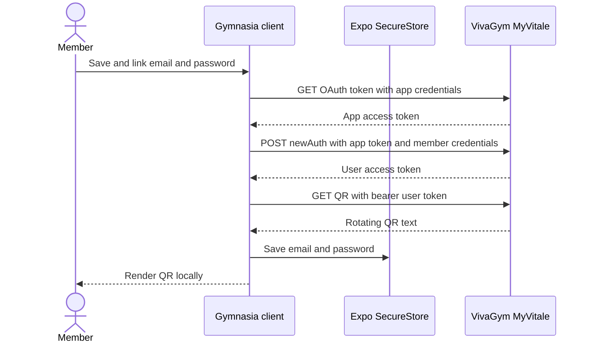
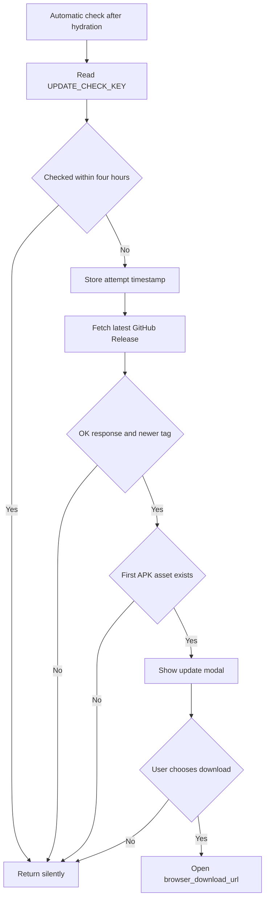

# Acceso a VivaGym y actualizaciones de la aplicación

En `apps/mobile/App.tsx`, dentro de Configuración, existen dos integraciones independientes: la vinculación de cuentas y la obtención de códigos QR de VivaGym, y el descubrimiento de actualizaciones desde las versiones de GitHub. Ambas son integraciones del lado del cliente. Gymnasia no dispone de un backend intermediario del producto para ninguno de los dos flujos.

## Acceso mediante QR de VivaGym

### Nombres de configuración y responsabilidad

La implementación declara estas constantes de configuración en el código fuente:

| Nombre | Función |
|---|---|
| `VIVAGYM_BASE_URL` | Origen fijo del servicio MyVitale utilizado para las tres solicitudes |
| `VIVAGYM_CLIENT_ID` | Identificador de cliente OAuth a nivel de aplicación integrado en el cliente |
| `VIVAGYM_CLIENT_SECRET` | Credencial de cliente OAuth a nivel de aplicación integrada en el cliente |
| `VIVAGYM_APP_NAME` | Campo de formulario que identifica la aplicación de VivaGym |
| `VIVAGYM_USER_AGENT` | Valor de agente de usuario solicitado para las llamadas a MyVitale |
| `VIVAGYM_EMAIL_KEY` | Clave de SecureStore para el correo electrónico del socio |
| `VIVAGYM_PASSWORD_KEY` | Clave de SecureStore para la contraseña del socio |

Los valores de las credenciales y los tokens no se reproducen aquí deliberadamente. El identificador y la credencial del cliente se compilan en el código cliente distribuido y deben tratarse como credenciales de aplicación extraíbles, no como secretos que autentiquen a un socio individual. El correo electrónico y la contraseña son credenciales de usuario y requieren un límite de seguridad más sólido.

### Ciclo de vida de tres solicitudes

`getVivaGymQr` realiza una secuencia nueva cada vez; no almacena en caché el token de la aplicación, el token de usuario, el token de actualización ni el valor del QR fuera del estado del componente de React:

1. `fetchVivaGymAppToken` codifica para URL `grant_type`, `client_id` y `client_secret`, y después envía `GET /oauth/v2/token` con esos valores en la cadena de consulta. Requiere un `access_token` JSON.
2. `loginVivaGym` envía `POST /api/v2.0/exerp/newAuth` como `application/x-www-form-urlencoded`, con el token de la aplicación, el correo electrónico, la contraseña y el nombre de la aplicación. Requiere un `access_token` de usuario en formato JSON.
3. `fetchVivaGymQrValue` envía `GET /api/v2.0/exerp/qr` con el token de usuario como credencial Bearer. Elimina los espacios en blanco de los extremos de la respuesta de texto y un par opcional de comillas circundantes.
4. `react-native-qrcode-svg` representa localmente la cadena devuelta. Gymnasia no crea ni valida la firma de acceso.

*Las credenciales solo se conservan después de que la secuencia completa de tres solicitudes finaliza correctamente y devuelve un valor QR.*

El QR lo emite el servidor, es rotativo y sensible al tiempo. Al entrar en la pestaña de configuración de VivaGym se cargan una vez las credenciales guardadas y se solicita inmediatamente un nuevo QR si ambos campos existen. Al volver a esa pestaña se solicita otro QR. El control **Actualizar QR** ejecuta la misma secuencia completa de tres solicitudes; no hay actualización basada en temporizador ni una ruta de token de actualización.

### Ciclo de vida de las credenciales y la interfaz de usuario

`readVivaGymCredentials` y `writeVivaGymCredentials` están condicionadas por `isSecureStoreAvailable`:

- Cuando está disponible, la aplicación lee o escribe `VIVAGYM_EMAIL_KEY` y `VIVAGYM_PASSWORD_KEY` simultánea o secuencialmente, según corresponda. Se eliminan los espacios en blanco de los extremos del correo electrónico. Los valores vacíos provocan su eliminación.
- Cuando no está disponible, las lecturas devuelven campos vacíos y las escrituras no hacen nada de forma silenciosa.
- Al guardar, se valida que ambos campos no estén vacíos, se obtiene primero un QR y, a continuación, se llama al escritor de SecureStore y se establecen `vivagymHasSavedCreds` y el estado del QR.
- El campo de contraseña está oculto de forma predeterminada, pero dispone de un control para alternar su visibilidad. Ambas credenciales permanecen en la memoria del componente mientras la pantalla está montada.
- Si las credenciales se cargaron previamente y el usuario edita un campo, `vivagymHasSavedCreds` permanece como verdadero hasta que otro resultado lo modifique; por tanto, una actualización manual utiliza los valores editados que están en memoria.
- No existe un control explícito para desvincular o eliminar la cuenta en el panel de VivaGym. Los campos vacíos no se pueden guardar porque la validación rechaza los valores vacíos, aunque el escritor de bajo nivel admite la eliminación.
- La carga útil de la copia de seguridad normal excluye estos valores de SecureStore; la copia de seguridad de la implementación contiene datos locales del dominio, preferencias, alimentos personales y datos personales, no las credenciales de VivaGym.

La interfaz de usuario afirma que el almacenamiento en el dispositivo está cifrado. Más concretamente, la protección nativa se delega en Expo SecureStore y en el almacén de claves o llavero de la plataforma. La disponibilidad y las garantías varían según la plataforma. No debe suponerse que la compilación web proporcione un almacenamiento seguro de credenciales equivalente; cuando SecureStore no está disponible, esta integración no puede conservar las credenciales, y la ruta actual de guardado no informa de que la persistencia ha fallado.

### Límites de confianza, seguridad y plataforma

VivaGym/MyVitale recibe el correo electrónico y la contraseña del socio en cada obtención del QR, porque Gymnasia no conserva ni utiliza el token de actualización devuelto. Por tanto, TLS hacia el `VIVAGYM_BASE_URL` fijo es fundamental. No hay ningún servidor de Gymnasia en la ruta.

Límites y riesgos importantes:

- Las credenciales OAuth de la aplicación integradas en el código fuente o en los binarios distribuidos se pueden recuperar y no deben considerarse un límite de secreto de producción.
- La credencial de la aplicación se incluye en la consulta de la URL de OAuth. Las plataformas, los proxies o los registros del servidor pueden capturar las URL, por lo que el registro y la telemetría deben ocultar las URL completas.
- Las credenciales y los tokens de los socios nunca deben aparecer en trazas, análisis, capturas de pantalla, informes de fallos, registros de consola ni documentación.
- La investigación del código fuente no encontró fijación de certificados en la aplicación oficial inspeccionada; Gymnasia tampoco añade fijación. La confianza termina en la pila TLS del dispositivo o de la plataforma y en el certificado de MyVitale.
- JavaScript puede solicitar un `User-Agent`, pero las implementaciones de fetch del navegador y nativas pueden restringir o reescribir esa cabecera. La integración no dispone de un adaptador del lado del servidor para normalizarla.
- El uso en navegadores está sujeto a la política CORS de MyVitale y a las limitaciones de SecureStore en la web. El código no tiene ningún proxy CORS para VivaGym ni ninguna condición basada en `Platform.OS`, por lo que el entorno nativo es el destino fiable, aunque la interfaz de configuración no esté oculta en la web.
- El propio valor QR es un artefacto de admisión de corta duración similar a una credencial Bearer. Gymnasia lo representa, pero no aplica `FLAG_SECURE` de Android ni un control equivalente para bloquear capturas de pantalla en esta pantalla de React Native.
- El comportamiento del servidor, la estabilidad de los endpoints y la autorización siguen siendo responsabilidad de una API externa no documentada. El uso en producción debe revisarse conforme a las condiciones de VivaGym y a las expectativas de consentimiento.

### Comportamiento ante fallos y carencias

`fetchVivaGymAppToken` informa de forma genérica sobre los estados no satisfactorios y rechaza un cuerpo de respuesta satisfactoria que no contenga `access_token`. `loginVivaGym` trata de forma especial el estado `400`: intenta mostrar el `message` JSON de MyVitale y, si no es posible, utiliza un mensaje de credenciales no válidas. Los demás fallos de inicio de sesión se basan en el estado; un JSON incorrecto en una respuesta satisfactoria genera una excepción. La obtención del QR informa de su estado, pero acepta un cuerpo vacío en una respuesta satisfactoria y lo pasa al procesador del QR.

`refreshVivagymQr` borra el error anterior, establece el estado de carga y, en caso de fallo, borra el QR y muestra el mensaje de la excepción. `saveVivagymCreds` conserva las credenciales almacenadas existentes si la validación o la comunicación de red fallan antes de la escritura. No hay tiempo de espera de solicitud, cancelación, reintentos ni espera exponencial, clasificación del estado sin conexión, recuperación ante la caducidad del token dentro de una secuencia, validación del formato del correo electrónico, validación del esquema de respuesta, validación del prefijo o la longitud del QR ni protección frente a la concurrencia, aparte de deshabilitar el botón durante el estado correspondiente de la interfaz. La entrada en la pestaña y las acciones del usuario aún pueden iniciar secuencias distintas que se solapen.

La investigación en `docs/research/GYM-6-vivagym-qr.md` respalda la intención del protocolo e informa de una verificación real con una cuenta propiedad de un socio, pero no es una prueba de contrato automatizada y el comportamiento externo puede cambiar.

## Ciclo de vida de las actualizaciones mediante versiones de GitHub

### Nombres de configuración y productor de versiones

| Nombre | Función |
|---|---|
| `GITHUB_RELEASES_API` | Endpoint REST fijo de GitHub para la versión más reciente del repositorio |
| `UPDATE_CHECK_INTERVAL_MS` | Limitación de cuatro horas para las comprobaciones automáticas |
| `UPDATE_CHECK_KEY` | Marca de tiempo de AsyncStorage del último intento automático o de la última obtención manual satisfactoria de una versión |
| `Constants.expoConfig.version` | Origen de la versión semántica instalada o actual, con `0.0.0` como valor alternativo |

El productor posterior es `.github/workflows/build-apk.yml`. Ante un envío móvil que cumpla los requisitos o una ejecución manual, calcula un incremento de versión basado en confirmaciones convencionales, actualiza `apps/mobile/app.json` en la copia de trabajo del flujo, compila Android mediante EAS, descarga el artefacto como `gymnasia.apk`, crea una versión de GitHub que no es preliminar y cuya etiqueta es `v` seguida de la versión, y después confirma el incremento de versión. El cliente de actualizaciones depende de esa convención de etiquetas y artefactos, pero no verifica cómo se compiló una versión.

### Comprobación automática

Después de que finaliza la hidratación local, un efecto de montaje llama a `checkForUpdate`:

1. Lee `UPDATE_CHECK_KEY` de AsyncStorage.
2. Si el tiempo transcurrido es inferior a `UPDATE_CHECK_INTERVAL_MS`, finaliza sin realizar una solicitud.
3. Escribe la marca de tiempo actual **antes** de ponerse en contacto con GitHub.
4. Obtiene `GITHUB_RELEASES_API` con la cabecera `Accept` del tipo de contenido JSON de GitHub.
5. Elimina una `v` inicial de `tag_name` y compara los tres primeros componentes numéricos separados por puntos con la versión instalada.
6. Si la versión remota es más reciente, selecciona el primer artefacto de la versión cuyo nombre termine en `.apk`.
7. Almacena su `browser_download_url` en el estado del componente y muestra una ventana modal. **Descargar** llama a `Linking.openURL`; **Ahora no** solo cierra la ventana modal.

Todos los errores automáticos y estados que no requieren ninguna acción devuelven `null` de forma silenciosa. Como la marca de tiempo del intento se escribe antes de la obtención, un fallo de red o de GitHub impide otro intento automático durante cuatro horas. Cerrar la ventana modal no crea un registro independiente de versión ignorada; una comprobación posterior que cumpla los requisitos puede volver a mostrarla.

### Comprobación manual

Configuración → Actualizaciones omite la condición de lectura de cuatro horas. `runManualUpdateCheck` obtiene el mismo endpoint de la versión más reciente y distingue entre estados de error visible para el usuario, actualización disponible y aplicación al día. Solo actualiza `UPDATE_CHECK_KEY` después de una respuesta OK con una etiqueta no vacía. Si una versión más reciente contiene un APK, **Actualizar aplicación** abre una ventana modal de confirmación; la confirmación llama a `Linking.openURL` para el artefacto.

Una etiqueta más reciente sin un archivo `.apk` se notifica como si la aplicación estuviera al día, no como una versión incorrecta. Una versión instalada igual o más reciente también se notifica como actualizada. Los fallos de las solicitudes manuales conservan un mensaje de error en el panel de configuración.

*La ruta automática descubre un APK y delega la descarga en el sistema operativo; no instala ni verifica el paquete.*

### Validación de versiones y artefactos

`compareVersions(a, b)` convierte cada componente separado por puntos mediante `Number`, examina solo los índices del 0 al 2 y devuelve un número positivo cuando `b` es más reciente que `a`. Es adecuado para valores `major.minor.patch` simples, pero no es un analizador de versiones semánticas:

- los metadatos de versiones preliminares o de compilación no se gestionan de forma intencionada;
- los componentes no numéricos producen `NaN`, lo que puede hacer que las comparaciones parezcan iguales de forma incorrecta;
- se ignoran los componentes posteriores al tercero;
- las versiones locales o remotas incorrectas no se rechazan.

La selección de artefactos distingue entre mayúsculas y minúsculas y elige el primer nombre que termina en `.apk`. El cliente confía en los metadatos de la versión más reciente de GitHub y en `browser_download_url`; no comprueba la suma de verificación, la firma, el nombre del paquete, el certificado, la procedencia, el tamaño, el tipo MIME, la arquitectura ni el perfil de compilación. No se espera la finalización de `Linking.openURL` ni se muestran sus errores. La instalación real, el permiso para orígenes desconocidos, las reglas de reversión a versiones anteriores y la aceptación de la firma del paquete se gestionan fuera de la aplicación, mediante Android, el navegador o la plataforma. En iOS o en la web, abrir un APK no es un mecanismo de actualización de aplicaciones, pero la comprobación y la interfaz no están condicionadas según la plataforma.

No hay ninguna llamada de actualización OTA de Expo. Esta integración solo descubre versiones APK completas.

### Fallos de actualización y riesgos en los límites de las versiones

- La limitación de solicitudes de GitHub, el estado sin conexión, un JSON incorrecto, la ausencia de etiquetas o artefactos y los errores de almacenamiento son silenciosos en la ruta automática.
- Ninguna de las rutas establece un tiempo de espera explícito para fetch ni admite cancelación, reintentos o espera exponencial.
- El endpoint de la versión “más reciente” de GitHub excluye los borradores y normalmente resuelve la versión más reciente que no sea borrador ni preliminar, lo que coincide con la configuración actual de versiones del flujo de trabajo; cambiar la política de versiones puede alterar el descubrimiento.
- El flujo de compilación utiliza `eas.json` con `appVersionSource: remote`, mientras que también edita `app.json` y posteriormente confirma el cambio. Se debe comprobar la correspondencia entre la versión instalada en `Constants.expoConfig.version`, la etiqueta de la versión y el artefacto producido por EAS, en lugar de dar por hecho que coinciden.
- Las compilaciones manuales del perfil `production` no están configuradas explícitamente como APK en `eas.json`; no obstante, el flujo de trabajo siempre publica el archivo descargado como `gymnasia.apk`. Valide el tipo real del artefacto para cada perfil expuesto por el flujo de trabajo.
- El flujo de trabajo publica la versión antes de confirmar y enviar el incremento de versión del código fuente. Un fallo tardío del envío puede dejar una versión válida aunque el archivo `app.json` del repositorio no haya avanzado.

## Validación y cobertura de pruebas

No se encontraron pruebas automatizadas específicas para las funciones o la interfaz de VivaGym, las comprobaciones de actualizaciones, el comparador de versiones, el comportamiento de SecureStore, el análisis de respuestas de GitHub ni las ventanas modales de descarga. Las pruebas deterministas existentes de agentes y los flujos de chat y entrenamiento de Playwright no cubren estas integraciones de configuración. La validación real de VivaGym utilizaría credenciales externas reales y debe seguir siendo opcional y segura para los secretos.

Validación recomendada después de cambios pertinentes:

1. Ejecute `npm --workspace apps/mobile exec tsc --noEmit` y `npm test`.
2. VivaGym: pruebe campos ausentes, SecureStore no disponible, credenciales incorrectas, cada fase externa con un estado distinto de 2xx, cuerpos de respuesta satisfactoria incorrectos o vacíos, el orden de guardado después de la validación, la reentrada en la pestaña, la actualización manual, las solicitudes solapadas y la representación del QR en un dispositivo nativo compatible. Utilice una cuenta de prueba con consentimiento y oculte las URL, cuerpos y cabeceras de las solicitudes, así como los tokens y los valores QR.
3. Actualizaciones: realice pruebas unitarias de `compareVersions` con entradas iguales, más recientes, más antiguas e incorrectas; simule respuestas del endpoint de la versión más reciente con errores, etiquetas ausentes, APK ausentes, varios artefactos y versiones más recientes o iguales; pruebe la semántica de la marca de tiempo de limitación.
4. Compile una versión candidata y compruebe que la versión instalada, la etiqueta de GitHub, el título de la versión, el nombre de archivo del APK, el ID del paquete, el certificado de firma y el perfil EAS seleccionado coincidan. Realice la descarga mediante la aplicación en Android y verifique que la plataforma la acepte como actualización.
5. Confirme que el comportamiento en iOS o la web se oculte, se deshabilite o se redirija intencionadamente antes de presentar esta funcionalidad exclusiva de APK en esas plataformas.

Las carencias de alta prioridad son pruebas puras para el análisis de versiones y publicaciones, pruebas HTTP con dependencias inyectadas para la cadena de tres solicitudes de VivaGym, errores explícitos cuando SecureStore no está disponible, esquemas de respuesta, cancelación y tiempos de espera de solicitudes, condicionamiento de las actualizaciones exclusivamente para Android y verificación de la integridad y la procedencia de los artefactos.

## Fuente de referencia

- `apps/mobile/App.tsx`: constantes, funciones auxiliares, estados, efectos e interfaz de VivaGym, así como constantes, comprobaciones y ventanas modales de actualización.
- `docs/research/GYM-6-vivagym-qr.md`: investigación de interoperabilidad y justificación del protocolo; pruebas de apoyo, no autoridad de ejecución.
- `.github/workflows/build-apk.yml`: ciclo de vida de la etiqueta de la versión, la versión, la compilación EAS y la publicación del APK.
- `apps/mobile/app.json` y `apps/mobile/eas.json`: identidad de versión y plataforma de la aplicación, y configuración de versiones y perfiles de compilación de EAS.
- `apps/mobile/package.json`: dependencias de SecureStore y del procesador de QR.