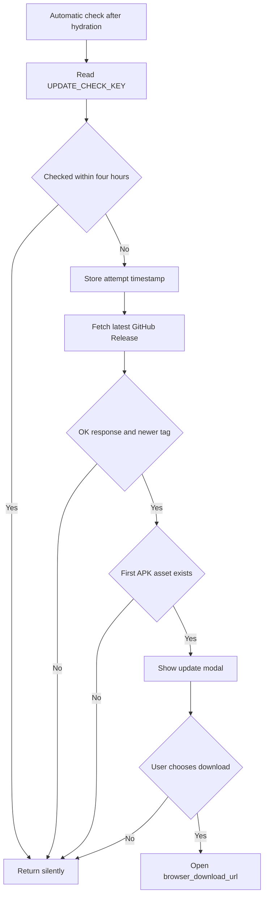

# Integración retirada de VivaGym y actualizaciones de la aplicación

La vinculación de cuentas y el QR de acceso de VivaGym están retirados de todas las variantes por GYM-192 (ticket para retirar temporalmente VivaGym de la versión pública). `apps/mobile/App.tsx` ya no contiene pestaña, autenticación, endpoints, credenciales de aplicación, solicitudes ni representación de QR, y `react-native-qrcode-svg` no forma parte de las dependencias.

La única huella de ejecución son los nombres `vivagym.email` y `vivagym.password` en `apps/mobile/legacySecureStorage.ts`. Una versión anterior pudo guardar valores bajo esas claves en Expo SecureStore. La versión retirada no los lee, escribe ni transmite durante el arranque o el uso normal; una actualización dentro del mismo package name los conserva y «Restablecer datos locales» los elimina. No existe transferencia entre las aplicaciones de development, staging y production.

El protocolo investigado y los riesgos de la implementación anterior se conservan en `docs/research/GYM-6-vivagym-qr.md` como contexto histórico, no como autoridad de ejecución.

## Reintroducción de VivaGym

No basta con recuperar el código anterior. Antes de volver a publicarla:

1. Confirmar por escrito el encaje autorizado y revisar los términos vigentes de VivaGym/MyVitale.
2. Reutilizar exactamente `vivagym.email` y `vivagym.password` mediante `scopedSecureStoreKey`, sin transferirlas entre package names ni incluirlas en copias de seguridad.
3. Resolver GYM-154 (ticket para endurecer solicitudes, validación y persistencia de VivaGym) y GYM-155 (ticket para proteger secretos y códigos QR de VivaGym) antes de habilitar el flujo para usuarios.
4. Restaurar la UI, el transporte y la representación de QR como un módulo aislado; añadir validación, timeout, cancelación, control de concurrencia, redacción y protección de capturas desde el principio.
5. Volver a declarar el endpoint y el tratamiento de datos en el inventario, la política, las declaraciones y la ficha de la tienda.
6. Pasar el contrato determinista, E2E nativo y la inspección del AAB, verificando que ningún valor personal o de prueba se distribuye.

## Ciclo de vida de las actualizaciones mediante versiones de GitHub

### Nombres de configuración y productor de versiones

| Nombre | Función |
|---|---|
| `GITHUB_RELEASES_API` | Endpoint REST fijo de GitHub para la versión más reciente del repositorio |
| `UPDATE_CHECK_INTERVAL_MS` | Limitación de cuatro horas para las comprobaciones automáticas |
| `UPDATE_CHECK_KEY` | Marca de tiempo de AsyncStorage del último intento automático o de la última obtención manual satisfactoria de una versión |
| `Constants.expoConfig.version` | Origen de la versión semántica instalada o actual, con `0.0.0` como valor alternativo |

El productor posterior es `.github/workflows/build-apk.yml`. Ante un envío móvil que cumpla los requisitos o una ejecución manual, calcula un incremento de versión basado en confirmaciones convencionales, actualiza `apps/mobile/app.json` en la copia de trabajo del flujo, compila Android mediante EAS, descarga el artefacto como `gymnasia.apk`, crea una versión de GitHub que no es preliminar y cuya etiqueta es `v` seguida de la versión, y después confirma el incremento de versión. El cliente de actualizaciones depende de esa convención de etiquetas y artefactos, pero no verifica cómo se compiló una versión.

### Comprobación automática

Después de que finaliza la hidratación local, un efecto de montaje llama a `checkForUpdate`:

1. Lee `UPDATE_CHECK_KEY` de AsyncStorage.
2. Si el tiempo transcurrido es inferior a `UPDATE_CHECK_INTERVAL_MS`, finaliza sin realizar una solicitud.
3. Escribe la marca de tiempo actual **antes** de ponerse en contacto con GitHub.
4. Obtiene `GITHUB_RELEASES_API` con la cabecera `Accept` del tipo de contenido JSON de GitHub.
5. Elimina una `v` inicial de `tag_name` y compara los tres primeros componentes numéricos separados por puntos con la versión instalada.
6. Si la versión remota es más reciente, selecciona el primer artefacto de la versión cuyo nombre termine en `.apk`.
7. Almacena su `browser_download_url` en el estado del componente y muestra una ventana modal. **Descargar** llama a `Linking.openURL`; **Ahora no** solo cierra la ventana modal.

Todos los errores automáticos y estados que no requieren ninguna acción devuelven `null` de forma silenciosa. Como la marca de tiempo del intento se escribe antes de la obtención, un fallo de red o de GitHub impide otro intento automático durante cuatro horas. Cerrar la ventana modal no crea un registro independiente de versión ignorada; una comprobación posterior que cumpla los requisitos puede volver a mostrarla.

### Comprobación manual

Configuración → Actualizaciones omite la condición de lectura de cuatro horas. `runManualUpdateCheck` obtiene el mismo endpoint de la versión más reciente y distingue entre estados de error visible para el usuario, actualización disponible y aplicación al día. Solo actualiza `UPDATE_CHECK_KEY` después de una respuesta OK con una etiqueta no vacía. Si una versión más reciente contiene un APK, **Actualizar aplicación** abre una ventana modal de confirmación; la confirmación llama a `Linking.openURL` para el artefacto.

Una etiqueta más reciente sin un archivo `.apk` se notifica como si la aplicación estuviera al día, no como una versión incorrecta. Una versión instalada igual o más reciente también se notifica como actualizada. Los fallos de las solicitudes manuales conservan un mensaje de error en el panel de configuración.

*La ruta automática descubre un APK y delega la descarga en el sistema operativo; no instala ni verifica el paquete.*

### Validación de versiones y artefactos

`compareVersions(a, b)` convierte cada componente separado por puntos mediante `Number`, examina solo los índices del 0 al 2 y devuelve un número positivo cuando `b` es más reciente que `a`. Es adecuado para valores `major.minor.patch` simples, pero no es un analizador de versiones semánticas:

- los metadatos de versiones preliminares o de compilación no se gestionan de forma intencionada;
- los componentes no numéricos producen `NaN`, lo que puede hacer que las comparaciones parezcan iguales de forma incorrecta;
- se ignoran los componentes posteriores al tercero;
- las versiones locales o remotas incorrectas no se rechazan.

La selección de artefactos distingue entre mayúsculas y minúsculas y elige el primer nombre que termina en `.apk`. El cliente confía en los metadatos de la versión más reciente de GitHub y en `browser_download_url`; no comprueba la suma de verificación, la firma, el nombre del paquete, el certificado, la procedencia, el tamaño, el tipo MIME, la arquitectura ni el perfil de compilación. No se espera la finalización de `Linking.openURL` ni se muestran sus errores. La instalación real, el permiso para orígenes desconocidos, las reglas de reversión a versiones anteriores y la aceptación de la firma del paquete se gestionan fuera de la aplicación, mediante Android, el navegador o la plataforma. En iOS o en la web, abrir un APK no es un mecanismo de actualización de aplicaciones, pero la comprobación y la interfaz no están condicionadas según la plataforma.

No hay ninguna llamada de actualización OTA de Expo. Esta integración solo descubre versiones APK completas.

### Fallos de actualización y riesgos en los límites de las versiones

- La limitación de solicitudes de GitHub, el estado sin conexión, un JSON incorrecto, la ausencia de etiquetas o artefactos y los errores de almacenamiento son silenciosos en la ruta automática.
- Ninguna de las rutas establece un tiempo de espera explícito para fetch ni admite cancelación, reintentos o espera exponencial.
- El endpoint de la versión “más reciente” de GitHub excluye los borradores y normalmente resuelve la versión más reciente que no sea borrador ni preliminar, lo que coincide con la configuración actual de versiones del flujo de trabajo; cambiar la política de versiones puede alterar el descubrimiento.
- El flujo de compilación utiliza `eas.json` con `appVersionSource: remote`, mientras que también edita `app.json` y posteriormente confirma el cambio. Se debe comprobar la correspondencia entre la versión instalada en `Constants.expoConfig.version`, la etiqueta de la versión y el artefacto producido por EAS, en lugar de dar por hecho que coinciden.
- Las compilaciones manuales del perfil `production` no están configuradas explícitamente como APK en `eas.json`; no obstante, el flujo de trabajo siempre publica el archivo descargado como `gymnasia.apk`. Valide el tipo real del artefacto para cada perfil expuesto por el flujo de trabajo.
- El flujo de trabajo publica la versión antes de confirmar y enviar el incremento de versión del código fuente. Un fallo tardío del envío puede dejar una versión válida aunque el archivo `app.json` del repositorio no haya avanzado.

## Validación y cobertura de pruebas

La retirada de VivaGym tiene un contrato determinista que prohíbe su superficie, protocolo y dependencia, conserva una lista cerrada de dos claves heredadas y un E2E que rechaza cualquier reaparición de la pestaña o tráfico hacia MyVitale. Las comprobaciones de actualizaciones, el comparador de versiones, el análisis de respuestas de GitHub y las ventanas modales de descarga siguen siendo un ámbito independiente.

Validación recomendada después de cambios pertinentes:

1. Ejecute `npm --workspace apps/mobile exec tsc --noEmit` y `npm test`.
2. Retirada de VivaGym: ejecute `apps/mobile/agent/vivagymRemoval.contract.test.ts`, el E2E de proveedor de desarrollo y la inspección del bundle/AAB; solo pueden sobrevivir los dos nombres de clave heredados.
3. Actualizaciones: realice pruebas unitarias de `compareVersions` con entradas iguales, más recientes, más antiguas e incorrectas; simule respuestas del endpoint de la versión más reciente con errores, etiquetas ausentes, APK ausentes, varios artefactos y versiones más recientes o iguales; pruebe la semántica de la marca de tiempo de limitación.
4. Compile una versión candidata y compruebe que la versión instalada, la etiqueta de GitHub, el título de la versión, el nombre de archivo del APK, el ID del paquete, el certificado de firma y el perfil EAS seleccionado coincidan. Realice la descarga mediante la aplicación en Android y verifique que la plataforma la acepte como actualización.
5. Confirme que el comportamiento en iOS o la web se oculte, se deshabilite o se redirija intencionadamente antes de presentar esta funcionalidad exclusiva de APK en esas plataformas.

Las carencias de alta prioridad para una futura reintroducción de VivaGym están registradas en GYM-154 (ticket para endurecer solicitudes, validación y persistencia de VivaGym) y GYM-155 (ticket para proteger secretos y códigos QR de VivaGym). Para las actualizaciones quedan pendientes pruebas puras del análisis de versiones, condicionamiento exclusivamente para Android y verificación de la integridad y procedencia de los artefactos.

## Fuente de referencia

- `apps/mobile/App.tsx`: restablecimiento explícito de las claves heredadas, además de las constantes, comprobaciones y ventanas modales de actualización.
- `apps/mobile/legacySecureStorage.ts`: lista cerrada de nombres heredados que sobreviven a una actualización normal.
- `docs/research/GYM-6-vivagym-qr.md`: investigación de interoperabilidad y justificación del protocolo; pruebas de apoyo, no autoridad de ejecución.
- `.github/workflows/build-apk.yml`: ciclo de vida de la etiqueta de la versión, la versión, la compilación EAS y la publicación del APK.
- `apps/mobile/app.json` y `apps/mobile/eas.json`: identidad de versión y plataforma de la aplicación, y configuración de versiones y perfiles de compilación de EAS.
- `apps/mobile/package.json`: dependencia de SecureStore; no incluye un procesador de QR.
